# Part 1 - Use cloud power for your advanced identity use cases

Microsoft Corporation
Published: July 2016
Version: 0.6a (DRAFT)

Author: Philippe Beraud (Microsoft France)
Reviewers: Kim Cameron, Brandon Murdoch, Ronny Bjones (Microsoft)

For the latest information on Azure Active Directory, please see http://azure.microsoft.com/en-us/services/active-directory/

Copyright© 2016 Microsoft Corporation. All rights reserved.

Abstract: Azure AD, the Identity Management as a Service (IDaaS) cloud multi-tenant service with proven ability to handle billions of authentications per day, extends its capabilities to manage consumer identities with a new service for Business-to-Consumer: Azure AD B2C.

Azure AD B2C is "IDaaS for Customers and Citizens” designed with Azure AD privacy, security, availability, and scalability for customer/citizen Identity management (IDM). It’s a comprehensive, cloud-based, 100% policy driven solution where declarative policies encode the identity
behaviors and experiences as well as the relationships of trust and authority inside a Trust Framework (TF).

Whilst the Azure AD B2C Basic leverages a dedicated TF tailored by Microsoft, i.e. the “Microsoft Basic Trust Framework” in which you can customize policies, the Premium edition gives you full control, and thus allows you to author and create your own Trust Framework through declarative policies. It thus provides you with all the requirements of an Identity “Hub”.

This document is intended for IT professionals, system architects, and developers who are interested in understanding the advanced capabilities Azure AD B2C Premium provides, and in this context how to author their own Trust Framework (policies).

Table of Content

* [Notice](#notice)
* [Introduction](#introduction)
  * [Azure AD B2C Basic for “basic needs”](#azure-ad-b2c-basic-for-basic-needs)
  * [Azure B2C Premium for creating your own Trust Framework](#azure-b2c-premium-for-creating-your-own-trust-framework)
  * [Objectives of this document](#objectives-of-this-document)
  * [Non-objectives of this document](#non-objectives-of-this-document)
  * [Organization of this document](#organization-of-this-document)
  * [About the audience](#about-the-audience)
* [Introducing policies in Azure AD B2C Premium](#introducing-policies-in-azure-ad-b2c-premium)
  * [Understanding the Trust Framework and federation management foundation](#understanding-the-trust-framework-and-federation-management-foundation)
  * [Understanding (Trust Framework) policies](#understanding-trust-framework-policies)
* [Understanding Azure AD B2C Premium logical architecture](#understanding-azure-ad-b2c-premium-logical-architecture)
  * [Introducing the identity experience engine](#introducing-the-identity-experience-engine)
  * [Understanding the identity experience engine core function](#understanding-the-identity-experience-engine-core-function)
* [Illustrating an advanced identity use case](#illustrating-an-advanced-identity-use-case)
  * [Performing trust elevation with Azure AD B2C Premium](#performing-trust-elevation-with-azure-ad-b2c-premium)
* [Going beyond](#going-beyond)
* [Appendix A. Terminology](#appendix-a.-terminology)

Notice
======

This document illustrates new capabilities of Azure AD through the just made available public preview of the Azure AD B2C service. This public preview may be substantially modified before
GA.

**This document will be updated to reflect the changes introduced at GA time.**

**This document reflects current views and assumptions as of the date of development and is subject to change.  Actual and future results and trends may differ materially from any forward-looking statements. Microsoft assumes no responsibility for errors or omissions in the materials.  **

**THIS DOCUMENT IS FOR INFORMATIONAL AND TRAINING PURPOSES ONLY AND IS PROVIDED "AS IS" WITHOUT WARRANTY OF ANY KIND, WHETHER EXPRESS OR IMPLIED, INCLUDING BUT NOT LIMITED TO THE IMPLIED WARRANTIES OF MERCHANTABILITY, FITNESS FOR A PARTICULAR PURPOSE, AND NON-INFRINGEMENT.**

Introduction
=============

Azure Active Directory (Azure AD) is Microsoft’s vehicle for providing Identity Management as-a-Service (IDaaS) capabilities in a cloud or hybrid environment. Microsoft’s approach to IDaaS is deeply grounded in – and extends – the proven concepts of on-premises Active Directory (AD) that is used extensively by governments and enterprises world-wide. Azure AD has been designed to easily extend AD (in whole or in part) into the public Azure cloud as a directory whose content is owned and controlled by the organization providing the information.

> **Note:** For additional information on Azure AD, see white paper [Active Directory from on-premises to the cloud](http://aka.ms/aadpapers/).

One of the new capabilities we are engineering in Azure AD is the ability to extend an organization’s identity management services to encompass **all the people who interact with its online applications and services**, but who are not directly members of the organization itself.

We will refer to these people as “external users” but since customers (or citizens) are chief amongst them we call the new Azure AD IDaaS capability for Business-to-Consumer: **Azure AD B2C**. Typical populations of these “external users” can dwarf the size of an organization’s internal workforce.

**Azure AD B2C is designed to solve the identity management challenges that have emerged, as economic and competitive pressures drive commercial enterprises, educational institutions, and government agencies to shift their service delivery channels from face-to-face engagements to online (Web) applications.**

**Based on standardized protocols like SAML 2.0, WS-Federation, OAuth 2.0 and OpenID Connect,** **Azure AD B2C is "IDaaS for Customers and Citizens” designed with Azure AD privacy, security, availability, and scalability for customer/citizen Identity management (IDM).**

The goal of Azure AD B2C is to provide all IDM functions an app or website needs to handle a customer/citizen audience.

> **Note:** For additional information on Azure AD, see white paper [An overview of Azure AD B2C](http://aka.ms/aadpapers/)

Azure AD B2C is available in two editions, e.g. Azure AD B2C Basic and Azure AD B2C Premium. The next two sections shortly depict these two editions.

Azure AD B2C Basic for “basic needs”
------------------------------------

Azure AD B2C Basic is devoted for “basic needs” and thus aims at fulfilling IDaaS needs and requirements of typical customer-facing applications and enterprises.

To make it easy for your external users to get to your consumer-facing application(s), Azure AD B2C Basic acts on behalf of your application(s) by automating and managing all the mechanisms through which it obtains digital identity information from 3^rd^ party identity providers (IdPs) to enable your application(s) to make an informed access control decision about a transaction requested by an external user.

**For that purpose, Azure AD B2C Basic leverages as its core a flexible, data-driven, 100% policy-driven identity exchange service that orchestrates authentication with attribute requests.**

**Declarative enterprise-level policies are at the heart of the above service and constitute units of re-use for applications**. They indeed define reusable out-of-the-box (OOB) customizable user journeys. These user journeys encompass as series of actions in sequence in terms of
authentication and information collection.

In terms of IdPs, Azure AD B2C Basic gives your organization, and eventually the end-users, a choice between bringing their own identities (BOYI) through a native support of the top social networks or creating a new local account with phone/email verification.

Enabling BYOI is only the first part of the solution. Clearly these social identities are self-asserted and of such low identity assurance that they are not sufficient to authorize access to valuable or sensitive information.

To address this concern, Azure AD B2C Basic can improve organizational security by requiring end users to employ an additional authentication method when the use case warrants it. Azure AD B2C Basic indeed allows organizations to seamlessly benefit from an optional (phone-based)
multi-factor authentication whenever needed. This authentication is based on [Azure Multi-Factor
Authentication](http://azure.microsoft.com/en-us/services/multi-factor-authentication/).

Furthermore, **you are in control the “look, feel and content” of these user journeys whist azure AD B2C guarantees the security and privacy of the system.**

From an operational standpoint, you can create multiple policies of the same type and use any policy in any application at runtime.

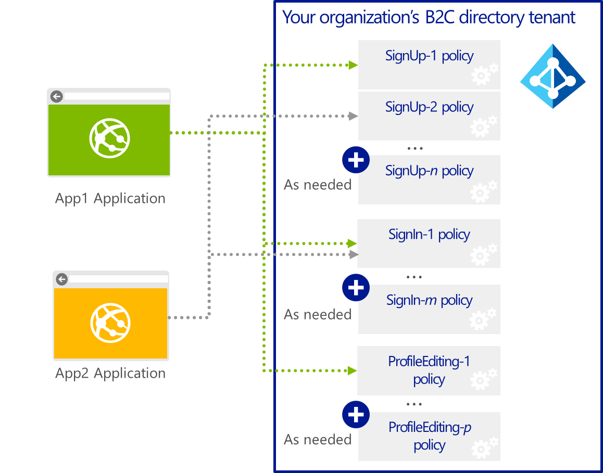

Policies can be articulated on an application by application basis. In other words, a registered consumer facing-application can then in turn adhere to them – one policy per type of user journey - thus enabling to drive the application compliance.

**Policies encode the relationships of trust and authority inside a Trust Framework (TF). Azure AD B2C Basic leverages for that purpose a TF specifically tailored by Microsoft, i.e. the “Microsoft Basic Trust Framework”.**

You invoke these policies in your application using standardized protocol requests to Azure AD B2C Basic and you receive tokens with claims (customized by you) as responses. From an application perspective, the developer just redirects to B2C specifying which policy he wants and gets back the authenticated result of the journey as a set of claims with zero app complexity.

Policies have a consistent “developer” interface that allows a graphical and fully guided customization through the Microsoft Azure AD B2C portal, which allows to configure underneath the “Microsoft Basic Trust Framework”.

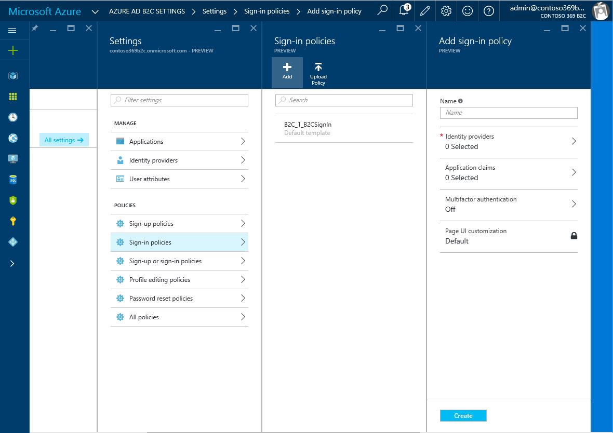

The portal supports the live run of the policy straight from the UI to test the policy without a single line of code.

As a whole, Azure AD B2C Basic allows to provide a unified view of the consumer (sign up, sign in, and profile editing) across all the consumer facing applications exposed by your organization, and with the awaited self-service capabilities (sign up, password reset, and profile management).

**Azure AD B2C Basic is upgradable to the premium edition at any time, with a smooth migration path for the customized policies** (as later discussed in this paper).

**Azure AD B2C Premium is a superset of Azure AD B2C Basic in which you will be able to take advantage of all the other capabilities of the system that are not present in the above portal.**

Azure B2C Premium for creating your own Trust Framework
-------------------------------------------------------

The Premium edition of Azure AD B2C provides you with all the requirements of an Identity “Hub”. Azure AD B2C Premium indeed allows you to author and create your own (Trust Framework) policies from scratch if you want to.

You’re completely in control of the set of policies and no longer restricted to the customization of policies within the **“Microsoft Basic Trust Framework”.**

This allows you to support a complete spectrum of identity services from high security (multi-factor authentication and verified attributes) to satisfy organizational “Know Your Customer” (KYC) requirements.

Like the Basic edition, Azure AD B2C Premium enables end users to “Bring their own Identities” (BYOI) for authentication to a relying party. However, Enabling BYOI is only the first part of the solution. Clearly these identities are self-asserted and of such low identity assurance that they are not sufficient to authorize access to valuable or sensitive information.

To address this concern, Azure AD B2C Premium can improve organizational security by requiring end users to employ an additional “step-up” authentication method (w/ various form factors including mobile phone) or **present verified attributes from authoritative sources** in the context of the online transaction. Finally, Azure AD B2C Premium can protect personal privacy by simplifying the process for an end user to consent to release of her identity information, by preventing tracking and correlation of her online activities and by avoiding unnecessary storage of a her personally identifying information by relying parties.
 

> **Note** There continue to be attempts to solve these needs for strong  identity assurance and verified attributes by creating attribute aggregators and/or registries. Such approaches can simplify the network interface for RPs into a rich source of end user digital identity data. However, if aggregation services function primarily to monetize the delivery of personal identifiable information (PII), or just to simplify the direct retrieval of PII by relying parties – without sufficient involvement and protection of end users – the industry runs the risk of privacy breakdowns which will destroy consumer and citizen confidence. Azure AD B2C Premium’s user centric approach to attribute release and verification, along with its minimal disclosure technology, can mediate between relying parties and attribute sources to avoid unnecessary data aggregation.

**Azure AD B2C Premium allows organizations to balance privacy versus security concerns on an application by application basis by articulating suitable policies for enforcement by a rules based engine.**  

Interoperability with existing relying party and identity provider, attribute provider and attribute verifier infrastructures is maintained with support for industry standard protocols. 

All of the above bring simplicity and confidence to the existing federation methods available today. **Azure AD B2C Premium simplifies and automates complex federation trust relationships setup – required to support re-use of digital identities across multiple contexts - in complex communities of interest as the ones that come along with more and more B2C scenarios. And it shields relying parties from ongoing trust and connectivity reconfigurations as different identity providers, attribute providers and relying parties join or leave the community – through a policy-based, data-driven technology.**

The Azure AD B2C Premium service has been developed out of a broad dialog internationally and in conformance with requirements from a great many expert sources in government and industry, and is being exercised in large scale projects globally. Because of its flexibility we believe it contributes to and helps provide the basis for interoperating IDaaS services world-wide.

Objectives of this document
---------------------------

This first part is intended as an overview document for discovering the policies and understanding the rich user journeys they allow to elaborate in a declarative manner for Business-to-Consumer (B2C)
scenarios and beyond.

Non-objectives of this document
-------------------------------

This series of documents is not intended as an overview document for the Azure AD offerings but rather focusses on this new Azure AD B2C identity service, and more specifically on the premium edition.

> **Note** For additional information, see the Microsoft MSDN article [Getting started with Azure AD](http://msdn.microsoft.com/en-us/library/dn655157.aspx). As well as the whitepapers [Active Directory from the on-premises to the  cloud](http://ttp://www.microsoft.com/en-us/download/details.aspx?id=36391) and [An overview of Azure AD](http://ttp://www.microsoft.com/en-us/download/details.aspx?id=36391) as part of the same series of documents.

Organization of this document
------------------------------

To cover the aforementioned objectives, this document of the series is organized in the following three sections:

-   Introducing policies in Azure AD B2C Premium.
-   Understanding Azure AD B2C Premium logical architecture.
-   Illustrating some use cases.

These various parts provide the information details necessary to understand the new capabilities introduced by the premium edition of Azure AD B2C based on the already available features as per the currently available public preview.

About the audience
------------------

This document is intended for IT professionals, system architects, and developers who are interested in understanding the advanced capabilities Azure AD B2C Premium provides with all the requirements of an Identity “Hub”.

Introducing policies in Azure AD B2C Premium
============================================

**Azure AD B2C Premium provides your organization with a centralized service that** **reduces the complexity of identity federation in a large community of interest to a single trust relationship and a single metadata exchange**.

This requires Azure AD B2C Premium to allow you to answer the following questions.

* What are the legal, security, privacy and data protection policies that must be adhered to?
* Who are the contacts and what are the processes for becoming an accredited participant?
* Who are the accredited identity information providers (a.k.a. claims providers) and what do they offer?
* Who are the accredited relying parties \[and optionally what do they require\]?
* What are the technical “on the wire” interoperability requirements for participants?
* What are the operational “runtime” rules that must be enforced for exchanging digital identity information?

To answer all these questions, Azure AD B2C Premium leverages the Trust Framework (TF) construct. Let’s consider this construct and what it provides in this respect.

Understanding the Trust Framework and federation management foundation
----------------------------------------------------------------------

Such a construct should be understood as a written specification of the identity, security, privacy, and data protection policies to which participants in a community of interest must conform.

Federated identity provides a basis for achieving end user identity assurance at Internet scale. By delegating identity management to 3^rd^ parties, a single digital identity for an end user can be re-used with multiple relying parties.

Identity assurance indeed requires that identity providers (IdPs) and attribute providers (AtPs) adhere to specific security, privacy and operational policies and practices. Absent the ability to perform direct inspections, relying parties (RPs) must develop trust relationships with the IdPs and AtPs they choose to work with. As the number of consumers and providers of digital identity information mushrooms, it becomes untenable to continue pairwise management of these trust relationships, or even the pairwise exchange of the technical metadata required for network connectivity. Federation Hubs have achieved only limited success at solving these problems.

TFs are the linchpin of the Open Identity Exchange (OIX) Trust Framework model[^7] where each community of interest is governed by a particular TF specification.

> **Note** The Open Identity Exchange (OIX) is a non-profit trade organization of market leaders from competing business sectors e.g. the internet (Google, PayPal, etc.), data aggregation (Equifax, Experian, etc.), and telecommunications (AT&T, Verizon, etc.) driving the expansion of existing online services and the adoption of new online products. OIX helps develop and register trust frameworks: pre-negotiated sets of business, legal, and technical agreements that provide stakeholders with mutual assurance that their online transactions can be trusted. OIX members form a global center of excellence for the identity trust layer of online transactions sharing domain expertise, joint research, and pilot projects to test real world use cases.

Such a TF specification defines:

-   The security and privacy metrics for the community of interest with the definition of:
    -   The levels of assurance (LOA) offered/required by participants, i.e. an ordered set of confidence ratings for the authenticity of digital identity information.
    -   The levels of protection (LOP) offered/required by participants, i.e. an ordered set of confidence ratings for the protection of digital identity information handled by participants in the community of interest.
-   The description of the digital identity information offered/required by participants.
-   The technical policies for production and consumption of digital identity information, and thus for measuring LOA and LOP. These written policies typically include the following categories of policies:
    -   Identity proofing policies: *how strongly is a person’s identity information vetted?*
    -   Security policies: *how strongly are information integrity and confidentiality protected?*
    -   Privacy policies: *what control does a user have over personal identifiable information (PII)?*
    -   Survivability policies: continuity and protection of PII if a provider ceases operations.
-   The technical profiles for production and consumption of digital identity information. These profiles:
    -   Scope interfaces for which digital identity information is available at specified LOA.
    -   Describe technical requirements for on-the-wire interoperability.
-   The descriptions of the various roles that participants in the community may perform along with the qualifications required to fulfill these roles.

Thus a TF specification governs how identity information is exchanged between the participants of the community of interest: relying parties, identity and attribute providers, and attribute verifiers.

In the parlance of this OIX TF model, a TF specification is constituted as one or multiples documents that serve as a reference for the governance of the community of interest regulating the assertion and consumption of digital identity information within the community. This means a documented set of policies and procedures, designed to establish trust in the digital identities used for online transactions between members of a community of interest. **A TF specification defines the rules for creating a viable federated identity ecosystem for some community**.

As of today, there is widespread agreement on the benefit of such an approach and there is no doubt that trust framework specifications will facilitate the development of digital identity ecosystems with verifiable security, assurance and privacy characteristics, such that they can be reused across multiple communities of interest.

For that reason, Azure AD B2C Premium leverages specification as its core as the basis of its data representation for a TF to facilitate interoperability.

Azure AD B2C Premium represents a TF specification as a mixture of human and machine readable data: some sections of this model (typically those more oriented towards governance) are represented as references to published security and privacy policies documentation along with the related procedures if any, while other sections describe in detail the configuration metadata and runtime rules to facilitate operational automation.

> **Note:** We will not describe the notion of TF specification any further since. For specific details of the TF specification structure, please to the OIX resources that relate to the TF model specification.

Understanding (Trust Framework) policies
----------------------------------------

In terms of implementation, the above TF specification consists in Azure AD B2C Premium in a set of “policies” that allow complete control over identity behaviors and experiences. Azure AD B2C Premium indeed allows you to author and create your own TF through such declarative policies that can define and configure:

-   The document reference(s) defining the federated identity ecosystem of the community that relates to the TF. They are links to the TF documentation.
The (predefined) operational “runtime” rules, a.k.a. the user journeys that automate and/or control the exchange and usage of the claims. These user journeys are associated with a LOA (and a LOP). A policy may therefore have user journeys with varying LOAs (and LOPs).
-   The identity and attribute providers, a.k.a. the *claims* providers, in the community of interest and the technical profiles they support along with the (out-of-band) LOA/LOP accreditation that relates to them.
-   The integration with attribute verifiers, a.k.a. the *claims* providers.
-   The relying parties in the community (by inference).
-   The metadata for establishing network communications between participants. These metadata along with the technical profiles will be used in the course of a transaction to plumb “on the wire”  interoperability between the relying party and other community participants.
-   The protocol conversion if any (SAML, OAuth2, WS-Federation and OpenID Connect).
-   The authentication requirements.
-   The multifactor orchestration if any.
-   A shared schema for all the claims available and mappings to
    participants of a community of interest.
-   All the *claims* transformations - along with the possible data minimization in this context - to sustain the exchange and usage of the claims.
-   The blinding and encryption.
-   The claims storage.
-   Etc.

> **Note:** We collectively refer to all the possible types of identity information that may be exchanged as *claims*: claims about an end user’s authentication credential, identity vetting, communication device, physical location, personally identifying attributes, and so on.

We use the term *claims* – rather than attributes which is a subset – because in the case of online transactions these are not facts that can be directly verified by the relying party; rather they are assertions, or claims about facts for which the relying party must develop sufficient confidence to grant the end user’s requested transaction.

It’s also due to the fact that Azure AD B2C Premium is designed to simplify the exchange of all types of digital identity information in a consistent manner regardless of whether the underlying protocol is defined for user authentication or attribute retrieval. Likewise, we will use the term *claims providers* to collectively refer to identity providers, attribute providers and attribute verifiers when we do not want to distinguish between their specific functions.

Thus they govern how identity information is exchanged between a relying party, identity and attribute providers, and attribute verifiers. They control which identity and attribute providers are required for a relying party’s authentication. They should be considered as a domain-specific language (DSL), i.e. “a computer language specialized to a particular application domain”[^8] with inheritance, “if” statements, polymorphism.

These policies constitute the machine readable portion of the TF construct in Azure AD B2C Premium with all the operational details (claims providers’ metadata and technical profiles, claims schema definition, claims transformation functions, and user journeys, etc.) filled in (for a specific community of interest) to facilitate operational orchestration and automation.

They are assumed to be “living documents” in Azure AD B2C Premium since there is more than a chance that their contents will change over time with respect to the active participants declared in the policies, and also potentially in some situations to the terms and conditions for being a participant.

Federation setup and maintenance are vastly simplified by shielding relying parties from ongoing trust and connectivity reconfigurations as different claims providers/verifiers join or leave (the community represented by) the set of policies.

Interoperability is another significant challenge as additional claims providers/verifiers have to be integrated, since relying parties are unlikely to support all of the necessary protocols. Azure AD B2C Premium solves this problem by supporting industry standard protocols and by applying specific user journeys to transpose requests when relying parties and attribute providers do not support the same protocol. 

Users journeys include protocol profiles and metadata that will be used to plumb “on the wire” interoperability between the relying party and other participants. There are also operational “runtime” rules that will be applied to identity information exchange request/response messages
for enforcing compliance with published policies as part of the TF specification. The idea of user journeys is key to the customization of customer experience and sheds light on how the system works at the protocol level.

On that basis, relying party applications and portals can, depending on their context, invoke Azure AD B2C Premium passing the name of a specific policy and get precisely the behavior and information exchange they want without any muss, fuss or risk.

Let’s see how this works from a logical architecture standpoint.

Understanding Azure AD B2C Premium logical architecture
=======================================================

At execution time, Azure AD B2C (Premium) creates an “identity information exchange network” between a given relying party and the other participants in the policy to execute, such as various claims providers.

To this end, Azure AD B2C (Premium) orchestrates two primary runtime functions through its 100% policy-driven engine:

1.  Dispatching in order route authentication and attribute requests from the relying party to the various claims providers. The technical metadata previously discussed are used for that purpose.

2.  Ensuring that the resulting exchange of the end user claims is in conformance to the policy in force. The operational rules are applied to all digital identity interactions between external  participants or entities.

Introducing the identity experience engine
------------------------------------------

With the above in mind we can logically conceptualize the internal runtime operations of Azure AD B2C Premium as an **identity experience engine**.

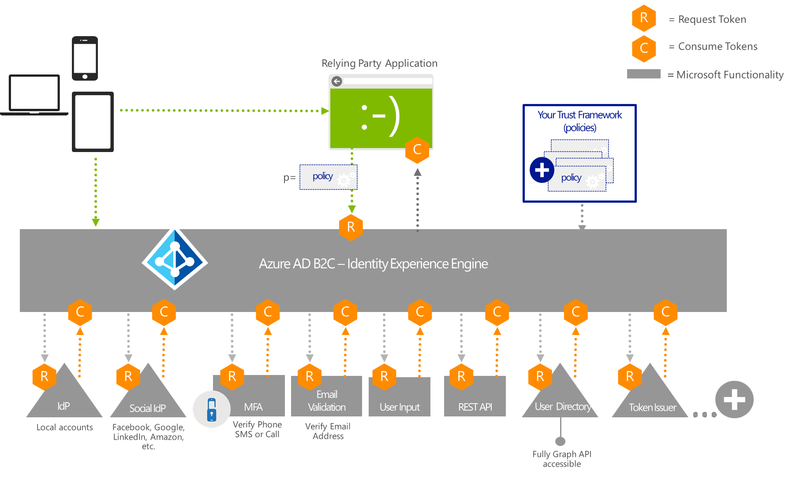

This identity experience engine operates as a pipeline and uses request/response claims exchanges to communicate with its internal components as well as with external entities. It enforces for regulating the assertion and consumption of claims.

**In the digital world, confidence can be based on trust in the source of a claim or correlation of claims from multiple sources. Azure AD B2C Premium** **is architected to facilitate both models under precise policy control.**

There are numerous scenarios in which a relying party requires claims that cannot be provided by a single source. For example, consumer identity providers almost never offer the kind of strongly vetted PII that is required to strongly identify an end user for access to valuable or sensitive information. Applications have historically relied on forms to gather this data, but self-asserted claims are not sufficient for authorizing access to sensitive resources. A modern Web application could redirect the user’s browser to different authoritative sources. However, this would complicate application development and maintenance because at a protocol or API level there are significant differences between the interactions with all the claims providers involved in the transaction: identity providers (IdPs) versus attribute providers (AtPs) or attribute verifiers (AtVs).

Azure AD B2C Premium is designed to abstract out this complexity and make it easy for relying parties (RPs) to obtain the necessary claims while automatically complying with applicable security and privacy obligations. For example, if an RP application needs claims that are not available from a single source, such an application simply submits a single request to Azure AD B2C Premium for claims that is to be processed under a specific policy.

Azure AD B2C Premium then applies the related policy to decompose the request. Depending on the complexity of the request, Azure AD B2C Premium may decompose it by farming out “pieces” of the request to separate claims providers, and initiating separate interactions with multiple claims providers. It may be necessary to ask the end user to approve specific claims providers or just to consent to release of the collective set of claims required.

**A core function of Azure AD B2C Premium is to uniformly orchestrate this process at both the protocol and human experience levels by applying the applicable policy.**

Understanding the identity experience engine core function
----------------------------------------------------------

The identity experience engine uses the machine readable rules from a policy to ensure that identity information is exchanged accordingly.

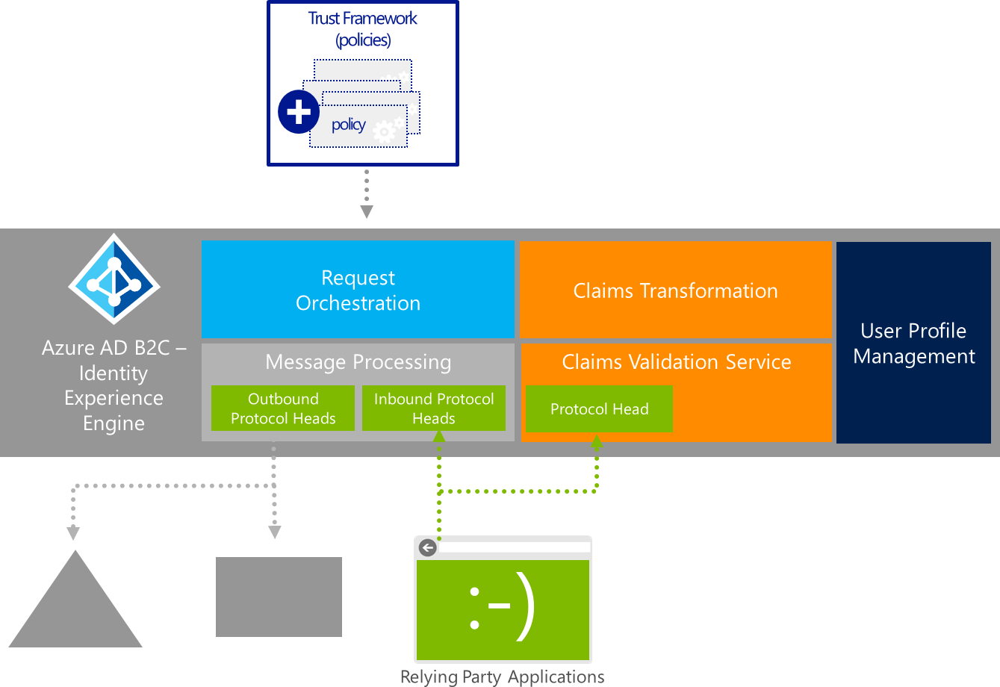

It performs the following four core functions:
1.  Message processing.
2.  Request orchestration.
3.  Claims transformation.
4.  User profile management.

The next sections depict each of the above functions.

### Message processing

The identity experience engine is exposed externally as two sets of protocol heads that support communication with claims providers and relying parties: inbound heads accept claims requests from RPs, and outbound heads are used to “relay” those requests to the claims providers.

They are responsible for de-serializing/serializing messages and verifying syntax. We will not describe their operations further since they are standards-based and well understood.

Azure AD B2C Premium does not relay protocol request and response messages like a security token service. It must indeed inspect every message and determine whether it conforms to the policy requirements. This may involve modifying parameters at the protocol level. For example, to prevent tracking of user transactions by a claims provider, a lightweight trust framework policy might only require Azure AD B2C Premium to change the SAML target audience from the RP to the Azure AD
B2C Premium service. Another policy with stronger regulatory compliance obligations might require that Azure Premium AD B2C use the claims returned in SAML assertions to generate derived claims and U-Prove “untraceable” tokens (see later in this document).

These types of syntactic and semantic modifications may need to be
performed on RP requests before they are relayed to claims providers,
and on the corresponding responses before they are returned to the RP.
However, not all protocols or assertion formats can be translated
directly without loss. Also, a policy may require different user
interactions if the original request has to be decomposed into multiple
operations during the orchestration stage.

Therefore, the message processing functions must be able to provide the
following features:

-   Maintain state for the original protocol format of an RP request
    messages.

-   Transpose request to a normalized format for request orchestration.

-   Transpose response to a normalized format for request orchestration.

-   Ensure that the final response complies with original protocol
    message parameters.

This leads us to the next function: the request orchestration.

### Request orchestration

Request orchestration is yet another core function of the identity
experience engine. Using the normalized request/response format that it
receives from the message processing, it performs three key operations
for every RP claims request.

1.  Verify (modify) that claims requests and responses comply with the policy:

    -   Ensure RP is authorized to receive the claims specified in its request.

    -   Ensure target claims providers are authorized to issue requested claims.

    -   \[as required\] Modify request parameters to comply with policy constraints (e.g. alter the *&lt;Audience&gt;* element in a SAML 2.0 request to prevent an IdP from tracking the end user).

    -   Ensure RP is authorized to receive the claims returned in response to its request.

2.  Orchestrate runtime request/response message flows:

    -   \[as required\] Decompose the incoming RP request into a set of simpler requests that can be serviced by individual claims providers.

    -   Issue the request(s) in sequence using the protocol supported by the claims provider(s).

    -   \[as required\] Process input claims required by claims providers (e.g. provide a SAML 2.0 Authentication assertion from an IdP to authenticate a SAML Assertion Query to an AtP).

    -   \[as required\] Aggregate claims issued by multiple claims providers.

    -   Return results to RP.

3.  Orchestrate user experience for runtime request/response message  flows:

    -   \[as required\] Display claims providers’ selection UI (policy may require RP or request Orchestration to display this UI).

    -   Display data entry UI for attribute verifiers (known attribute verifiers usually offer a back-end API such that Request Orchestration must display UI for collecting claims from the user).

    -   \[as required\] Display consent UI for claims release to RP (policy may require claims providers or Request Orchestration to display this UI).

    -   \[as required\] Display one combined consent screen if multiple claims providers are involved in processing a single RP request.

### Claims transformation

Recall that Azure AD B2C Premium conceptually treats authentication as a request for claims, similar to an attribute request for more traditional claims like job title or group memberships. Thus an Azure AD B2C Premium compliant policy includes a schema of all of the claims which could potentially be requested by a RP from any of the claims providers listed in that policy. Claims transformation is the process of applying functions on claims (if necessary) before they are returned to the RP that requested them.

Claims transformation typically translate a claim type or value from the format issued by an IdP/AtP to the format specified in the policy claims schema.

### User profile management

There are several scenarios where it is important to store the claims
that have been returned to an RP. If the RP or the end user had to pay a
fee to generate verified claims to authorize a particular transaction,
they should not have to pay again if the same claims are required for
another transaction in the same environment. User profile management is
an Azure AD B2C Premium feature that enables to store claims in the RP’s
B2C tenant.

Once claims have been stored in a B2C tenant, Azure AD B2C Premium can
retrieve them for subsequent transactions that require verified claims.
Also, RP applications can access the persistent claims directly. It
would also be possible to create Azure AD group memberships for an end
user based on these verified claims. Thus applications that are not
claims-aware could take advantage of this information to make
traditional group-based access control decisions.

**It’s time to provide some illustrations of how all the concepts we
have introduced so far fit together.**

Illustrating an advanced identity use case
==========================================

So let’s take an example to further explain the process’s orchestration
principles.

Performing trust elevation with Azure AD B2C Premium
----------------------------------------------------

For the sake of this illustration, we will more specifically rely on a
real world situation with the [Inova Health System use
case](https://customers.microsoft.com/Pages/Download.aspx?id=3051)[^9]
in the US.

In collaboration with a pilot called the Cross Sector Digital Identity
Initiative (CSDII) to offer the highest level of security and privacy
for confidential health records for 2 million patients a year, Inova has
piloted an outsourced verification solution whereby patient’s identities
and personal details are checked against official databases by the
American Association of Motor Vehicle Administrators (AAMVA), which
makes a referral to the state that holds the driver’s record. This pilot
based on Azure AD B2C Premium becomes operational with the goal of being
a uniquely flexible and patient-friendly solution.

> Note: CSDII is one of the [National Strategy for trusted Identities in the Cyberspace (NSTIC) pilot projects](http://www.nist.gov/nstic/pilots.html)[^10]. The goal of CSDII is to produce a secure online identity ecosystem that will lead to safer transactions by enhancing privacy and reducing the risk of fraud in online commerce.

For this first illustration:

-   The CSDII consortium authored and created a (Trust Framework) policy.

-   Identity and attribute providers/verifiers who are accredited to comply with the corresponding legal, security, privacy and data protection policies of the pilot have been added: social identity providers (Facebook, Google+, or Microsoft), AAMVA, and Inova Healthcare EHR system.

-   The Inova Healthcare EHR portal subscribed to the above (Trust Framework) policy as a base policy.

### Provisioning workflow

At this stage, Inova is in the process to define, create and deploy
suitable policies for its Inova Healthcare EHR portal.

The workflow is as follows:

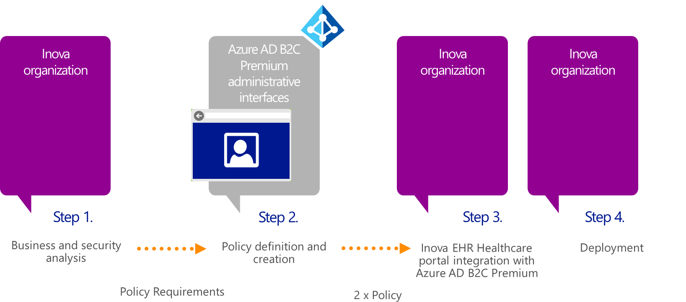

1.  Security and business analysts at Inova determine the user requirements and security constraints for the Inova Healthcare EHR portal so that patients can be free patients from having to remember separate user names or passwords.

Thus, the defined sign-up user journey allows patients to register and log on to the Inova Healthcare EHR portal with a social account that patients already have (or can get for free) from Facebook, Google+, or Microsoft, and then matches their account to their identity in two ways:

a.  Confirming that information, they provide from their driver license, driver permit, or state ID card, matches their Department of Motor vehicle (DMV) records at AAMVA that acts as a claims verifier.

b.  Calling the patient at one of the phone numbers already on file in their Inova record.

Patients have to register once. In the future, they will access the Inova Healthcare EHR portal by signing in the social account that they choose and answering an automated phone call.

OUTCOME: *determination that two policies are required, one for the registration (sign-up) user journey and another for the sign-in user journey once registered*.

1.  An Inova’s administrator uses the Azure AD B2C Premium administration tooling to create in their B2C tenant two policies for the Inova Healthcare EHR portal relying party (i.e. one for each user journey), selecting the aforementioned social identity providers, attribute verifier and provider, and satisfying organizational “Know Your Customer” (KYC) requirements and the additional authentication factor (phone call). In this illustration, the two policies inherit from the base policy authored by the CSDII consortium.

OUTCOME: *Inova’s administrator has generated 2 policies, one (Signup-Policy) for sign-up user journey and another one (SignIn-Policy) for the sign-in user journey*.

1.  Inova’s developers adapt the Inova Healthcare EHR portal and integrate with Azure AD B2C Premium by doing simple Web redirection. In our example, for the initial sign-in user journey where social
identity authentication was sufficient, the Inova Healthcare EHR portal does a redirect to Azure AD B2C Premium as per standard protocol being used passing the *Signup-Policy* name as the argument value of an additional p parameter. When a patient with *(verified)* additional registration and strong authentication information want to sign-in, the Inova Healthcare EHR portal does a redirect to Azure AD B2C Premium passing the *SignIn-Policy* name as the argument value of an additional p parameter.

OUTCOME: the *Azure AD B2C Premium identity experience engine* *will orchestrate the application requests according to the different policies and the required claims will be returned to Inova Healthcare EHR portal.*

1.  The developers use the claims that are posted back to their Inova Healthcare EHR portal by the Azure AD B2C Premium identity experience engine in order to personalize and authenticate their application.

2.  Inova deploys the modified Inova Healthcare EHR portal to a production environment for the pilot.

### Sign-up orchestration workflow

The identity experience engine will receive a redirect from the Inova Healthcare EHR portal which includes the *Signup-Policy* policy.

The protocol attribute workflow to orchestrate for the sign-up user journey along with the related human experience is follows in terms of various separate interactions:

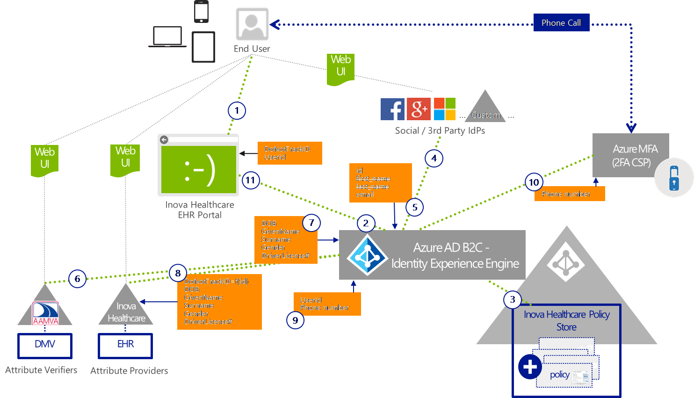

1.  The patient navigates to the Inova Healthcare EHR portal.

The patient then clicks **Register** in the home page of the portal to
initiate the registration process. A dialog explaining the above
registration process pops up. It notably emphasizes that the patient
will be always in control of their personal information and CSDII
(i.e. Azure AB B2C Premium underneath) never stores this data and
access it again after the initial identity verification.

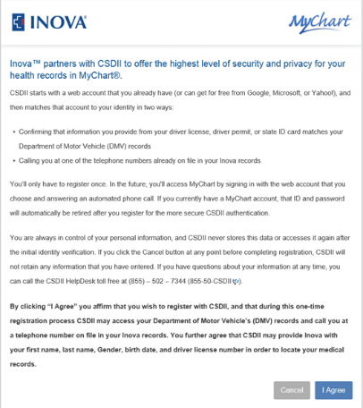

By clicking **I Agree**, the patient affirms that they wish to
register with CSDII, and consents that, during this one-time
registration process, CSDII may access their Department of Motor
Vehicle’s (DMV) records and call them at a phone number on file in
their related records. They further agree that CSDII may provide Inova
with their first name, last name, gender, birth date, and driver
license number in order to locate their medical records.

The Inova Healthcare EHR portal redirects to CSDII, i.e. Azure AD B2C
Premium, to orchestrate the intended workflow. The specific policy to
enforce for the sign-up user journey is specified as part of the
protocol standard redirection.

1.  As stated above, the Azure AD B2C Premium identity experience engine
    receives a redirect from the Inova Healthcare EHR relying party
    which includes the policy to enforce. The specific policy pointed
    through the redirection is then retrieved by Azure AD B2C Premium
    from the Inova Healthcare Policy Store in the Inova B2C tenant. In
    accordance with the policy, Azure AD B2C Premium will have to
    orchestrate several requests to 3^rd^ party providers to establish
    the claims for the portal as required by the policy.

2.  As an initial step of the user journey as defined by the policy,
    Azure AD B2C Premium displays a policy-based customized Web UI
    dialog to choose a social account within a policy defined list and
    sign-in.

> **Note:** Azure AD B2C Premium allows running code in your consumer's
> browser and uses the modern and standard approach [Cross-Origin
> Resource Sharing (CORS)](http://www.w3.org/TR/cors/)[^11] to load
> content from a specific URL that you specify in a policy to point to
> the appropriate HTML5/CSS files.

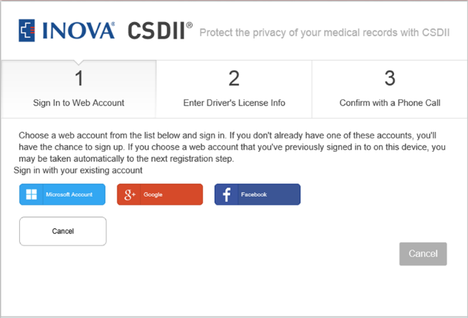

The patient selects the social identity provider to sign-in with their
existing account.

> **Note:** If the patient doesn’t already have one account with one of
> these social identity providers (IdPs), they will have the chance to
> sign-up at the chosen social identity providers.

The patient is then redirected to the social identity provider with
the appropriate protocol technical profile.

> **Note:** If the patient chooses an account that they’ve previously
> signed in to on their device, they may be taken automatically to the
> next registration step orchestrated by the Azure AD B2C Premium
> identity experience engine.

1.  If authentication succeeds at the selected claims provider, a token
    is returned with at least an identifier for the social account as an
    output claim. The returned token is then cached and orchestration
    continues to the identity confirmation at AAMVA as dictated by the
    policy.

2.  For that purpose, Azure AD B2C Premium displays as part of the user
    journey a second-step policy-based customized Web UI dialog. The
    patient clicks **Verify Identity with AAMVA**.

This brings the patient to an additional policy-based customized Web
UI dialog for collecting from the patient a specific set of attributes
for identity confirmation: first name, last name, gender, birth date,
and driver license number.

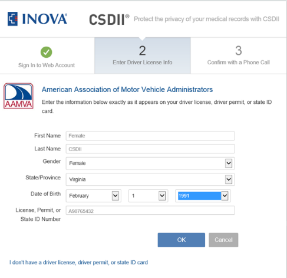

The patient then clicks **OK**. The provided self-asserted information
is then used to verify it matches their Department of Motor vehicle
(DMV) record at AAMVA, i.e. the policy defined attribute verifier
(AtV) in terms of claims provider.

For that purpose, Azure AD B2C Premium sends a request with the
self-asserted information as input claims to AAMVA, which in turn may
confirm (or not) that it matches a dataset in its authoritative system
of record.

1.  If a match can be found, a token is returned by AAMVA with a date of
    birth, a given name, a surname, a gender, and a driver license
    number as verified output claims. Likewise, the returned token is
    then cached and orchestration continues to the query of the phone
    numbers already on file in their Inova record.

2.  For that purpose, the Inova EHR system is a policy defined
    attributes provider (AtP) in terms of claims provider. Azure AD B2C
    Premium sends a request to Inova with the following claims provided
    as input claims: an “unlinkable” identifier (that results from a
    Do-Not-Track (DNT) derivation function on the identifier received
    from the social identity provider), and the verified claims from
    AAMVA (date of birth, given name, surname, gender, and driver
    license number).

3.  If a match with an existing record can be found based on the
    received input claims, the Inova EHR system (may update the dataset
    in its system of record with notably the above “unlinkable”
    identifier, and) sends back a token with the following output
    claims: user identifier under which the patient is known in the
    Inova EHR system along with the phone number(s) already on file in
    the Inova matched record.

As before, the returned token is then cached and orchestration continues
to the second authentication factor as per policy. The proof of
possession of a phone number will be used here using Azure Multi-Factor
Authentication in this illustration.

> **Note:** Azure Multi-Factor Authentication is the multi-factor authentication (MFA) service that requires users to also verify sign-ins using a mobile app, phone call or text message. It is available to use with Azure AD or with custom applications and directories using the SDK. For more information, see the article [*What is Azure Multi-Factor Authentication?*](https://azure.microsoft.com/en-us/documentation/articles/multi-factor-authentication/).

1.  For that purpose, Azure AD B2C Premium displays as part of the user
    journey the third-step policy-based customized Web UI dialog where
    the phone number(s) already on file in the Inova matched record are
    listed partially obfuscated.

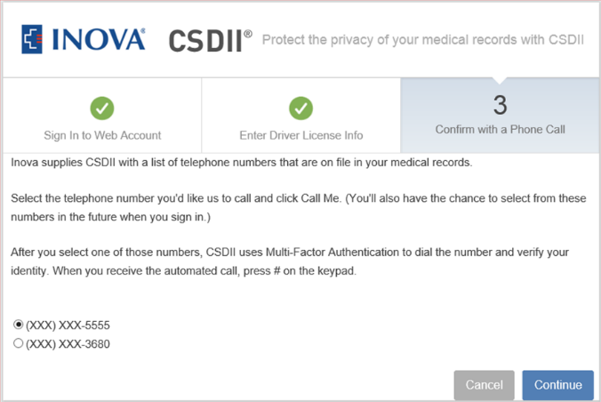

The patient selects one of the listed phone numbers, and then clicks
**Continue**. Azure AD B2C Premium sends a request to Azure
Multi-Factor Authentication with the selected phone number. As stated
before, Azure Multi-Factor Authentication is a policy defined
attribute verifier.

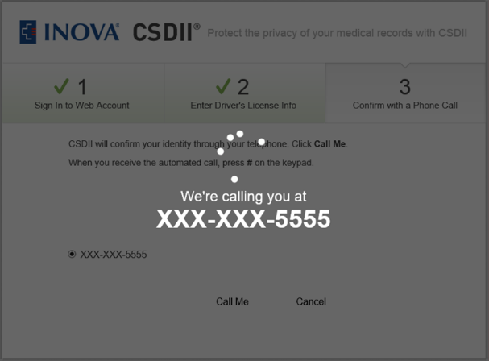

1.  On successful verification of the second factor, the orchestrator
    initiates the finalization of the registration process. Azure AD B2C
    Premium displays as part of the user journey a last-step
    policy-based customized Web UI dialog.

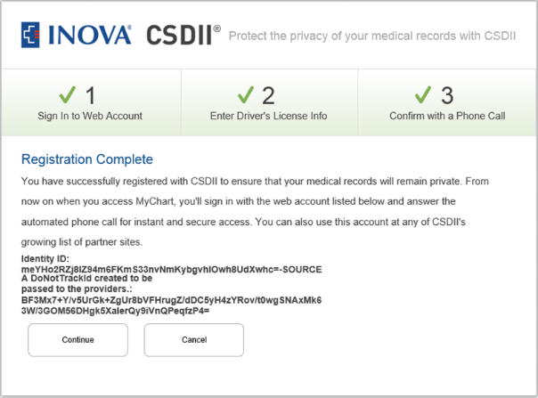

The patient clicks **Continue** to finalize the sign-up. Azure AD B2C
Premium returns a set of (verified) claims returned (and optionally
derived) from the above individual claims providers for the Inova
Healthcare EHR portal to evaluate: an “unlinkable” identifier (that
results from a DNT derivation function on the identifier received from
the selected social identity provider) along with the user identifier
under which the patient is known in the Inova EHR system.

At this stage, the registration is complete. If the patient has an
account for the application, that user identifier under which the
patient is already known in the system and the associated password will
be automatically retired after they register for the more secure
authentication.

One can easily imagine a different confirmation and elevation policy
that might have allowed the intended verification. Azure AD B2C Premium
provides such a flexibility as covered later in the other part of this
document.

Moreover, in many orchestration flows, it is necessary to obtain an
identity claim before obtaining a second attribute claim. The Azure AD
B2C Premium identity experience engine handles all the necessary
ordering of claim requests as illustrated above.

This said, let’s now consider the sign-in experience for a patient after
they register for the above more secure authentication.

### Sign-in orchestration workflow

Similarly, the protocol attribute workflow that relates for a sign-in to
orchestrate along with the human experience is as follows:

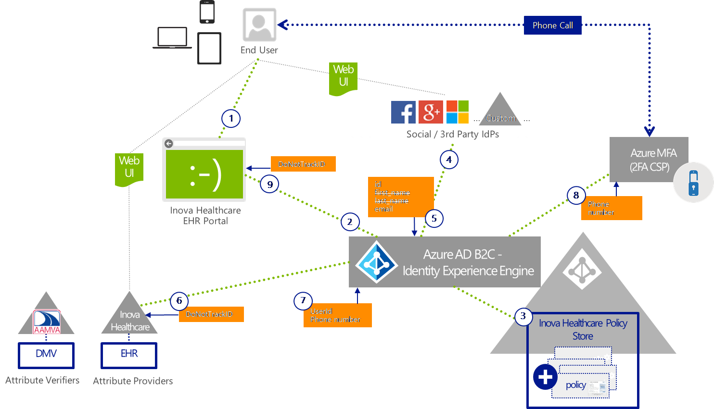

1.  The registered patient navigates to the Inova Healthcare EHR portal.

The patient then clicks **Sign-in** in the home page of the portal to
initiate the registration process.

1.  The Inova Healthcare EHR portal redirects to CSDII, i.e. Azure AD
    B2C Premium, to orchestrate the intended workflow. Like for the
    previous illustration of the Inova Healthcare use case, the specific
    policy to enforce for this time the sign-in user journey is
    specified as part of the protocol standard redirection.

2.  Once again, the Azure AD B2C Premium identity experience engine
    receives a redirect from the Inova Healthcare EHR relying party
    which includes the policy to enforce. The specific policy is then
    retrieved by Azure AD B2C Premium from the Inova Healthcare Policy
    Store. In accordance with the policy, Azure AD B2C Premium will have
    to orchestrate the various several requests to 3^rd^ party claims
    providers to establish the expected (verified) claims for the portal
    as required by the policy.

3.  As an initial step of the user journey as defined by the policy,
    Azure AD B2C Premium displays a policy-based customized Web UI
    dialog to choose a social account within a policy defined list and
    sign-in.

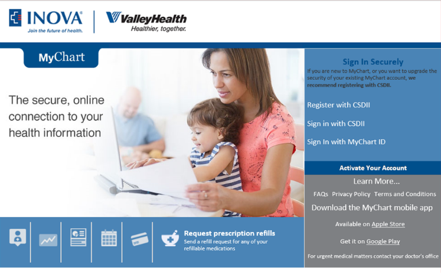

The patient selects the social identity provider to sign-in with their
existing account. The patient is then redirected to the social
identity provider with the appropriate protocol technical profile.

> **Note:** If the patient chooses an account that they’ve previously
> signed in to on their device, they may be taken automatically to the
> next registration step orchestrated by the Azure AD B2C Premium
> identity experience engine.

1.  If authentication succeeds at the selected claims provider, a token
    is returned with at least an identifier for the social account as an
    output claim. The returned token is then cached and orchestration
    continues to the query of the phone numbers on file in their Inova
    record.

2.  For that purpose, the Inova EHR system is once again a policy
    defined attributes provider (AtP) in terms of claims provider. Azure
    AD B2C Premium sends a request to Inova with the following claims
    provided as input claims: an “unlinkable” identifier that results
    from the same DNT derivation function on the identifier received
    from the social identity provider.

3.  If a match with an existing record can be found based on the
    received input claim, the Inova EHR system sends back a token with
    the following output claims: user identifier under which the patient
    is known in the Inova EHR system along with the phone number(s)
    already on file in the Inova matched record. As before, the returned
    token is then cached and orchestration continues to the second
    authentication factor as per policy. The proof of possession of a
    phone number will be used here using Azure Multi-Factor
    Authentication.

4.  For that purpose, Azure AD B2C Premium displays as part of the user
    journey the second-step policy-based customized Web UI dialog where
    the phone number(s) already on file in the Inova matched record are
    listed partially obfuscated.

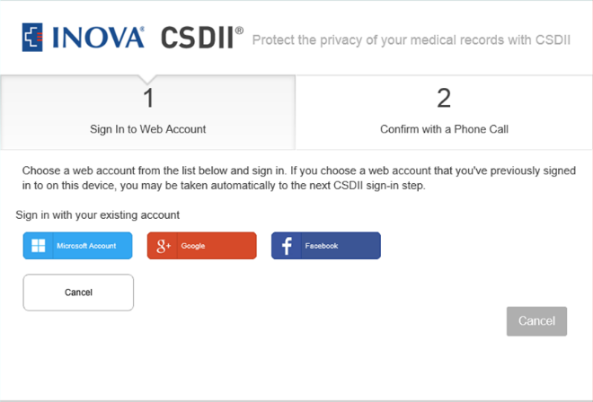

The patient selects one of the listed phone numbers, and then clicks
**Continue**. Azure AD B2C Premium sends a request to Azure
Multi-Factor Authentication with the selected phone number. As stated
before, Azure Multi-Factor Authentication is a policy defined
attribute verifier.

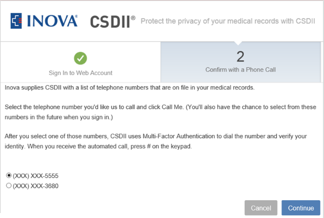

1.  On successful verification of the second factor, Azure AD B2C
    Premium returns the “unlinkable” identifier (that results from a DNT
    derivation function on the identifier received from the selected
    social identity provider) as a (verified) claim for the Inova
    Healthcare EHR portal to evaluate.

With all of the above in mind we can thus logically conceptualize the
internal runtime operation of Azure AD B2C Premium as an identity
experience engine as previously named above.

This concludes our illustration. This only represents one of the many
use cases of Azure AD B2C Premium already in production today.
Nevertheless, it should give a good sense of what can be achieved by
simply authoring Trust Framework (policies). It has also allowed us to
introduced some of the vocabulary used later in the other parts of this
series of documents.

**This concludes this first part of the series of the documents on the
Premium edition of Azure AD B2C.**

Going beyond
============

Azure AD B2C is a cloud identity service for your consumer-facing web
and mobile applications. Azure AD B2C is designed to solve the identity
management challenges that have emerged, as economic and competitive
pressures drive commercial enterprises, educational institutions, and
government agencies to shift their service delivery channels from
face-to-face engagements to online web and mobile applications.

Based on standardized protocols, Azure AD B2C is "IDaaS for Customers
and Citizens” designed with Azure AD privacy, security, availability,
and scalability for customer/citizen Identity management (IDM). The
“secret sauce” of Azure AD B2C to achieve the above objectives resides
in the 100% policy driven identity experience engine that consume fit to
purpose declarative policies.

Many of the most frequently used identity use cases can be addresses
using the B2C extension in the Azure portal as the developer control
surface. However, there some advanced features only available by writing
custom user journeys like the one illustrated in the previous section.
Such custom user journeys must be configured directly into policy XML
files and uploaded to the B2C tenant. Access to this incremental feature
set is available via the Premium edition of Azure AD B2C.

As part of the same series of documents on Azure AD B2C Premium, the
**second part Get started with
the “Starter Pack” of Azure AD B2C Premium** describes as its
name suggests the essential steps required to configure your B2C tenant
for the use of policies in Premium mode. By:

-   Uploading the latest version of the “Starter Pack” and the premium policies’ templates that come along

-   Following the steps below,

you will have a common starting point to add your customizations, and
share them with others using the same baseline “Starter Pack” of Azure
AD B2C Premium.

The **third part Manage premium
policies for your custom user journeys** is intended as an
overview document for discovering and understanding how the premium
capabilities can be leveraged to author and manage your own premium
policies (along with the associated security keys) for your custom user
journeys.

This **fourth part Address and
implement most common advanced identity use cases** further
discusses the most common advanced identity use cases. This part is
intended as a guidance document for implementing these identity use
cases so that you can smoothly and seamlessly instantiate your own
specific to purpose tailored identity “Hub” based on the advanced
capabilities of Azure AD B2C Premium.

For that purpose, it covers a series of common scenarios and depict how
to implement them thanks to premium policies. As far as the related
policy definition is concerned, this this series of envisaged scenarios
leverages the aforementioned premium policies’ templates of the “Starter
Pack” of Azure AD B2C Premium, and as such override/extend them in many
cases to drastically limit the amount of information to provide to
enable the intended scenario.

In addition, the **fifth part Troubleshoot your custom user
journeys** discusses how to troubleshoot your tailored for
specific purpose policy XML files. To troubleshoot your custom user
journeys, it features the so-called “User Journey Recorder/Player” tool
that is part of the “Starter Pack” of the Azure AD B2C Premium edition.
The “User Journey Recorder/Player” tool is a nearly essential tool for
developing identity experiences with Azure AD B2C Premium. It captures
the output from the Azure AD B2C identity experience engine as it
brokers the users’ identity journey between the application (relying
party), the identity provider (e.g. Facebook or local account), and any
other claims providers (e.g. MFA, or the Azure AD directory) along the
path. It works in real-time, showing each of the orchestrations steps
that complete the journey, including the claims exchanged between them.

Finally, the **sixth and final part Understand the Trust Framework
policies** aims at helping you achieve a better understanding of
the Trust Framework (TF) policies, the XML schema that sustains them,
and thus enable you to modify the policy XML file(s) (based the “Starter
Pack”) to achieve certain business goals and your advanced identity use
cases that come along with.

Appendix A. Terminology
=======================

**Community of interest**: grouping of organizations which agree to
specific terms and conditions for the exchange of digital identity
information to improve trust, security and privacy of online
transactions.

**Trust Framework**: internationally recognized policy construct that
combines the contractual, security, privacy and compliance identity
management policies subscribed to by members of a community of interest,
with the configuration metadata to establish network connectivity
between them for federated identity management.

**End user**: person who is attempting to perform an operation at a
relying party that requires authentication, and possibly the evaluation
of attributes as authorization data.

**Relying Party (RP)**: (aka Service Provider) organization that offers
online applications or resources to end users, and relies upon
authentication results and attributes about end users to make access
control decisions.

**Identity Assurance**: confidence that the digital identity of a party
to an online transaction corresponds to the asserted real-world identity
of that party. Identity assurance can apply to both the end user and
relying party.

**Level of Assurance (LOA)**: measure of identity assurance specifically
applied to end users. As notably defined in NIST [*SP800-63-2 Electronic Authentication
Guideline*](http://nvlpubs.nist.gov/nistpubs/SpecialPublications/NIST.SP.800-63-2.pdf)[^13],
LOA represents confidence in how strongly the asserted identity
corresponds to the real-world identity along a scale from 1 to 4, in
terms of no confidence, some confidence, high confidence and very high
confidence. Other standards than the NIST SP800-63-2 adopt a similar
approach such as the [*ISO/IEC
29115:2013 “Information technology - Security techniques - Entity
authentication assurance
framework”*](http://www.iso.org/iso/iso_catalogue/catalogue_tc/catalogue_detail.htm?csnumber=45138)[^14]
standard.

**Level of protection (LOP)**: measure of confidence in the privacy
protection provided for identity information that is disclosed between
participants in a community of interest. LOP will be used in this
document as illustrating a corollary to LOA for measuring privacy
protection on a graduated scale; but there is no corresponding standard
specification for LOP at this time.

**Attribute**: data item that describes any characteristic that might be
evaluated to identify an end user or make an access control decision. In
addition to “traditional attributes” (e.g. name, address, group
memberships) we include characteristics of the end-user’s i)
authentication credential (e.g. type or strength), ii) human identity
proofing, ii) device or iv) location.

**Identity Provider (IdP)**: organization that performs an end user
authentication operation, and upon success provides at least one
attribute it maintains about that subject, a digital identifier. It may
declare the LOA associated the authentication event. It may also return
other attributes about the end user.

**Attribute Provider (AtP)**: organization that provides attributes
about a specific end user. An AtP does not provide information about any
current authentication operation as does an IdP.

**Attribute Verifier (AtV)**: organization that accepts a set of
attributes about an end-user, and confirms that they match a dataset in
some authoritative system of record (e.g. drivers’ licenses, credit
ratings). An AtV may provide additional information about the dataset
(e.g. SSN refers to a deceased person).

**Digital identity information Providers**: or just Providers, is a
collective reference to Identity Providers, Attribute Providers and
Attribute Verifiers.

  -----------------------------------------------------------------------------------------------------------------------------------------------------------------------------------------------------------------------------------------------------------------------------------------------------------------------------------------------------------------------------------------------------------------------------
  The information contained in this document represents the current view of Microsoft Corporation on the issues discussed as of the date of publication. Because Microsoft must respond to changing market conditions, it should not be interpreted to be a commitment on the part of Microsoft, and Microsoft cannot guarantee the accuracy of any information presented after the date of publication.

  This white paper is for informational purposes only. Microsoft makes no warranties, express or implied, in this document.

  Complying with all applicable copyright laws is the responsibility of the user. Without limiting the rights under copyright, no part of this document may be reproduced, stored in, or introduced into a retrieval system, or transmitted in any form or by any means (electronic, mechanical, photocopying, recording, or otherwise), or for any purpose, without the express written permission of Microsoft Corporation.

  Microsoft may have patents, patent applications, trademarks, copyrights, or other intellectual property rights covering subject matter in this document. Except as expressly provided in any written license agreement from Microsoft, the furnishing of this document does not give you any license to these patents, trademarks, copyrights, or other intellectual property.

  © 2016 Microsoft Corporation. All rights reserved.

  The example companies, organizations, products, domain names, e-mail addresses, logos, people, places, and events depicted herein are fictitious. No association with any real company, organization, product, domain name, e-mail address, logo, person, place, or event is intended or should be inferred.

  Microsoft, list Microsoft trademarks used in your white paper alphabetically are either registered trademarks or trademarks of Microsoft Corporation in the United States and/or other countries.

  The names of actual companies and products mentioned herein may be the trademarks of their respective owners.
  -----------------------------------------------------------------------------------------------------------------------------------------------------------------------------------------------------------------------------------------------------------------------------------------------------------------------------------------------------------------------------------------------------------------------------
