#Part 2 – Get started with the “Starter Pack” of Azure AD B2C Premium

Microsoft Corporation
Published: July 2016
Version: 0.2 (DRAFT)

Author: Philippe Beraud (Microsoft France)
Reviewers: Kim Cameron, Brandon Murdoch, Ronny Bjones, Jose Rojas
(Microsoft Corporation)

For the latest information on Azure Active Directory, please see

http://azure.microsoft.com/en-us/services/active-directory/

Copyright© 2016 Microsoft Corporation. All rights reserved.

Abstract: Azure AD, the Identity Management as a Service (IDaaS) cloud
multi-tenant service with proven ability to handle billions of
authentications per day, extends its capabilities to manage consumer
identities with a new service for Business-to-Consumer: Azure AD B2C.

Azure AD B2C is "IDaaS for Customers and Citizens” designed with Azure
AD privacy, security, availability, and scalability for customer/citizen
Identity management (IDM). It’s a comprehensive, cloud-based, 100%
policy driven solution where declarative policies encode the identity
behaviors and experiences as well as the relationships of trust and
authority inside a Trust Framework (TF).

Whilst the Azure AD B2C Basic leverages a dedicated TF tailored by
Microsoft, i.e. the “Microsoft Basic Trust Framework” in which you can
customize policies, the Premium edition gives you full control, and thus
allows you to author and create your own Trust Framework through
declarative policies. It thus provides you with all the requirements of
an Identity “Hub”.

This document is intended for IT professionals, system architects, and
developers who are interested in understanding the advanced capabilities
Azure AD B2C Premium provides.

Table of Content

[Notice](#notice)

[Introduction](#introduction)

[Objectives of this document](#objectives-of-this-document)

[Non-objectives of this paper](#non-objectives-of-this-paper)

[Organization of this paper](#organization-of-this-paper)

[About the audience](#about-the-audience)

[Fulfilling the prerequisites for the “Starter Pack”](#fulfilling-the-prerequisites-for-the-starter-pack)

[Confirming your B2C tenant](#confirming-your-b2c-tenant)

[Declaring Facebook as claims provider in your B2C tenant](#declaring-facebook-as-claims-provider-in-your-b2c-tenant)

[Downloading the “Starter Pack”](#downloading-the-starter-pack)

[Getting the “Starter Pack”](#getting-the-starter-pack)

[Cloning the “Starter Pack”](#cloning-the-starter-pack)

[Unblocking the set of PowerShell cmdlets](#unblocking-the-set-of-powershell-cmdlets)

[Setting up the cryptographic keys](#setting-up-the-cryptographic-keys)

[Preparing the premium policies for your B2C tenant](#preparing-the-premium-policies-for-your-b2c-tenant)

[Renaming the policies](#renaming-the-policies)

[Changing the client ID of your Facebook claims provider configuration](#_Toc454543047)

[Uploading the policies](#uploading-the-policies)

[Testing your policies of the “Starter Pack”](#testing-your-policies-of-the-starter-pack)

[Using a sample application](#using-a-sample-application)

[Testing the policies right away from the B2C Admin portal](#testing-the-policies-right-away-from-the-b2c-admin-portal)

Notice
======

This document illustrates new capabilities of
Azure AD through the just made available public preview of the Azure AD
B2C service. This public preview may be substantially modified before
GA.

**This document will be updated to reflect the changes introduced at GA
time.**

**This document reflects current views and assumptions as of the date of
development and is subject to change.  Actual and future results and
trends may differ materially from any forward-looking statements. 
Microsoft assumes no responsibility for errors or omissions in the
materials.  **

**THIS DOCUMENT IS FOR INFORMATIONAL AND TRAINING PURPOSES ONLY AND IS
PROVIDED "AS IS" WITHOUT WARRANTY OF ANY KIND, WHETHER EXPRESS OR
IMPLIED, INCLUDING BUT NOT LIMITED TO THE IMPLIED WARRANTIES OF
MERCHANTABILITY, FITNESS FOR A PARTICULAR PURPOSE, AND
NON-INFRINGEMENT.**

Introduction
=============

Azure AD B2C is a cloud identity service for your
consumer-facing web and mobile applications. Azure AD B2C is designed to
solve the identity management challenges that have emerged, as economic
and competitive pressures drive commercial enterprises, educational
institutions, and government agencies to shift their service delivery
channels from face-to-face engagements to online web and mobile
applications.

Based on standardized protocols, Azure AD B2C is "IDaaS for Customers
and Citizens” designed with Azure AD privacy, security, availability,
and scalability for customer/citizen Identity management (IDM). The
“secret sauce” of Azure AD B2C to achieve the above objectives resides
in the 100% policy driven identity experience engine that consume fit to
purpose declarative policies.

Many of the most frequently used identity use cases can be addresses
using the B2C extension in the Azure portal as the developer control
surface. However, there some advanced features only available by writing
custom user journeys which must be configured directly into policy XML
files and uploaded to the B2C tenant. Access to this incremental feature
set is available via the Premium edition of Azure AD B2C.

**Note** For a basic level of proficiency with the policy configuration
available directly in the B2C Admin portal, see the introduction video
[Business-to-Consumer Identity
Management with Azure Active
Directory B2C](https://channel9.msdn.com/Events/Build/2016/P423)
where all the relevant B2C Admin **portal** settings are.

Objectives of this document
---------------------------

This second part of the series of document describes the essential steps
required to configure your B2C tenant for the use of policies in Premium
mode. By:

-   Uploading the latest version of the “Starter Pack” and the premium policies’ templates that come along

-   Following the steps below,

you will have a common starting point to add your customizations, and
share them with others using the same baseline “Starter Pack” of Azure
AD B2C Premium.

> **Important note** if you have any question and/or feedback regarding the “Starter Pack” of Azure AD B2C Premium, send an email to **AADB2CPreview@microsoft.com** (subject: **B2C Premium Starter Pack),** with your B2C tenant name, i.e. &lt;*your\_b2c\_tenant*&gt;.onmicrosoft.com”, for example in our illustration contoso369b2c.onmicrosoft.com.

Non-objectives of this paper
----------------------------

This series of
documents is not intended as an overview document for the Azure AD
offerings but rather focusses on this new Azure AD B2C identity service,
and more specifically on the Premium edition.

> **Note** For additional information, see the Microsoft MSDN article [Getting started with Azure AD](http://msdn.microsoft.com/en-us/library/dn655157.aspx). As well as the whitepapers [Active Directory from the on-premises to the cloud](ttp://www.microsoft.com/en-us/download/details.aspx?id=36391) and [An overview of Azure AD](ttp://www.microsoft.com/en-us/download/details.aspx?id=36391) as part of the same series of documents.

Organization of this paper
--------------------------

To cover the aforementioned objectives, this document of the series is
organized in the following five sections:

-   Fulfilling the prerequisites for the “Starter Pack”.
-   Downloading the “Starter Pack”.
-   Unblocking the PowerShell cmdlets.
-   Preparing the premium policies for your B2C tenant.
-   Configuring a test application to test your policies of the “Starter Pack”.

These sections provide the information details necessary to setup the
“Starter Pack” of the Premium edition of Azure AD B2C, and be in a
position to successfully start building and managing your own (Trust
Framework) premium policies based on the already available features as
per the currently available public preview.

About the audience
------------------

This document is intended for IT professionals, system architects, and
developers who are interested in understanding the advanced capabilities
Azure AD B2C Premium provides with all the requirements of an Identity
“Hub” for their advanced identity use cases.

Fulfilling the prerequisites for the “Starter Pack”
===================================================

The prerequisites for preparing your B2C tenant with the “Starter Pack”
are the followings:

-   An active Azure subscription.

> **Note** If you don’t have any Azure subscription, you can sign up for a free account at [https://azure.microsoft.com/free/](https://azure.microsoft.com/free/). This will require to use a Microsoft account (e.g. xyz@outlook.com))

-   Visual Studio 2015 (to build and deploy some of the tooling and
    sample codes)

> **Note** If you don’t have Visual Studio 2015, you can download [Microsoft Visual Studio Community 2015](https://go.microsoft.com/fwlink/?LinkId=691978&clcid=0x40c) for free at.

-   A favorite XML editor.

-   An Azure AD B2C tenant with Premium features activated (see next section § *Confirming your B2C tenant* below).

-   A global administrative user in your B2C tenant e.g. admin@&lt;*your\_b2c\_tenant*&gt;.onmicrosoft.com where *your\_b2c\_tenant* is the name of your B2C tenant, for example in our illustration [admin@contoso369b2c.onmicrosoft.com](mailto:admin@contoso369b2c.onmicrosoft.com).

-   Facebook declared as a claims provider in the B2C Admin portal (see section § *Declaring Facebook as claims provider in your B2C tenant* below).

Confirming your B2C tenant
--------------------------

To confirm that your B2C tenant is with Premium features activated,
proceed with the following steps:

1.  Open a browsing session and navigate to the Azure AD B2C blade using
    the following URL:

https://portal.azure.com/&lt;*your\_b2c\_tenant*&gt;.onmicrosoft.com/?Microsoft\_AAD\_B2CAdmin=true\#blade/Microsoft\_AAD\_B2CAdmin/TenantManagementBlade/id/&lt;*your\_b2c\_tenant*&gt;.onmicrosoft.com where *your\_b2c\_tenant* the name of your B2C tenant, for example:

[https://portal.azure.com/contoso369b2c.onmicrosoft.com/?Microsoft\_AAD\_B2CAdmin=true\#blade/Microsoft\_AAD\_B2CAdmin/TenantManagementBlade/id/contoso369b2c.onmicrosoft.com](https://portal.azure.com/contoso369b2c.onmicrosoft.com/?Microsoft_AAD_B2CAdmin=true#blade/Microsoft_AAD_B2CAdmin/TenantManagementBlade/id/contoso369b2c.onmicrosoft.com)

1.  Sign in using an administrative account of that tenant, for example [admin@contoso369b2c.onmicrosoft.com](mailto:admin@contoso369b2c.onmicrosoft.com) in our illustration.

2.  Click **Browse** | **Azure AD B2C**. The Azure AD B2C blade opens up
    in the B2C Admin portal.

1.  Click **All Policies**.

2.  Make sure **Upload Policy** is available and enable at the top of the blade as illustrated hereafter.

Declaring Facebook as claims provider in your B2C tenant
--------------------------------------------------------

To register a Facebook application and add its details to your B2C
tenant, follow and complete all the required instructions in the article
[Azure Active Directory B2C
preview: Provide sign-up and sign-in to consumers with Facebook
accounts](https://azure.microsoft.com/en-us/documentation/articles/active-directory-b2c-setup-fb-app/):

-   You will need a Facebook account to perform the described steps. If you don’t have one, you can get it at [https://www.facebook.com/](https://www.facebook.com/).

-   Eventually, you will need the value of both **App ID** and **App Secret** to configure Facebook as a social identity provider in your B2C tenant. Note down these values that will be needed later in this document (see section § *Changing the client ID of your Facebook claims provider configuration* below). They will be respectively referred as to the “*YourClientIDValue*” and “*YourClientSecretValue*” values.

The rest of this document assumes that Facebook is properly declared in
your B2C tenant.

Downloading the “Starter Pack”
==============================

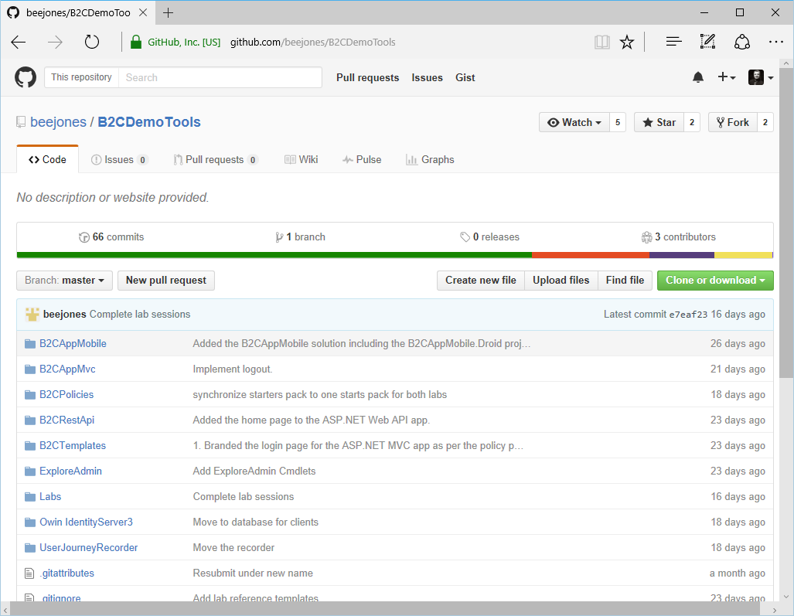 Microsoft is open-sourcing the “Starter
Pack” of Azure AD B2C Premium on
[GitHub](https://github.com/beejones/B2CDemoTools/tree/master/UserJourneyRecorder)
under the [MIT
license](https://github.com/beejones/B2CDemoTools/blob/master/LICENSE.md).

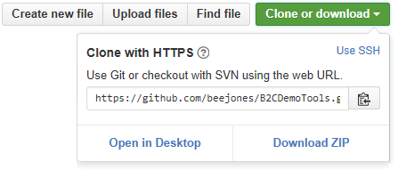

This means you can not only get the package and the related code to
compile it but also clone the Git repo, read and compile the code and
submit pull requests just like any other open source package you might
find on GitHub.

> **Note** Because of our commitment to quality and compatibility, each pull request will be carefully evaluated before it is accepted.

The next two sections explore the two possible options.

Getting the “Starter Pack”
--------------------------

To get the “Starter Pack”, modify the provided premium policies, compile
the code of the various tools and samples, you can simply download the
entire source package as an archive file from the **GitHub repo. **

To get the code, proceed with the following steps:

1.  Open a browsing session and navigate to the “Starter Pack” repo on
    GitHub.

2.  Click **Clone or Download**.

1.  Click **Download ZIP**.

2.  Save the *B2CdemoTools-master.zip* file on your local machine.

3.  Extract the content of the *B2CdemoTools-master.zip* file on your
    local disk, for example under the *C:\\Code* folder in our
    illustration.

Cloning the “Starter Pack”
--------------------------

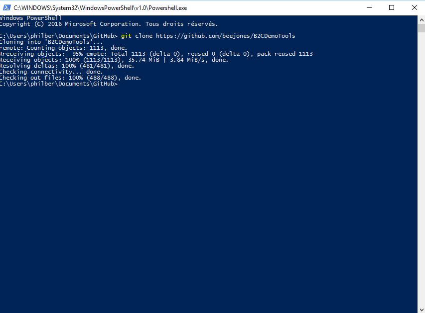As mentioned above, the “Starter Pack”
source package is stored on **GitHub**, which uses **Git** as a source
control system.

To access and build the package and the related code, you should have
some basic familiarity with [Git](http://git-scm.com/),
[GitHub](https://github.com/beejones/B2CDemoTools) and/or
[Visual Studio](https://msdn.microsoft.com/vstudio/aa718325.aspx),
but the following steps provide some information and links to get
you started.

> **Note** For information on how to set up Git and GitHub, see the article [Set up Git](https://help.github.com/articles/set-up-git/) on the GitHub site.

To access the source package and further contribute to it, you need to
i) fork the Git repo that contains it and ii) clone it on your
development computer.

To fork the Git repo, proceed with the following steps:

1.  Open a browsing session and navigate to **the “Starter Pack” repo on
    GitHub**.

2.  Clicking **Fork** in the upper right corner of your browser.

You can then clone the fork by using the GitHub app or on the command
line in the GitHub shell.

To clone the repo in the GitHub Shell, proceed with the following steps:

1.  Open a Git Shell by double-clicking the eponym icon on your Windows
    10 desktop.

2.  From the command prompt, run this command:

C:\\Users\\philber\\Documents\\GitHub&gt;Copygit clone
https://github.com/beejones/B2CDemoTools

The cloning starts.

C:\\Users\\philber\\Documents\\GitHub&gt;Copygit clone
https://github.com/beejones/B2CDemoTools

Cloning into 'B2CDemoTools'...

remote: Counting objects: 1113, done.

Rreceiving objects: 95% emote: Total 1113 (delta 0), reused 0 (delta 0),
pack-reused 1113

Receiving objects: 100% (1113/1113), 35.74 MiB | 3.84 MiB/s, done.

Resolving deltas: 100% (481/481), done.

Checking connectivity... done.

Checking out files: 100% (488/488), done.

C:\\Users\\philber\\Documents\\GitHub&gt;

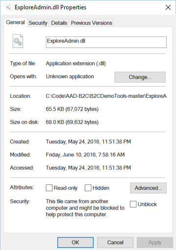

The “Starter Pack” source package is available in the *B2CdemoTools*
folder under *%UserProfile%\\Documents\\GitHub*.

Regardless of the chosen option, i.e. getting the package vs. cloning
the package, the source package is located under the *B2CdemoTools*
folder of the “Starter Pack”.

> **Important note** We will refer to this as **Starter-Pack** folder in this document as well as in the other documents of the series.

Unblocking the set of PowerShell cmdlets
========================================

The “Starter Pack” of Azure AD B2C Premium provides a set of PowerShell
cmdlets for developers and administrators to deploy and manage the
premium policies and the cryptographic keys in the B2C tenant.

To unblock these set of PowerShell cmdlets, proceed with the following
steps:

1.  Open a File Explorer and navigate to the *ExploreAdmin* folder in
    *Starter-Pack*.

2.  Right-click the file *ExploreAdmin.dll*.

1.  This file is marked unsecure because it has been downloaded from the
    Internet. Check **Unblock**, and then click **OK**.

2.  The folder *ExploreAdmin* contains a set 11 related files with the
    main aforementioned .dll dated 3/8/2016 or later. Repeat steps 2 and
    3 with the following files:

    a.  *Microsoft.IdentityModel.Clients.ActiveDirectory.dll*

    b.  *Microsoft.IdentityModel.Clients.ActiveDirectory.WindowsForms.dll*

    c.  *Microsoft.IdentityModel.Clients.ActiveDirectory.xml*

    d.  *Newtonsoft.Json.dll*

    e.  *Newtonsoft.Json.xml*

    f.  *System.Management.Automation.dll*

    g.  *System.Net.Http.Formatting.dll*

    h.  *System.Net.Http.Formatting.xml*

    i.  *System.Web.Http.dll*

    j.  *System.Web.Http.xml*

Setting up the cryptographic keys
=================================

A policy typically requires a number of cryptographic keys to be setup.
These are required by various providers. For example, federation with
Facebook requires a client secret for Facebook to trust Azure AD on
behalf of the application as depicted in the article [Azure Active Directory B2C preview:
Provide sign-up and sign-in to consumers with Facebook
accounts](https://azure.microsoft.com/en-us/documentation/articles/active-directory-b2c-setup-fb-app/).

> **Note** For additional information, see section § *Declaring Facebook as claims provider in your B2C tenant* before in this document.

The policy that you are provided with as part of the “Starter Pack”
already references the same Facebook secret named *FacebookSecret* that
was created through the portal if you have followed the procedure
outlined in the above article.

The following XML code snippet shows that secret reference in the base
policy provided by the “Starter Pack”:

…

&lt;ClaimsProvider&gt;

&lt;!-- The following Domain element allows this profile to be used if
the request comes with domain\_hint query string

parameter, e.g. domain\_hint=facebook.com --&gt;

&lt;Domain&gt;facebook.com&lt;/Domain&gt;

&lt;DisplayName&gt;Facebook&lt;/DisplayName&gt;

&lt;TechnicalProfiles&gt;

&lt;TechnicalProfile Id="Facebook-OAUTH"&gt;

&lt;!-- The text in the following DisplayName element is shown to the
user on the claims provider selection screen. --&gt;

…

&lt;CryptographicKeys&gt;

&lt;Key Id="client\_secret" StorageReferenceId="FacebookSecret" /&gt;

&lt;/CryptographicKeys&gt;

…

&lt;/TechnicalProfile&gt;

&lt;/TechnicalProfiles&gt;

&lt;/ClaimsProvider&gt;

…

Other claim providers’ secrets can be handled similarly for Amazon,
Google, LinkedIn, and Microsoft Accounts. For additional information,
see the following articles:

-   [Azure Active Directory B2C
    preview: Provide sign-up and sign-in to consumers with Amazon
    accounts](https://azure.microsoft.com/en-us/documentation/articles/active-directory-b2c-setup-amzn-app/),

-   [Azure Active Directory B2C
    preview: Provide sign-up and sign-in to consumers with Google+
    accounts](https://azure.microsoft.com/en-us/documentation/articles/active-directory-b2c-setup-goog-app/),

-   [Azure Active Directory B2C
    preview: Provide sign-up and sign-in to consumers with LinkedIn
    accounts](https://azure.microsoft.com/en-us/documentation/articles/active-directory-b2c-setup-li-app/),

-   and [Azure Active Directory
    B2C preview: Provide sign-up and sign-in to consumers with Microsoft
    accounts](file:///C:\Users\philber\AppData\Roaming\Microsoft\Word\Azure%20Active%20Directory%20B2C%20preview:%20Provide%20sign-up%20and%20sign-in%20to%20consumers%20with%20Microsoft%20accounts).

However, the premium policies of the “Starter Pack” reference additional
secrets that need to be setup:

  **Key containers**              **Description**
  ------------------------------- --------------------------------------------------------------------------------------------------------------------------------------------------------------------------------------------------------------------------------------------------------------------------------------------------------------------------------------------
  *TokenSigningKeyContainer*      Used for signing tokens
  *TokenEncryptionKeyContainer*   Encrypt certain tokens, e.g. the refresh token, that can be decrypted by Azure AD B2C Premium later. Refresh token, auth. code, etc. are sent by Azure AD B2C Premium to the client and encrypted to maintain confidentiality and integrity. When Azure AD B2C Premium reads the token back, it is decrypted using the same key container.

The names of these containers coincide with the names on the premium
policies in the “Starter Pack” (see next section). This keys must exist
in the B2C tenant for the upload to be successful.

To create the above required keys for the policies of the “Starter
Pack”, proceed with the following steps:

1.  Open a PowerShell command prompt and navigate to the folder *ExploreAdmin* in the *Starter-Pack* folder.

2.  Import the *ExploreAdmin.dll* using the following command:

PS&gt; import-module .\\ExploreAdmin.dll

As mentioned before, this enables a set of PowerShell cmdlets for Azure
AD B2C Premium.

1.  Enter the following commands to create the keys:

PS&gt; New-CpimKeyContainer &lt;*your\_b2c\_tenant&gt;*
TokenSigningKeyContainer key0 rsa 2048 0 0

PS&gt; New-CpimKeyContainer &lt;*your\_b2c\_tenant&gt;*
TokenEncryptionKeyContainer key0 rsa 2048 0 0

Where your*\_b2c\_tenant* is the name of your tenant, for example *contoso369b2c.onmicrosoft.com* in our illustration.

You will be prompted to login to authenticate into your B2C tenant, use your local admin user, e.g. admin@&lt;*your\_b2c\_tenant*&gt;, for example in our illustration admin@*contoso369b2c*.onmicrosoft.com)

These create two different key containers: the first is **TokenSigningKeyContainer** and the second one is **TokenEncryptionKeyContainer**:

a.  The *key0* in both the commands is the identifier of the key.

b.  The last two parameters to above commands are timestamps indicating when the key can become active and when it will expire. For this exercise, we will create keys without any time limits.

In general, for key roll over, an administrator can create new keys and Azure AD B2C Premium will typically use the appropriate keys.

> **Note** For additional information on cryptographic key management, see section *Managing key containers* in the third part of this series of document.

Preparing the premium policies for your B2C tenant
==================================================

All the Trust Framework policies of the “Starter Pack” are located in
the *B2CPolicies\\Advanced Policies Starter Pack* folder in the
*Starter-Pack* folder. All the policies conform to the
*TrustFrameworkPolicy\_0.3.0.0.xsd* XML schema file that is located in
the same directory.

Renaming the policies
---------------------

To rename the policies to reflect your own B2C tenant, proceed with the
following steps:

1.  Navigate to *B2CPolicies\\Advanced Policies Starter Pack* folder in
    *Starter-Pack*.

Using an XML editor of your choice, find and replace the B2C tenant name from **lamnahealth.onmicrosoft.com** to **&lt;*your\_b2C\_tenant*&gt;.onmicrosoft.com** where your*\_b2c\_tenant* is the name of your tenant, for example *contoso369b2c* in our illustration: *contoso369b2c.onmicrosoft.com*.

The file names and number of occurrences in the “Starter Pack” are listed hereafter:

*lamnahealth.onmicrosoft.com\_B2C\_1A\_base.xml* (2 occurrences)

*lamnahealth.onmicrosoft.com\_B2C\_1A\_base\_Extensions.xml* (3 occurrences)

*lamnahealth.onmicrosoft.com\_editprofile.xml* (3 occurrences)

*lamnahealth.onmicrosoft.com\_passwordreset.xml* (3 occurrences)

*lamnahealth.onmicrosoft.com\_signin.xml* (3 occurrences)

*lamnahealth.onmicrosoft.com\_signup.xml* (3 occurrences)

*lamnahealth.onmicrosoft.com\_signuporsignin.xml* (3 occurrences)

1.  Rename the files *lamnahealth.onmicrosoft.com\_base.xml*,
    *lamnahealth.onmicrosoft.com\_signin.xml*,
    *lamnahealth.onmicrosoft.com\_signup.xml*, and
    *lamnahealth.onmicrosoft.com\_signuporsignin.xml* to reflect your
    own B2C tenant name, for example in our illustration:

*contoso369b2c.onmicrosoft.com\_B2C\_1A\_base.xml*

*contoso369b2c.onmicrosoft.com\_B2C\_1A\_base\_Extensions.xml*

*contoso369b2c.onmicrosoft.com\_editprofile.xml*

*contoso369b2c.onmicrosoft.com\_passwordreset.xml*

*contoso369b2c.onmicrosoft.com\_signin.xml*

*contoso369b2c.onmicrosoft.com\_signup.xml*

*contoso369b2c.onmicrosoft.com\_signuporsignin.xml*

Changing the client ID of your Facebook claims provider configuration
---------------------------------------------------------------------

As (implicitly) stated above (see section § *Setting up the
cryptographic keys*), the secrets for the social claims provider like
Facebook, Google, etc. can still be uploaded using the B2C Admin portal.

The premium base policy of the “Starter Pack” makes reference to the
same secret.

Once you have the Facebook secret configured in the B2C Admin portal,
you can add “*YourClientIDValue*” values in the policy in the file
&lt;*your\_b2c\_tenant*&gt;*.onmicrosoft.com\_base.xml* under:

…

&lt;ClaimsProvider&gt;

&lt;!-- The following Domain element allows this profile to be used if
the request comes with domain\_hint query string

parameter, e.g. domain\_hint=facebook.com --&gt;

&lt;Domain&gt;facebook.com&lt;/Domain&gt;

&lt;DisplayName&gt;Facebook&lt;/DisplayName&gt;

&lt;TechnicalProfiles&gt;

&lt;TechnicalProfile Id="Facebook-OAUTH"&gt;

&lt;!-- The text in the following DisplayName element is shown to the
user on the claims provider selection screen. --&gt;

&lt;DisplayName&gt;Facebook&lt;/DisplayName&gt;

&lt;Protocol Name="OAuth2" /&gt;

&lt;Metadata&gt;

&lt;Item Key="ProviderName"&gt;facebook&lt;/Item&gt;

…

&lt;Item Key="client\_id"&gt;222912088063716&lt;/Item&gt; &lt;!-- Insert
your own client\_id from your facebook setup--&gt;

…

&lt;Item Key="UsePolicyInRedirectUri"&gt;0&lt;/Item&gt;

&lt;/Metadata&gt;

&lt;CryptographicKeys&gt;

&lt;Key Id="client\_secret" StorageReferenceId="FacebookSecret" /&gt;

&lt;/CryptographicKeys&gt;

…

&lt;/TechnicalProfile&gt;

&lt;/TechnicalProfiles&gt;

&lt;/ClaimsProvider&gt;

…

Uploading the policies
----------------------

To upload the prepared premium policies of the “Starter Pack”, proceed
with the following steps:

1.  Open a browsing session and navigate to the B2C Admin portal at
    [https://portal.azure.com](https://portal.azure.com).

2.  Sign in using an administrative account of that tenant, for example [admin@contoso369b2c.onmicrosoft.com](mailto:admin@contoso369b2c.onmicrosoft.com) in our illustration.

3.  Click **Browse** | **Azure AD B2C**. The Azure AD B2C blade opens up in the B2C Admin portal.

4.  Click **All Policies**.

1.  Click **Upload Policy** at the top of the blade. An eponym blade
    opens up.

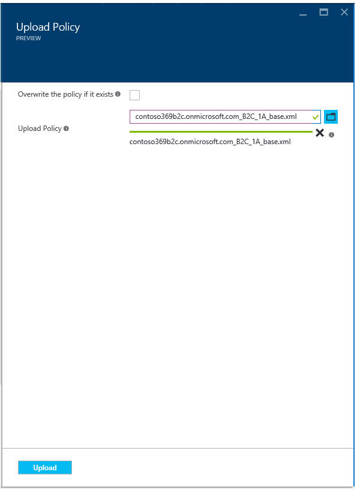

1.  In **Upload Policy**:

    a.  Press the folder icon to select the policy XML file
        &lt;*your\_b2c\_tenant*&gt;*.onmicrosoft.com\_base.xml* where
        *your\_b2c\_tenant* is your B2C tenant name, for example in our
        illustration *contoso369b2c.onmicrosoft.com\_base.xml*.

The base policy XML file must be uploaded first as the other remaining Premium policy XML files of the “Starter Pack” depend on this.

a.  Leave the option to **overwrite the policy if it exists** unchecked
    to make sure you do not overwrite an existing policy with the same
    name unintentionally. The policy id is contained within the
    &lt;BasePolicy&gt; segment:

&lt;BasePolicy&gt;

&lt;TenantId&gt;contos369b2c.onmicrosoft.com&lt;/TenantId&gt;

&lt;PolicyId&gt;b2c\_1a\_base&lt;/PolicyId&gt;

&lt;/BasePolicy&gt;

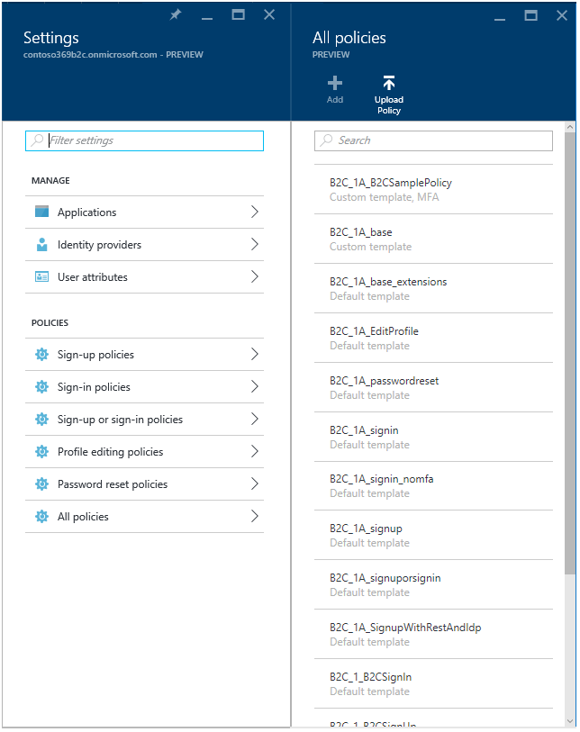

1.  Click **Upload**.

2.  When the policy is uploaded, the name is prepended with *B2C\_1A\_* for “Advanced”. This is done to differentiate between the policies created by the B2C Admin portal and the handcrafted ones.

3.  After the base policy is uploaded, uploaded the policy XML file &lt;*your\_b2c\_tenant*&gt;*.onmicrosoft.com\_base\_Extensions.xml*.

4.  After this second policy is uploaded, other policies can be uploaded in any order.

After upload, the seven premium policies of the “Starter Pack” should be
listed under **All policies**:

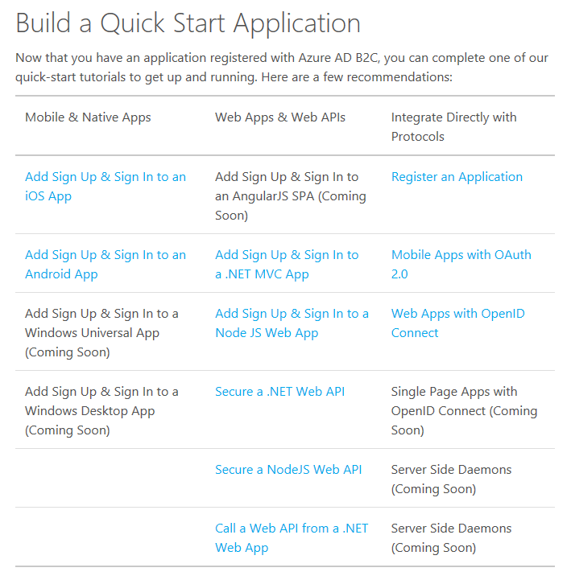

Testing your policies of the “Starter Pack”
===========================================

Using a sample application
--------------------------

Any application setup for B2C should work with any of the premium
policies of the “Starter Pack”. For that purposes, you can leverage one
of the quick start tutorials provided by the Azure AD B2C documentation
to get up and running, and eventually test your policies of the “Starter
Pack”.

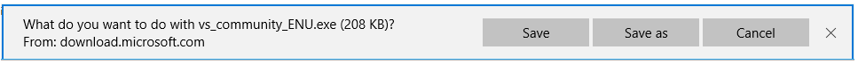

**Note** For additional information, see section [Build a Quick Start
Application](https://azure.microsoft.com/en-us/documentation/articles/active-directory-b2c-app-registration/#build-a-quick-start-application)
of the article Azure Active
Directory B2C preview: how to Register your Application.

#### Installing Visual Studio Community 2015

Visual Studio Community 2015 is a free, fully-featured, and extensible
IDE for creating web applications and APIs, and cloud services, as well
as creating modern applications for Android, iOS and Windows. As far as
the latter is concerned, it no integrates Xamarin features that complete
the out-of-the-box mobile application development experience for
Android, iOS and Windows.

To install Visual Studio Community 2015, proceed with the following
steps:

1.  Open a browsing session and navigate to
    [https://www.visualstudio.com/en-us/products/visual-studio-community-vs.aspx](https://www.visualstudio.com/en-us/products/visual-studio-community-vs.aspx).

2.  Click **Download Community 2015**.

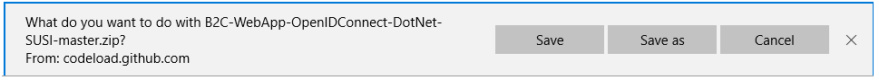

1.  Click **Save** to download the setup file (*vs\_community\_ENU.exe*
    file).

2.  Click **Run**, and follow the instructions to setup the environment.

### Getting a sample application from the GitHub

Amongst the various quick start already available, you can leverage for
example the simple ASP.NET web application that shows how to use a
sign-up or sign-in (SUSI) policy in Azure AD B2C. The sample code and
the related instructions for this sample application are maintained on
GitHub:
[B2C-WebApp-OpenIDConnect-DotNet-SUSI](https://github.com/azureadquickstarts/b2c-webapp-openidconnect-dotnet-susi).

To get the sample application, proceed with the following steps:

1.  Download the
    [B2C-WebApp-OpenIDConnect-DotNet-SUSI-master.zip](https://github.com/AzureADQuickStarts/B2C-WebApp-OpenIDConnect-DotNet-SUSI/archive/master.zip)
    file from GitHub and save it to your computer if you haven’t done so
    already.

1.  Click **Save** and save it on your computer.

2.  Extract the *B2C-WebApp-OpenIdConnect-DotNet-SUSI-master.zip* file.

### Registering the sample application on your B2C tenant

> **Note** For additional information, see the article [Azure Active Directory B2C preview: how to Register your Application](https://azure.microsoft.com/en-us/documentation/articles/active-directory-b2c-app-registration/).

To register the sample application on your B2C tenant, proceed with the
followings steps:

1.  From the B2C Admin portal, click **Applications**.

2.  Click **Add** at the top of the blade. A **New application** blade
    shows up.

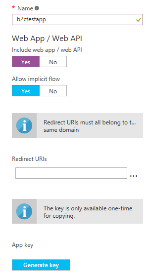

1.  In **Name**, provide an application name that will describe your
    application to consumers, for example in our configuration
    “*b2ctetsapp*”.

2.  Since we’re going to configure a web-based application later in this
    document, toggle the **Include web app / web API** switch to
    **Yes**.

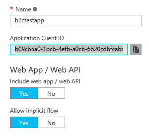

1.  In **Redirect URIs**, type “*https://localhost:44316*”, which the default value of the sample web application provided. Reply URLs are endpoints where Azure AD B2C will return any tokens your application requests.

> **Note** If the application top register also includes a web API that needs to be secured, you'll want to create (and copy) an **Application Secret** as well by clicking **Generate key**.

1.  Click **Create** to register your application.

2.  Click the application that you just created and Note down the
    application’s globally unique **Application Client ID** that you'll
    use later in the application’s code:
    b09cb5a0-1bcb-4efb-a0cb-6b20cdbfcabe.

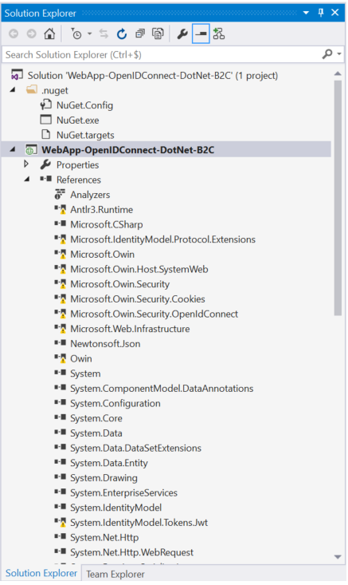

1.  This value will be later referred as to the “*Application Client ID*” value.

### Configuring and building the sample application

We will configure the sample to use the sign-up or sign-in premium
policy of the “Starter Pack”. This will allow the sample
*B2C-WebApp-OpenIdConnect-DotNet-SUSI* application to issue sign-up or
sign-in requests to the Azure AD B2C Premium preview service.

The OpenID Connect OWIN middleware
(Microsoft.Owin.Security.OpenIdConnect) enables the sample application
to seamlessly use OpenID Connect for authentication. This middleware is
available as [NuGet
package](http://www.nuget.org/packages/Microsoft.Owin.Security.WsFederation/)
for the Visual Studio development environment.

To configure the sample application, proceed with the following steps:

1.  Open the solution in Visual Studio Community 2015.

    a.  Click **File** | **Open** | **Project/Solution**

    b.  Navigate to the extracted *master.zip* file

2.  Open the *WebApp-OpenIDConnect-DotNet-B2C-SUSI.sln* solution file.

3.  Open the **Solution Explorer** if it’s not already the case.

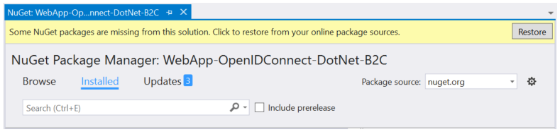

1.  The **References** section of the *WebApp-OpenIDConnect-DotNet-B2C*
    shows a series of unresolved references with an exclamation mark.

2.  Under **WebApp-OpenIDConnect-DotNet-B2C**, right-click
    **References**, and then select **Manage NuGet Packages...** to (try
    to) resolve them. A **NuGet** window opens up and is docked as a
    tabbed document.

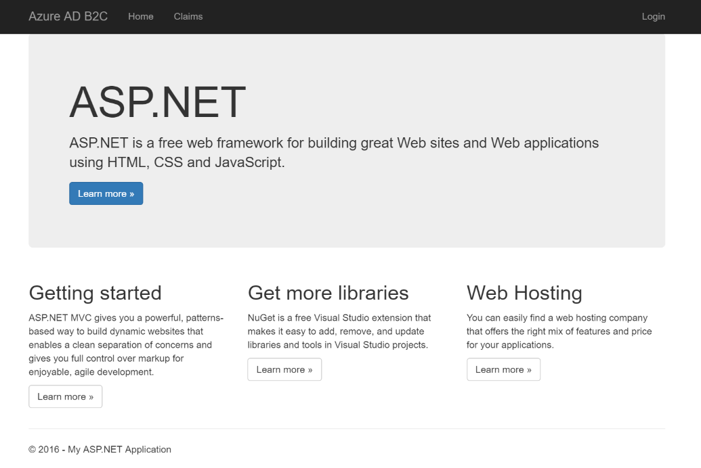

1.  Click **Restore**. The missing NuGet packages are then downloaded to
    resolve the above unresolved references.

2.  Back to the **Solution Explorer** window, select
    **WebApp-OpenIDConnect-DotNet-B2C-SUSI**.

3.  Open the *web.config* file in the root folder of the project.

&lt;?xml version="1.0" encoding="utf-8"?&gt;

&lt;!--

For more information on how to configure your ASP.NET application,
please visit

http://go.microsoft.com/fwlink/?LinkId=301880

--&gt;

&lt;configuration&gt;

&lt;appSettings&gt;

&lt;add key="webpages:Version" value="3.0.0.0" /&gt;

&lt;add key="webpages:Enabled" value="false" /&gt;

&lt;add key="ClientValidationEnabled" value="true" /&gt;

&lt;add key="UnobtrusiveJavaScriptEnabled" value="true" /&gt;

&lt;add key="ida:Tenant" value="fabrikamb2c.onmicrosoft.com" /&gt;

&lt;add key="ida:ClientId" value="90c0fe63-bcf2-44d5-8fb7-b8bbc0b29dc6"
/&gt;

&lt;add key="ida:AadInstance"
value="https://login.microsoftonline.com/{0}{1}{2}" /&gt;

&lt;add key="ida:RedirectUri" value="https://localhost:44316/" /&gt;

&lt;add key="ida:SusiPolicyId" value="b2c\_1\_susi" /&gt;

&lt;add key="ida:PasswordResetPolicyId" value="b2c\_1\_reset" /&gt;

&lt;/appSettings&gt;

…

&lt;/configuration&gt;

1.  In *web.config*, find ‘*ida:Tenant*’ and replace the value with your
    B2C tenant name, for example in our configuration
    “*contoso369b2c.onmicrosoft.com*”.

2.  Find the app key ‘*ida:ClientId*’ and replace the value with the
    “*Application Client ID*” value you copied from the B2C
    application’s blade “b09cb5a0-1bcb-4efb-a0cb-6b20cdbfcabe”.

3.  Leave "*ida:RedirectUri*" as-it: “*https://localhost:44316/*”.

4.  Replace the value in the ‘*ida:SusiPolicyId*’, and
    ‘*ida:PasswordResetPolicyId*’ by the name of the corresponding
    previously uploaded premium policy (see section § *Uploading the
    policies*), i.e. “*B2C\_1A\_signuporsignin*”, and
    “*B2C\_1A\_passwordreset*”.

&lt;?xml version="1.0" encoding="utf-8"?&gt;

&lt;!--

For more information on how to configure your ASP.NET application,
please visit

http://go.microsoft.com/fwlink/?LinkId=301880

--&gt;

&lt;configuration&gt;

&lt;appSettings&gt;

&lt;add key="webpages:Version" value="3.0.0.0" /&gt;

&lt;add key="webpages:Enabled" value="false" /&gt;

&lt;add key="ClientValidationEnabled" value="true" /&gt;

&lt;add key="UnobtrusiveJavaScriptEnabled" value="true" /&gt;

&lt;add key="ida:Tenant" value="contoso369b2c.onmicrosoft.com" /&gt;

&lt;add key="ida:ClientId" value="b09cb5a0-1bcb-4efb-a0cb-6b20cdbfcabe"
/&gt;

&lt;add key="ida:AadInstance"
value="https://login.microsoftonline.com/{0}{1}{2}" /&gt;

&lt;add key="ida:RedirectUri" value="https://localhost:44316/" /&gt;

&lt;add key="ida:SusiPolicyId" value="B2C\_1A\_signuporsignin" /&gt;

&lt;add key="ida:PasswordResetPolicyId" value="B2C\_1A\_passwordreset"
/&gt;

&lt;/appSettings&gt;

…

&lt;/configuration&gt;

1.  Save the file. Click **File** | **Save All**.

### Testing the policies from the sample application

To run the sample application from Visual Studio and test the policies,
proceed with the following steps:

1.  Clean the Visual Studio solution. Click **Build** | **Clean
    Solution**.

2.  Rebuild the Visual Studio solution. Click **Build** | **Rebuild Solution**.

3.  Run the sample application. Press F5 to run the solution.

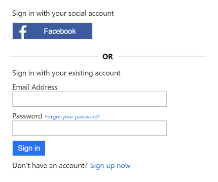

1.  Click **Login** in the upper right corner.

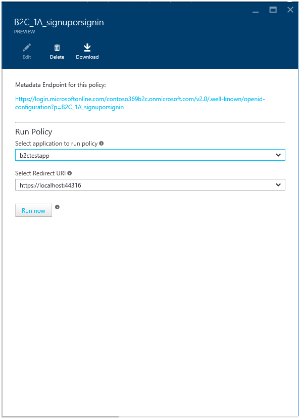

1.  Continue with the sign-up or sign-in process as invited by the
    execution of the premium policy.

2.  Back to the sample app, click **Claims** to see the claims that are
    sent to the app by Azure AD B2C Premium. The premium policy that has
    been executed is provided in the claim
    *http://schemas.microsoft.com/claims/authnclassreference*.

Testing the policies right away from the B2C Admin portal
---------------------------------------------------------

To test the premium policies of the “Starter Pack” right away from the
B2C Admin portal, proceed with the following steps:

1.  From the B2C Admin portal, in the **All Policies** blade, click on a
    policy, such as **B2C\_1A\_signin**, to open the policy blade.

1.  Select an application and click **Run now** to test the policy. A
    new tab opens up.

2.  Continue with the sign-up or sign-in process as invited by the
    execution of the premium policy. The user journey is the exact same.

**This concludes this “Getting Started” guide.**

  -----------------------------------------------------------------------------------------------------------------------------------------------------------------------------------------------------------------------------------------------------------------------------------------------------------------------------------------------------------------------------------------------------------------------------
  The information contained in this document represents the current view of Microsoft Corporation on the issues discussed as of the date of publication. Because Microsoft must respond to changing market conditions, it should not be interpreted to be a commitment on the part of Microsoft, and Microsoft cannot guarantee the accuracy of any information presented after the date of publication.

  This white paper is for informational purposes only. Microsoft makes no warranties, express or implied, in this document.

  Complying with all applicable copyright laws is the responsibility of the user. Without limiting the rights under copyright, no part of this document may be reproduced, stored in, or introduced into a retrieval system, or transmitted in any form or by any means (electronic, mechanical, photocopying, recording, or otherwise), or for any purpose, without the express written permission of Microsoft Corporation.

  Microsoft may have patents, patent applications, trademarks, copyrights, or other intellectual property rights covering subject matter in this document. Except as expressly provided in any written license agreement from Microsoft, the furnishing of this document does not give you any license to these patents, trademarks, copyrights, or other intellectual property.

  © 2016 Microsoft Corporation. All rights reserved.

  The example companies, organizations, products, domain names, e-mail addresses, logos, people, places, and events depicted herein are fictitious. No association with any real company, organization, product, domain name, e-mail address, logo, person, place, or event is intended or should be inferred.

  Microsoft, list Microsoft trademarks used in your white paper alphabetically are either registered trademarks or trademarks of Microsoft Corporation in the United States and/or other countries.

  The names of actual companies and products mentioned herein may be the trademarks of their respective owners.
  -----------------------------------------------------------------------------------------------------------------------------------------------------------------------------------------------------------------------------------------------------------------------------------------------------------------------------------------------------------------------------------------------------------------------------
