#Part 3 - Manage premium policies for your custom user journeys

Microsoft Corporation
Published: July 2016
Version: 0.7 (DRAFT)

Author: Philippe Beraud (Microsoft France)
Reviewers: Kim Cameron, Brandon Murdoch, Ronny Bjones, Jose Rojas
(Microsoft Corporation)

For the latest information on Azure Active Directory, please see

http://azure.microsoft.com/en-us/services/active-directory/

Copyright© 2016 Microsoft Corporation. All rights reserved.

Abstract: Azure AD, the Identity Management as a Service (IDaaS) cloud
multi-tenant service with proven ability to handle billions of
authentications per day, extends its capabilities to manage consumer
identities with a new service for Business-to-Consumer: Azure AD B2C.

Azure AD B2C is "IDaaS for Customers and Citizens” designed with Azure
AD privacy, security, availability, and scalability for customer/citizen
Identity management (IDM). It’s a comprehensive, cloud-based, 100%
policy driven solution where declarative policies encode the identity
behaviors and experiences as well as the relationships of trust and
authority inside a Trust Framework (TF).

Whilst the Azure AD B2C Basic leverages a dedicated TF tailored by
Microsoft, i.e. the “Microsoft Basic Trust Framework” in which you can
customize policies, the Premium edition gives you full control, and thus
allows you to author and create your own Trust Framework through
declarative policies. It thus provides you with all the requirements of
an Identity “Hub”.

This document is intended for IT professionals, system architects, and
developers who are interested in understanding the advanced capabilities
Azure AD B2C Premium provides, and more especially in this context how
to manage their own Trust Framework (policies) along with all the
associated keys.

Table of Content

[Notice](#notice)

[Introduction](#introduction)

[Objectives of this document](#objectives-of-this-document)

[Non-objectives of this paper](#non-objectives-of-this-paper)

[Organization of this paper](#organization-of-this-paper)

[About the audience](#about-the-audience)

[Implementing and managing your policies for custom user journeys](#implementing-and-managing-your-policies-for-custom-user-journeys)

[Understanding interaction with policies configured via portal UI](#understanding-interaction-with-policies-configured-via-portal-ui)

[Authoring your policies for the custom user journeys](#authoring-your-policies-for-the-custom-user-journeys)

[Managing the premium policies](#managing-the-premium-policies)

[Managing your keys for the policies](#managing-your-keys-for-the-policies)

[Introducing the key containers support in Azure AD B2C Premium](#introducing-the-key-containers-support-in-azure-ad-b2c-premium)

[Managing key containers](#managing-key-containers)

[Managing your HTML5/CSS templates for the policies](#managing-your-html5css-templates-for-the-policies)

[Preparing a storage account for your HTML5/CSS templates](#preparing-a-storage-account-for-your-html5css-templates)

[Ensuring the storage you are hosting your HTML5/CSS templates from has
CORS enabled](#ensuring-the-storage-you-are-hosting-your-html5css-templates-from-has-cors-enabled)

[Managing your users and their attributes with the Graph API](#managing-your-users-and-their-attributes-with-the-graph-api)

[Appendix A. Understanding the premium policies of the Starter Pack](#appendix-a.-understanding-the-premium-policies-of-the-starter-pack)

[Core elements of the *B2C\_1A\_base* policy](#core-elements-of-the-b2c_1a_base-policy)

[Appendix B. Using the Graph API with your B2C tenant](#appendix-b.-using-the-graph-api-with-your-b2c-tenant)

[Setup the B2CGraphClient sample command line application](#setup-the-b2cgraphclient-sample-command-line-application)

[Running local account CRUD operations](#running-local-account-crud-operations)

Notice
======

This document illustrates new capabilities of
Azure AD through the just made available public preview of the Azure AD
B2C service. This public preview may be substantially modified before
GA.

**This document will be updated to reflect the changes introduced at GA
time.**

**This document reflects current views and assumptions as of the date of
development and is subject to change.  Actual and future results and
trends may differ materially from any forward-looking statements. 
Microsoft assumes no responsibility for errors or omissions in the
materials.  **

**THIS DOCUMENT IS FOR INFORMATIONAL AND TRAINING PURPOSES ONLY AND IS
PROVIDED "AS IS" WITHOUT WARRANTY OF ANY KIND, WHETHER EXPRESS OR
IMPLIED, INCLUDING BUT NOT LIMITED TO THE IMPLIED WARRANTIES OF
MERCHANTABILITY, FITNESS FOR A PARTICULAR PURPOSE, AND
NON-INFRINGEMENT.**

Introduction
=============

Azure AD B2C is a cloud identity service for your
consumer-facing web and mobile applications. Azure AD B2C is designed to
solve the identity management challenges that have emerged, as economic
and competitive pressures drive commercial enterprises, educational
institutions, and government agencies to shift their service delivery
channels from face-to-face engagements to online web and mobile
applications.

Based on standardized protocols, Azure AD B2C is "IDaaS for Customers
and Citizens” designed with Azure AD privacy, security, availability,
and scalability for customer/citizen Identity management (IDM). The
“secret sauce” of Azure AD B2C to achieve the above objectives resides
in the 100% policy driven identity experience engine that consume fit to
purpose declarative policies.

Many of the most frequently used identity use cases can be addresses
using the B2C extension in the Azure portal as the developer control
surface. However, there some advanced features only available by writing
custom user journeys which must be configured directly into policy XML
files and uploaded to the B2C tenant. Access to this incremental feature
set is available via the Premium edition of Azure AD B2C.

**Note** For a basic level of proficiency with the policy configuration
available directly in the B2C Admin portal, see the introduction video
[Business-to-Consumer Identity
Management with Azure Active
Directory B2C](https://channel9.msdn.com/Events/Build/2016/P423)
where all the relevant B2C Admin **portal** settings are.

Objectives of this document
---------------------------

This third part is intended as an overview document for discovering and
understanding how the premium capabilities can be leveraged to author
and manage your own premium policies (along with the associated security
keys) for your custom user journeys.

Non-objectives of this paper
----------------------------

This series of
documents is not intended as an overview document for the Azure AD
offerings but rather focusses on this new Azure AD B2C identity service,
and more specifically on the premium edition.

> **Note** For additional information, see the Microsoft MSDN article
> [Getting started with Azure
> AD](http://msdn.microsoft.com/en-us/library/dn655157.aspx).
> As well as the whitepapers [Active Directory from the
> on-premises to the
> cloud](ttp://www.microsoft.com/en-us/download/details.aspx?id=36391)
> and [An overview of Azure
> AD](ttp://www.microsoft.com/en-us/download/details.aspx?id=36391)
> as part of the same series of documents.

Organization of this paper
--------------------------

To cover the aforementioned objectives, this document of the series is
organized in the following four sections:

-   Implementing and managing
    > your policies.

-   Managing your keys for the
    > policies.

-   Managing your HTML5/CSS
    > templates for the policies.

-   Managing your users and their
    > attributes with Graph API.

These sections provide the information details necessary to understand
the new capabilities introduced by the premium edition of Azure AD B2C,
and successfully build and manage your own (Trust Framework) premium
policies based on the already available features as per the currently
available public preview.

About the audience
------------------

This document is intended for IT professionals, system architects, and
developers who are interested in understanding the advanced capabilities
Azure AD B2C Premium provides with all the requirements of an Identity
“Hub”, and in this context how to manage their own (Trust Framework)
policies and all the associated keys.

Implementing and managing your policies for custom user journeys
================================================================

Azure AD B2C Premium provides administrative interfaces to create and
publish your premium policies to define your more advanced custom user
journeys.

Based on the shared understanding of both the nature and structure of
the policies that constitute a Trust Framework, this section describes
all the operations that relate to them, and provides guidance and best
practices in this context.

Understanding interaction with policies configured via portal UI
----------------------------------------------------------------

Azure AD B2C premium policies rely on your own Trust Framework
configuration as discussed below and therefore share only a few
characteristics with policies that are configured via the B2C admin
portal which rely on a common multi-tenant Trust Framework.

Premium policies inherit configuration settings from each other. (see
the sixth part of this series of document for additional information).

The portal configured policies inherit from hidden files not available
to the developer where as any premium policies based on the “Started
Pack” (see the third part of this series of documents) ***inherit and
extend*** the settings in the base policy coming from the “Started
Pack”, e.g. the
&lt;*your\_b2c\_tenant&gt;*.*onmicrosoft.com\_B2C\_1A\_base.xml* policy
XML file.

***We DO recommend that you do not intermix premium and portal
configured policies.***

A web or mobile application, however, may invoke any type of policy, for
example a premium policy for signup and a portal configured policy for
sign-in. Claims providers, extended attributes, MFA on/off, and UI
customization are a few of the features that must be configured
separately between premium policies and portal configured policies.

Authoring your policies for the custom user journeys
----------------------------------------------------

Azure AD B2C Premium is flexible enough to accommodate various
situations in terms of identity use cases. The next sections deal with
the most common situations you may encounter and the role you may play
in such a context.

### Authoring your policies as an organization

Considering the above, let’s illustrate a typical logical provisioning
workflow. Let’s suppose that, at this stage, your organization is in the
process to define, create and deploy suitable policies to constitute its
own Trust Framework.

#### Leveraging the inheritance model

The various policies to define and create to accommodate various
requirements, constraints, and needs should leverage the layering
approach permitted by Azure AD B2C Premium thanks to the inheritance
model rather than defining everything in the policy XML file, and
starting again and again from scratch.

The inheritance model is as follows:

-   The parent policy and child policy are of the same schema and
    flexibility.

-   Child policy can inherit the parent policy functionality and
    ‘*extend it*’.

-   Adding a new element effectively extends the parent policy.

-   There is NO limit on the number of levels.

And, in terms of override:

-   The child policy can override ‘allowed’ aspects of the parent
    policy.

-   Same element in the child policy and parent policy implies, child
    policy is overriding that element of the parent policy.

> **Important note** In terms of security boundary, because the parent
> policy and child policy could span across tenants, References to
> cryptographic key material (see section § *Managing your keys for the
> policies* later in this document) should be kept within the boundary
> of the organization that owns them.

Considering the above, when you subscribe to Azure AD B2C Premium, and
after configuring the “Starter Pack” in accordance to the second part of
this series of documents, you have uploaded in your B2C tenant the
following policies:

1.  A *B2C\_1A\_base* base policy, e.g. the
    > &lt;*your\_b2c\_tenant&gt;*.*onmicrosoft.com\_B2C\_1A\_base.xml*
    > policy XML file, that mainly defines the core elements that Azure
    > AD B2C Premium can basically leverages basically leverages for
    > your premium policies that will inherit from it: core claims
    > schema and transformations definitions, some key claims providers,
    > and core user journeys.

2.  A *B2C\_1A\_base\_extensions* premium policy, e.g. the
    > &lt;*your\_b2c\_tenant&gt;*.*onmicrosoft.com\_B2C\_1A\_base\_Extensions.xml*
    > policy XML file, that simply inherits from the above policy. This
    > second policy constitutes a kind of isolation layer on which to
    > ground any Trust Framework (premium policies). It constitutes the
    > “exposed” base policy.

**The former *B2C\_1A\_base* policy certainly constitutes a more than
valuable resource to learn how the various XML elements are defined in
addition to this document and the sixth part of this series of
documents. We highly recommend to leave this file untouched. **

**The latter one, i.e. the *B2C\_1A\_base\_extensions* premium policy,
should really be considered as the starting point of your own Trust
Framework (policies). We advise to use it to all the core and common
additional elements you may need for your own premium policies: common
additional claims schema, key claims providers you will need, etc.**

The additional five premium policies that come with the “Starter Pack”
inherit from this base extension policy, e.g.:

1.  EditProfile
    (*&lt;your\_b2c\_tenant&gt;.onmicrosoft.com\_editprofile.xml* policy
    XML file).

2.  passwordreset
    (*&lt;your\_b2c\_tenant&gt;.onmicrosoft.com\_passwordreset.xml*
    policy XML file).

3.  signin (*&lt;your\_b2c\_tenant&gt;.onmicrosoft.com\_signin.xml*
    policy XML file).

4.  signup (*&lt;your\_b2c\_tenant&gt;.onmicrosoft.com\_signup.xml*
    policy XML file).

5.  signuporsignin
    (*&lt;your\_b2c\_tenant&gt;.onmicrosoft.com\_signuporsignin.xml*
    policy XML file).

As illustrated hereafter.

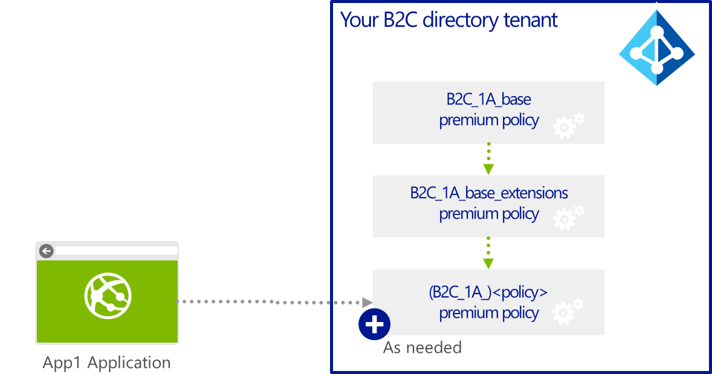

&lt;TrustFrameworkPolicy
xmlns:xsi="http://www.w3.org/2001/XMLSchema-instance"

xmlns:xsd="http://www.w3.org/2001/XMLSchema"

xmlns="http://schemas.microsoft.com/online/cpim/schemas/2013/06"

PolicySchemaVersion="0.3.0.0"

TenantId="contoso369b2c.onmicrosoft.com"

PolicyId="(B2C\_1A\_)&lt;*policy*&gt;"

PublicPolicyUri="http://contoso369b2c.onmicrosoft.com/"&gt;

…

&lt;BasePolicy&gt;

&lt;TenantId&gt;contoso369b2c.onmicrosoft.com&lt;/TenantId&gt;

&lt;PolicyId&gt;B2C\_1A\_base\_extensions&lt;/PolicyId&gt;

&lt;/BasePolicy&gt;

…

&lt;/TrustFrameworkPolicy&gt;

In the lifecycle of a Trust Framework, the base policy indeed will
certainly evolve over the time and there are consequently need for
change version control. This may have significant consequences and
should be indicated by a change in the version. You thus may require a
new version to be published with the update version of the
*B2C\_1A\_base* policy: let’s’ say a new *B2C\_1A\_base-v2* policy
instead of the *B2C\_1A\_base* policy.

In such circumstances that will certainly occur over the time, having
the *B2C\_1A\_base\_extensions* policy between the
(*B2C\_1A*)&lt;*policy*&gt; premium policies and the *B2C\_1A\_base* or
now the *B2C\_1A\_base-v2* policy can introduce a well-suited
flexibility in your ability to version your foundational base policy.
Having such a policy in place allows you simply changing the base policy
reference in the *B2C\_1A\_base\_extensions* without having to update
any of the &lt;*policy*&gt; policies sitting below in the inheritance
hierarchy in terms of reference to core definitions.

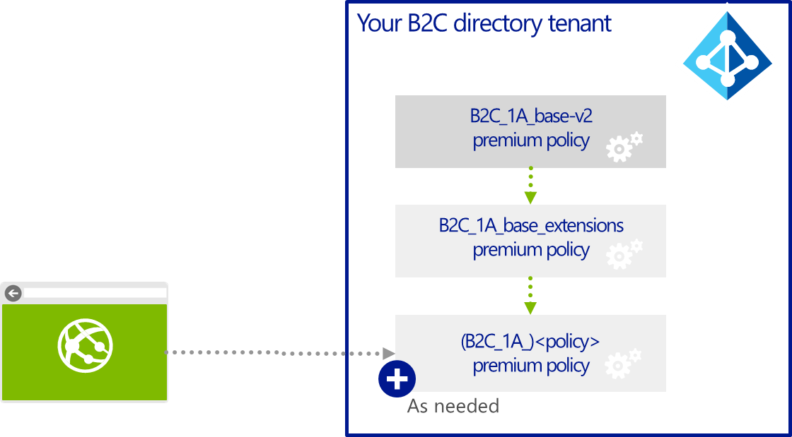

Considering the above, the recommended inheritance model will be as
follows for a specific (*B2C\_1A\_*)&lt;*policy*&gt; policy is the one
suggested by the “Starter Pack”:

-   The (*B2C\_1A\_*)&lt;*policy*&gt; inherits from the
    > *B2C\_1A\_base\_extensions* policy.

-   The *B2C\_1A\_base\_extensions* policy inherits in turn from the
    > *B2C\_1A\_base* policy.

### Authoring your policies as a Trust Framework provider

Considering what has been covered so far, Azure AD B2C Premium has the
ability address the unique identity management problems of different
communities of interest. Industry has indeed many verticals that need to
comply with specific regulations: e.g. applications dealing with
financial transactions, applications dealing with patient health data,
applications dealing with defense, etc. We often find the need to create
policies that help those industries meet the required regulations.

Azure AD B2C Premium achieves this versatility by being architected as
you already know as a 100% policy driven identity experience engine.
Policies and counterpart policy XML files are designed to enable
defining such policies, that various applications could use and thereby
be compliant. **100% of everything is defined in the policy XML file
(and its parent policy XML files). Nothing is hardcoded anywhere else
outside of the policies.**

This engine can support a broad spectrum of digital identity ecosystems
by enforcing different Trust Frameworks (TFs) tailored to the needs of
individual communities of interest.

As such, Azure AD B2C Premium provides thus the ability to manage data
on behalf of participants in the above communities of interest.
Federated identity provides a basis for achieving end user identity
assurance at Internet scale. By delegating identity management to 3^rd^
parties, a single digital identity for an end user can be re-used with
multiple relying parties.

Let’s consider how you can author a particular TF as a Trust Framework
Provider (TFP) to allow governing a community of interest.

Multiple Trust Frameworks can be published by a TFP. **The intention
could aim at establishing a catalog/marketplace of TFs that are suitable
for a variety of communities of interest. **

**Note** A TFP may choose to author a given TF for a single LOA and LOP
in which case, the related policies may only include user journeys
associated with that LOA and LOP. It should also be mentioned that a
policy may have multiple user journeys for the same LOA and/or LOP
simply because to achieve that LOA/LOP requirements, some claims
providers can only be used with certain other claims providers, and thus
user journeys may have to be formed for different combinations.

**Important note** All the *certification program* aspects that may
relate to a trust framework are outside the scope of Azure AD B2C
Premium. These aspects are covered using existing, out-of-band processes
under the responsibility of the TFP that publishes a TF.

#### Leveraging the inheritance model as a TFP

The aforementioned considerations for an organization that authors its
own Trust Framework (policies) also apply here for the TFP.

When the TFP subscribes to Azure AD B2C Premium, and after configuring
the “Starter Pack” in accordance to the second part of this series of
documents, the TFP will have uploaded in its B2C tenant the following
two policies:

1.  A *B2C\_1A\_base* base policy, e.g. the
    &lt;*your\_b2c\_tenant&gt;*.*onmicrosoft.com\_B2C\_1A\_base.xml*
    policy XML file, that mainly defines the core elements that Azure AD
    B2C Premium can basically leverages.

2.  A *B2C\_1A\_base\_extensions* premium policy, e.g. the
    > &lt;*your\_b2c\_tenant&gt;*.*onmicrosoft.com\_B2C\_1A\_base\_Extensions.xml*
    > policy XML file, that simply inherits from the above policy and
    > constitutes an isolation layer on which to ground any Trust
    > Framework (policies) for the TFP.

To author a particular TF to allow governing a community of interest, we
do recommend for the TFP defining the following two policies:

1.  A *B2C\_1A\_*&lt;*TF*&gt;*base* policy that inherits from the above
    *B2CTrustFrameworkV2* policy. This policy will mainly define all the
    core and common additional elements the TFP may need for a
    particular policy: common additional claims schema, key claims
    providers you will need, etc.

2.  And in turn a *B2C\_1A\_*&lt;*TF*&gt;*base\_extensions* policy that
    > will simply inherit from the above *B2C\_1A\_*&lt;*TF*&gt;*base*
    > policy. This second policy constitutes the same kind of isolation
    > layer as the one mentioned above.

**The above policies are located in the TFP’s B2C tenant as illustrated
hereafter.**

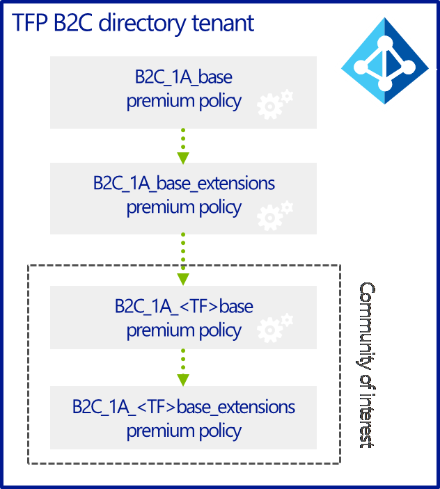

### Authoring your policies as a relying party

As a participant in the community of interest, a specific relying party
can express its technical policies for its application. These policies
are referred as to *relying party application policies*.

A relying party application (*B2C\_1A\_*)&lt;*policy*&gt; policy will
directly inherit from *B2C\_1A\_*&lt;*TF*&gt;*base\_extensions* policy
located in the TFP B2C tenant - and thus leverages – all the elements
defined in this policy provided by the TPF.

In other words, such a TF (*B2C\_1A\_*)&lt;*policy*&gt; policy builds on
top of a technical policy in a given TFP.

&lt;TrustFrameworkPolicy
xmlns:xsi="http://www.w3.org/2001/XMLSchema-instance"

xmlns:xsd="http://www.w3.org/2001/XMLSchema"

xmlns="http://schemas.microsoft.com/online/cpim/schemas/2013/06"

PolicySchemaVersion="0.3.0.0"

TenantId="contoso369b2c.onmicrosoft.com"

PolicyId="(B2C\_1A\_)&lt;*policy*&gt;"

PublicPolicyUri="http://contoso369b2c.onmicrosoft.com/"&gt;

…

&lt;BasePolicy&gt;

&lt;TenantId&gt;"&lt;TFP&gt;.onmicrosoft.com&lt;/TenantId&gt;

&lt;PolicyId&gt;B2C\_1A\_&lt;TF&gt;base\_extensions&lt;/PolicyId&gt;

&lt;/BasePolicy&gt;

…

&lt;/TrustFrameworkPolicy&gt;

They will allow the relying parties belonging to the community of
interest to author their own relying party application
(*B2C\_1A\_*)&lt;*policy*&gt; policies.

Such an approach greatly facilitates the onboarding of a given relying
party application onto the “identity information exchange network” of
the community of interest. Such (*B2C\_1A\_*)&lt;*policy*&gt; policies
not only operate with the constraints of the Trust Framework
(*B2C\_1A\_*&lt;*TF*&gt;base\_extensions policy) but also enables the
relying party to further refine its template-based application policy to
accommodate its own requirements by for instance restricting its users’
experiences to, e.g. a subset of claims that it is interested in,
constraint on the claims providers that can be used, etc.

**The relying party application (B2C\_1A\_)&lt;*policy*&gt; policies are
located in the relying party’s B2C tenant as illustrated hereafter.**

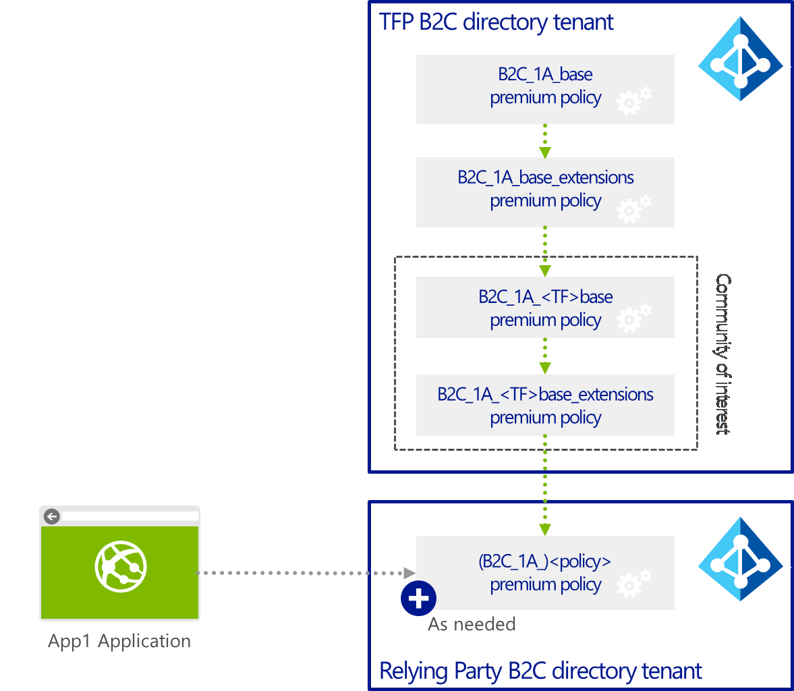

Azure AD B2C Premium provides as part of its administrative PowerShell
cmdlets interface the tooling for a relying party to manage in Azure AD
B2C Premium its own policies on that basis as expressed as per policy
XML files. A relying party can publish any number of policy XML files
referring to various definitions of the Trust Framework that the relying
party has subscribed to. The relying party can update or delete its own
policies at any time.

On that basis, developers and/or security officers are then able to
configure the relying party’s application(s) for automated digital
identity information request processing by the Azure AD B2C Premium
service under the rules of the above policies.

Managing the premium policies
------------------------------

This section depicts how to conduct the various operations that relate
to the management of the premium policies.

As one can imagine, Azure AD B2C Premium administrative interface
provides standard CRUD features for publishing and updating policies.
These operations are realized through the B2C admin portal.

### Uploading a specific premium policy

To upload a premium policy in your B2C tenant, proceed with the
following steps:

1.  Open a browsing session and navigate to the Azure AD B2C blade using
    the following URL:

https://portal.azure.com/&lt;*your\_b2c\_tenant*&gt;.onmicrosoft.com/?Microsoft\_AAD\_B2CAdmin=true\#blade/Microsoft\_AAD\_B2CAdmin/TenantManagementBlade/id/&lt;*your\_b2c\_tenant*&gt;.onmicrosoft.com

> where *your\_b2c\_tenant* the name of your B2C tenant, for example:

[https://portal.azure.com/contoso369b2c.onmicrosoft.com/?Microsoft\_AAD\_B2CAdmin=true\#blade/Microsoft\_AAD\_B2CAdmin/TenantManagementBlade/id/contoso369b2c.onmicrosoft.com](https://portal.azure.com/contoso369b2c.onmicrosoft.com/?Microsoft_AAD_B2CAdmin=true#blade/Microsoft_AAD_B2CAdmin/TenantManagementBlade/id/contoso369b2c.onmicrosoft.com)

1.  Sign in using an administrative account of that tenant, for example
    > [admin@contoso369b2c.onmicrosoft.com](mailto:admin@contoso369b2c.onmicrosoft.com)
    > in our illustration.

2.  Click **Browse** | **Azure AD B2C**. The Azure AD B2C blade opens up
    > in the B2C Admin portal.

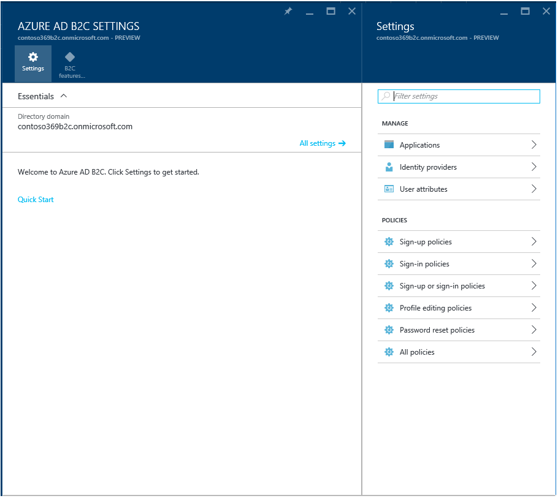 

1.  Click **All Policies**.

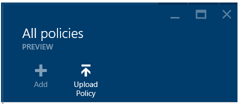

1.  Click **Upload Policy** at the top of the blade. An eponym blade
    opens up.

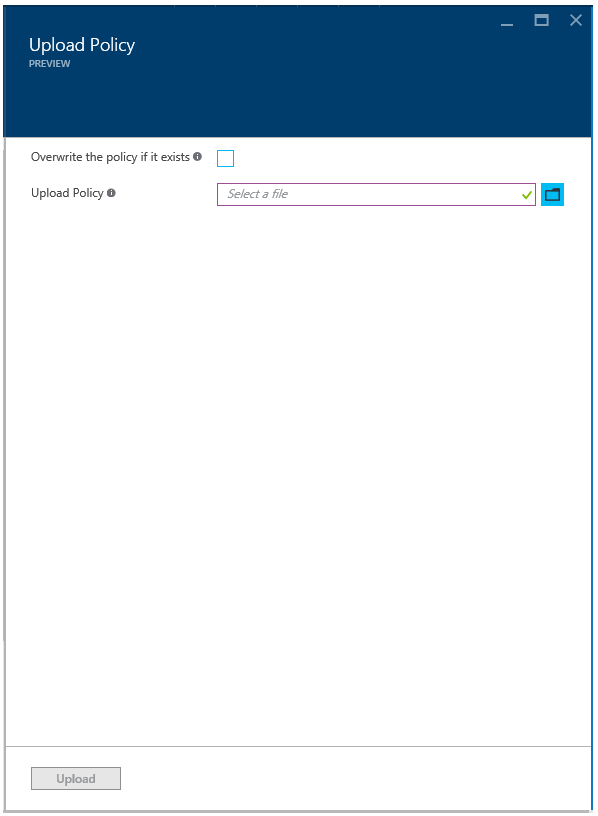 

1.  In **Upload Policy**:

    a.  Press the folder icon to select the premium policy XML file to
        upload.

    b.  Leave the option to **overwrite the policy if it exists**
        unchecked to make sure you do not overwrite an existing policy
        with the same name unintentionally. Conversely, check
        **overwrite the policy if it exists** to overwrite it.

 

1.  Click **Upload**.

2.  When the premium policy is uploaded, the name is prepended with
    > *B2C\_1A\_* for “Advanced”. This is done to differentiate between
    > the policies created by the B2C Admin portal and the handcrafted
    > ones.

### Viewing all your premium policies

To view all your premium policy, from the Azure AD B2C blade in the B2C
Admin portal, click **All Policies**.

 

All your premium policies are prefixed by *B2C\_1A\_* with A standing
for “Advanced”. The policies prefixed by *B2C\_1\_* are policies created
by the B2C Admin portal.

### Downloading a specific premium policy

To download a specific premium policy, proceed with the following steps:

1.  From the Azure AD B2C blade in the B2C Admin portal, click **All
    > Policies**.

2.  Click the premium policy to download, e.g. one being prefixed by
    > B2C\_1A\_. A related blade opens up.

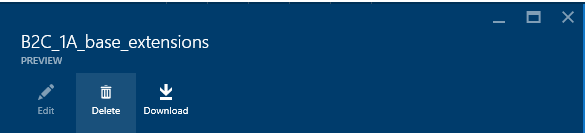 

1.  Click **Download**.

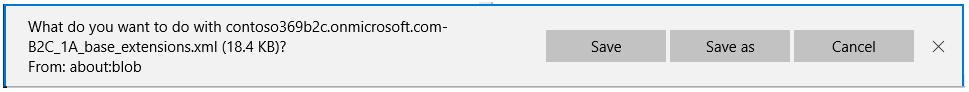 

1.  Click **Save** or **Save as** to save the policy XML file.

You can refer to the fourth and sixth parts of this series of documents
for information, guidances, and a technical reference on how to edit and
customize the policy XML file to model your advanced identity use case.

### Deleting a specific premium policy

To delete a specific premium policy, proceed with the following steps:

1.  From the Azure AD B2C blade in the B2C Admin portal, click **All
    Policies**.

2.  Click the premium policy to download, e.g. one being prefixed by
    > B2C\_1A\_. A related blade opens up.

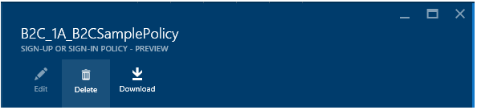 

1.  Click **Delete**.

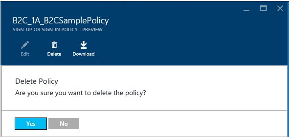 

1.  Click **Save** or **Save as** to save the policy XML file.

Managing your keys for the policies
===================================

This section deals with the key containers for which references have
been specified in the policy XML files. It introduces and presents in
this context what a key container is and details on how to upload keys
in it.

Introducing the key containers support in Azure AD B2C Premium
--------------------------------------------------------------

As already introduced in this document as part of the technical profiles
for claims providers and claims issuers, Azure AD B2C Premium leverages
the [JSON Web Key (JWK)](https://tools.ietf.org/html/rfc7517)
standard for the key containers.

JWK is a JavaScript Object Notation (JSON) data structure that
represents a cryptographic key. This aforementioned specification also
defines a JWK Set JSON data structure that represents a set of JWKs.
Azure AD B2C Premium implements the basic readers, writers and
sterilizers for the JWK standard.

### Understanding key set

A key set is a collection of keys. These keys can be binary secrets or
RSA keys.

The following JSON snippet provides an examples of a key set that
contains binary secrets:

{"keys":

\[

{"kty":"oct",

"k":"MKBCTNIcKUSDii11ySs3526iDZ8AiTo7Tu6KPAqv7D4",

"use":"sig",

"kid":"FacebookClientSecret"

},

{"kty":"oct",

"k":"AABCTNIcKUSDii11ySs3526iDZ8AiTo7Tu6KPAqv7E3",

"use":"sig",

"kid":"FacebookClientSecret"

}

\]

}

This key set contains two key objects placed in the array “keys”. They
are both of the key type “oct” which means binary secret. All keys are
serialized in base64 Url encoding.

The following JSON snippet provides an examples of a key set that
contains a RSA private key:

{"keys":

\[

{"kty":"RSA",

"kid":"JwtTokenSigning",

"use":"sig",

"e":"AQAB",

"d":"G2VGBWW2er3GgDY
sh3M7oZyTDJQugOuIvWXU9dr9aXiSpt6rqeYMYJscb2KswL3YbZhc2BdIlFc5DMGyxR8bcRLOWZto-

VbmWYvxE9P332VCZU4OHAincU3WzlU-gDsWNE21GV0hEG30wFJV2xCgARJxq35XUK33ro6XwDs7V5E",

"n":"lPX72e7g2exGDDSwk9JxZP-RaLc8MennVuctuNi2ajKCnHp6eqxixxakZ4uGf11qP9zhEEseAONK3m-q2M96y7HJJ261f0Dom-

lngR73iS3v0UWMjR\_SGjnhv0HJ8zA7IaDCHAgdARJaUQ6Y6RP4Ft54Vfw39QJTrXMObQz7DrM",

"p":"-vfl4t8R40NiiY\_Bk7hNOYZqb6wt2zk-uvQzEeQ6VTGPRVTX52DGYGCU-bzCgwb4rMV2LmQS72gbgQEAgxwvSQ",

"q":"l\_KHk\_syueUwJnYoUUprcYnHrZj2hQcXaBJk\_8WpXAl6fFxbopsa4MMqGbLlHfMZgw01DyodeZAqT-HSrgeCGw",

"dp":"PhA2Ao\_lrY0JfjlVxsEqH9K02Z77zB3w\_GzNgFwvbMgPxTaBGhAdntHjpYrfk2WS8671Ve2bnSbivllQFhxPOQ",

"dq":
"AChcQ6cLEm5OcnvE5vCw09lUv7Vc7B5pw83hFPLbjiDkY6Sk47JNgNYzAPvSiQlriVtGJtHgXfPsV1DgqxWO6Q",

"qi":"Wg3mWikHWlpecQj9MA9UtDBs8KL0uaXe1DGatEsT1-gOWznbaUF\_PIoSC8Xow3TC\_TXdmdISfj7A5pJT\_cOggw"},

\]

}

This key set contains an RSA private key with all key parameters needed
to perform efficient RSA operations.

It is always advisable to include all key components in the key because
lacking one of them reduces performance in so far as all key parameters
need to be generated during the key loading.

**As stated above, "oct” and “RSA” are currently the only key types
supported.**

The following table describes the main parameters of a key. For the
additional one, please refer to the standard specification:

  ----------------------------------------------------------------------------------------------------------------------------------------------------------------------------------------------------------------------------------------------------------------------------------------------------
  Parameter   Description
  ----------- ----------------------------------------------------------------------------------------------------------------------------------------------------------------------------------------------------------------------------------------------------------------------------------------
  Kty         Indicate the type of key. This parameter is mandatory.

              Values: “oct” or “RSA”.

  Kid         Provide a specific key an identifier which can be later. This parameter is optional.

              In Azure AD B2C Premium, kid corresponds to the *StorageReferenceId* value of *the Key* XML element, i.e. the machine understandable identifier that is used to uniquely identify a particular storage key container, and reference it from other XML elements in the policy XML file.

  Use         Specify the key’s usage. This parameter is optional.

              As of this writing, Azure AD B2C Premium usage of oct and RSA keys is currently limited to signatures.
  ----------------------------------------------------------------------------------------------------------------------------------------------------------------------------------------------------------------------------------------------------------------------------------------------------

Interestingly enough, key set allows to support rolling keys. Rolling
key are used for signing keys and allow you to define in Azure AD B2C
Premium key sets with different generations of keys. A new key can be
generated and published way ahead. Depending on policy and expiration,
the old key will no longer be used and removed. Azure AD B2C Premium can
switch to the new key and a new generation key can be generated.

This same approach can also be used to revoke a key.

Now that you have an understanding of the key containers structure,
let’s consider how to manage them in Azure AD B2C Premium.

Managing key containers
-----------------------

Key containers in Azure AD B2C Premium are managed through a set of
PowerShell cmdlets.

> **Note** Windows PowerShell is a command-line shell and scripting
> language that is designed for system administration and automation. It
> uses administrative tasks called cmdlets. Each cmdlet has required and
> optional arguments, called parameters, that identify which objects to
> act on or control how the cmdlet performs its task. You can combine
> cmdlets in scripts to perform complex functions that give you more
> control and help you automate the administration of Windows and
> applications. It’s a common way to manage the latest generation of
> Microsoft Server products on-premises and in the cloud.
>
> For more information about Windows PowerShell, please see the
> [Windows PowerShell Web
> site](http://www.microsoft.com/powershell), the [Scripting with
> Windows
> PowerShell](http://technet.microsoft.com/en-us/library/bb978526.aspx),
> and the [Windows PowerShell
> Weblog](http://blogs.msdn.com/powershell) [Windows PowerShell
> Software Development Kit
> (SDK)](http://msdn2.microsoft.com/en-us/library/aa830112.aspx)
> that includes a programmer’s guide along with a full reference.

This set of PowerShell cmdlets is provided by the Azure AD B2C Premium
cmdlets module for PowerShell. This module is part of the “Starter Pack”
of Azure AD B2C Premium. **The second part of the series of documents
depicts how to proceed to get started with the “Starter Pack” of Azure
AD B2C Premium.**

### Importing the Azure AD B2C Premium cmdlets module for PowerShell

The Azure AD B2C Premium PowerShell cmdlets module corresponds to the
DLL *ExploreAdmin.dll*. This DLL is located under the eponym
*ExploreAdmin* folder of the *B2CdemoTools* folder of the “Starter
Pack”.

To import the Azure AD B2C Premium cmdlets module in your PowerShell
session, proceed with the following steps:

1.  Open a PowerShell command prompt and navigate to the folder
    > *ExploreAdmin* in *Starter-Pack*.

2.  Import the *ExploreAdmin.dll* using the following command:

PS&gt; import-module .\\ExploreAdmin.dll

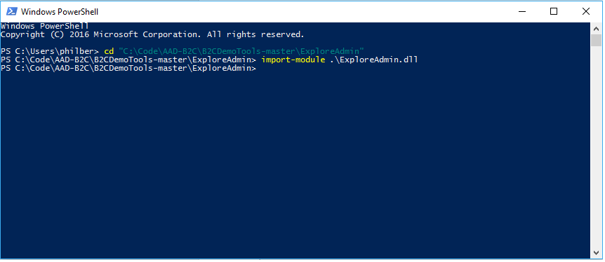 

> This enables a set of PowerShell cmdlets for developers and
> administrators to manage the cryptographic keys and the related key
> containers in the B2C tenant.

1.  For detail descriptions and examples of these cmdlets, type the
    following command to get all the cmdlets:

PS&gt; Get-Command \*Cpim\*

> **Cpim** is the codename of Azure AD B2C.

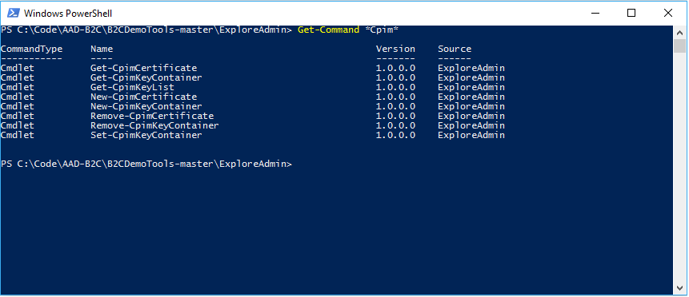 

> The available set of PowerShell cmdlets is as follows:

  > PowerShell cmdlet         > Description
  --------------------------- ---------------------------------------------------------------------------------------------------------
  > Get-CpimCertificate       
  > Get-CpimKeyContainer      
  > Get-CpimKeyList           > Get a list of all the keys in a specific B2C tenant.
  > New-CpimCertificate       > Create a key container in a specific B2C tenant based on a base64 encoded certificate or a .pfx file.
  > New-CpimKeyContainer      > Create a key container in a specific B2C tenant of type secret (oct) or RSA.
  > Remove-CpimCertificate    > Delete a key container with a certificate in a specific B2C tenant.
  > Remove-CpimKeyContainer   > Delete a key container in a specific B2C tenant.
  > Set-CpimKeyContainer      > Create a key container in a specific B2C tenant and specify the key for the key container.

1.  Let’s see of such these cmdlets work. Type the following command to
    get the details of a specific cmdlet &lt;*cmdlet name*&gt;:

PS&gt; Get-help &lt;cmdlet name&gt;

> For example:

PS&gt; Get-help New-CpimKeyContainer

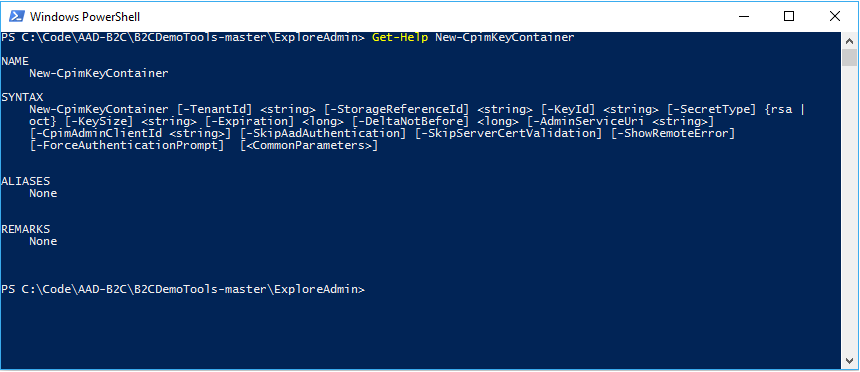 

> **Note** Each cmdlet has required and optional arguments, called
> parameters, that identify which objects to act on or control how the
> cmdlet performs its task. For more information about a cmdlet that you
> can run in Windows PowerShell, at the Windows PowerShell command
> prompt.
>
> In addition, each cmdlet of the set supports the common parameters:
> Verbose, Debug, ErrorAction, ErrorVariable, WarningAction,
> WarningVariable, OutBuffer, PipelineVariable, and OutVariable. For
> more information, see the article [about\_CommonParameters](https://technet.microsoft.com/library/hh847884.aspx).

The following sections describe the main operations that can be
conducted thanks to the above set of cmdlets.

### Generating a new key container

As stated above, the **New-CpimKeyContainer** cmdlet enables you to
create a key container in your B2C tenant of type secret oct or RSA:

New-CpimKeyContainer \[-TenantId\] &lt;*your\_b2C\_tenant*&gt;
\[-StorageReferenceId\] &lt;*your\_storage-reference\_id*&gt; \[-KeyId\]
&lt;*your\_key\_id*&gt; \[-SecretType\] {rsa | oct} \[-KeySize\]
&lt;*key\_size*&gt; \[-Expiration\] &lt;*expiration*&gt;
\[-DeltaNotBefore\] &lt;*notbefore*&gt; \[&lt;*CommonParameters*&gt;\]

Where:

-   &lt;*your\_b2C\_tenant*&gt; is the name of your B2C tenant, for
    example *contoso369b2c.onmicrosoft.com* in our illustration.

-   &lt;*your\_storage-reference\_id*&gt; specifies the name of the key
    container to create.

-   &lt;*your\_key\_id*&gt; allows to specify the identifier of the key.
    For all practical purposes, it is not used by Azure AD B2C Premium
    directly, but used by administrator like maybe you for operations
    such as deleting a key if necessary.

In general, for key roll over, an administrator can create new keys and
Azure AD B2C Premium will typically use the appropriate keys.

-   &lt;*key\_size*&gt; specifies the size of the key. The recommended
    key size is 256 bits for a ‘oct” key, 2048 bits for a signing RSA
    key.

-   &lt;*expiration*&gt;, when not 0, allows to set an expiration on the
    key container. This corresponds to the number of seconds from now
    when the key container will expire.

-   &lt;*notbefore*&gt;, when not 0, allows to specify the number of
    seconds from now when the key becomes valid to use.

The following command line illustrates how to create a key container
named TokenSigningKeyContainer in the B2C tenant
*contoso369b2c.onmicrosoft.com*:

PS&gt; New-CPIMKeyContainer contoso369b2c.onmicrosoft.com
TokenSigningKeyContainer key0 rsa 0 0

You will be prompted to login to authenticate into your B2C tenant. Use
your local admin user, e.g. admin@&lt;*your\_b2c\_tenant*&gt;, for
example in our illustration *admin@contoso369b2c.onmicrosoft.com*).

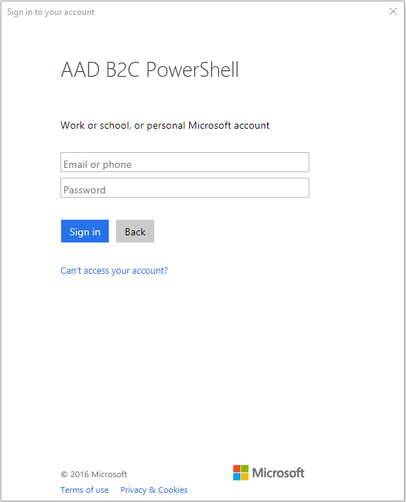 

Enter your credentials.

### Creating a key container with a fixed key

The **Set-CpimKeyContainer** cmdlet enables you to create a key
container in your B2C tenant and allows to specify the fixed key for the
key container:

Set-CpimKeyContainer \[-TenantId\] &lt;*your\_b2C\_tenant*&gt;
\[-StorageReferenceId\] &lt;*your\_storage-reference\_id*&gt;
-UnencodedAsciiKey &lt;*ascii\_key*&gt; \[&lt;*CommonParameters*&gt;\]

Where:

-   &lt;*your\_b2C\_tenant*&gt; is the name of your B2C tenant, for
    example *contoso369b2c.onmicrosoft.com* in our illustration.

-   &lt;*your\_storage-reference\_id*&gt; specifies the name of the key
    container to create.

-   &lt;*ascii\_key*&gt; specify the fixed key for the above key
    container.

The following command line illustrates how to create a key container
named FixedKeyContainer in the B2C tenant
*contoso369b2c.onmicrosoft.com*:

PS&gt; Set-CpimKeyContainer contoso369b2c.onmicrosoft.com
FixedKeyContainer '{"keys": \[{"kty": "oct","k": "Base64URLencoded of
the key\*\*","use": "sig","kid": "Contoso369b2cKeyContainer.1"}\]}'

\*\* **The secret you gonna use in your exchange has to be Base64 Url
encoded. So even if the key appears to be already a Base64 encoded one,
you STILL have to encode it.**

### Uploading a certificate to a key container

The **New-CpimCertificate** cmdlet enables you to create a key container
in your B2C tenant based on a base64 encoded certificate or a .pfx file.
These files can optionally be protected by a password:

New-CpimCertificate \[-TenantId\] &lt;*your\_b2C\_tenant*&gt;
\[-CertificateId\] &lt;*your\_certificate\_id*&gt; \[\[-Certificate\]
&lt;*base64\_encoded\_certificate\_data&gt;* | -CertificateFilename
&lt;*pfx\_file*&gt; \[-CertificatePassword
&lt;*pfx\_file\_password*&gt;\]\] \[-SkipServerCertValidation\]
\[&lt;CommonParameters&gt;\]

Where:

-   &lt;*your\_b2C\_tenant*&gt; is the name of your B2C tenant, for
    example *contoso369b2c.onmicrosoft.com* in our illustration, in
    which you’d like to upload a certificate.

-   &lt;*your\_certificate\_id*&gt; specifies the name of the key
    container to create with your certificate.

-   &lt;*base64\_encoded\_certificate\_data*&gt; is the base64 encoded
    certificate data.

-   &lt;*pfx\_file*&gt; specifies the path of .pfx file.

-   &lt;*pfx\_file\_password*&gt; allows to specify the password if any
    that protects the .pfx file being specified.

The expiration and not before dates will be the same as the certificate.

The following command line illustrates how to create a key container
named SigningCertificate based on a certificate in the B2C tenant
*contoso369b2c.onmicrosoft.com*:

PS&gt; New-CpimCertificate contoso369b2c.onmicrosoft.com
SigningCertificate \$x509 -CertificateFilename
"C:\\Temp\\contoso369b2c\_signing\_cert.pfx" -CertificatePassword
"Pass@word1"

-or-

PS&gt; \$pathToCertFile = "C:\\Temp\\contoso369b2c\_signing\_cert.pfx"

PS&gt; \$x509 = New-Object
System.Security.Cryptography.X509Certificates.X509Certificate2(\$pathToCertFile,
"Pass@word1")

PS&gt; New-CpimCertificate contoso369b2c.onmicrosoft.com
SigningCertificate \$x509

### Viewing all your keys

The **Get-CpimKeyList** cmdlet enables you to get a list of all the keys
in your B2C tenant:

Get-CpimKeyList \[-TenantId\] &lt;*your\_b2C\_tenant*&gt; \[-KeyType\]
{keycontainer | secret | rsa | cert} \[&lt;*CommonParameters*&gt;\]

Where &lt;*your\_b2C\_tenant*&gt; is the name of your B2C tenant, for
example *contoso369b2c.onmicrosoft.com* in our illustration, in which
you’d like to list the existing keys.

The following command line illustrates how to list all the key
containers in the B2C tenant *contoso369b2c.onmicrosoft.com*:

PS&gt; Get-CpimKeyList contoso369b2c.onmicrosoft.com keycontainer

Similarly, the following command line illustrates how to list all the
‘oct’ keys, aka symmetric keys, in the B2C tenant
*contoso369b2c.onmicrosoft.com*:

PS&gt; Get-CpimKeyList contoso369b2c.onmicrosoft.com secret

The following command line illustrates how to list all the RSA keys, aka
asymmetric keys, in the B2C tenant *contoso369b2c.onmicrosoft.com*:

PS&gt; Get-CpimKeyList contoso369b2c.onmicrosoft.com secret

Finally, the following command line illustrates how to list all the
certificates in the B2C tenant *contoso369b2c.onmicrosoft.com*:

PS&gt; Get-CpimKeyList contoso369b2c.onmicrosoft.com cert

### Deleting a key container

The **Remove-CpimKeyContainer** cmdlet enables you to delete a key
container in your B2C tenant:

Remove-CpimKeyContainer \[-TenantId\] &lt;*your\_b2C\_tenant*&gt;
\[-StorageReferenceId\] &lt;*your\_storage-reference\_id*&gt;
\[&lt;*CommonParameters*&gt;\]

Where:

-   &lt;*your\_b2C\_tenant*&gt; is the name of your B2C tenant, for
    example *contoso369b2c.onmicrosoft.com* in our illustration, in
    which to delete a key container.

-   &lt;*your\_storage-reference\_id*&gt; specifies the name of the key
    container to delete.

The following command line illustrates how to delete a key container
named SomeKeyContainer in the B2C tenant
*contoso369b2c.onmicrosoft.com*:

PS&gt; Remove-CpimKeyContainer contoso369b2c.onmicrosoft.com
SomeKeyContainer

### Deleting a certificate

Conversely, the **Remove-CpimCertificate** cmdlet enables you to delete
a certificate in your B2C tenant:

Remove-CpimCertificate \[-TenantId\] &lt;*your\_b2C\_tenant*&gt;
\[-CertificateId\] &lt;*your\_certificate\_id*&gt;
\[&lt;*CommonParameters*&gt;\]

Where:

-   &lt;*your\_b2C\_tenant*&gt; is the name of your B2C tenant, for
    example *contoso369b2c.onmicrosoft.com* in our illustration, in
    which to delete a key container.

-   &lt;*your\_certificate\_id*&gt; specifies the name of the key
    container with your certificate.

The following command line illustrates how to delete a key container
named SomeKeyContainer in the B2C tenant
*contoso369b2c.onmicrosoft.com*:

PS&gt; Remove-CpimKeyContainer contoso369b2c.onmicrosoft.com
SomeKeyContainer

Managing your HTML5/CSS templates for the policies
==================================================

Azure AD B2C allows you to customize the look-and-feel of user
experience on the various pages that can be potentially served and
displayed by Azure AD B2C via your premium policies.

For that purpose, Azure AD B2C runs code in your consumer's browser and
uses the modern and standard approach [Cross-Origin Resource Sharing
(CORS)](http://www.w3.org/TR/cors/) to load custom content from a
specific URL that you specify in a premium policy to point to your own
HTML5/CSS templates: **“**Cross-origin resource sharing (CORS) is a
mechanism that allows restricted resources (e.g. fonts) on a web page to
be requested from another domain outside the domain from which the
resource originated.”

**Note** For details that pertain to how specify your custom HTML5/CSS
templates in your premium policies, see section § *Adding a link to your
HTML5/CSS templates to your user journey* of the fourth part of this
series of documents.

Compared to the old traditional way, where template pages are owned by
the solution where you provided limited text and images, where limited
control of layout and feel was offered leading to more than difficulties
to achieve a seamless experience, the CORS way supports HTML5 and CSS
and allow you to:

-   Host the content and the solution injects its controls using client
    side script.

-   Have full control over every pixel of layout and feel.

You can provide as many content pages as you like by crafting HTML5/CSS
templates as appropriate.

**Note** For security reasons, the use of JavaScript is currently
blocked for customization.

**Note** For details that pertain to the custom HTML5 and CSS styling
for your templates, see section § *Understanding the CORS way for UI
customization* of the fourth part of this series of documents.

This rest of this section deals with the management of these HTML5/CSS
templates you’d like to use along with your premium policies to
customize the UI of your user journeys. It introduces and presents in a
suggested approach to manage them through an Azure account storage that
has CORS enabled and where you can upload them and reference them on
that basis in your policies. It provides details on how to upload such
HTML5/CSS templates.

Let’s illustrate how to set up a basic storage account in Azure to host
your custom HTML5 and CSS resources for UI customization.

Preparing a storage account for your HTML5/CSS templates
--------------------------------------------------------

### Creating a storage account

To create a storage account, proceed with the following steps:

1.  Open a browsing session and navigate to the Azure portal at
    [https://portal.azure.com](https://portal.azure.com).

2.  Sign in with your administrative credentials.

3.  Click **+ New** &gt; **Data + Storage** &gt; **Storage account**. A
    **Create storage account** blade opens up.

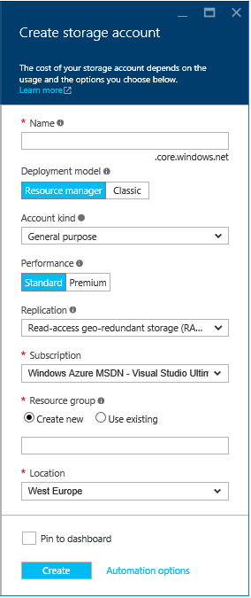 

**Note** You will need an Azure subscription to create an Azure Blob
Storage account. You can sign up a free trial at the Azure website at
[https://azure.microsoft.com/en-us/pricing/free-trial/](https://azure.microsoft.com/en-us/pricing/free-trial/).

1.  In **Name**, provide a name for the storage account, for example,
    “*contoso369b2c*" in our configuration. This value will be later
    referred as to *storageAccountName*.

2.  Pick the appropriate selections for the pricing tier, the resource
    group and the subscription. Make sure that you have the **Pin to
    Startboard** option checked. Click **Create**.

3.  Go back to the Startboard and click the storage account that you
    just created.

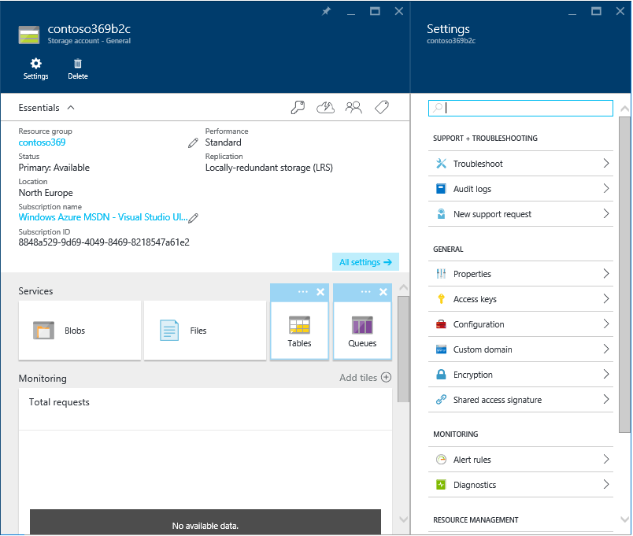 

1.  In the **Services** section, click **Blobs**. A **Blob service**
    blade opens up.

2.  Click **+ Container**.

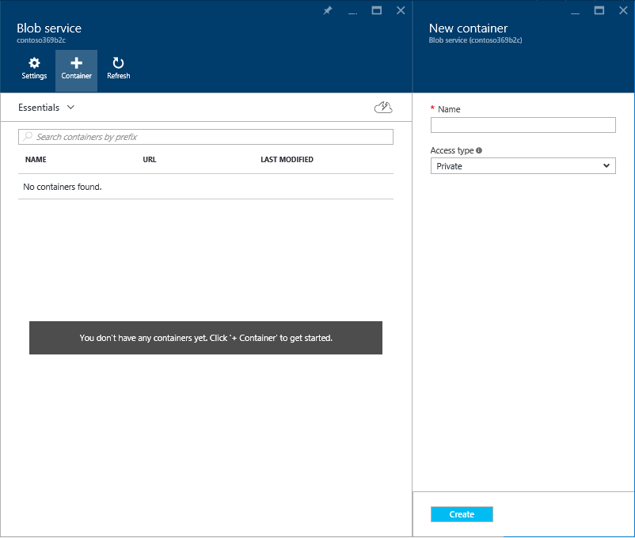 

1.  In **Name**, provide a name for the container, for example, "b2c" in
    our configuration. This value will be later referred as to
    *containerName*.

<!-- -->

1.  Select **Blob** as the **Access type**. Click **Create**.

2.  The container that you created will appear in the list on the **Blob
    service** blade.

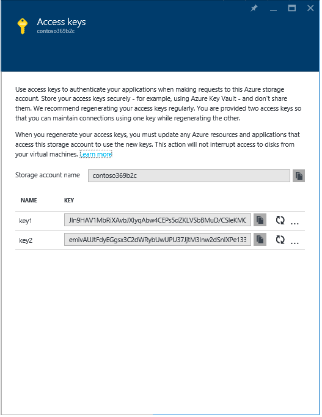

1.  Close the **Blobs** blade.

2.  On the storage account blade, click the Key icon. An **Access keys**
    blade opens up.

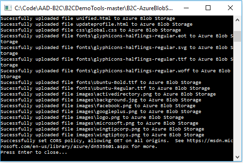 

1.  Write down the value of **key1**. This value will be later referred
    as *key1*.

**Important note** key1 is an important security credential.

### Downloading the helper tool

To download the so-called Azure Blob Storage helper tool, proceed with
the following step:

1.  Download the helper tool as a .zip file from GitHub at
    [https://github.com/azureadquickstarts/b2c-azureblobstorage-client/archive/master.zip](https://github.com/azureadquickstarts/b2c-azureblobstorage-client/archive/master.zip).

2.  Save the *B2C-AzureBlobStorage-Client-master.zip* file on your local
    machine.

3.  Extract the content of the *B2C-AzureBlobStorage-Client-master.zip*
    file on your local disk, for example under the **Starter-Pack**
    folder. This will create a *B2C-AzureBlobStorage-Client-master*
    folder underneath.

4.  Open that folder and extract the content of the archive file
    *B2CAzureStorageClient.zip* within it.

### Upload the “Starter-Pack” sample files

To upload the “Starter-Pack” sample files, proceed with the following
steps:

1.  From the Windows explore, navigate to the above folder
    *B2C-AzureBlobStorage-Client-master* located under the
    **Starter-Pack** folder.

2.  Run the *B2CAzureStorageClient.exe* file within. This program will
    simply upload all the files in the directory that you specify to
    your storage account, and enable CORS access for those files.

3.  When prompted, specify:

    a.  The name of your storage account, i.e. *storageAccountName*, for
        example *contoso369b2c* in our configuration.

    b.  The primary access key of your azure blob storage, i.e. *key1*,
        for example *contoso369b2c* in our configuration.

    c.  The name of your storage blob storage container, i.e.
        *containerName*, for example *b2c* in our configuration.

    d.  And eventually the path of the “Starter-Pack” sample files, e.g.
        **..\\B2CTemplates\\wingtiptoys**.

> 
> 

If you followed the steps above, the HTML5 and CSS files of the
“Starter-Pack” for the fictitious company wingtiptoys will now be
pointing to your storage account.

You can verify that the content has been uploaded correctly by opening
the related container blade in the Azure portal. 

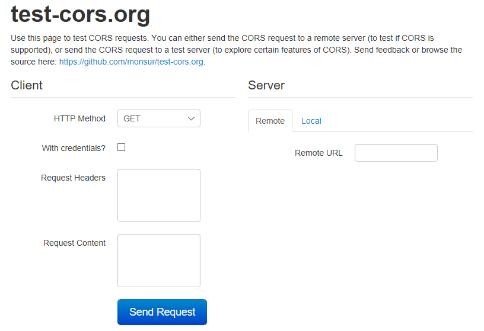 

You can alternatively verify that the content has been uploaded
correctly by trying to access on the browser

The page should be displayed in the browser.

**Note** For additional information, see the article [Azure Active Directory B2C preview: A
helper tool used to demonstrate the page user interface (UI)
customization
feature](https://azure.microsoft.com/en-us/documentation/articles/active-directory-b2c-reference-ui-customization-helper-tool/).

Ensuring the storage you are hosting your HTML5/CSS templates from has CORS enabled
-----------------------------------------------------------------------------------

As stated before, CORS (Cross-Origin Resource Sharing) must be enabled
on your endpoint for Azure AD B2C Premium to load your content. This is
because your content is hosted on a different domain than the domain
Azure AD B2C Premium will be serving the page from.

To verify that the storage you are hosting your content on has CORS
enabled, proceed with the following steps:

1.  Open a browsing session and navigate to the page
    *unified.html* using the full URL of its location in your storage
    account: 

> https://&lt;*storageAccountName*&gt;.blob.core.windows.net/&lt;*containerName*&gt;/unified.html 
>
> For example, in our configuration:
>
> [https://contoso369b2c.blob.core.windows.net/b2c/unified.html](https://contoso369b2c.blob.core.windows.net/b2c/unified.html)

1.  Navigate to [http://test-cors.org](http://test-cors.org). This
    site allows you to verify that the page you are using has CORS
    enabled.

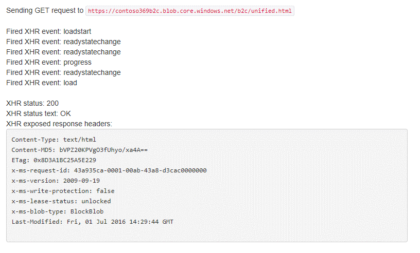 

1.  In **Remote URL**, enter the full URL for your *unified.html*
    content, and click **Send Request**.

2.  Verify that the output in the **Results** section contains “XHR
    status: 200”. This indicates that CORS is enabled.

 

Managing your users and their attributes with the Graph API
===========================================================

You can leverage for that purpose the new version 2 of the Azure AD
module for Windows PowerShell that now leverages the Graph API.

To install this new version, proceed with the following steps:

1.  Open a Windows PowerShell command prompt with administrative
    privileges.

2.  install the Azure AD module from the PowerShell Gallery by running
    the following command:

PS&gt; Install-Module -Name AzureAD

1.  Start taking advantage of the new cmdlets.

**Note** for additional information, see the article [Manage Azure AD using Windows
PowerShell](http://technet.microsoft.com/en-ca/library/jj151815.aspx).

The Appendix B. Using the Graph API with your B2C tenant covers the
programmatic access features available via the Graph API in Azure AD B2C
Premium and aims at helping you understand:

-   How the Graph API allows you to perform CRUD
    > (Create-Read-Update-Delete) operations on local accounts in your
    > B2C tenant.

-   How to use a service application to do programmatic, automated tasks
    > in your B2C applications.

-   The use of custom attributes (directory extensions) in your B2C
    > tenant.

This concludes this third part of this series of document.

Appendix A. Understanding the premium policies of the Starter Pack
===================================================================

Core elements of the *B2C\_1A\_base* policy
-------------------------------------------

This section lists all the core elements of the *B2C\_1A\_base* policy
that comes with the “Starter Pack” and that is leveraged for authoring
your own policies through the inheritance of the
*B2C\_1A\_base\_extensions* policy.

As such, it more particularly focusses on the already defined claim
types, claims transformations, content definitions, claims providers
with their technical profile(s), and the core user journeys.

**Microsoft makes no warranties, express or implied, with respect to the
information provided hereafter. Changes may be introduced at any time,
before GA time, at GA time, or after.**

Both your own policies and the *B2C\_1A\_base\_extensions* policy can
override these definitions and extend this parent policy by providing
additional ones as needed.

### Building blocks

This section depicts the core elements of the *B2C\_1A\_base* policy in
terms of claim types, claims transformations, and content definitions.
These elements can susceptible to be referenced in your own policies as
well as in the *B2C\_1A\_base\_extensions* policy.

#### Claims schemas

This claims schemas is “divided” into three sections:

1.  A first section that lists the minimum claims that are required for
    the user journeys to work properly.

2.  A second section that lists the claims required for query string
    parameters and other special parameters to be passed to other claims
    providers, especially *login.microsoftonline.com* for
    authentication. Please DO not modify these claims.

3.  And eventually a third section that lists any additional (optional)
    claims that can be collected from the user, stored in the directory
    and sent in tokens during sign in. New claims type to be collected
    from the user and/or sent in the token can be added in this section.

> **Important note** The claims schema contains restrictions on certain
> claims such as passwords and usernames. The Trust Framework (TF)
> policy treats Azure AD as any other claims provider and all its
> restrictions are modelled in the premium policy. A policy could be
> modified to add more restrictions, or use another claims provider for
> credential storage which will have its own restrictions.

As of this writing, and based on the above considerations, the available
claim types are as follows.

##### Claims that are required for the user journeys

The following claims are required for user journeys to work properly:

  > Claims type                                  > Description
  ---------------------------------------------- -----------------------------------------------------------------------------------------------------------------------
  > *UserId*                                     Username
  > *signInName*                                 Sign in name
  > *tenantId*                                   Tenant identifier (ID) of the user object in Azure AD B2C Premium
  > *objectId*                                   Object identifier (ID) of the user object in Azure AD B2C Premium
  > *password*                                   Password
  > *newPassword*                                
  > *reenterPassword*                            
  > *passwordPolicies*                           Password policies used by Azure AD B2C Premium to determine password strength, expiry, etc.
  > *sub*                                        
  > *alternativeSecurityId*                      
  > *identityProvider*                           
  > *displayName*                                
  > *strongAuthenticationPhoneNumber*            User's telephone number
  > *Verified.strongAuthenticationPhoneNumber*   
  > *email*                                      Email address that can be used to contact the user
  > *signInNamesInfo.emailAddress*               Email address that the user can use to sign in
  > *otherMails*                                 Email addresses that can be used to contact the user
  > *userPrincipalName*                          Username as stored in the Azure AD B2C Premium
  > *upnUserName*                                Username for creating user principal name
  > *mailNickName*                               User's mail nick name as stored in the Azure AD B2C Premium
  > *newUser*                                    
  > *executed-SelfAsserted-Input*                Claim that specifies whether attributes were collected from the user
  > *executed-PhoneFactor-Input*                 Claim that specifies whether a new phone number was collected from the user
  > *authenticationSource*                       Specifies whether the user was authenticated at Social Identity Provider, login.microsoftonline.com, or local account

##### Claims required for query string parameters and other special parameters

The following claims are required to pass on special parameters
(including some query string parameters) to other claims providers:

  > Claims type             > Description
  ------------------------- -------------------------------------------------------------------------------------------------------------------------------------
  > *nux*                   Special parameter passed for local account authentication to login.microsoftonline.com
  > *nca*                   Special parameter passed for local account authentication to login.microsoftonline.com
  > *prompt*                Special parameter passed for local account authentication to login.microsoftonline.com
  > *mkt*                   Special parameter passed for local account authentication to login.microsoftonline.com
  > *lc*                    Special parameter passed for local account authentication to login.microsoftonline.com
  > *grant\_type*           Special parameter passed for local account authentication to login.microsoftonline.com
  > *scope*                 Special parameter passed for local account authentication to login.microsoftonline.com
  > *client\_id*            Special parameter passed for local account authentication to login.microsoftonline.com
  > *objectIdFromSession*   Parameter provided by the default session management provider to indicate that the object id has been retrieved from an SSO session
  > *isActiveMFASession*    Parameter provided by the MFA session management to indicate that the user has an active MFA session

##### Additional (optional) claims that can be collected

The following claims are additional claims that can be collected from
the users, stored in the directory, and sent in the token. As outlined
before, additional claims can be added to this list.

  > Claims type            > Description
  ------------------------ ---------------------------------------------------------
  > *givenName*            User's given name (also known as first name)
  > *surname*              User's surname (also known as family name or last name)
  > *Extension\_picture*   User's picture from social

#### Claim transformations

As of this writing, the available claim transformations are as follows:

  > Claim transformation                            > Description
  ------------------------------------------------- ---------------
  > *CreateOtherMailsFromEmail*                     
  > *CreateRandomUPNUserName*                       
  > *CreateUserPrincipalName*                       
  > *CreateSubjectClaimFromObjectID*                
  > *CreateSubjectClaimFromAlternativeSecurityId*   
  > *CreateAlternativeSecurityId*                   

#### Content definitions

This section depicts the (canvas of the) content definitions already
declared in the *B2C\_1A\_base* policy. These content definitions are
susceptible to be referenced, overridden, and/or extended as needed in
your own policies as well as in the *B2C\_1A\_base\_extensions* policy.

As of this writing, the available content definitions are as follows:

  > Content definition   > Description
  ---------------------- ---------------
  > *Default Web*        

### Claims providers

This section depicts the (canvas of the) claims providers already
declared in the *B2C\_1A\_base* policy. These claims providers are
susceptible to be referenced, overridden, and/or extended as needed in
your own policies as well as in the *B2C\_1A\_base\_extensions* policy.

As of this writing, the available claims providers are as follows:

  > Claims provider                                    > Description
  ---------------------------------------------------- ---------------
  > *Facebook*                                         
  > *Local Account SignIn*                             
  > *PhoneFactor*                                      
  > *Azure Active Directory*                           
  > *Self Asserted*                                    
  > *Local Account*                                    
  > *Session Management*                               
  > *Trustframework Policy Engine TechnicalProfiles*   
  > *Token Issuer*                                     

#### Technical profiles

This section depicts the (canvas of the) technical profiles already
declared per claim provider in the *B2C\_1A\_base* policy. These
technical profiles are susceptible to be further referenced, overridden,
and/or extended as needed in your own policies as well as in the
*B2C\_1A\_base\_extensions* policy.

##### Technical profiles for “Facebook”

As of this writing, the available technical profiles for the “Facebook”
claims provider are as follows:

  > Technical profile   > Description
  --------------------- ---------------
  > *Facebook-OAUTH*    

##### Technical profiles for “Local Account SignIn”

As of this writing, the available technical profiles for the “Local
Account SignIn” claims provider are as follows:

  > Technical profile        > Description
  -------------------------- ---------------
  > *Login-NonInteractive*   

##### Technical profiles for “Phone Factor”

As of this writing, the available technical profiles for the “Phone
Factor” claims provider are as follows:

  > Technical profile             > Description
  ------------------------------- ---------------
  > *PhoneFactor-Input*           
  > *PhoneFactor-InputOrVerify*   
  > *PhoneFactor-Verify*          

##### Technical profiles for “Azure Active Directory”

As of this writing, the available technical profiles for the “Azure
Active Directory” claims provider are as follows:

  > Technical profile                                  > Description
  ---------------------------------------------------- ----------------------------------------------------------------------
  > *AAD-Common*                                       > Technical profile included by the other AAD-xxx technical profiles
  > *AAD-UserWriteUsingAlternativeSecurityId*          > Technical profile for social logins
  > *AAD-UserReadUsingAlternativeSecurityId"*          > Technical profile for social logins
  > *AAD-UserReadUsingAlternativeSecurityId-NoError*   > Technical profile for social logins
  > *AAD-UserWritePasswordUsingLogonEmail*             > Technical profile for local accounts
  > *AAD-UserReadUsingEmailAddress*                    > Technical profile for local accounts
  > *AAD-UserWriteProfileUsingObjectId*                > Technical profile for updating user record using objectId
  > *AAD-UserWritePhoneNumberUsingObjectId*            > Technical profile for updating user record using objectId
  > *AAD-UserWritePasswordUsingObjectId*               > Technical profile for updating user record using objectId
  > *AAD-UserReadUsingObjectId*                        > Technical profile is used to read data after user authenticates

##### Technical profiles for “Self Asserted”

As of this writing, the available technical profiles for the “Self
Asserted” claims provider are as follows:

  > Technical profile              > Description
  -------------------------------- ---------------
  > *SelfAsserted-Social*          
  > *SelfAsserted-ProfileUpdate*   

##### Technical profiles for “Local Account”

As of this writing, the available technical profiles for the “Local
Account” claims provider are as follows:

  > Technical profile                    > Description
  -------------------------------------- ---------------
  > *LocalAccountSignUpWithLogonEmail*   

##### Technical profiles for “Session Management”

As of this writing, the available technical profiles for the “Session
Management” claims provider are as follows:

  > Technical profile   > Description
  --------------------- --------------------------------------------------------------------------------------
  > *SM-Noop*           
  > *SM-AAD*            
  > *SM-SocialSignup*   > Profile name is being used to disambiguate AAD session between sign up and sign in
  > *SM-SocialLogin*    
  > *SM-MFA*            

##### Technical profiles for “Trustframework Policy Engine TechnicalProfiles”

As of this writing, no technical profiles are defined for the
“Trustframework Policy Engine TechnicalProfiles” claims provider.

##### Technical profiles for “Token Issuer”

As of this writing, the available technical profiles for the “Token
Issuer” claims provider are as follows:

  > Technical profile   > Description
  --------------------- ---------------
  > *JwtIssuer*         

### User journeys

This section depicts the (canvas of the) user journeys already declared
in the *B2C\_1A\_base* policy. These user journeys are susceptible to be
further referenced, overridden, and/or extended as needed in your own
policies as well as in the *B2C\_1A\_base\_extensions* policy.

As of this writing, the available user journeys are as follows:

  > User journey       > Description
  -------------------- ---------------
  > *SignUp*           
  > *SignIn*           
  > *SignUpOrSignIn*   
  > *EditProfile*      
  > *PasswordReset*    

Appendix B. Using the Graph API with your B2C tenant
====================================================

This appendix covers the programmatic access features available via the
Graph API in Azure AD B2C and aims at helping you understand:

-   How the Graph API allows you to perform CRUD
    > (Create-Read-Update-Delete) operations on local accounts in your
    > B2C tenant.

-   How to use a service application to do programmatic, automated tasks
    > in your B2C applications.

-   The use of custom attributes (directory extensions) in your B2C
    > tenant.

It leverages for that purpose the B2CGraphClient sample command line
application.

> **Note** For more information, see the article [Azure AD B2C Preview:
> Use the Graph
> API](https://azure.microsoft.com/en-us/documentation/articles/active-directory-b2c-devquickstarts-graph-dotnet/).

Setup the B2CGraphClient sample command line application
---------------------------------------------------------

### Installing the prerequisites

Prior building the B2CGraphClient sample command line app, your
environment requires the setup of the following required tooling: i) the
Microsoft Online Services Sign-In Assistant and ii) the version 1 of the
Azure AD module for Windows PowerShell.

Download and install the [Microsoft Online Services Sign-In
Assistant](http://go.microsoft.com/fwlink/?LinkID=286152).

Download and install the [version 1 of Azure AD module for Windows
PowerShell](http://go.microsoft.com/fwlink/p/?linkid=236297).

### Creating the service application in the B2C tenant

The next step consists in creating a service application in your B2C
tenant for use with the Graph API and give it the correct permissions.

To create the service principal in your B2C tenant, proceed with the
following steps:

1.  Open a Windows PowerShell command prompt, and then connect to your
    > B2C tenant using the following commands:

PS&gt; \$msolcred = Get-Credential

PS&gt; Connect-MsolService -credential \$msolcred

1.  Sign in with your B2C tenant admin user credentials.

2.  Create a client secret to use with the B2CGraphClient sample command
    > line application.

PS&gt; \$bytes = New-Object Byte\[\] 32

PS&gt; \$rand =
\[System.Security.Cryptography.RandomNumberGenerator\]::Create()

PS&gt; \$rand.GetBytes(\$bytes)

PS&gt; \$rand.Dispose()

PS&gt; \$newClientSecret = \[System.Convert\]::ToBase64String(\$bytes)

PS&gt; \$newClientSecret

1.  Copy down the client secret that is shown on command prompt screen
    for later.

2.  Create a service application.

PS&gt; New-MsolServicePrincipal -DisplayName "My B2C Graph API App"
-Type password -Value \$newClientSecret

1.  Copy down both the *ObjectID* and *AppPrincipalID* for later use,
    for example in our configuration:
    *f87b1b5f-c5cf-4608-88ce-3a0e91650b5d* respectively
    *1eec67ff-6f39-4968-9f35-8d0c35de93b3oeYoBIrHxE5VNf5Bjz7A1b5C5jZmTlGC65zIlMzSQ0M=*.

2.  List all directory roles using the following command:

PS&gt; Get-MsolRole

1.  Copy down the object IDs of the following 3 directory roles:

    a.  Directory readers (to read users), for example:
        *88d8e3e3-8f55-4a1e-953a-9b9898b8876b*

    b.  Directory writers (to create and update users), for example:
        *9360feb5-f418-4baa-8175-e2a00bac4301*

    c.  User account administrator (to delete users), for example:
        *fe930be7-5e62-47db-91af-98c3a49a38b1*

2.  Replace the above 3 object IDs in the commands below (which adds the
    service application to these 3 directory roles):

Add-MsolRoleMember -RoleObjectId &lt;ObjectID1&gt; -RoleMemberObjectId
&lt;Your-App’s-ObjectId&gt; -RoleMemberType servicePrincipal

Add-MsolRoleMember -RoleObjectId &lt;ObjectID2&gt; -RoleMemberObjectId
&lt;Your-App’s-ObjectId&gt; -RoleMemberType servicePrincipal

Add-MsolRoleMember -RoleObjectId &lt;ObjectID2&gt; -RoleMemberObjectId
&lt;Your-App’s-ObjectId&gt; -RoleMemberType servicePrincipal

For example, in our configuration:

PS&gt; Add-MsolRoleMember -RoleObjectId
88d8e3e3-8f55-4a1e-953a-9b9898b8876b -RoleMemberObjectId
f87b1b5f-c5cf-4608-88ce-3a0e91650b5d -RoleMemberType servicePrincipal

PS&gt; Add-MsolRoleMember -RoleObjectId
9360feb5-f418-4baa-8175-e2a00bac4301 -RoleMemberObjectId
f87b1b5f-c5cf-4608-88ce-3a0e91650b5d -RoleMemberType servicePrincipal

PS&gt; Add-MsolRoleMember -RoleObjectId
9360feb5-f418-4baa-8175-e2a00bac4301 -RoleMemberObjectId
f87b1b5f-c5cf-4608-88ce-3a0e91650b5d -RoleMemberType servicePrincipal

At this stage, you now have a service application ready to use with the
Graph API in your B2C tenant.

### Downloading and building the B2CGraphClient sample command line application

Proceed with the following steps:

1.  Download the B2CGraphClient sample command line application as a
    .zip file from GitHub at
    [https://github.com/azureadquickstarts/b2c-azureblobstorage-client/archive/master.zip](https://github.com/azureadquickstarts/b2c-azureblobstorage-client/archive/master.zip).

2.  Save the *B2C-graphAPI-DotNet-master.zip* file on your local
    machine, and then extract the content of the
    *B2C-graphAPI-DotNet-master.zip* file on your local disk, for
    example under the **Starter-Pack** folder. This will create a
    *B2C-graphAPI-DotNet-master* folder underneath.

3.  Navigate to the folder *B2CGraphClient* within it and open the
    *B2CGraphClient.sln* Visual Studio solution.

4.  In the **B2CGraphClient** project, open the file *App.config*.

5.  Replace the following app settings with your own values (generated
    earlier):

&lt;appSettings&gt;

&lt;add key="b2c:Tenant" value="{Your tenant ID}" /&gt;

&lt;add key="b2c:ClientId" value="{The AppPrincipalId from above}" /&gt;

&lt;add key="b2c:ClientSecret" value="{The client secret you generated
above}" /&gt;

&lt;/appSettings&gt;

1.  From the **Solution Explorer**, right-click on the
    **B2CGraphClient** solution and rebuild the sample.

2.  Test the sample app by pressing F5. A command line window opens up.

3.  From the command line window, type the following command:

PS&gt; cd B2CGraphClient\\bin\\Debug

PS&gt; B2C Help

The various CRUD operations supported by the B2CGraphClient sample
command line application are listed.

Running local account CRUD operations
-------------------------------------

This section illustrates the local account CRUD tasks possible using the
Graph APi and how to perform local account CRUD operations with the
B2CGraphClient sample command line application.

To get all users in your B2C tenant, run the following command:

PS&gt; B2C Get-User

To create new username-based and email-based local accounts in your B2C
tenant, proceed with the following steps:

1.  Open a text editor of your choice, copy and paste the following
    > content, and finally save the file as *usertemplate-email.json* in
    > the same directory of the B2C.exe executable.

2.  Open a text editor of your choice, copy and paste the following
    > content, and finally save the file as *usertemplate-username.json*
    > in the same directory of the B2C.exe executable.

3.  Run the following commands from the above command line window:

PS&gt; B2C Create-User usertemplate-email.json

PS&gt; B2C Create-User usertemplate-username.json

1.  Save the object IDs of the users you just created. You’ll need them
    > in the next section.

2.  Run the previous “Get-User” command to see the new local accounts in
    your B2C tenant.

To search for specific users in your B2C tenant, run the following
commands (use the object ID of one of the local accounts created in the
previous step 4):

PS&gt; B2C Get-User 2bcf1067-90b6-4253-9991-7f16449c2d91

PS&gt; B2C Get-User
\$filter=signInNames/any(x:x/value%20eq%20%27joeconsumer@gmail.com%27)

### Using custom attributes

Most consumer applications need to store some type of custom user
profile information. One way you can do this is to define a custom
attribute in your B2C tenant.

To find how custom attributes are defined in your B2C tenant, proceed
with the following steps:

1.  From the above command line windows, run the following commands:

PS&gt; B2C Get-B2C-Application

PS&gt; B2C Get-Extension-Attribute &lt;object-id-from-above-section&gt;

1.  Update one of the two *above.json* files with the new property and a
    > value for the property and run the following:

PS&gt; B2C Update-User &lt;object-id-of-user&gt;
&lt;path-to-json-file&gt;

  -----------------------------------------------------------------------------------------------------------------------------------------------------------------------------------------------------------------------------------------------------------------------------------------------------------------------------------------------------------------------------------------------------------------------------
  The information contained in this document represents the current view of Microsoft Corporation on the issues discussed as of the date of publication. Because Microsoft must respond to changing market conditions, it should not be interpreted to be a commitment on the part of Microsoft, and Microsoft cannot guarantee the accuracy of any information presented after the date of publication.

  This white paper is for informational purposes only. Microsoft makes no warranties, express or implied, in this document.

  Complying with all applicable copyright laws is the responsibility of the user. Without limiting the rights under copyright, no part of this document may be reproduced, stored in, or introduced into a retrieval system, or transmitted in any form or by any means (electronic, mechanical, photocopying, recording, or otherwise), or for any purpose, without the express written permission of Microsoft Corporation.

  Microsoft may have patents, patent applications, trademarks, copyrights, or other intellectual property rights covering subject matter in this document. Except as expressly provided in any written license agreement from Microsoft, the furnishing of this document does not give you any license to these patents, trademarks, copyrights, or other intellectual property.

  © 2016 Microsoft Corporation. All rights reserved.

  The example companies, organizations, products, domain names, e-mail addresses, logos, people, places, and events depicted herein are fictitious. No association with any real company, organization, product, domain name, e-mail address, logo, person, place, or event is intended or should be inferred.

  Microsoft, list Microsoft trademarks used in your white paper alphabetically are either registered trademarks or trademarks of Microsoft Corporation in the United States and/or other countries.

  The names of actual companies and products mentioned herein may be the trademarks of their respective owners.
  -----------------------------------------------------------------------------------------------------------------------------------------------------------------------------------------------------------------------------------------------------------------------------------------------------------------------------------------------------------------------------------------------------------------------------
