#Part 4 - Address and implement most common advanced identity use cases

Microsoft Corporation
Published: July 2016
Version: 0.3 (DRAFT)

Author: Philippe Beraud (Microsoft France)
Reviewers: Kim Cameron, Brandon Murdoch, Ronny Bjones, Jose Rojas
(Microsoft Corporation)

For the latest information on Azure Active Directory, please see

http://azure.microsoft.com/en-us/services/active-directory/

Copyright© 2016 Microsoft Corporation. All rights reserved.

Abstract: Azure AD, the Identity Management as a Service (IDaaS) cloud
multi-tenant service with proven ability to handle billions of
authentications per day, extends its capabilities to manage consumer
identities with a new service for Business-to-Consumer: Azure AD B2C.

Azure AD B2C is "IDaaS for Customers and Citizens” designed with Azure
AD privacy, security, availability, and scalability for customer/citizen
Identity management (IDM). It’s a comprehensive, cloud-based, 100%
policy driven solution where declarative policies encode the identity
behaviors and experiences as well as the relationships of trust and
authority inside a Trust Framework (TF).

Whilst the Azure AD B2C Basic leverages a dedicated TF tailored by
Microsoft, i.e. the “Microsoft Basic Trust Framework” in which you can
customize policies, the Premium edition gives you full control, and thus
allows you to author and create your own Trust Framework through
declarative policies. It thus provides you with all the requirements of
an Identity “Hub”.

This document is intended for IT professionals, system architects, and
developers who are interested in understanding the advanced capabilities
Azure AD B2C Premium provides, and more especially in this context how
to successfully address the most common use cases.

Table of Content

[Notice](#notice)

[Introduction](#introduction)

[Objectives of this document](#objectives-of-this-document)

[Non-objectives of this paper](#non-objectives-of-this-paper)

[Organization of this paper](#organization-of-this-paper)

[About the audience](#about-the-audience)

[Bringing your own identity (BYOI) for work or school users](#bringing-your-own-identity-byoi-for-work-or-school-users)

[Using a generic IdP as a claims provider](#using-a-generic-idp-as-a-claims-provider)

[Using AD FS as a claims provider](#using-ad-fs-as-a-claims-provider)

[Bringing your own identity (BYOI) for social users](#bringing-your-own-identity-byoi-for-social-users)

[Using Amazon as a claim provider](#using-amazon-as-a-claim-provider)

[Using Facebook as a claim provider](#using-facebook-as-a-claim-provider)

[Using Google+ as a claim provider](#using-google-as-a-claim-provider)

[Using LinkedIn as a claim provider](#using-linkedin-as-a-claim-provider)

[Using Microsoft Accounts as a claim provider](#using-microsoft-accounts-as-a-claim-provider)

[Using Twitter as a claim provider](#using-twitter-as-a-claim-provider)

[Setting up suitable claims](#setting-up-suitable-claims)

[Exchanging claims with directories or other systems](#exchanging-claims-with-directories-or-other-systems)

[Integrating with Azure AD](#integrating-with-azure-ad)

[Integrating with a RESTful API](#integrating-with-a-restful-api)

[Implementing a custom user journey](#implementing-a-custom-user-journey)

[Creating a new user journey](#creating-a-new-user-journey)

[Customizing a user journey](#customizing-a-user-journey)

[Customizing the UI of a user journey](#customizing-the-ui-of-a-user-journey)

[Appendix A. Using the samples of the “Starter Pack”](#appendix-a.-using-the-samples-of-the-starter-pack)

[Using the OIDC claims provider](#using-the-oidc-claims-provider)

[Using the REST API claims provider](#using-the-rest-api-claims-provider)

Notice
======

This document illustrates new capabilities of
Azure AD through the just made available public preview of the Azure AD
B2C service. This public preview may be substantially modified before
GA.

**This document will be updated to reflect the changes introduced at GA
time.**

**This document reflects current views and assumptions as of the date of
development and is subject to change.  Actual and future results and
trends may differ materially from any forward-looking statements. 
Microsoft assumes no responsibility for errors or omissions in the
materials.  **

**THIS DOCUMENT IS FOR INFORMATIONAL AND TRAINING PURPOSES ONLY AND IS
PROVIDED "AS IS" WITHOUT WARRANTY OF ANY KIND, WHETHER EXPRESS OR
IMPLIED, INCLUDING BUT NOT LIMITED TO THE IMPLIED WARRANTIES OF
MERCHANTABILITY, FITNESS FOR A PARTICULAR PURPOSE, AND
NON-INFRINGEMENT.**

Introduction
=============

Azure AD B2C is a cloud identity service for your
consumer-facing web and mobile applications. Azure AD B2C is designed to
solve the identity management challenges that have emerged, as economic
and competitive pressures drive commercial enterprises, educational
institutions, and government agencies to shift their service delivery
channels from face-to-face engagements to online web and mobile
applications.

Based on standardized protocols, Azure AD B2C is "IDaaS for Customers
and Citizens” designed with Azure AD privacy, security, availability,
and scalability for customer/citizen Identity management (IDM). The
“secret sauce” of Azure AD B2C to achieve the above objectives resides
in the 100% policy driven identity experience engine that consume fit to
purpose declarative policies.

Many of the most frequently used identity use cases can be addresses
using the B2C extension in the Azure portal as the developer control
surface. However, there some advanced features only available by writing
custom user journeys which must be configured directly into policy XML
files and uploaded to the B2C tenant. Access to this incremental feature
set is available via the Premium edition of Azure AD B2C.

**Note** For a basic level of proficiency with the policy configuration
available directly in the B2C Admin portal, see the introduction video
[Business-to-Consumer Identity
Management with Azure Active
Directory B2C](https://channel9.msdn.com/Events/Build/2016/P423)
where all the relevant B2C Admin **portal** settings are.

Objectives of this document
---------------------------

This fourth part discusses the most common advanced identity use cases.
This document is indeed intended as a guidance document for implementing
these identity use cases so that you can smoothly and seamlessly
instantiate your own specific to purpose tailored identity “Hub” based
on the advanced capabilities of Azure AD B2C Premium.

For that purpose, it covers a series of common scenarios and depict how
to implement them thanks to premium policies.

As far as the related policy definition is concerned, this series of
envisaged scenarios leverages the premium policies of the “Starter Pack”
of Azure AD B2C Premium, and as such override/extend them in many cases
to drastically limit the amount of information to provide to enable the
intended scenario.

**Note** For additional information on the “Starter Pack” and how to get
started with, see the second part of this series of the documents. 

Non-objectives of this paper
----------------------------

This series of
document is not intended as an overview document for the Azure AD
offerings but rather focusses on this new Azure AD B2C identity service,
and more specifically on the premium edition.

> **Note** For additional information, see the Microsoft MSDN article
> [Getting started with Azure
> AD](http://msdn.microsoft.com/en-us/library/dn655157.aspx).
> As well as the whitepapers [Active Directory from the
> on-premises to the
> cloud](ttp://www.microsoft.com/en-us/download/details.aspx?id=36391)
> and [An overview of Azure
> AD](ttp://www.microsoft.com/en-us/download/details.aspx?id=36391)
> as part of the same series of documents.

Organization of this paper
--------------------------

To cover the aforementioned objectives, this document of the series is
organized in the following five sections:

-   Bringing your own identity (BYOI) for work or school users.

-   Bringing your own identity (BYOI) for social users.

-   Setting up suitable claims.

-   Exchanging claims with directories or other systems.

-   Implementing a custom order in a user journey.

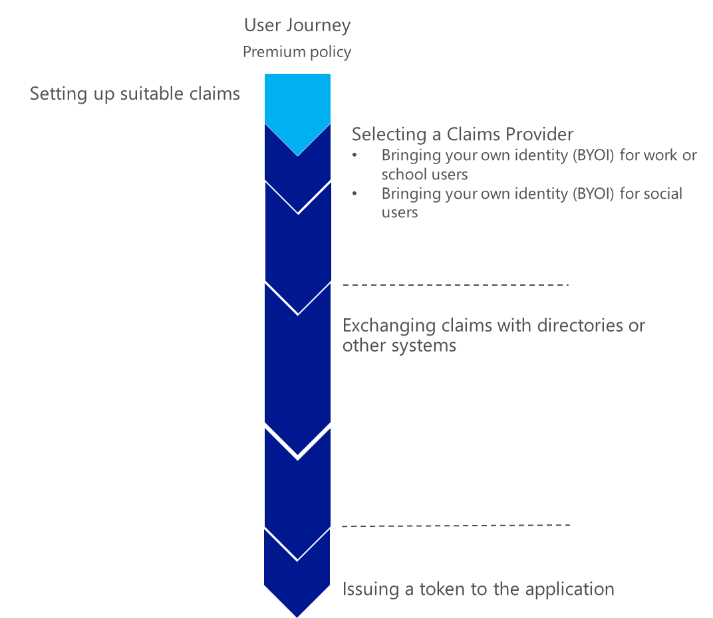


These sections provide the information details necessary to understand
the new capabilities introduced by the premium edition of Azure AD B2C
that allow successfully implementing the most common use cases with your
own (Trust Framework) policies.

About the audience
------------------

This document is intended for IT professionals, system architects, and
developers who are interested in understanding the advanced capabilities
Azure AD B2C Premium provides with all the requirements of an Identity
“Hub”, and in this context how to address the most common use cases
based on the already available features as per the currently available
public preview.

Bringing your own identity (BYOI) for work or school users
==========================================================

This section
illustrates how to use in a non-exhaustive manner specific products or
services to ingrate with Azure AD B2C Premium in order to “*Bring Your
Own Identity*” (BYOI) for work or school users.

It features the following claims providers:

-   Generic identity provider (IdP).

-   Active Directory Federation Services (AD FS) in Windows Server 2012
    > R2.

-   Active Directory Federation Services (AD FS) in Windows Server 2016.

The following sections depicts the related configuration for your B2C
tenant and policies.

Using a generic IdP as a claims provider
----------------------------------------

This section covers how to configure a generic IdP so that it can be
used as a claims provider in a XML policy file. In this use case, Azure
AD B2C Premium acts as a relying party and obtains a token from the
generic IdP as a claims provider. We will add a “generic” IdP as claims
provider in your *B2C\_1A\_Base\_Extensions* premium policy coming with
the “Starter Pack” and later use it in an application policy.

We illustrate the declaration of a “generic” IdP as claims provider by
leveraging an OpenID Connect (OIDC) claims provider. For that purpose,
it leverages the OIDC claims provider sample provided by the “Starter
Pack”. This IdP is based on the [Identity
Server](https://demo.identityserver.io/) open source project. The
rest of this section supposes that you have successfully built this
sample.

**Note** Section § *Using the OIDC claims provider* of the Appendix A.
Using the samples of the “Starter Pack” provides instructions that you
can purposely follow.

This said, this section notably covers how to:

1.  Add the necessary cryptographic key for the “generic” IdP as claims
    provider.

2.  Add the “generic” IdP as claims provider to the
    *B2C\_1A\_Base\_Extensions* premium policy of the “Starter Pack”.

3.  Eventually test the “generic” IdP as claims provider.

The next sections detail the above.

### Adding the cryptographic key for the “generic” IdP as claims provider

To add the cryptographic key needed by the “generic” IdP as claims
provider, proceed with the following steps:

1.  Open a Windows PowerShell command prompt. Change to the directory to
    the *ExploreAdmin* folder in the *Starter-Pack* folder.

The *Starter-Pack* folder corresponds to the path
*C:\\Code\\AAD-B2C\\B2CDemoTools-master* in our configuration.

PS&gt; cd C:\\Code\\AAD-B2C\\B2CDemoTools-master\\ExploreAdmin

1.  Generate the cryptographic key in your B2C tenant by running the
    following commands:

PS&gt; Import-Module .\\ExploreAdmin.dll

PS&gt; Set-CpimKeyContainer -Tenant contoso369b2c.onmicrosoft.com
-StorageReferenceId B2CAuthClientSecret -UnencodedAsciiKey abcdef

**Note** The B2CAuthClientSecret *abcdef* is preset in the ODIC claims
provider as basic authentication credentials.

### Configuring a “generic” IdP as a claims provider in your policy

As outlined before, we will add the “generic” IdP as claims provider to
the *B2C\_1A\_Base\_Extensions* premium policy of the “Starter Pack”.

Proceed with the following steps:

1.  Use your favorite XML editor to open the
    *&lt;your\_b2c\_tenant&gt;\_B2C\_1A\_Base\_Extensions.xml* policy
    XML file of the “Starter Pack”, i.e. the file
    *contoso369b2c.onmicrosoft.com\_B2C\_1A\_Base\_Extensions.xml* in
    our configuration.

All the Trust Framework policies of the “Starter Pack” are located in
the *B2CPolicies\\Advanced Policies Starter Pack* folder in the
*Starter-Pack* folder.

1.  Add the “generic” IdP as claims provider to the policy.

    a.  Add or uncomment the following under &lt;/BuildingBlocks&gt;

&lt;ClaimsProviders&gt;

&lt;/ClaimsProviders&gt;

a.  Insert the following declaration in-between &lt;ClaimProviders&gt;
    &lt;/ClaimsProviders&gt;

&lt;ClaimsProvider&gt;

&lt;DisplayName&gt;IdentityServer&lt;/DisplayName&gt;

&lt;TechnicalProfiles&gt;

&lt;TechnicalProfile Id="IdentityServer"&gt;

&lt;DisplayName&gt;IdentityServer&lt;/DisplayName&gt;

&lt;Description&gt;IdentityServer&lt;/Description&gt;

&lt;Protocol Name="OpenIdConnect" /&gt;

&lt;OutputTokenFormat&gt;JWT&lt;/OutputTokenFormat&gt;

&lt;Metadata&gt;

&lt;Item Key="METADATA"&gt;

http://contoso369b2cauth.azurewebsites.net/identity/.well-known/openid-configuration

&lt;/Item&gt;

&lt;Item
Key="ProviderName"&gt;https://contoso369b2cauth.azurewebsites.net/identity&lt;/Item&gt;

&lt;Item
Key="client\_id"&gt;https://login.microsoftonline.com/te/contoso369b2c&lt;/Item&gt;

&lt;Item
Key="BearerTokenTransmissionMethod"&gt;AuthorizationHeader&lt;/Item&gt;

&lt;Item Key="scope"&gt;openid userdetails&lt;/Item&gt;

&lt;Item Key="HttpBinding"&gt;POST&lt;/Item&gt;

&lt;Item Key="response\_types"&gt;code&lt;/Item&gt;

&lt;Item
Key="IdTokenAudience"&gt;https://login.microsoftonline.com/te/contoso369b2c&lt;/Item&gt;

&lt;/Metadata&gt;

&lt;CryptographicKeys&gt;

&lt;Key Id="client\_secret" StorageReferenceId="B2CAuthClientSecret"
/&gt;

&lt;/CryptographicKeys&gt;

&lt;InputClaims /&gt;

&lt;OutputClaims&gt;

&lt;OutputClaim ClaimTypeReferenceId="userId" PartnerClaimType="oid"
/&gt;

&lt;OutputClaim ClaimTypeReferenceId="identityProvider"
PartnerClaimType="idp" DefaultValue="B2CAuth" /&gt;

&lt;OutputClaim ClaimTypeReferenceId="givenName"
PartnerClaimType="given\_name" /&gt;

&lt;OutputClaim ClaimTypeReferenceId="surname"
PartnerClaimType="family\_name" /&gt;

&lt;OutputClaim ClaimTypeReferenceId="email" /&gt;

&lt;OutputClaim ClaimTypeReferenceId="displayName"
PartnerClaimType="name" /&gt;

&lt;OutputClaim ClaimTypeReferenceId="sub" Required="true" /&gt;

&lt;OutputClaim ClaimTypeReferenceId="authenticationSource"
DefaultValue="socialIdpAuthentication" /&gt;

&lt;/OutputClaims&gt;

&lt;OutputClaimsTransformations&gt;

&lt;OutputClaimsTransformation ReferenceId="CreateRandomUPNUserName"
/&gt;

&lt;OutputClaimsTransformation ReferenceId="CreateUserPrincipalName"
/&gt;

&lt;OutputClaimsTransformation ReferenceId="CreateAlternativeSecurityId"
/&gt;

&lt;OutputClaimsTransformation
ReferenceId="CreateSubjectClaimFromAlternativeSecurityId" /&gt;

&lt;/OutputClaimsTransformations&gt;

&lt;UseTechnicalProfileForSessionManagement ReferenceId="SM-Noop" /&gt;

&lt;/TechnicalProfile&gt;

&lt;/TechnicalProfiles&gt;

&lt;/ClaimsProvider&gt;

1.  Change in the above XML code snippet the following keys in the
    *Metadata* XML element:

<!-- -->

a.  Modify the *METADATA* key to reflect the based URL where you’ve
    deployed the OIDC claims provider sample:

http://&lt;your\_deployment&gt;.azurewebsites.net/identity/.well-known/openid-configuration

> for example, in our configuration:

[http://369b2cauth.azurewebsites.net/identity/.well-known/openid-configuration](http://369b2cauth.azurewebsites.net/identity/.well-known/openid-configuration)

**Note** For additional information, see section § *Deploying the OIDC
claims provider* in the Appendix A. Building the samples of the “Starter
Pack”.

a.  Likewise, modify the *ProviderName* key to reflect the base URL
    where you’ve deployed the OIDC claims provider sample:

http://&lt;your\_deployment&gt;.azurewebsites.net/identity

> for example, in our configuration:

[http://369b2cauth.azurewebsites.net/identity](http://369b2cauth.azurewebsites.net/identity)

a.  Modify the *client\_id* key
    https://login.microsoftonline.com/te/&lt;*your\_tenant*&gt; to
    reflect your tenant, for example
    [https://login.microsoftonline.com/te/contoso369b2c](https://login.microsoftonline.com/te/contoso369b2c)
    in our configuration.

b.  Change the *IdTokenAudience* key to the same value as the above
    *client*\_id key. The identity server will use the *client\_id* key
    value to scope the JSON Web Token (JWT) to the client id.

> **At this stage, the policy now contains a reference to the “generic”
> IdP as claims provider.**

1.  Add a **SignUpOrSignInWithRestAndIdp** user journey to the
    *B2C\_1A\_Base\_Extensions* policy:

<!-- -->

a.  Open the base policy XML file
    *&lt;your\_b2c\_tenant&gt;\_B2C\_1A\_Base.xml* of the “Starter
    Pack”, for example
    *contoso369b2c.onmicrosoft.com\_B2C\_1A\_Base.xml* in our
    configuration.

b.  Search for “*&lt;UserJourney Id="SignUpOrSignIn"&gt;*”. Copy the
    full user journey, i.e. the full XML element.

c.  Back in the file
    *&lt;your\_b2c\_tenant&gt;\_B2C\_1A\_Base\_Extensions.xml*, paste
    beyond *&lt;/ClaimsProviders&gt;*. Enclose the *UserJourney* XML
    element by *&lt;UserJourneys&gt;&lt;/UserJourneys&gt;*.

d.  Rename the id **SignUpOrSignIn** to
    **SignUpOrSignInWithRestAndIdp**.

<!-- -->

1.  Change the **SignUpOrSignInWithRestAndIdp** user journey to include
    the “generic” IdP as claims provider.

    a.  Find “*&lt;UserJourney Id="SignUpOrSignInWithRestAndIdp"&gt;*”
        in the policy.

    b.  Find “*Orchestration Step order=1*” underneath. We need to add
        our provider in the selection screen.

    c.  Add the following line.

&lt;UserJourneys&gt;

&lt;UserJourney Id="SignUpOrSignInWithRestAndIdp"&gt;

&lt;AssuranceLevel&gt;LOA1&lt;/AssuranceLevel&gt;

&lt;PreserveOriginalAssertion&gt;false&lt;/PreserveOriginalAssertion&gt;

&lt;OrchestrationSteps&gt;

&lt;OrchestrationStep Order="1" Type="CombinedSignInAndSignUp"
ContentDefinitionReferenceId="api.signuporsignin"&gt;

&lt;ClaimsProviderSelections&gt;

&lt;ClaimsProviderSelection TargetClaimsExchangeId="FacebookExchange"
/&gt;

&lt;ClaimsProviderSelection
TargetClaimsExchangeId="SignUpWithLogonEmailExchange" /&gt;

&lt;ClaimsProviderSelection
TargetClaimsExchangeId="IdentifyServerExchange" /&gt;

&lt;!----&gt;

&lt;/ClaimsProviderSelections&gt;

&lt;/OrchestrationStep&gt;

…

&lt;OrchestrationSteps&gt;

…

&lt;/UserJourney&gt;

&lt;/UserJourneys&gt;

1.  We now need to map the Id **IdentifyServerExchange** to the right
    technical profile of the OIDC claims provider. When you re-inspect
    the &lt;ClaimsProvider&gt; definition of OIDC claims provider above,
    you will notice that we have a technical profile called
    **IdentityServer**.

In Orchestration Step order=2, add this mapping by the following line:

&lt;UserJourneys&gt;

&lt;UserJourney Id="SignUpOrSignInWithRestAndIdp"&gt;

&lt;AssuranceLevel&gt;LOA1&lt;/AssuranceLevel&gt;

&lt;PreserveOriginalAssertion&gt;false&lt;/PreserveOriginalAssertion&gt;

&lt;OrchestrationSteps&gt;

&lt;OrchestrationStep Order="1" Type="CombinedSignInAndSignUp"
ContentDefinitionReferenceId="api.signuporsignin"&gt;

…

&lt;/OrchestrationStep&gt;

&lt;!-- Check if the user has selected to sign in using one of the
social providers --&gt;

&lt;OrchestrationStep Order="2" Type="ClaimsExchange"&gt;

&lt;Preconditions&gt;

&lt;Precondition Type="ClaimsExist" ExecuteActionsIf="true"&gt;

&lt;Value&gt;objectId&lt;/Value&gt;

&lt;Action&gt;SkipThisOrchestrationStep&lt;/Action&gt;

&lt;/Precondition&gt;

&lt;/Preconditions&gt;

&lt;ClaimsExchanges&gt;

&lt;ClaimsExchange Id="FacebookExchange"
TechnicalProfileReferenceId="Facebook-OAUTH" /&gt;

&lt;ClaimsExchange Id="SignUpWithLogonEmailExchange"

TechnicalProfileReferenceId="LocalAccountSignUpWithLogonEmail" /&gt;

&lt;ClaimsExchange Id="IdentifyServerExchange"
TechnicalProfileReferenceId="IdentityServer" /&gt;

&lt;!----&gt;

&lt;/ClaimsExchanges&gt;

&lt;/OrchestrationStep&gt;

…

&lt;OrchestrationSteps&gt;

…

&lt;/UserJourney&gt;

&lt;/UserJourneys&gt;

**You are now done with the configuration of the “generic” IdP as claims
provider.**

1.  Save the policy XML file.

2.  Upload the policy XML file to your B2C tenant.

    a.  Open a browsing session and navigate to the B2C Admin portal. In
        **Settings**, select **All Policies**.

    b.  Click **Upload Policy**.

    c.  Check **Overwrite the policy if it exists** and Click **Select a
        file**. Browse and select the modified policy XML file
        *&lt;your\_b2c\_tenant&gt;\_B2C\_1A\_Base\_Extensions.xml*, i.e.
        the file
        *contoso369b2c.onmicrosoft.com\_B2C\_1A\_Base\_Extensions.xml*
        in our configuration.

    d.  Click **Upload**, and then check whether it is uploaded without
        validation errors.

### Testing the “generic” IdP as claims provider

To test the “generic” IdP as claims provider, proceed with the following
steps:

1.  Navigate to the B2C Admin portal.

2.  In **Settings**, select **All Policies**.

3.  Select the policy name **B2C\_1A\_SignupWithRestAndIdp**.

In the **run policies** blade, click **Run now**. As before, this will
execute your new user journey.

Using AD FS as a claims provider
--------------------------------

This section covers how to configure AD FS so that it can be used as a
claims provider in a XML policy file. In this use case, Azure AD B2C
Premium acts as a relying party and obtains a token from the AD FS as a
claims provider.

For that purpose, a “Relying Party Trust” has to be created. AD FS in
Windows Server 2012 R2 will serve hereafter as an illustration for the
configuration in AD FS. Differences with AD FS in Windows Server 2016
will be highlighted on purpose if any.

> **Important note** As of this writing, Windows Server 2016 is a
> prerelease software. You can start investigating [Windows Server 2016
> Technical Preview
> 4](https://www.microsoft.com/en-us/evalcenter/evaluate-windows-server-technical-preview).

### Creating a relying party trust

The **Add-ADFSRelyingPartyTrust** cmdlet enables to add a new relying
party trust to your AD FS deployment:

Add-ADFSRelyingPartyTrust -Identifier &lt;String\[\]&gt; -Name
&lt;String&gt; -WSFedEndpoint &lt;Uri&gt;

> **Note** For additional information, see Microsoft TechNet article
> [Add-AdfsRelyingPartyTrust](https://technet.microsoft.com/en-us/library/dn479341(v=wps.630).aspx).
>
> **Note** For information on how to create a relying party trust
> manually, see Microsoft TechNet article [Create a Relying Party
> Trust](https://technet.microsoft.com/en-us/library/dn486828.aspx).

As per WS-Fed specification being used in this scenario, the WS-Fed
request must include a *wtRealm* parameter, which corresponds in AD FS
to the above *Identifier* argument of the cmdlet. 

The value of this parameter should be set as follows with Azure B2C
Premium unless specified otherwise in the metadata of the related WS-Fed
claims provider technical profile in the XML policy file:

https://&lt;*B2C service
hostname*&gt;/&lt;*your\_b2c\_tenant*&gt;/&lt;*your\_premium\_policy*&gt;

For example:

*https://login.microsoftonline.com/te/contoso369.onmicrosoft.com/B2C\_1A\_base\_extensions 
*

Where:

-   &lt;*B2C service hostname*&gt; is specified by
    *login.microsoftonline.com/te*.

-   &lt;*your\_b2c\_tenant*&gt; is specified by
    *contoso269.onmicrosoft.com*.

-   &lt;*your\_premium\_policy*&gt; is *B2C\_1A\_base\_extensions*.

Generally speaking, AD FS when acting as a claims provider must normally
be configured to return the issued SAML security token to specific
WS-Fed endpoint addresses.  Hence, as per WS-Fed specification, the
WS-Fed request also includes a *wReply* parameter, which is the URL to
which the response token should be posted.  This parameter corresponds
to the *WSFedEndpoint* argument of the cmdlet.

The *WSFedEndpoint* argument must be set to:

https://&lt;*B2C service
hostname*&gt;/&lt;*your\_b2c\_tenant*&gt;/&lt;*your\_premium\_policy*&gt;/WSFED/SSO/ASSERTIONCONSUMER

For example:

*https://login.microsoftonline.com/te/contoso369b2c.onmicrosoft.com/B2C\_1A\_base\_extensions/WSFED/SSO/ASSERTIONCONSUMER*

The following command line illustrates how to create a Relying Party
trust named “*Contoso369b2c B2C Tenant*” in AD FS:

PS &gt; \$wsRealm =
"https://login.microsoftonline.com/te/contoso369b2c.onmicrosoft.com/B2C\_1A\_base\_extensions"

PS &gt; \$wsReply =
"https://login.microsoftonline.com/te/contoso369b2c.onmicrosoft.com/B2C\_1A\_base\_extensions/WSFED/SSO/ASSERTIONCONSUMER"

PS &gt; Add-ADFSRelyingPartyTrust -Identifier \$wsRealm -Name
'Contoso369b2c B2C Tenant' -WSFedEndpoint \$wsReply

As per above configuration, the **Identifier** tab of the *Contoso369b2c
B2C Tenant* relying party trust contains the above *wtRealm* value under
**Relying party identifiers**.


Likewise, the **endpoint** tab contains the above *wReply* value listed
under **WS-Federation Passive Endpoints***.*

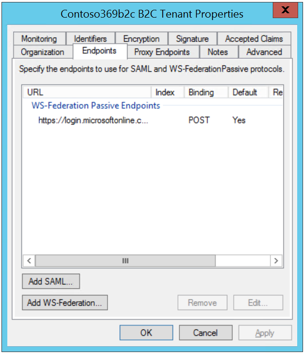


By double-clicking the related line, you can edit the value if needed.

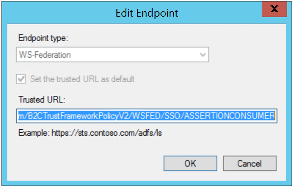 

### Configuring AD FS issuance transform rules

The previous “Relying Party Trust” is where the federation trust between
AD FS as a claims provider and Azure AD B2C Premium as a relying party
is configured.

AD FS is a security token service (STS) that relies on a claims-based
model. In this model, the claims pipeline represents the path that
claims must follow through the service before they can be issued as part
of a SAML token.

> **Note** For additional detail on the claims pipeline, see the
> Microsoft TechNet article [The
> Role of the Claims
> Pipeline](http://technet.microsoft.com/en-us/library/ee913585.aspx).

AD FS manages the entire end-to-end process of flowing claims through
the various stages of the claims pipeline, which also includes the
processing of different claim rule sets by the claim rule-based engine.

> **Note** For additional detail on the claim rule-based engine, see the
> Microsoft TechNet article [The
> Role of the Claims
> Engine](http://technet.microsoft.com/en-us/library/ee913582.aspx).

In the considered scenario, the claim engine controls which users have
access to the Azure AD B2C Premium relying party based on the issuance
authorization rules, and then it issues outgoing claims to the Azure AD
B2C Premium based on issuance transform rules.

Consequently, issuance transform rules must be at least configured to
define the claims to be returned to Azure AD B2C Premium.

Each of these claims should have an existing claim description in AD FS,
which is comparable to the claims schema definition in the XML police
file. The **Add-AdfsClaimDescription** cmdlet enables to add such a
definition to AD FS if required.

> **Note** For additional information, see Microsoft TechNet article
> [Add-AdfsClaimDescription](https://technet.microsoft.com/en-us/library/dn479354(v=wps.630).aspx).

The **New-ADFSClaimRuleSet** cmdlet allows to create a set of claims
rules.

> **Note** For additional information, see Microsoft TechNet article
> [New-AdfsClaimRuleSet](https://technet.microsoft.com/en-us/library/dn479360(v=wps.630).aspx).
>
> **Note** For information on how to create claims rule for a Relying
> Party Trust, see Microsoft TechNet article [Checklist: Creating Claim Rules for
> a Relying Party
> Trust](https://technet.microsoft.com/en-us/library/ee913578.aspx).

The **Set-ADFSRelyingPartyTrust** cmdlet allows then to add this set of
claims rules as issuance transform rules to an existing relying party
trust identified via its *wtRealm* value.

> **Note** For additional information, see Microsoft TechNet article
> [Set-AdfsRelyingPartyTrust](https://technet.microsoft.com/en-us/library/dn479407(v=wps.630).aspx).

The following command line illustrates how to configure issuance
transform rules for the previously created relying party trust named
“*Contoso369b2c B2C Tenant*”:

```Powershell
PS > $wsRealm = "https://login.microsoftonline.com/te/contoso369b2c.onmicrosoft.com/B2C\_1A\_base\_extensions"
```

```Powershell
PS > $ruleSet = New-ADFSClaimRuleSet -ClaimRule 'c:[Type ==
"http://schemas.microsoft.com/ws/2008/06/identity/claims/windowsaccountname",
Issuer == "AD AUTHORITY"] => issue(store = "Active Directory", types
=
("http://schemas.microsoft.com/ws/2008/06/identity/claims/windowsaccountname",

"http://schemas.xmlsoap.org/claims/employeeNumber",

"http://schemas.xmlsoap.org/ws/2005/05/identity/claims/emailaddress",
"http://schemas.xmlsoap.org/ws/2005/05/identity/claims/givenname",
"http://schemas.xmlsoap.org/ws/2005/05/identity/claims/surname"), query
= ";userPrincipalName,employeeNumber,mail,givenName,sn;{0}", param =
c.Value);'
```
```Powershell
PS > Set-ADFSRelyingPartyTrust -TargetIdentifier $wsRealm -IssuanceTransformRules $ruleSet.ClaimRulesString
```

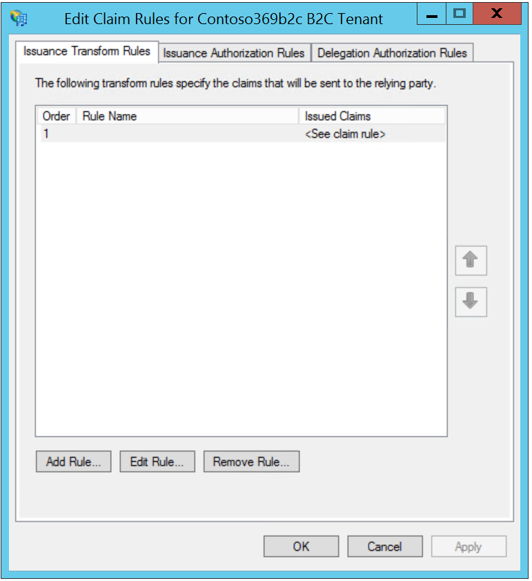


By double-clicking the related line, you can edit the issuance transform
rules if needed.

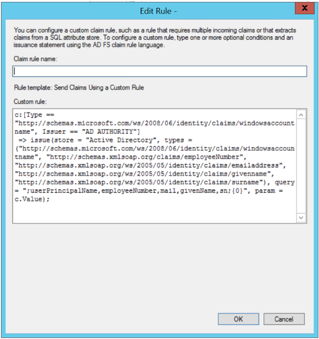


### Configuring ADFS as a claims provider in your policy

The configuration for ADFS as a claims provider in your policy is
straightforward as a simple four steps process when you’d want to
override/extend an already existing relying party information along with
its existing user journey (canvas).

The process can be thus described as follows:

1.  Adding the missing claim type information.

2.  Adding ADFS as a claims provider.

3.  Modifying an existing user journey to take ADFS into account.

4.  Modifying the relaying party in accordance of the above steps for
    > the expected result.

We depict each of the above steps in the next sections.

#### Adding the missing claim type information

This very first step is optional depending if you’d like to leverage or
not one or several additional claim types that do not yet exist in the
*B2C\_1A\_base* premium policy. You can leverage for that purpose the
*B2C\_1A\_base\_extensions* premium policy as discussed in the third
part of this series of document.

We illustrate this situation with the *employeeNumber* claim that will
be provided by ADFS thanks to the above claims rule. As a consequence,
so that Azure AD B2C Premium can appropriately handle this claim type,
you will need to add the following information to extend the
*ClaimsSchema* XML collection element.

&lt;BuildingBlocks&gt;

&lt;ClaimsSchema&gt;

&lt;ClaimType Id="employeeNumber"&gt;

&lt;DisplayName&gt;Employee Number&lt;/DisplayName&gt;

&lt;DataType&gt;string&lt;/DataType&gt;

&lt;AdminHelpText&gt;Employee number&lt;/AdminHelpText&gt;

&lt;UserHelpText&gt;Your employee number&lt;/UserHelpText&gt;

&lt;/ClaimType&gt;

&lt;/ClaimsSchema&gt;

&lt;/BuildingBlocks&gt;

**Note** For additional information, see section § *Setting up suitable
claims* later in this document.

#### Adding ADFS as a claims provider

Once you’ve declared the additional claim types, e.g. the
*employeeNumber* claim in our illustration, you need to declare as you
can expect ADFS as claims provider.

The following XML code snippet illustrates the information to provide in
our example:

&lt;ClaimsProvider&gt;

&lt;Domain&gt;contoso369.com&lt;/Domain&gt;

&lt;DisplayName&gt;On-premises ADFS&lt;/DisplayName&gt;

&lt;TechnicalProfiles&gt;

&lt;TechnicalProfile Id="ADFS-WSFED-Outbound"&gt;

&lt;DisplayName&gt;Contoso369 Inc.&lt;/DisplayName&gt;

&lt;Description&gt;Contoso369 IS STS&lt;/Description&gt;

&lt;Protocol Name="WsFed" /&gt;

&lt;Metadata&gt;

&lt;Item
Key="PartnerEntity"&gt;https://adfs.contoso369.com/FederationMetadata/2007-06/FederationMetadata.xml&lt;/Item&gt;

&lt;/Metadata&gt;

&lt;OutputClaims&gt;

&lt;OutputClaim ClaimTypeReferenceId="UserId"
PartnerClaimType="employeeNumber" /&gt;

&lt;OutputClaim ClaimTypeReferenceId="givenName" /&gt;

&lt;OutputClaim ClaimTypeReferenceId="surname" /&gt;

&lt;OutputClaim ClaimTypeReferenceId="email" PartnerClaimType="UPN"
/&gt;

&lt;OutputClaim ClaimTypeReferenceId="identityProvider"
DefaultValue="contoso369.com" /&gt;

&lt;OutputClaim ClaimTypeReferenceId="authenticationSource"
DefaultValue="socialIdpAuthentication" /&gt;

&lt;/OutputClaims&gt;

&lt;OutputClaimsTransformations&gt;

&lt;OutputClaimsTransformation
ClaimTypeReferenceId="CreateUserPrincipalName" /&gt;

&lt;OutputClaimsTransformation
ClaimTypeReferenceId="CreateAlternativeSecurityId" /&gt;

&lt;OutputClaimsTransformation
ClaimTypeReferenceId="CreateSubjectClaimFromAlternativeSecurityId" /&gt;

&lt;/OutputClaimsTransformations&gt;

&lt;/TechnicalProfile&gt;

&lt;/TechnicalProfiles&gt;

&lt;ClaimsProvider&gt;

You will not be surprised that the protocol being used here is the
**WsFed** (WS-Federation) protocol. (It could also have been **SAML2**
as ADFS supports it also.)

This claims provider definition allows creating an account for the user
in the B2C tenant if it does not already exist.

**Note** For additional information, see section § *Specifying a
technical profile for a WS-Fed claims provider* in the sixth part of
this series of documents,
along with the implementation notes for the technical profile if any.

#### Modifying an existing user journey to take ADFS into account

The next step consists in modifying an existing user journey to take
ADFS into account. We illustrate the approach through the
**B2CSignUpOrSignInWithPassword** user journey defined in the
*B2C\_1A\_base* premium policy.

As such, this user journey defines 10 orchestration steps.

For the illustration, let’s assume that if you’ve already defined a
policy that inherits from it to use both Google and Facebook as claims
provider along with the ability to use a local account of your B2C
tenant.

Regardless of how this policy has been defined, you may end up with a
XML code snippet like the following one that will serve for our
illustration:

&lt;UserJourneys&gt;

&lt;UserJourney Id="B2CSignUpOrSignInWithPassword"&gt;

&lt;OrchestrationSteps&gt;

&lt;OrchestrationStep Order="1" Type="CombinedSignInAndSignUp"

ContentDefinitionReferenceId="api.signinandsignupwithpassword"&gt;

&lt;ClaimsProviderSelections&gt;

&lt;ClaimsProviderSelection TargetClaimsExchangeId="GoogleExchange"
/&gt;

&lt;ClaimsProviderSelection TargetClaimsExchangeId="FacebookExchange"
/&gt;

&lt;ClaimsProviderSelection
TargetClaimsExchangeId="ReadAndCreateSsoSession"

ValidationClaimsExchangeId="LocalAccountSigninEmailExchange" /&gt;

&lt;/ClaimsProviderSelections&gt;

&lt;/OrchestrationStep&gt;

&lt;/OrchestrationSteps&gt;

&lt;/UserJourney&gt;

&lt;/UserJourneys&gt;

On that basis, you will need to:

1.  Modify the above first orchestration step to add a
    > *ClaimsProviderSelection* for ADFS and define a claims exchange
    > identifier reference, for example in our illustration
    > **AdfsExchange**, to link this selection with a *ClaimsExchange*
    > information in another orchestration step as part of that user
    > journey.

2.  Add that *ClaimsExchange* for ADFS as claims provider as part of
    > that user journey and specify the technical profile reference to
    > use for that purpose, for example in our illustration
    > **ADFS-WSFED-Outbound**.

As far as the latter is concerned and as per
**B2CSignUpOrSignInWithPassword** user journey’s definition, you will
simply extend the second orchestration step. One should note that as a
result of it, an account will be created in the B2C tenant if it doesn’t
exist already.

The following XML code snippet illustrates the information to provide in
our example:

&lt;UserJourneys&gt;

&lt;UserJourney Id="B2CSignUpOrSignInWithPassword"&gt;

&lt;OrchestrationSteps&gt;

&lt;OrchestrationStep Order="1" Type="CombinedSignInAndSignUp"

ContentDefinitionReferenceId="api.signinandsignupwithpassword"&gt;

&lt;ClaimsProviderSelections&gt;

&lt;ClaimsProviderSelection TargetClaimsExchangeId="GoogleExchange"
/&gt;

&lt;ClaimsProviderSelection TargetClaimsExchangeId="FacebookExchange"
/&gt;

&lt;ClaimsProviderSelection
TargetClaimsExchangeId="ReadAndCreateSsoSession"

ValidationClaimsExchangeId="LocalAccountSigninEmailExchange" /&gt;

&lt;ClaimsProviderSelection TargetClaimsExchangeId="AdfsExchange" /&gt;

&lt;/ClaimsProviderSelections&gt;

&lt;/OrchestrationStep&gt;

&lt;OrchestrationStep Order="2" Type="ClaimsExchange"&gt;

&lt;ClaimsExchanges&gt;

&lt;ClaimsExchange Id="AdfsExchange"
TechnicalProfileReferenceId="ADFS-WSFED-Outbound" /&gt;

&lt;/ClaimsExchanges&gt;

&lt;/OrchestrationStep&gt;

&lt;/OrchestrationSteps&gt;

&lt;/UserJourney&gt;

&lt;/UserJourneys&gt;

#### Modifying the relaying party

Eventually, you will need to amend the list of the output claims you’d
like to send to the relaying party application:

&lt;RelyingParty&gt;

&lt;DefaultUserJourney ReferenceId="B2CSignUpOrSignInWithPassword" /&gt;

&lt;TechnicalProfile Id="PolicyProfile"&gt;

&lt;DisplayName&gt;PolicyProfile&lt;/DisplayName&gt;

&lt;Protocol Name="OpenIdConnect" /&gt;

&lt;OutputClaims&gt;

&lt;OutputClaim ClaimTypeReferenceId="displayName" /&gt;

&lt;OutputClaim ClaimTypeReferenceId="email" /&gt;

&lt;OutputClaim ClaimTypeReferenceId="givenName" /&gt;

&lt;OutputClaim ClaimTypeReferenceId="identityProvider" /&gt;

&lt;OutputClaim ClaimTypeReferenceId="objectId" /&gt;

&lt;OutputClaim ClaimTypeReferenceId="sub" /&gt;

&lt;OutputClaim ClaimTypeReferenceId="surname" /&gt;

&lt;OutputClaim ClaimTypeReferenceId="UserId" /&gt;

&lt;/OutputClaims&gt;

&lt;SubjectNamingInfo ClaimType="sub" /&gt;

&lt;/TechnicalProfile&gt;

&lt;/RelyingParty&gt;

Et voila!

Bringing your own identity (BYOI) for social users
==================================================

This section illustrates how to use in a non-exhaustive manner specific
products or services to integrate with Azure AD B2C Premium in order to
“*Bring Your Own Identity*” (BYOI) for social users.

More particularly, this section shows you how to configure common social
identity providers on your B2C tenant. It illustrates the configuration
for (by alphabetical order):

-   Amazon,

-   Facebook,

-   Google+,

-   LinkedIn,

-   Microsoft Accounts,

-   Twitter.

The following sections depicts the related configuration for your B2C
tenant and policies.

Using Amazon as a claim provider
--------------------------------

This section shows you, in this use case, how to configure Amazon as
social identity providers on your B2C tenant.

To use Amazon as a social identity provider in Azure AD B2C Premium, you
will first need to create an Amazon application and supply it with the
right parameters.

### Creating an Amazon application

The article [Azure Active
Directory B2C preview: Provide sign-up and sign-in to consumers with
Amazon
accounts](https://azure.microsoft.com/en-us/documentation/articles/active-directory-b2c-setup-amzn-app/)
provides all the required instructions for creating the Amazon
application:

-   You will need an Amazon account to perform the described steps. If
    > you don’t have one, you can get it at
    > [https://www.amazon.com/](https://www.amazon.com/).

-   Eventually, you will need the value of both **Client ID** and
    > **Client Secret** to configure Amazon as a social identity
    > provider in your B2C tenant. Note down these values that will be
    > in the next section respectively referred as to the
    > “*YourClientIDValue*” and “*YourClientSecretValue*” values.

### Configuring Amazon as a claims provider in your policy

The configuration for Amazon as a claims provider in your policy is
straightforward as a simple two steps process. This twofold process can
be described as follows:

1.  Overriding the “Amazon” claims provider.

2.  Modifying an existing user journey to take Amazon into account.

We depict each of the above twosteps in the next sections.

#### Overriding the “Amazon” claims provider

You will then need to configure a claims provider for Amazon and reflect
in its definition the above values.

Fortunately, to limit the amount of information to specify, you can
seamlessly leverage the *B2C\_1A\_base\_extensions* premium policy to
provide a core definition for the “Amazon” claims provider with an
associated technical profile. This technical profile is named
**Amazon-OAUTH** hereafter.

You simply need to extend it to reflect in it the information that
pertains to the Amazon application created in the previous section, i.e.
the “*YourClientIDValue*” and “*YourClientSecretValue*” values.

The following XML code snippet illustrates the above: *+ instructions
that relate to cryptographic key for the “YourClientSecretValue” value.*

&lt;ClaimsProvider&gt;

&lt;DisplayName&gt;Amazon&lt;/DisplayName&gt;

&lt;TechnicalProfiles&gt;

&lt;TechnicalProfile Id="Amazon-OAUTH"&gt;

&lt;Metadata&gt;

&lt;Item Key="client\_id"&gt;***YourClientIDValue***&lt;/Item&gt;

&lt;/Metadata&gt;

&lt;/TechnicalProfile&gt;

&lt;/TechnicalProfiles&gt;

&lt;/ClaimsProvider&gt;

**Note** For additional information, see section § *Specifying a
technical profile for an OAuth 2.0 claims provider* in the sixth part of
this series of documents,
along with the implementation notes for the technical profile if any.

#### Modifying an existing user journey to take Amazon into account.

TBD

Using Facebook as a claim provider
----------------------------------

This section shows you, in this use case, how to configure Facebook as
social identity providers on your B2C tenant with the premium edition.

To use Facebook as a social identity provider in Azure AD B2C Premium,
you will first need to create a Facebook application and supply it with
the right parameters.

### Creating a Facebook application

The article [Azure Active
Directory B2C preview: Provide sign-up and sign-in to consumers with
Facebook
accounts](https://azure.microsoft.com/en-us/documentation/articles/active-directory-b2c-setup-fb-app/)
provides all the required instructions for creating the Facebook
application:

-   You will need a Facebook account to perform the described steps. If
    > you don’t have one, you can get it at
    > [https://www.facebook.com/](https://www.facebook.com/).

-   Eventually, you will need the value of both **App ID** and **App
    > Secret** to configure Facebook as a social identity provider in
    > your B2C tenant. Note down these values that will be in the next
    > section respectively referred as to the “*YourClientIDValue*” and
    > “*YourClientSecretValue*” values.

### Configuring Facebook as a claims provider in your policy

The configuration for Facebook as a claims provider in your policy is
straightforward as a simple two steps process. This twofold process can
be described as follows:

1.  Overriding the “Facebook” claims provider.

2.  Modifying an existing user journey to take Facebook into account.

We depict each of the above twosteps in the next sections.

#### Overriding the “Facebook” claims provider

You will then need to configure a claims provider for Facebook and
reflect in its definition the above values. Fortunately, to limit the
amount of information to specify, you can seamlessly leverage the core
definition that already exists in the *B2C\_1A\_base* premium policy for
the “Facebook” claims provider and its associated technical profile
**Facebook-OAUTH**.

You simply need to extend it to reflect in it the information that
pertains to the Facebook application created in the previous section,
i.e. the “*YourClientIDValue*” and “*YourClientSecretValue*” values.

The following XML code snippet illustrates the above: *+ instructions
that relate to cryptographic key for the “YourClientSecretValue” value.*

&lt;ClaimsProvider&gt;

&lt;DisplayName&gt;Facebook&lt;/DisplayName&gt;

&lt;TechnicalProfiles&gt;

&lt;TechnicalProfile Id="Facebook-OAUTH"&gt;

&lt;Metadata&gt;

&lt;Item Key="client\_id"&gt;***YourClientIDValue***&lt;/Item&gt;

&lt;/Metadata&gt;

&lt;/TechnicalProfile&gt;

&lt;/TechnicalProfiles&gt;

&lt;/ClaimsProvider&gt;

**Note** For additional information, see section § *Specifying a
technical profile for an OAuth 2.0 claims provider* in the sixth part of
this series of documents,
along with the implementation notes for the technical profile if any.

#### Modifying an existing user journey to take Facebook into account.

TBD

Using Google+ as a claim provider
---------------------------------

This section shows you, in this use case, how to configure Google+ as
social identity providers on your B2C tenant.

To use Google as a social identity provider in Azure AD B2C Premium, you
will first need to create a Google application and supply it with the
right parameters.

### Creating a Google application

The article [Azure Active
Directory B2C preview: Provide sign-up and sign-in to consumers with
Google+
accounts](https://azure.microsoft.com/en-us/documentation/articles/active-directory-b2c-setup-goog-app/)
provides all the required instructions for creating the Google
application.

-   You will need a Google account to perform the described steps. If
    > you don’t have one, you can get it at
    > [https://accounts.google.com/SignUp](https://accounts.google.com/SignUp).

-   Eventually, you will need the value of both **client ID** and
    > **client Secret** to configure Google as a social identity
    > provider in your B2C tenant. Note down these values that will be
    > later respectively referred as to the “*YourClientIDValue*” and
    > “*YourClientSecretValue*” values.

### Configuring Google as a claims provider in your policy

The configuration for Google as a claims provider in your policy is
straightforward as a simple two steps process. This twofold process can
be described as follows:

1.  Overriding the “Google” claims provider.

2.  Modifying an existing user journey to take Google into account.

We depict each of the above twosteps in the next sections.

#### Overriding the “Google” claims provider

You will then need to configure a claims provider for Amazon and reflect
in its definition the above values.

Fortunately, to limit the amount of information to specify, you can
seamlessly leverage the *B2C\_1A\_base\_extensions* premium policy to
provide a core definition for the “Google” claims provider with an
associated technical profile. This technical profile is named
**Google-OAUTH** hereafter.

You simply need to extend it to reflect in it the information that
pertains to the Google application created in the previous section, i.e.
the “*YourClientIDValue*” and “*YourClientSecretValue*” values.

The following XML code snippet illustrates the above: *+ instructions
that relate to cryptographic key for the “YourClientSecretValue” value.*

&lt;ClaimsProvider&gt;

&lt;DisplayName&gt;Google&lt;/DisplayName&gt;

&lt;TechnicalProfiles&gt;

&lt;TechnicalProfile Id="Google-OAUTH"&gt;

&lt;Metadata&gt;

&lt;Item Key="client\_id"&gt;***YourClientIDValue***&lt;/Item&gt;

&lt;/Metadata&gt;

&lt;/TechnicalProfile&gt;

&lt;/TechnicalProfiles&gt;

&lt;/ClaimsProvider&gt;

**Note** For additional information, see section § *Specifying a
technical profile for an OAuth 2.0 claims provider* in the sixth part of
this series of documents,
along with the implementation notes for the technical profile if any.

Using LinkedIn as a claim provider
----------------------------------

This section shows you, in this use case, how to configure LinkedIn as
social identity providers on your B2C tenant.

To use LinkedIn as a social identity provider in Azure AD B2C Premium,
you will first need to create a Google application and supply it with
the right parameters.

### Creating a LinkedIn application

The article [Azure Active
Directory B2C preview: Provide sign-up and sign-in to consumers with
LinkedIn
accounts](https://azure.microsoft.com/en-us/documentation/articles/active-directory-b2c-setup-li-app/)
provides all the required instructions for creating the LinkedIn
application:

-   You will need a LinkedIn account to perform the described steps. If
    > you don’t have one, you can get it at
    > [https://www.linkedin.com/](https://www.linkedin.com/).

-   Eventually, you will need the value of both **Client ID** and
    > **Client Secret** to configure Google as a social identity
    > provider in your B2C tenant. Note down these values that will be
    > later respectively referred as to the “*YourClientIDValue*” and
    > “*YourClientSecretValue*” values.

### Configuring LinkedIn as a claims provider in your policy

The configuration for LinkedIn as a claims provider in your policy is
straightforward as a simple two steps process. This twofold process can
be described as follows:

1.  Overriding the “Linkedin” claims provider.

2.  Modifying an existing user journey to take LinkedIn into account.

We depict each of the above twosteps in the next sections.

#### Overriding the “Linkedin” claims provider

You will then need to configure a claims provider for Amazon and reflect
in its definition the above values.

Fortunately, to limit the amount of information to specify, you can
seamlessly leverage the *B2C\_1A\_base\_extensions* premium policy to
provide a core definition for the “Linkedin” claims provider with an
associated technical profile. This technical profile is named
**LinkedIn-OAUTH** hereafter.

You simply need to extend it to reflect in it the information that
pertains to the LinkedIn application created in the previous section,
i.e. the “*YourClientIDValue*” and “*YourClientSecretValue*” values.

The following XML code snippet illustrates the above: *+ instructions
that relate to cryptographic key for the “YourClientSecretValue” value.*

&lt;ClaimsProvider&gt;

&lt;Domain&gt;linkedin.com&lt;/Domain&gt;

&lt;DisplayName&gt;Linkedin&lt;/DisplayName&gt;

&lt;TechnicalProfiles&gt;

&lt;TechnicalProfile Id="LinkedIn-OAUTH"&gt;

&lt;Metadata&gt;

&lt;Item Key="client\_id"&gt;***YourClientIDValue***&lt;/Item&gt;

&lt;/Metadata&gt;

&lt;/TechnicalProfile&gt;

&lt;/TechnicalProfiles&gt;

&lt;/ClaimsProvider&gt;

**Note** For additional information, see section § *Specifying a
technical profile for an OAuth 2.0 claims provider* in the sixth part of
this series of documents,
along with the implementation notes for the technical profile if any.

#### Modifying an existing user journey to take LinkedIn into account.

TBD

Using Microsoft Accounts as a claim provider
--------------------------------------------

This section shows you, in this use case, how to configure Microsoft
Accounts (MSA) as social identity providers on your B2C tenant.

To use Microsoft Accounts (MSA) as a social identity provider in Azure
AD B2C Premium, you will first need to create a MSA application and
supply it with the right parameters.

### Creating a Microsoft Accounts application

The article [Azure Active
Directory B2C preview: Provide sign-up and sign-in to consumers with
Microsoft
accounts](https://azure.microsoft.com/en-us/documentation/articles/active-directory-b2c-setup-msa-app/)
provides all the required instructions for creating the MSA application:

-   You will need a MSA account to perform the described steps. If you
    > don’t have one, you can get it at
    > [https://www.live.com/](https://www.live.com/).

-   Eventually, you will need the value of both **Client ID** and
    > **Client Secret** to configure Google as a social identity
    > provider in your B2C tenant. Note down these values that will be
    > later respectively referred as to the “*YourClientIDValue*” and
    > “*YourClientSecretValue*” values.

### Configuring Microsoft Account as a claims provider in your policy

The configuration for Microsoft Accounts as a claims provider in your
policy is straightforward as a simple two steps process. This twofold
process can be described as follows:

1.  Overriding the “Microsoft Accounts” claims provider.

2.  Modifying an existing user journey to take Microsoft Accounts into
    > account.

We depict each of the above twosteps in the next sections.

#### Overriding the “Microsoft Accounts” claims provider

You will then need to configure a claims provider for Amazon and reflect
in its definition the above values.

Fortunately, to limit the amount of information to specify, you can
seamlessly leverage the *B2C\_1A\_base\_extensions* premium policy to
provide a core definition for the “Microsoft Accounts” claims provider
with an associated technical profile. This technical profile is named
**MSA-OIDC** hereafter.

You simply need to extend it to reflect in it the information that
pertains to the Microsoft Accounts application created in the previous
section, i.e. the “*YourClientIDValue*” and “*YourClientSecretValue*”
values.

The following XML code snippet illustrates the above: *+ instructions
that relate to cryptographic key for the “YourClientSecretValue” value.
*

&lt;ClaimsProvider&gt;

&lt;DisplayName&gt;Microsoft Account&lt;/DisplayName&gt;

&lt;TechnicalProfiles&gt;

&lt;TechnicalProfile Id="MSA-OIDC"&gt;

&lt;DisplayName&gt;Microsoft Account&lt;/DisplayName&gt;

&lt;Metadata&gt;

&lt;Item Key="MsaOriginalClientId"&gt;0000000040143214&lt;/Item&gt;

&lt;Item Key="client\_id"&gt;***YourClientIDValue***&lt;/Item&gt;

&lt;Item Key="IdTokenAudience"&gt;***YourClientIDValue***&lt;/Item&gt;

&lt;Item Key="UsePolicyInRedirectUri"&gt;0&lt;/Item&gt;

&lt;/Metadata&gt;

&lt;/TechnicalProfile&gt;

&lt;/TechnicalProfiles&gt;

&lt;/ClaimsProvider&gt;

**Note** For additional information, see section § *Specifying a
technical profile for an OpenID Connect claims provider* in the sixth
part of this series of documents, along with the implementation
notes for the technical profile if any.

#### Modifying an existing user journey to take Microsoft Accounts into account.

TBD

Using Twitter as a claim provider
---------------------------------

This section shows you, in this use case, how to configure Twitter as
social identity providers on your B2C tenant.

To use Twitter as a social identity provider in Azure AD B2C Premium,
you will first need to create a Twitter application and supply it with
the right parameters.

### Creating a Twitter application

TBD

### Configuring Twitter as a claims provider in your policy

The configuration for Twitter as a claims provider in your policy is
straightforward as a simple two steps process. This twofold process can
be described as follows:

1.  Adding Twitter as a claims provider.

2.  Modifying an existing user journey to take Twitter into account.

We depict each of the above twosteps in the next sections.

#### Adding Twitter as a claims provider

TBD

You simply need to extend it to reflect in it the information that
pertains to the Twitter application created in the previous section,
i.e. the “*YourClientIDValue*” and “*YourClientSecretValue*” values.

The following XML code snippet illustrates the above: *+ instructions
that relate to cryptographic key for the “YourClientSecretValue” value.*

&lt;ClaimsProvider&gt;

&lt;DisplayName&gt;Twitter&lt;/DisplayName&gt;

&lt;TechnicalProfiles&gt;

&lt;TechnicalProfile Id="Twitter-OAUTH1"&gt;

&lt;DisplayName&gt;Twitter&lt;/DisplayName&gt;

&lt;Protocol Name="OAuth1" /&gt;

&lt;Metadata&gt;

&lt;Item Key="ProviderName"&gt;twitter&lt;/Item&gt;

&lt;Item
Key="request\_token\_endpoint"&gt;https://api.twitter.com/oauth/request\_token&lt;/Item&gt;

&lt;Item
Key="authorization\_endpoint"&gt;https://api.twitter.com/oauth/authenticate&lt;/Item&gt;

&lt;Item
Key="access\_token\_endpoint"&gt;https://api.twitter.com/oauth/access\_token&lt;/Item&gt;

&lt;Item Key="client\_id"&gt;CMoQQI355stTG3lumdgYRsf8a&lt;/Item&gt;

&lt;/Metadata&gt;

&lt;CryptographicKeys&gt;

&lt;Key Id="client\_secret" StorageReferenceId="TwitterSecret" /&gt;

&lt;/CryptographicKeys&gt;

&lt;InputClaims /&gt;

&lt;OutputClaims&gt;

&lt;OutputClaim ClaimTypeReferenceId="userId"
PartnerClaimType="user\_id" /&gt;

&lt;OutputClaim ClaimTypeReferenceId="givenName"
PartnerClaimType="given\_name" /&gt;

&lt;OutputClaim ClaimTypeReferenceId="surname"
PartnerClaimType="family\_name" /&gt;

&lt;OutputClaim ClaimTypeReferenceId="displayName"
PartnerClaimType="screen\_name" /&gt;

&lt;OutputClaim ClaimTypeReferenceId="email" PartnerClaimType="email"
/&gt;

&lt;OutputClaim ClaimTypeReferenceId="identityProvider"
DefaultValue="twitter.com" /&gt;

&lt;OutputClaim ClaimTypeReferenceId="authenticationSource"
DefaultValue="socialIdpAuthentication" /&gt;

&lt;/OutputClaims&gt;

&lt;OutputClaimsTransformations&gt;

&lt;OutputClaimsTransformation ReferenceId="CreateUserPrincipalName"
/&gt;

&lt;OutputClaimsTransformation ReferenceId="CreateAlternativeSecurityId"
/&gt;

&lt;OutputClaimsTransformation
ReferenceId="CreateSubjectClaimFromAlternativeSecurityId" /&gt;

&lt;/OutputClaimsTransformations&gt;

&lt;/TechnicalProfile&gt;

&lt;/TechnicalProfiles&gt;

&lt;/ClaimsProvider&gt;

**Note** For additional information, see section § *Specifying a
technical profile for an OAuth 1.0 claims provider* in the sixth part of
this series of documents,
along with the implementation notes for the technical profile if any.

#### Modifying an existing user journey to take Twitter into account

TBD

Setting up suitable claims
==========================

This section illustrates how to setup the suitable claims, including
related transformations, and partner claims.

It completes the simple example provided earlier in this document with
the definition of AD FS as a claims provider, see section § *Adding the
missing claim type information*.

To add new claims type in the policy, proceed with the following steps:

1.  Use your favorite XML editor to open the
    *&lt;your\_b2c\_tenant&gt;\_B2C\_1A\_Base\_Extensions.xml* policy
    XML file of the “Starter Pack”, i.e. the file
    *contoso369b2c.onmicrosoft.com\_B2C\_1A\_Base\_Extensions.xml* in
    our configuration.

All the Trust Framework policies of the “Starter Pack” are located in
the *B2CPolicies\\Advanced Policies Starter Pack* folder in the
*Starter-Pack* folder.

1.  Add claim type used by the REST API. Copy the following section
    *ClaimsSchema* under the *BuildingsBlocks* XML element. This defines
    the Loyalty claims used by the REST API.

&lt;TrustFrameworkPolicy
xmlns:xsi="http://www.w3.org/2001/XMLSchema-instance"

xmlns:xsd="http://www.w3.org/2001/XMLSchema"

xmlns="http://schemas.microsoft.com/online/cpim/schemas/2013/06"

PolicySchemaVersion="0.3.0.0"

TenantId="contoso369b2c.onmicrosoft.com"

PolicyId="B2C\_1A\_base\_extensions"

PublicPolicyUri="http://contoso369b2c.onmicrosoft.com"&gt;

&lt;BasePolicy&gt;

&lt;TenantId&gt;contoso369b2c.onmicrosoft.com&lt;/TenantId&gt;

&lt;PolicyId&gt;B2C\_1A\_base&lt;/PolicyId&gt;

&lt;/BasePolicy&gt;

&lt;BuildingBlocks&gt;

&lt;ClaimsSchema&gt;

&lt;ClaimType Id="Loyalty"&gt;

&lt;DisplayName&gt;Loyalty number&lt;/DisplayName&gt;

&lt;DataType&gt;string&lt;/DataType&gt;

&lt;UserHelpText /&gt;

&lt;UserInputType&gt;TextBox&lt;/UserInputType&gt;

&lt;Restriction&gt;

&lt;Pattern RegularExpression="\^\[a-zA-Z0-9\]+\[a-zA-Z0-9\_-\]\*\$"
HelpText="The loyalty number you provided is not

valid. It must begin with an alphabet or number and can contain
alphabets,

numbers and the following symbols: \_ -" /&gt;

&lt;/Restriction&gt;

&lt;/ClaimType&gt;

&lt;/ClaimsSchema&gt;

…

&lt;BuildingBlocks&gt;

…

&lt;/TrustFrameworkPolicy&gt;

1.  Save the policy XML file.

2.  Upload the policy XML file to your B2C tenant.

<!-- -->

a.  Open a browsing session and navigate to the B2C Admin portal. In
    **Settings**, select **All Policies**.

b.  Click **Upload Policy**.

c.  Check **Overwrite the policy if it exists** and Click **Select a
    file**. Browse and select the modified policy XML file
    *&lt;your\_b2c\_tenant&gt;\_B2C\_1A\_Base\_Extensions.xml*, i.e. the
    file *contoso369b2c.onmicrosoft.com\_B2C\_1A\_Base\_Extensions.xml*
    in our configuration.

d.  Click **Upload**, and then check whether it is uploaded without
    validation errors.

TBD

Exchanging claims with directories or other systems
===================================================

This section illustrates how to use in a non-exhaustive manner specific
directory provider or REST APIs to exchange claims with Azure AD B2C
Premium in order to sustain your own specific scenarios.

More particularly, this section shows you how to integrate with:

-   Azure AD.

-   A REST API.

The following sections depicts the related configuration for your B2C
tenant and policies.

Integrating with Azure AD
-------------------------

As its name indicates, this section illustrates how to integrate with
Azure AD to exchange claims.

### Adding Azure AD as a claim provider

TBD

**Note** For additional information, see section § *Specifying a
technical profile for an Azure AD claims provider* in the sixth part of
this series of documents,
along with the implementation notes for the technical profile if any.

### Supporting custom attributes for Azure AD claims providers

Azure AD has a few predefined attributes, such as *givenName*,
*lastName*, *telephoneNumber*, *userPrincipalName*, etc. for a User
object.

**Note** For additional information, see section [User
Entity](https://msdn.microsoft.com/Library/Azure/Ad/Graph/api/entity-and-complex-type-reference#EntityreferenceUserEntity)
in the article Entity and complex
type reference | Graph API reference.

Azure AD also allows creation of additional custom attributes and refers
to them as *Extension* properties. They can be defined on various
objects types, such as *User*, *Group*, *Application*,
*ServicePrincipal*, and others. These objects can be extended with
“*Binary*”, “*Boolean*”, “*DateTime*”, “*Integer*”, “*LargeInteger*”,
and “*String*” type single-valued attributes. For that purpose, the
Azure AD Graph API provides REST interfaces for an application to
register, unregister, enumerate, read, write, and filter by extension
properties.

> **Note** For more information, see the Microsoft MSDN article [Azure
> AD Graph
> API](http://msdn.microsoft.com/library/azure/hh974476.aspx).

Azure AD B2C Premium policy supports adding *Extension* properties only
on users though. This section describes how to proceed in order to use
*Extension* properties in the technical profiles’ definition relating to
an Azure AD provider.

*Extension* properties can only be registered on an *Application* object
even though they may contain data for a *User*. They belong to that
application. The application must be granted write access to register an
*Extension* property. 100 *Extension* properties (across ALL types and
ALL applications) can be written to any single object. *Extension*
properties are added to the target directory type and becomes
immediately accessible in the Azure AD directory tenant.

If the application is deleted, those *Extension* properties along with
any data contained in them are also removed. If an Extension property is
deleted by the application, it is removed on the target directory
object, and any data contained in it is removed too.

**Note** For additional information, see the article [Directory schema extensions | Graph
API
concepts](https://msdn.microsoft.com/Library/Azure/Ad/Graph/howto/azure-ad-graph-api-directory-schema-extensions).

Thus, before *Extension* properties can be stored, a new application
must be created which is used by Azure AD B2C Premium for storing the
*Extension* properties. The object id of that application is to be
provided in the technical profile(s).

To complete this procedure, proceed with the following steps in order.

1.  Creating a new application

2.  Get the object id of the application

3.  Modify the policy to add the object id of the application:

4.  Add extension attributes in the technical profiles

The next sections describe in order each of the above steps.

#### Creating a new application

Proceed with the following steps:

1.  Open a browsing session, navigate to the classic Azure management
    > portal at
    > [https://manage.windowsazure.com](https://manage.windowsazure.com/),
    > and sign as with administrative credentials of the directory
    > tenant to configure.

2.  Click **ACTIVE DIRECTORY**.

3.  Select the name of your directory for which you are creating the
    > technical profile, for example **Contoso369** in our illustration.

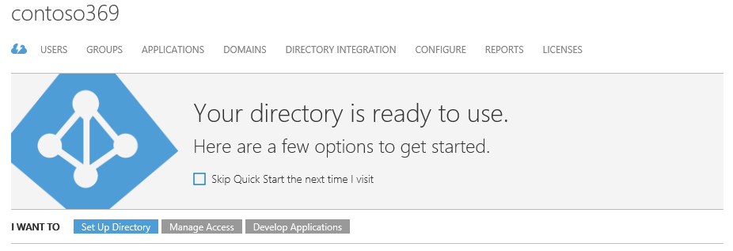


1.  Click **APPLICATIONS**.

2.  Click **ADD** in the tray of the bottom. A **What do you want to
    > do?** dialog brings up.

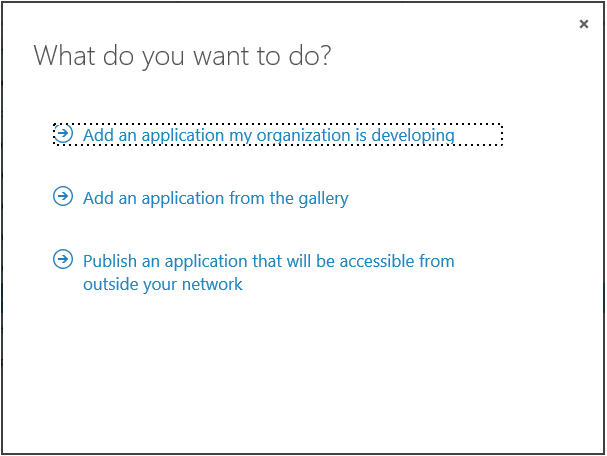


1.  Click **Add an application for my organization is developing**.

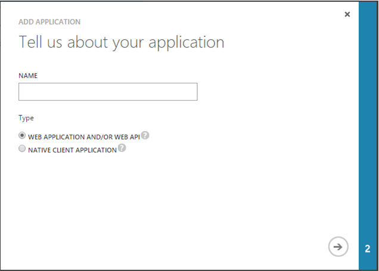


1.  On the **Tell us about your application** page, specify a name for
    > the web application, for example
    > “*WebApp-GraphAPI-DirectoryExtensions*”. This used as
    > human-readable moniker to refer to the application. Select **WEB
    > APPLICATION AND/OR WEB API**. Click the arrow icon on the
    > bottom-right hand corner of the page.

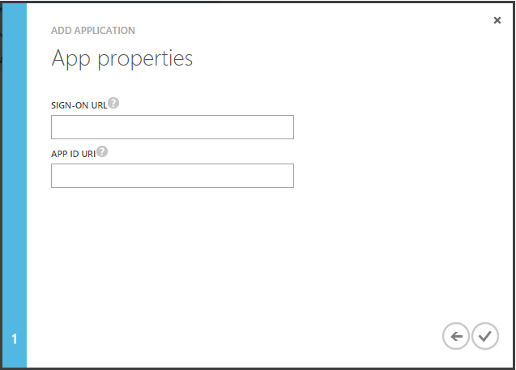


1.  On the **App properties** page, enter in **APP URL** and in **APP ID
    > URI**, for example
    > “https://contoso369.onmicrosoft.com/WebApp-GraphAPI-DirectoryExtensions”,
    > then click the check mark icon on the bottom-right hand corner of
    > the page.

2.  After a successful creation of the app, you are redirected to the
    > **Quick Start** page for the web application.

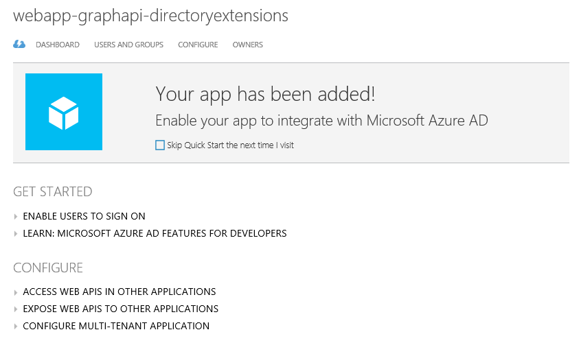


> **Note** For more information, see the MSDN article [Adding, Updating, and Removing an
> App](http://msdn.microsoft.com/en-us/library/dn132599.aspx)
> .

All done! Before moving on to the next step, you need to ensure that the
application has permissions to read/write directory data, and find the
Client ID of your application for the *Extensions* properties.

To set the appropriate permission, proceed with the following steps:

1.  While still in the Azure management portal on the **Quick Start**
    page for the web application, click **CONFIGURE**.

2.  Scroll down to **permissions to other applications**.

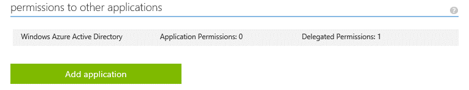


1.  Scroll down to **Application Permissions** next to **Windows Azure
    Active Directory**.

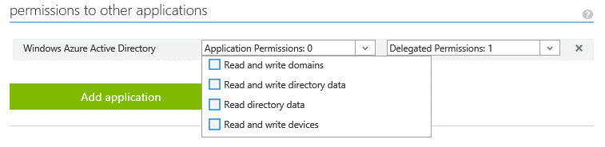


1.  Check **Read and write directory data**.

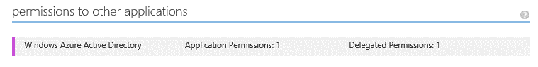


1.  Click **SAVE** at the bottom of the tray.

To get the Client ID of your sample application, proceed with the
following steps:

1.  While still in the Azure management portal on the **CONFIGURE** page
    for the web application, scroll up to **CLIENT ID**.

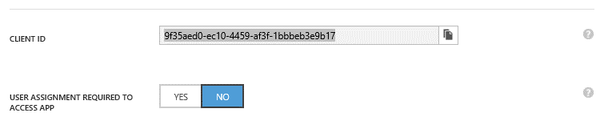


1.  Copy the “*Client ID*” value to the clipboard:
    9f35aed0-ec10-4459-af3f-1bbbeb3e9b17. Note this value.

#### Getting the object id of the application

Proceed with the following steps:

1.  Open a browsing session and navigate to
    > [https://graphexplorer.cloudapp.net](https://graphexplorer.cloudapp.net),
    > and click **Sign in** on the right hand page.

2.  Sign in with the directory tenant admin credentials to sign in.

3.  Type the following URL in the textbox next to **GET**:

https://graph.windows.net/*&lt;tenant domain name&gt;*/applications/?\$filter=appId
eq '&lt;*Client ID*&gt;

Where:

-   &lt;*tenant domain name*&gt; is the name of your directory for which
    > you are creating the technical profile:

-   &lt;*Client ID*&gt; is the “*Client ID*” value noted above. Do do
    not include { or } and make sure you have single quotes around it:

https://graph.windows.net/*contoso369.onmicrosoft.com*/applications/?\$filter=appId
eq '9f35aed0-ec10-4459-af3f-1bbbeb3e9b17'

1.  Click **GET**. A JSON representation of the application should be
    > then retrieved.

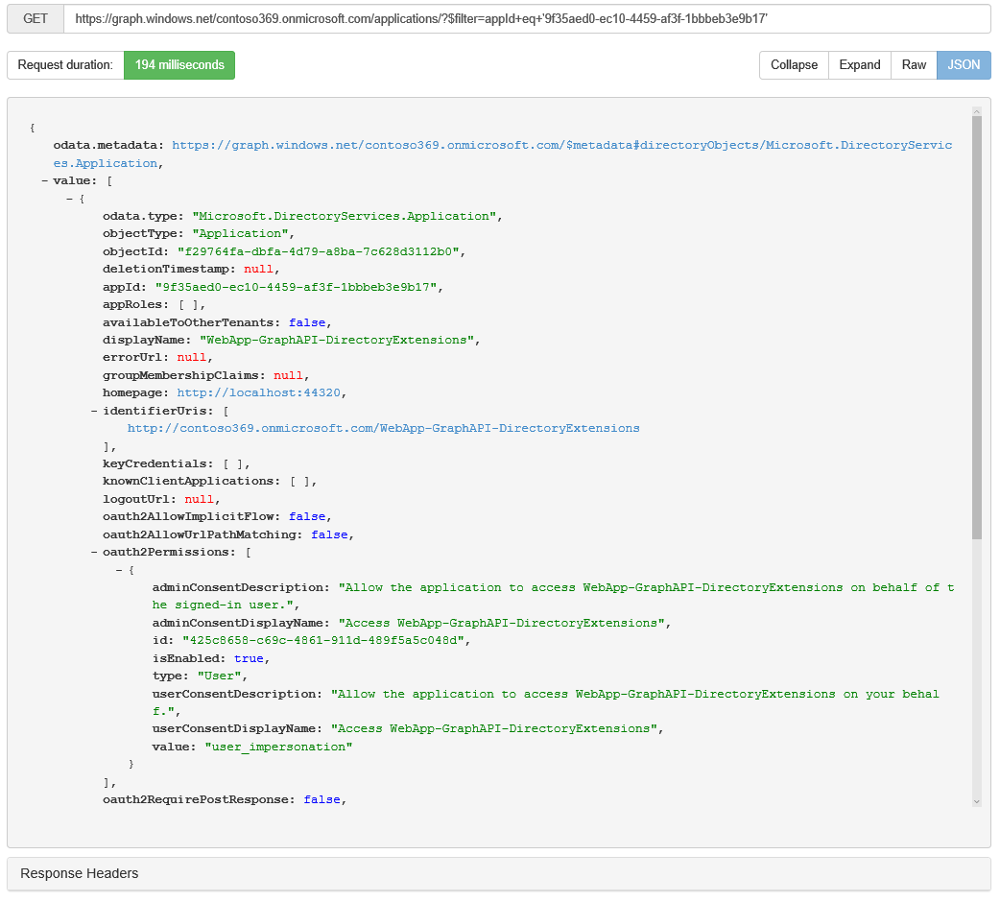


{

"odata.metadata":
"https://graph.windows.net/contoso69.onmicrosoft.com/\$metadata\#directoryObjects/Microsoft.DirectoryServices.Application",

-

"value": \[

-{

"odata.type": "Microsoft.DirectoryServices.Application",

"objectType": "Application",

"objectId": "f29764fa-dbfa-4d79-a8ba-7c628d3112b0",

"deletionTimestamp": null,

"appId": "9f35aed0-ec10-4459-af3f-1bbbeb3e9b17",

"appRoles": \[ \],

"availableToOtherTenants": false,

"displayName": "WebApp-GraphAPI-DirectoryExtensions",

"errorUrl": null,

"groupMembershipClaims": null,

"homepage": "http://localhost:44320",

- "identifierUris": \["

http://contoso369.onmicrosoft.com/WebApp-GraphAPI-DirectoryExtensions"

\],

"keyCredentials": \[ \],

"knownClientApplications": \[ \],

"logoutUrl": null,

"oauth2AllowImplicitFlow": false,

"oauth2AllowUrlPathMatching": false,

-"oauth2Permissions": \[

-{

"adminConsentDescription": "Allow the application to access
WebApp-GraphAPI-DirectoryExtensions on behalf of the

signed-in user.",

"adminConsentDisplayName": "Access WebApp-GraphAPI-DirectoryExtensions",

"id": "425c8658-c69c-4861-911d-489f5a5c048d",

"isEnabled": true,

"type": "User",

"userConsentDescription": "Allow the application to access
WebApp-GraphAPI-DirectoryExtensions on your behalf.",

"userConsentDisplayName": "Access WebApp-GraphAPI-DirectoryExtensions",

"value": "user\_impersonation"

}

\],

"oauth2RequirePostResponse": false,

"passwordCredentials": \[ \],

"publicClient": null,

-"replyUrls": \[

"http://localhost:44320"

\],

-"requiredResourceAccess": \[

-{

"resourceAppId": "00000002-0000-0000-c000-000000000000",

-"resourceAccess": \[

-{

"id": "78c8a3c8-a07e-4b9e-af1b-b5ccab50a175",

"type": "Role"

},

-{

"id": "311a71cc-e848-46a1-bdf8-97ff7156d8e6",

"type": "Scope"

}

\]

}

\],

"samlMetadataUrl": null

}

\]

}

1.  Look for a property called “*objectId*” and note its value:
    > f29764fa-dbfa-4d79-a8ba-7c628d3112b0 in our example.

#### Modifying the policy to add the object id of the application

For every technical profile that will read or write extension
attributes, you will have to add a *ApplicationObjectId* metadata item
key with the “*objectId*” value you copied from step 5 in previous
section, for example, in our illustration with the **AAD-WriteCommon**
defined in the *B2C\_1A\_base* premium policy as described in the third
part of this series of documents:

&lt;TechnicalProfile Id="AAD-WriteCommon"&gt;

&lt;DisplayName&gt;Azure Active Directory&lt;/DisplayName&gt;

&lt;Metadata&gt;

&lt;Item
Key="ApplicationObjectId"&gt;f29764fa-dbfa-4d79-a8ba-7c628d3112b0&lt;/Item&gt;

&lt;/Metadata&gt;

&lt;IncludeTechnicalProfile ReferenceId="AAD-Common" /&gt;

&lt;/TechnicalProfile&gt;

#### Adding extension properties in the technical profiles

Extension attributes in Graph API are named using the pattern
*extension\_objectId\_attribute*.

The preferable mechanism is to name the *PartnerClaimType* in the format
*extension\_cpim\_&lt;XXX&gt;* where *XXX* is the attribute name to be
stored.

When Azure AD B2C Premium processes this *PartnerClaimType*, it will
automatically insert the object id of the application to make it conform
to the Graph API format.

Thus if *PartnerClaimType* is represented as
*extension\_cpim\_secretQuestion*, it would be interpreted as
*extension\_*
*f29764fa-dbfa-4d79-a8ba-7c628d3112b0\_cpim\_secretQuestion* in our
illustration

Note that “*cpim”* stays in the attribute, which is used to
differentiate Azure AD B2C Premium created attributes from others. CPIM
was the internal codename of Azure AD B2C.

When the *Operation* is **Write**, Azure AD B2C Premium first checks to
see if all extension attributes exist in the directory. If not, they are
created immediately. Then Azure AD B2C Premium attempts to write the
actual value. However, on the first attempt, it always fails because
there is a lag between when the extension attribute is created in the
directory and when it becomes available. All subsequent requests usually
succeed. During a read operation, there is no attempt to check or create
extension attributes, they are automatically returned from the directory
if they existed.

Integrating with a RESTful API
------------------------------

This section illustrates how to add a RESTful API claims provider in
your *B2C\_1A\_Base\_Extensions* premium policy coming with the “Starter
Pack” and later use it in an application policy.

For that purpose, it leverages the RESTful API claims provider sample
provided by the “Starter Pack”. The rest of this section supposes that
you have successfully built this sample.

**Note** Section § *Using the RESTful API claims provider* of the
Appendix A. Building the samples of the “Starter Pack” provides
instructions that you can purposely follow.

This said, this section notably covers how to:

1.  Add the cryptographic keys for the RESTful API claims provider.

2.  Configure the RESTful API claims provider to the policy.

3.  Eventually test the RESTful API claims provider.

The next sections detail the above.

### Adding the cryptographic keys needed by the RESTful API claims provider

To add the cryptographic key needed by the RESTful API claims provider,
proceed with the following steps:

1.  Open a Windows PowerShell command prompt. Change to the directory to
    the *ExploreAdmin* folder in the *Starter-Pack* folder.

The *Starter-Pack* folder corresponds to the path
*C:\\Code\\AAD-B2C\\B2CDemoTools-master* in our configuration.

PS&gt; cd C:\\Code\\AAD-B2C\\B2CDemoTools-master\\ExploreAdmin

1.  Generate the cryptographic keys in your B2C tenant by running the
    following commands:

PS&gt; Import-Module .\\ExploreAdmin.dll

PS&gt; Set-CpimKeyContainer -Tenant contoso369b2c.onmicrosoft.com
-StorageReferenceId B2cRestClientId -UnencodedAsciiKey 12345678

PS&gt; Set-CpimKeyContainer -Tenant contoso369b2c.onmicrosoft.com
-StorageReferenceId B2cRestClientSecret -UnencodedAsciiKey abcdef

**Note** The clientId *12345678*, clientSecret *abcdef* are preset in
the REST API as basic authentication credentials.

### Configuring the RESTful API claims provider in the policy

As outlined before, we will add the RESTful API claims provider to the
*B2C\_1A\_Base\_Extensions* premium policy of the “Starter Pack”.

The RESTfull API claims provider is an attribute provider. It keeps
track of all the loyalty numbers of their customers. Using a loyalty
number will give customers a price reduction when renting video games.

We will change the default user journey to authenticate the customer and
use the userid to collect the loyalty number from the RESTful API. The
loyalty number will be returned to the application.

To configure the RESTful API claims provider in the policy, proceed with
the following steps:

1.  Use your favorite XML editor to open the
    *&lt;your\_b2c\_tenant&gt;\_B2C\_1A\_Base\_Extensions.xml* policy
    XML file of the “Starter Pack”, i.e. the file
    *contoso369b2c.onmicrosoft.com\_B2C\_1A\_Base\_Extensions.xml* in
    our configuration.

All the Trust Framework policies of the “Starter Pack” are located in
the *B2CPolicies\\Advanced Policies Starter Pack* folder in the
*Starter-Pack* folder.

1.  Scroll down to the *ClaimsProviders* XML element. As you may now
    expect, we are going to add a new claims provider into the section.

2.  Add the RESTful API claims provider to the policy.

    a.  Insert the following declaration
        in-between&lt;ClaimProviders&gt; &lt;/ClaimsProviders&gt; after
        the last &lt;/ClaimsProvider&gt;in the section.

&lt;ClaimsProvider&gt;

&lt;DisplayName&gt;Loyalty Rest Api&lt;/DisplayName&gt;

&lt;TechnicalProfiles&gt;

&lt;TechnicalProfile Id="LoyaltyRest"&gt;

&lt;DisplayName&gt;Restful Claims Provider&lt;/DisplayName&gt;

&lt;Protocol Name="Proprietary"
Handler="Web.TPEngine.Providers.RestfulProvider, Web.TPEngine,
Version=1.0.0.0,

Culture=neutral, PublicKeyToken=null" /&gt;

&lt;!--&lt;InputTokenFormat&gt;JWT&lt;/InputTokenFormat&gt;--&gt;

&lt;Metadata&gt;

&lt;Item
Key="userinfo\_endpoint"&gt;http://b2cauthapi.azurewebsites.net/api/loyalty&lt;/Item&gt;

&lt;Item Key="AuthenticationType"&gt;Basic&lt;/Item&gt;

&lt;Item Key="SendClaimsIn"&gt;Body&lt;/Item&gt;

&lt;Item
Key="issuer"&gt;http://b2cauthapi.azurewebsites.net/&lt;/Item&gt;

&lt;/Metadata&gt;

&lt;CryptographicKeys&gt;

&lt;Key Id="BasicAuthenticationUsername"
StorageReferenceId="B2cRestClientId" /&gt;

&lt;Key Id="BasicAuthenticationPassword"
StorageReferenceId="B2cRestClientSecret" /&gt;

&lt;/CryptographicKeys&gt;

&lt;InputClaims&gt;

&lt;InputClaim ClaimTypeReferenceId="objectId" PartnerClaimType="userid"
/&gt;

&lt;/InputClaims&gt;

&lt;OutputClaims&gt;

&lt;OutputClaim ClaimTypeReferenceId="Loyalty"
PartnerClaimType="LoyaltyNumber" /&gt;

&lt;/OutputClaims&gt;

&lt;UseTechnicalProfileForSessionManagement ReferenceId="SM-Noop" /&gt;

&lt;/TechnicalProfile&gt;

&lt;TechnicalProfile Id="LoyaltyRest-Header"&gt;

&lt;DisplayName&gt;Restful Claims Provider&lt;/DisplayName&gt;

&lt;Protocol Name="Proprietary"
Handler="Web.TPEngine.Providers.RestfulProvider, Web.TPEngine,
Version=1.0.0.0,

Culture=neutral, PublicKeyToken=null" /&gt;

&lt;!--&lt;InputTokenFormat&gt;JWT&lt;/InputTokenFormat&gt;--&gt;

&lt;Metadata&gt;

&lt;Item
Key="userinfo\_endpoint"&gt;http://369b2cauthapi.azurewebsites.net/api/loyalty&lt;/Item&gt;

&lt;Item Key="AuthenticationType"&gt;Basic&lt;/Item&gt;

&lt;Item Key="SendClaimsIn"&gt;Header&lt;/Item&gt;

&lt;Item
Key="issuer"&gt;http://369b2cauthapi.azurewebsites.net/&lt;/Item&gt;

&lt;/Metadata&gt;

&lt;CryptographicKeys&gt;

&lt;Key Id="BasicAuthenticationUsername"
StorageReferenceId="B2cRestClientId" /&gt;

&lt;Key Id="BasicAuthenticationPassword"
StorageReferenceId="B2cRestClientSecret" /&gt;

&lt;/CryptographicKeys&gt;

&lt;InputClaims&gt;

&lt;InputClaim ClaimTypeReferenceId="objectId" PartnerClaimType="userid"
/&gt;

&lt;/InputClaims&gt;

&lt;OutputClaims&gt;

&lt;OutputClaim ClaimTypeReferenceId="Loyalty"
PartnerClaimType="LoyaltyNumber" /&gt;

&lt;/OutputClaims&gt;

&lt;UseTechnicalProfileForSessionManagement ReferenceId="SM-Noop" /&gt;

&lt;/TechnicalProfile&gt;

&lt;TechnicalProfile Id="LoyaltyRest-Form"&gt;

&lt;DisplayName&gt;Restful Claims Provider&lt;/DisplayName&gt;

&lt;Protocol Name="Proprietary"
Handler="Web.TPEngine.Providers.RestfulProvider, Web.TPEngine,
Version=1.0.0.0,

Culture=neutral, PublicKeyToken=null" /&gt;

&lt;!--&lt;InputTokenFormat&gt;JWT&lt;/InputTokenFormat&gt;--&gt;

&lt;Metadata&gt;

&lt;Item
Key="userinfo\_endpoint"&gt;http://b2cauthapi.azurewebsites.net/api/loyalty&lt;/Item&gt;

&lt;Item Key="AuthenticationType"&gt;Basic&lt;/Item&gt;

&lt;Item Key="SendClaimsIn"&gt;Form&lt;/Item&gt;

&lt;Item
Key="issuer"&gt;http://b2cauthapi.azurewebsites.net/&lt;/Item&gt;

&lt;/Metadata&gt;

&lt;CryptographicKeys&gt;

&lt;Key Id="BasicAuthenticationUsername"
StorageReferenceId="B2cRestClientId" /&gt;

&lt;Key Id="BasicAuthenticationPassword"
StorageReferenceId="B2cRestClientSecret" /&gt;

&lt;/CryptographicKeys&gt;

&lt;InputClaims&gt;

&lt;InputClaim ClaimTypeReferenceId="objectId" PartnerClaimType="userid"
/&gt;

&lt;/InputClaims&gt;

&lt;OutputClaims&gt;

&lt;OutputClaim ClaimTypeReferenceId="Loyalty"
PartnerClaimType="LoyaltyNumber" /&gt;

&lt;/OutputClaims&gt;

&lt;UseTechnicalProfileForSessionManagement ReferenceId="SM-Noop" /&gt;

&lt;/TechnicalProfile&gt;

&lt;/TechnicalProfiles&gt;

&lt;/ClaimsProvider&gt;

**Note** For additional information, see section § *Specifying a
technical profile for a RESTful claims provider* in the sixth part of
this series of documents,
along with the implementation notes for the technical profile if any.

1.  Change in the above XML code snippet the following keys in the
    *Metadata* XML element:

    a.  Modify the *userinfo\_endpoint* key to reflect the based URL
        where you’ve deployed the RESTful API claims provider sample:

http://&lt;*your\_deployment*&gt;.azurewebsites.net/api/loyalty

> for example, in our configuration:

[http://369b2cauthapi.azurewebsites.net/api/loyalty](http://369b2cauthapi.azurewebsites.net/api/loyalty)

**Note** For additional information, see section § Deploying the RESTful
API claims provider in the Appendix A. Building the samples of the
“Starter Pack”.

a.  Likewise, modify the *ProviderName* key to reflect the base URL
    where you’ve deployed the OIDC claims provider sample:

http://&lt;your\_deployment&gt;.azurewebsites.net/identity

> for example, in our configuration:

[http://369b2cauth.azurewebsites.net/identity](http://369b2cauth.azurewebsites.net/identity)

> **At this stage, the policy now contains a reference to the RESTful
> API claims provider.**

1.  Change the **SignUpOrSignInWithRestAndIdp** user journey to include
    the RESTful API claims provider.

<!-- -->

a.  Find “*&lt;OrchestrationStep Order="10" Type="SendClaims"*” in the
    **SignUpOrSignInWithRestAndIdp** user journey.

b.  Change this step’s *Order* to 11 because we will add an additional
    step in between step 9 and step 11 which will do the REST call.

c.  Add the following lines as the new orchestration step order 10.

&lt;OrchestrationStep Order="10" Type="ClaimsExchange"&gt;

&lt;ClaimsExchanges&gt;

&lt;ClaimsExchange Id="LoyaltyRestExchange"
TechnicalProfileReferenceId="LoyaltyRest" /&gt;

&lt;/ClaimsExchanges&gt;

&lt;/OrchestrationStep&gt;

1.  Save the policy XML file.

2.  Upload the policy XML file to your B2C tenant.

<!-- -->

a.  Open a browsing session and navigate to the B2C Admin portal. In
    **Settings**, select **All Policies**.

b.  Click **Upload Policy**.

c.  Check **Overwrite the policy if it exists** and Click **Select a
    file**. Browse and select the modified policy XML file
    *&lt;your\_b2c\_tenant&gt;\_B2C\_1A\_Base\_Extensions.xml*, i.e. the
    file *contoso369b2c.onmicrosoft.com\_B2C\_1A\_Base\_Extensions.xml*
    in our configuration.

d.  Click **Upload**, and then check whether it is uploaded without
    validation errors.

### Testing the RESTful API claims provider

To test the RESTful API claims provider, proceed with the following
steps:

1.  Create a new policy named *B2C\_1A\_SignupWithRestAndIdp*.

    a.  Copy the policy
        *&lt;your\_b2c\_tenant&gt;.onmicrosoft.com\_signin.xml* of the
        “Starter Pack”, for example
        *contoso369b2c.onmicrosoft.com\_signin.xml* in our configuration
        to your location. This policy is located in the folder
        *B2CPolicies\\Advanced Policies Starter pack* in *Starter-Pack*.

    b.  Rename it to
        *&lt;your\_b2c\_tenant&gt;\_B2C\_1A\_SignupWithRestAndIdp.xml*,
        for example *contoso369b2c.onmicrosoft.
        SignupWithRestAndIdp.xml* in our configuration.

    c.  Open the policy XML file with your favorite XML editor.

    d.  Change the *PolicyID* attribute in the *TrustFrameworkPolicy*
        XML element to **B2C\_1A\_SignupWithRestAndIdp**.

    e.  Change the *ReferenceId* attribute of the *DefaultUserJourney*
        XML element to **SignupWithRestAndIdp.**

    f.  Save the policy XML file.

2.  Upload the policy XML file to your B2C tenant.

3.  Test the policy in the B2C Admin portal.

4.  Still from the B2C Admin portal, select the newly uploaded policy.
    In the **run policies** blade, click **Run now**. This will execute
    your new user journey.

Implementing a custom user journey
==================================

Creating a new user journey
---------------------------

TBD

Customizing a user journey
--------------------------

This section illustrates some common customization for a user journey.

### Collecting a new attribute from the user during sign up and send in the token

TBD

### Persisting a custom attribute in the directory, and enable user to edit it

TBD

### Applying a claims transformation to create a new claim

TBD

Customizing the UI of a user journey
------------------------------------

**UI customization for a relating seamless user experience is key for
any business-to-consumer solution. By seamless user experience, we mean
an experience, whether on device or browser, where a user’s journey
through our service cannot be distinguished from that of the customer
service they are using.**

### Understanding the CORS way for UI customization

As introduced in the third part of this series of documents, Azure AD
B2C allows you to customize the look-and-feel of user experience (UX) on
the various pages that can be potentially served and displayed by Azure
AD B2C via your premium policies.

For that purpose, Azure AD B2C runs code in your consumer's browser and
uses the modern and standard approach [Cross-Origin Resource Sharing
(CORS)](http://www.w3.org/TR/cors/) to load custom content from a
specific URL that you specify in a premium policy to point to your
HTML5/CSS templates (see next section): **“**Cross-origin resource
sharing (CORS) is a mechanism that allows restricted resources (e.g.
fonts) on a web page to be requested from another domain outside the
domain from which the resource originated.”

Compared to the old traditional way, where template pages are owned by
the solution where you provided limited text and images, where limited
control of layout and feel was offered leading to more than difficulties
to achieve a seamless experience, the CORS way supports HTML5 and CSS
and allow you to:

-   Host the content and the solution injects its controls using client
    side script.

-   Have full control over every pixel of layout and feel.

You can provide as many content pages as you like by crafting HTML5/CSS
files as appropriate.

> **Note** For security reasons, the use of JavaScript is currently
> blocked for customization.

In each of your HTML5/CSS templates, you provide an “anchor” element,
which corresponds to the required &lt;div id=”api”&gt; element in the
HTML or the content page as illustrate hereafter. Azure AD B2C indeed
requires that all content pages have this specific div.

&lt;!DOCTYPE html&gt;

&lt;html&gt;

&lt;head&gt;

&lt;title&gt;Your page content’s tile!&lt;/title&gt;

&lt;/head&gt;

&lt;body&gt;

&lt;div id="api"&gt;&lt;/div&gt;

&lt;/body&gt;

&lt;/html&gt;

Azure AD B2C-related content for the page will be injected into this
div, while the rest of the page is yours to control. The Azure AD B2C’s
JavaScript code pulls in your content and injects our HTML into this
specific div element. Azure AD B2C injects the following controls as
appropriate: account chooser control, login controls, multi-factor
(currently phone-based) controls, and attribute collection controls. In
terms of commitment, we will ensure that i) all our controls are HTML5
compliant and accessible, ii) all our controls can be fully styled, and
iii) a control version will not regress.

The merged content is eventually displayed as the dynamic document to
your consumer.

To ensure of the above works as expected, you must:

-   Ensure your content is HTML5 compliant and accessible

-   Ensure your content server is enabled for CORS.

**Note** To verify that the site you are hosting your content on has
CORS enabled and test CORS requests, you can use the site
[http://test-cors.org/](http://test-cors.org/). Thanks to this site,
you can simply either send the CORS request to a remote server (to test
if CORS is supported), or send the CORS request to a test server (to
explore certain features of CORS).

**Note** The site [http://enable-cors.org/](http://enable-cors.org/)
also constitutes a more than useful resources on CORS.

-   Serve content over HTTPS.

-   Use absolute URLS such as *https://yourdomain/content* for all links
    and CSS content.

**Thank to this CORS-based approach, the end users will then have
consistent experiences between your application and the pages served by
Azure AD B2C.**

**Section § *Managing your HTML5/CSS templates for the policies* of the
third part of this series of document describes how to configure an
Azure storage account that has CORS enabled to host your HTML5/CSS
templates. The rest of this section supposes that you’ve followed the
provided instructions to configure such a storage account.**

The storage account should contain a blob container named *b2c* in our
illustration that contains the following wingtiptoys templates from the
“Starter-Pack”.

 

The following table describes the purpose of the above HTML5 pages.

  HTML5 template       Description
  -------------------- ---------------------------------------------------------------------------------------------------------------------------------------------------
  phonefactor.html     This page can be used as a template for a multi-factor authentication page. (See below)
  resetpassword.html   This page can be used as a template for a forgot password page page. (See below)
  selfasserted.html    This page can be used as a template for a social account sign-up page, a local account sign-up page, or a local account sign-in page. (See below)
  unified.html         This page can be used as a template for a unified sign-up or sign-in page. (See below)
  updateprofile.html   This page can be used as a template for a profile update page. (See below)

### Adding a link to your HTML5/CSS templates to your user journey

This section describes how add a link to your custom HTML5/CSS templates
to your user journey by editing a premium policy directly.

> **Note** For details that pertain to how to configure and use a
> storage for your custom HTML5/CSS templates, see section § *Managing
> your HTML5/CSS templates for the policies* of the third part of this
> series of documents.

The custom HTML5/CSS templates to use in your user journey have to be
specified in a list of content definitions that can be used in those
user journeys. For that purpose, an optional *ContentDefinitions* XML
element must be declared under the *BuildingBlocks* section of your
premium policy XML file.

> **Note** For additional detail on the content definitions, see eponym
> section § *Specifying the content definitions* of the sixth part of
> this series of documents.

TBD

The following table describes the set of content definition ids
recognized by the Azure AD B2C identity experience engine and the type
of pages that relates to them.

  Content definition id            Description
  -------------------------------- -----------------------------------------------------------------------------------------------------------------------------------------------------------------------------------------------------------------------------------------------------------------------------------------------------------------------------------------------------------
  api.error                        **Error page**. This page is displayed when an exception or an error is encountered.
  api.idpselections                **Identity provider selection page**. This page contains a list of identity providers that the user can choose from during sign-in. These are either enterprise identity providers, social identity providers such as Facebook and Google+, or local accounts (based on email address or user name).
  api.idpselections.signup         **Identity provider selection for sign-up**. This page contains a list of identity providers that the user can choose from during sign-up. These are either enterprise identity providers, social identity providers such as Facebook and Google+, or local accounts (based on email address or user name).
  api.localaccountpasswordreset    **Forgot password page**. This page contains a form that the user has to fill to initiate their password reset.
  api.localaccountsignin           **Local account sign-in page**. This page contains a sign-in form that the user has to fill in when signing in with a local account that is based on an email address or a user name. The form can contain a text input box and password entry box.
  api.localaccountsignup           **Local account sign-up page**. This page contains a sign-up form that the user has to fill in when signing up for a local account that is based on an email address or a user name. The form can contain different input controls such as text input box, password entry box, radio button, single-select drop-down boxes, and multi-select check boxes.
  api.phonefactor                  **Multi-factor authentication page**. On this page, users can verify their phone numbers (using text or voice) during sign-up or sign-in
  api.selfasserted                 **Social account sign-up page**. This page contains a sign-up form that the user has to fill in when signing up using an existing account from a social identity provider such as Facebook or Google+. This page is similar to the above social account sign-up page with the exception of the password entry fields.
  api.selfasserted.profileupdate   **Profile update page**. This page contains a form that the user can use to update their profile. This page is similar to the above social account sign-up page with the exception of the password entry fields.
  api.signuporsignin               **Unified sign-up or sign-in page**. This page handles both sign-up & sign-in of users, who can use enterprise identity providers, social identity providers such as Facebook or Google+, or local accounts.

Appendix A. Using the samples of the “Starter Pack”
===================================================

Using the OIDC claims provider
------------------------------

The OIDC claims provider to use as part of our illustration corresponds
to the sample code is located in the *Owin IdentityServer3\\Owin
IdentityServer3* folder in *Starter-Pack*.

This OIDC sample of the “Starter Pack” leverages on the open source
Identity Server project available on GitHub.

### Loading the OIDC claims provider code

To load the OIDC claims provider, proceed with the following steps:

1.  Set the signing certificate to use for the OIDC claims provider.

<!-- -->

a.  Download the certificate file *idsrv3test.pfx* from
    [https://github.com/IdentityServer/IdentityServer3/blob/master/source/Host.Configuration/Config/idsrv3test.pfx](https://github.com/IdentityServer/IdentityServer3/blob/master/source/Host.Configuration/Config/idsrv3test.pfx)

b.  Copy the file *idsrv3test.pfx* under the *Owin IdentityServer3\\Owin
    IdentityServer3\\IdentityServer* folder of the “Starter Pack”.

<!-- -->

1.  Open the solution in Visual Studio Community 2015.

<!-- -->

a.  Click **File** | **Open** | **Project/Solution**.

b.  Navigate to *IdentityServer3\\Owin IdentityServer3* folder in
    *Starter-Pack*.

c.  Open the Visual Studio solution file *Owin IdentityServer3.sln*.

<!-- -->

1.  If you get the following error dialog when you load the Visual
    Studio solution, you need to change the configuration of the project
    to use the LocalDB engine instead of SQL Express as declared.
    (Another option consists in installing SQL Express as suggested by
    the dialog).

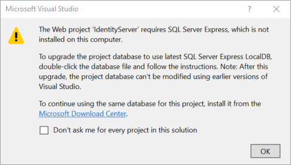 

a.  Click **OK** to continue loading the Visual Studio solution.

b.  Open the *web.config* file and scroll down to the
    *connectionStrings* section.

c.  Modify the connection string of the
    *CpimIdentityServerDbConnectionString* element to use the LocalDB
    engine" with the following change:

&lt;connectionStrings&gt;

&lt;add name="CpimIdentityServerDbConnectionString"

connectionString="Data Source=.\\SQLEXPRESS;Initial
Catalog=CpimIdentityServer;

Integrated

Security=True;MultipleActiveResultSets=True"

providerName="System.Data.SqlClient" /&gt;

&lt;/connectionStrings&gt;

> to

&lt;connectionStrings&gt;

&lt;add name="CpimIdentityServerDbConnectionString"

connectionString="Data
Source=(LocalDB)\\MSSQLLocalDB;InitialCatalog=CpimIdentityServer;

Integrated Security=True;MultipleActiveResultSets=True"

providerName="System.Data.SqlClient" /&gt;

&lt;/connectionStrings&gt;

a.  And you’re done. Save the *web.config* file.

### Modifying the configuration of the OIDC claims provider

TBD

### Building the OIDC claims provider

TBD

### Deploying the OIDC claims provider

Once successfully complied, and to eventually deploy the OIDC claims
provider, proceed with the following steps:

1.  Within Visual Studio 2015, open the **Solution Explorer** if not
    displayed.

2.  From the **Solution Explorer**, expand the **Owin IdentityServer2**
    solution.

3.  Right-click the **IdentityServer** project under **STS**, and then
    select **Publish…** A **Publish Web** dialog opens up.

Using the REST API claims provider
-----------------------------------

### Building the REST API claims provider

The REST API claims provider to use as part of our illustration
corresponds to the sample code located in the *B2CRestApi* folder in
*Starter-Pack*.

To build the REST API claims provider, proceed with the following steps:

1.  Open the solution in Visual Studio Community 2015.

<!-- -->

a.  Click **File** | **Open** | **Project/Solution**.

b.  Navigate to *B2CRestApi* folder in *Starter-Pack*.

c.  Open the Visual Studio solution file *B2CRestApi.sln*.

<!-- -->

1.  Open the **Solution Explorer** if it’s not already the case.

2.  Rebuild the Visual Studio solution. Click **Build** | **Rebuild
    Solution**.

### Deploying the REST API claims provider

Once successfully complied, and to eventually deploy the OIDC claims
provider, proceed with the following steps:

1.  Within Visual Studio 2015, open the **Solution Explorer** if not
    displayed.

2.  From the **Solution Explorer**, expand the **B2CRestApi** solution.

3.  Right-click the **B2CRestApi** project underneath, and then select
    **Publish…** A **Publish Web** dialog opens up.


1.  Click **Microsoft Azure App Service** under **Select a publish
    target**. A **App Service** dialog opens up.


1.  Select the intended subscription in **Subscription** if not listed.

2.  Click **New**. A **Create App Service** dialog opens up.

3.  Click **New** for **App Service Plan**. A **Configure App Service
    Plan** dialog opens up.

4.  Specify the information for the App Service plan to configure:

    a.  Type the name of the App Service plan in **App Service Plan**,
        for example “*369B2CAuthApi*” in our illustration.

    b.  Set the location in **Location**.

    c.  Specify the size of the plan in **Size**.

5.  Once completed, click **OK**.

6.  Click **Create** once enabled.

7.  Click **Next &gt;**.

8.  Leave the form untouched, and then click **Next &gt;** again.

9.  Select the configuration to deploy, i.e. **Release** vs. **Debug**,
    in **Configuration**, and then click **Next &gt;**.

10. Click **Publish**. Et voilà!


1.  Click **Microsoft Azure App Service** under **Select a publish
    target**. A **App Service** dialog opens up.


1.  Select the intended subscription in **Subscription** if not listed.

2.  Click **New**. A **Create App Service** dialog opens up.

3.  Click **New** for **App Service Plan**. A **Configure App Service
    Plan** dialog opens up.

4.  Specify the information for the App Service plan to configure:

    a.  Type the name of the App Service plan in **App Service Plan**,
        for example “*369B2CAuth*” in our illustration.

    b.  Set the location in **Location**.

    c.  Specify the size of the plan in **Size**.

5.  Once completed, click **OK**.

6.  Click **Create** once enabled.

7.  Click **Next &gt;**.

8.  Leave the form untouched, and then click **Next &gt;** again.

9.  Select the configuration to deploy, i.e. **Release** vs. **Debug**,
    in **Configuration**, and then click **Next &gt;**.

10. Click **Publish**. Et voilà!

  -----------------------------------------------------------------------------------------------------------------------------------------------------------------------------------------------------------------------------------------------------------------------------------------------------------------------------------------------------------------------------------------------------------------------------
  The information contained in this document represents the current view of Microsoft Corporation on the issues discussed as of the date of publication. Because Microsoft must respond to changing market conditions, it should not be interpreted to be a commitment on the part of Microsoft, and Microsoft cannot guarantee the accuracy of any information presented after the date of publication.

  This white paper is for informational purposes only. Microsoft makes no warranties, express or implied, in this document.

  Complying with all applicable copyright laws is the responsibility of the user. Without limiting the rights under copyright, no part of this document may be reproduced, stored in, or introduced into a retrieval system, or transmitted in any form or by any means (electronic, mechanical, photocopying, recording, or otherwise), or for any purpose, without the express written permission of Microsoft Corporation.

  Microsoft may have patents, patent applications, trademarks, copyrights, or other intellectual property rights covering subject matter in this document. Except as expressly provided in any written license agreement from Microsoft, the furnishing of this document does not give you any license to these patents, trademarks, copyrights, or other intellectual property.

  © 2016 Microsoft Corporation. All rights reserved.

  The example companies, organizations, products, domain names, e-mail addresses, logos, people, places, and events depicted herein are fictitious. No association with any real company, organization, product, domain name, e-mail address, logo, person, place, or event is intended or should be inferred.

  Microsoft, list Microsoft trademarks used in your white paper alphabetically are either registered trademarks or trademarks of Microsoft Corporation in the United States and/or other countries.

  The names of actual companies and products mentioned herein may be the trademarks of their respective owners.
  -----------------------------------------------------------------------------------------------------------------------------------------------------------------------------------------------------------------------------------------------------------------------------------------------------------------------------------------------------------------------------------------------------------------------------
