#Technical Reference

Microsoft Corporation
Published: July 2016
Version: 0.7 (DRAFT)

Author: Philippe Beraud (Microsoft France)
Reviewers: Kim Cameron, Brandon Murdoch, Ronny Bjones, Jose Rojas
(Microsoft Corporation)

For the latest information on Azure Active Directory, please see

http://azure.microsoft.com/en-us/services/active-directory/

Copyright© 2016 Microsoft Corporation. All rights reserved.

Abstract: Azure AD, the Identity Management as a Service (IDaaS) cloud
multi-tenant service with proven ability to handle billions of
authentications per day, extends its capabilities to manage consumer
identities with a new service for Business-to-Consumer: Azure AD B2C.

Azure AD B2C is "IDaaS for Customers and Citizens” designed with Azure
AD privacy, security, availability, and scalability for customer/citizen
Identity management (IDM). It’s a comprehensive, cloud-based, 100%
policy driven solution where declarative policies encode the identity
behaviors and experiences as well as the relationships of trust and
authority inside a Trust Framework (TF).

Whilst the Azure AD B2C Basic leverages a dedicated TF tailored by
Microsoft, i.e. the “Microsoft Basic Trust Framework” in which you can
customize policies, the Premium edition gives you full control, and thus
allows you to author and create your own Trust Framework through
declarative policies. It thus provides you with all the requirements of
an Identity “Hub”.

This document is intended for IT professionals, system architects, and
developers who are interested in understanding the advanced capabilities
Azure AD B2C Premium provides, and more particularly in this context how
to author their own Trust Framework (policies).

Table of Content

[Notice](#notice)

[Introduction](#introduction)

[Objectives of this document](#objectives-of-this-document)

[Non-objectives of this document](#non-objectives-of-this-document)

[Organization of this document](#organization-of-this-document)

[About the audience](#about-the-audience)

[Declaring a policy](#declaring-a-policy)

[Specifying the root element of policy](#specifying-the-root-element-of-policy)

[Specifying the participant contact information of a policy](#specifying-the-participant-contact-information-of-a-policy)

[Specifying the document references of a policy](#specifying-the-document-references-of-a-policy)

[Understanding the technical components of a policy](#understanding-the-technical-components-of-a-policy)

[Specifying a base policy](#specifying-a-base-policy)

[Specifying the building blocks](#specifying-the-building-blocks)

[Specifying the claims listing](#specifying-the-claims-listing)

[Specifying the claims transformation](#specifying-the-claims-transformation)

[Specifying the client definitions](#specifying-the-client-definitions)

[Specifying the content definitions](#specifying-the-content-definitions)

[Specifying the supported locales](#specifying-the-supported-locales)

[Specifying the claims providers](#specifying-the-claims-providers)

[Specifying technical profile(s) for a given claims provider](#specifying-technical-profiles-for-a-given-claims-provider)

[Specifying a technical profile for an Azure AD claims provider](#specifying-a-technical-profile-for-an-azure-ad-claims-provider)

[Specifying a technical profile for a SAML 2.0 claims provider](#specifying-a-technical-profile-for-a-saml-2.0-claims-provider)

[Specifying a technical profile for a WS-Fed claims provider](#specifying-a-technical-profile-for-a-ws-fed-claims-provider)

[Specifying a technical profile for a WS-Trust claims provider](#specifying-a-technical-profile-for-a-ws-trust-claims-provider)

[Specifying a technical profile for an OAuth 1.0 claims provider](#specifying-a-technical-profile-for-an-oauth-1.0-claims-provider)

[Specifying a technical profile for an OAuth 2.0 claims provider](#specifying-a-technical-profile-for-an-oauth-2.0-claims-provider)

[Specifying a technical profile for an OpenID Connect claims provider](#specifying-a-technical-profile-for-an-openid-connect-claims-provider)

[Specifying a technical profile for a self-asserted claims provider](#specifying-a-technical-profile-for-a-self-asserted-claims-provider)

[Specifying a technical profile for a RESTful claims provider](#specifying-a-technical-profile-for-a-restful-claims-provider)

[Specifying a technical profile for session management](#specifying-a-technical-profile-for-session-management)

[Specifying the token issuers](#specifying-the-token-issuers)

[Using a remote token issuer service](#using-a-remote-token-issuer-service)

[Specifying a technical profile for a SAML 2.0 token issuer](#specifying-a-technical-profile-for-a-saml-2.0-token-issuer)

[Specifying a technical profile for a WS-Fed token issuer](#specifying-a-technical-profile-for-a-ws-fed-token-issuer)

[Specifying a technical profile for a JWT token issuer](#specifying-a-technical-profile-for-a-jwt-token-issuer)

[Specifying the user journeys](#specifying-the-user-journeys)

[Providing property information for a given user journey](#providing-property-information-for-a-given-user-journey)

[Specifying the orchestration steps for a given user journey](#specifying-the-orchestration-steps-for-a-given-user-journey)

[Specifying the relying party](#specifying-the-relying-party)

[Appendix A. Trust Framework Policy XML schema and tools](#appendix-a.-trust-framework-policy-xml-schema-and-tools)

[Trust Framework Policy XML Schema](#trust-framework-policy-xml-schema)

[Generating .NET Classes for serialization/deserialization purposes](#generating-.net-classes-for-serializationdeserialization-purposes)

[Installing XML tooling for editing the policy XML files](#installing-xml-tooling-for-editing-the-policy-xml-files)

Notice
======

This document illustrates new capabilities of
Azure AD through the just made available public preview of the Azure AD
B2C service. This public preview may be substantially modified before
GA.

**This document will be updated to reflect the changes introduced at GA
time.**

**This document reflects current views and assumptions as of the date of
development and is subject to change.  Actual and future results and
trends may differ materially from any forward-looking statements. 
Microsoft assumes no responsibility for errors or omissions in the
materials.  **

**THIS DOCUMENT IS FOR INFORMATIONAL AND TRAINING PURPOSES ONLY AND IS
PROVIDED "AS IS" WITHOUT WARRANTY OF ANY KIND, WHETHER EXPRESS OR
IMPLIED, INCLUDING BUT NOT LIMITED TO THE IMPLIED WARRANTIES OF
MERCHANTABILITY, FITNESS FOR A PARTICULAR PURPOSE, AND
NON-INFRINGEMENT.**

Introduction
=============

Azure AD B2C is a cloud identity service for your consumer-facing web
and mobile applications. Azure AD B2C is designed to solve the identity
management challenges that have emerged, as economic and competitive
pressures drive commercial enterprises, educational institutions, and
government agencies to shift their service delivery channels from
face-to-face engagements to online web and mobile applications.

Based on standardized protocols, Azure AD B2C is "IDaaS for Customers
and Citizens” designed with Azure AD privacy, security, availability,
and scalability for customer/citizen Identity management (IDM). The
“secret sauce” of Azure AD B2C to achieve the above objectives resides
in the 100% policy driven identity experience engine that consume fit to
purpose declarative policies.

Many of the most frequently used identity use cases can be addresses
using the B2C extension in the Azure portal as the developer control
surface. However, there some advanced features only available by writing
custom user journeys which must be configured directly into policy XML
files and uploaded to the B2C tenant. Access to this incremental feature
set is available via the Premium edition of Azure AD B2C.

**Note** For a basic level of proficiency with the policy configuration
available directly in the B2C Admin portal, see the introduction video
[Business-to-Consumer Identity
Management with Azure Active
Directory B2C](https://channel9.msdn.com/Events/Build/2016/P423)
where all the relevant B2C Admin **portal** settings are.

Azure AD B2C Premium indeed allows you to author and create your own
(Trust Framework) policies from scratch if you want to for your user
journeys. You’re completely in control of the set of policies and no
longer restricted to the customization of policies within the “Microsoft
Basic Trust Framework” for the policies that are defined form the portal
UI. The intention is to create a flexible model for a policy definition
to support a wide variety in the operational complexity and governance
rigor of the policy that is to be enforced for your more advanced user
journeys.

The policy XML files can define and configure:

-   The document reference(s) defining the federated identity ecosystem
    of the community that relates to them.

-   The (predefined) operational “runtime” rules, a.k.a. the user
    journeys that automate and/or control the exchange and usage of the
    claims.

-   The identity and attribute providers, a.k.a. the *claims* providers,
    and the technical profiles they support along with the (out-of-band)
    LOA/LOP accreditation that relates to these providers.

-   The integration with attribute verifiers, a.k.a. the *claims*
    providers.

-   The relying parties in the community (by inference).

-   The metadata for establishing network communications between
    participants. These metadata along with the technical profiles will
    be used in the course of a transaction to plumb “on the wire”
    interoperability between the relying party and other community
    participants.

-   The protocol conversion if any (SAML 2.0, WS-Fed, WS-Trust, OAuth2,
    and OpenID Connect).

-   The authentication requirements.

-   The multifactor orchestration if any.

-   A shared schema for all the claims available and mappings to
    participants of a community of interest.

-   All the *claims* transformations - along with the possible data
    minimization in this context - to sustain the exchange and usage of
    the claims.

-   The blinding and encryption.

-   The claims storage.

-   Etc.

These policies constitute the machine readable portion of the TF
construct in Azure AD B2C Premium with all the operational details
(claims providers’ metadata and technical profiles, claims schema
definition, claims transformation functions, and user journeys, etc.)
filled in (for a specific community of interest) to facilitate
operational orchestration and automation by the Azure AD B2C Premium
identity experience engine. Policies should be considered as a
domain-specific language (DSL), i.e. “a computer language specialized to
a particular application domain” with inheritance, “if” statements,
polymorphism.

They are assumed to be “living documents” in Azure AD B2C Premium since
there is more than a chance that their contents will change over time
with respect to the active participants declared in the policies, and
also potentially in some situations to the terms and conditions for
being a participant (in a community of interested).

To offer such a flexibility and appropriately deal with the complexity
this implies, the retained approach in Azure AD B2C Premium
unsurprisingly consists in leveraging the XML capabilities along with
the advanced tooling available in this space for defining and consuming
from a computing standpoint and thus for processing purposes a specific
policy.

Objectives of this document
---------------------------

A specific policy will be defined in a policy XML file. As such, a
policy XML file allow to define all the policy details along with the
metadata to enforce on the transactions that will take place between the
relying parties that subscribe to the policy and the claims providers.

Available as part of the “Starter Pack”, a well-defined XML schema
allows (see section § *Appendix A. Trust Framework Policy XML schema and
tools*) allows to model such a flexible policy XML file to fully author
a specific policy. Any policy XML file MUST respect this XML schema
definition.

> **Note** For information on the “Starter Pack” and how to get started
> with, see the second of this series of document.

**This sixth part aims at helping you achieve a better understanding of
the Trust Framework (TF) policies, the XML schema that sustains them,
and thus enable you to modify the policy XML file(s) (based the “Starter
Pack”) to achieve certain business goals and your advanced identity use
cases that come along with. **

**It is intended as a reference document for describing how a TF policy
is logically structured in accordance to the above XML schema.**

Non-objectives of this document
-------------------------------

This series of
documents is not intended as an overview document for the Azure AD
offerings but rather focusses on this new Azure AD B2C identity service,
and more specifically on the premium edition.

> **Note** For additional information, see the Microsoft MSDN article
> [Getting started with Azure
> AD](http://msdn.microsoft.com/en-us/library/dn655157.aspx).
> As well as the whitepapers [Active Directory from the
> on-premises to the
> cloud](ttp://www.microsoft.com/en-us/download/details.aspx?id=36391)
> and [An overview of Azure
> AD](ttp://www.microsoft.com/en-us/download/details.aspx?id=36391)
> as part of the same series of documents.

Organization of this document
-----------------------------

To cover the aforementioned objectives, this document of the series is
organized in the following eight sections:

-   Declaring a policy.

-   Understanding the technical
    > components of a policy.

-   Specifying a base
    > policy.

-   Specifying the building
    > blocks.

-   Specifying the claims
    > providers.

-   Specifying token
    > issuers.

-   Specifying the user
    > journeys.

-   Specifying the relying
    > party.

These sections provide the information details necessary to successfully
build your own policies based on the already available features as per
the currently available public preview.

About the audience
------------------

This document is intended for IT professionals, system architects, and
developers who are interested in understanding how to author their own
policies.

Declaring a policy
==================

Specifying the root element of policy
-------------------------------------

A specific policy is defined within the top level *TrustFrameworkPolicy*
XML element of a policy XML file.

The *TrustFrameworkPolicy* XML element contains the following
attributes:

  ----------------------------------------------------------------------------------------------------------------------------------------------------------------------------------------
  Attribute                       Required   Description
  ------------------------------- ---------- ---------------------------------------------------------------------------------------------------------------------------------------------
  *PolicySchemaVersion*           True       Determine the schema version published by Microsoft using which this policy is to be executed. As of this writing, this must be “*0.3.0.0*”

                                             Type: String

  *TenantId*                      True       Specify the unique identifier of the B2C tenant to which this policy belongs.

                                             Type: String

  *TenantObjectId*                False      Specify the unique identifier of the object ID of the Azure tenant.

                                             Type: String

  *PolicyId*                      True       Specify the unique identifier for the policy. This identifier must be prefixed by “B2C\_1A\_”

                                             Type: String

  *PublicPolicyUri*               True       Specify the URI for the policy which is an appropriate name of the policy outside of the Azure AD B2C Premium system.

                                             Type: String

  *DeploymentMode*                False      Indicate the mode when uploading the policy XML file in a B2C tenant.

                                             Type: String

                                             Value: one of the following values as per *DeploymentModeType* enumeration in the Azure AD B2C Premium XML schema:

                                             -   **Development**.

                                             -   **Production**. (default)

                                             -   **Debugging**.

  *UserJourneyRecorderEndpoint*   False      Specify the Url of a service able to receive http posts documenting user journey progress.

                                             Type: String

                                             Value: Url in the format http://{host}?stream={guid} (where the braces are omitted)
  ----------------------------------------------------------------------------------------------------------------------------------------------------------------------------------------

The following XML snippet illustrates how to specify this top level
*TrustFrameworkPolicy* XML element:

&lt;?xml version="1.0" encoding="utf-8"?&gt;

&lt;TrustFrameworkPolicy
xmlns:xsi="http://www.w3.org/2001/XMLSchema-instance"

xmlns:xsd="http://www.w3.org/2001/XMLSchema"

xmlns="http://schemas.microsoft.com/online/cpim/schemas/2013/06"

PolicySchemaVersion="0.3.0.0"

TenantId="contoso369b2c.onmicrosoft.com"

PolicyId="B2C\_1A\_SignUp"

PublicPolicyUri="http://contoso369b2c.onmicrosoft.com"&gt;

…

&lt;/TrustFrameworkPolicy&gt;

This top level XML element allows in turn to specify the policy itself
with possibly the participant contact information, the document
references, as well as of course the technical components that
constitute the policy.

These topics are covered hereafter in a dedicated section.

Specifying the participant contact information of a policy
----------------------------------------------------------

Participants in a community regulated by a policy are defined in terms
of the roles they play. These are typically the operational roles for
conducting online transactions: identity provider, attribute provider,
attribute verifier, and federation operator.

These are the governance roles which are typically performed through
offline processes: trust framework provider (TFP) that authors the trust
framework policy, assessor, auditor, dispute resolution arbitrator, and
special assessor.

These approved participants should be identified in the policy, along
with the role(s) they perform and their contact information.
Explanations of the meanings of these roles and the qualifications for
performing them are not published in the policy. This information is
available in the documentation referenced by the policy (see next
section below).

To specify the list of contacts who can be communicated with for
notifications and issues regarding the policy, a *Contacts* XML element
should be declared under the top-level XML element of the policy XML
file. This element is optional.

This element contains the following XML element:

  XML element   Occurrences   Description
  ------------- ------------- --------------------------------------------
  *Contact*     0:n           Provide a participant contact information.

The *Contact* XML element contains in turn the following attribute:

  Attribute   Required   Description
  ----------- ---------- --------------------------------------------------------------------------------------------------------
  *Id*        True       Specify a machine understandable identifier that is used to uniquely identify this particular contact.

Along with the following XML elements:

  -------------------------------------------------------------------------------------------------------------------------------------
  XML element         Occurrences   Description
  ------------------- ------------- ---------------------------------------------------------------------------------------------------
  *DisplayName*       1:1           Specify the name of the contact for a given participant in the community of interest.

                                    Type: String

  *TelephoneNumber*   1:1           Specify the telephone number of the contact for a given participant in the community of interest.

                                    Type: String

  *Email*             1:1           Specify the email address of the contact for a given participant in the community of interest.

                                    Type: String

  *Role*              1:1           Specify the role of the contact for a given participant in the community of interest.

                                    Type: String
  -------------------------------------------------------------------------------------------------------------------------------------

Each *DocumentReference* XML element contains a required *Id* attribute.
This attribute enables to specify a machine understandable identifier
that is used to uniquely identify this particular Contact for a given
participant in the community of interest.

The following XML snippet illustrates how to specify participant contact
information:

&lt;?xml version="1.0" encoding="utf-8"?&gt;

&lt;TrustFrameworkPolicy
xmlns:xsi="http://www.w3.org/2001/XMLSchema-instance"

xmlns:xsd="http://www.w3.org/2001/XMLSchema"

xmlns="http://schemas.microsoft.com/online/cpim/schemas/2013/06"

PolicySchemaVersion="0.3.0.0"

…&gt;

…

&lt;!-- A list of all the contacts who can be communicated with for
notifications and issues regarding this policy --&gt;

&lt;Contacts&gt;

&lt;Contact id="1"&gt;

&lt;DisplayName&gt;Contoso369 Customer Support&lt;/Name&gt;

&lt;TelephoneNumber&gt;+14258828080&lt;/TelephoneNumber&gt;

&lt;Email&gt;johndoe@contoso369.com&lt;/Email&gt;

&lt;Role&gt;Administrator&lt;/Role&gt;

&lt;/Contact&gt;

&lt;/Contacts&gt;

…

&lt;/TrustFrameworkPolicy&gt;

Specifying the document references of a policy
----------------------------------------------

The policy may be defined through various documents that need to be
reviewed and understood by human beings. Certain documents, such as
terms of use or privacy policy, may be made available to the relying
parties or even the users before they sign up to the use one of the
services provided by Azure AD B2C Premium.

The relying parties (RPs) may use these documents to determine whether
the policy is appropriate for the purposes it intends to use it for. The
users may view these documents to look at the parameters within which
RPs and the policy will operate and determine whether they want to
participate or not. These documents constitute the human readable
portion of the policy construct in Azure AD B2C Premium. The policy XML
file supports link(s) to that documentation if any. The URL(s) enable
hosting the policy’s documentation anywhere. Moreover, the policy’s
documentation could be in any suitable format that can meet the UI
formatting and localization requirements.

To provide a list of URLs to the policy’s documentation, a
*DocumentReferences* XML element should be added under the top-level XML
element of the policy XML file. This element is optional.

This element contains the following XML element:

  XML element           Occurrences   Description
  --------------------- ------------- ---------------------------------------------------
  *DocumentReference*   0:n           Provide a reference to a document for the policy.

Each *DocumentReference* XML element contains in turn the following
attribute:

  Attribute   Required   Description
  ----------- ---------- ----------------------------------------------------------------------------------------------------------------------------------------------------------------
  *Id*        True       Specify a machine understandable identifier that is used to uniquely identify this particular document reference as part of the policy’s documentation if any.

This element also contains the following XML element:

  XML element           Occurrences   Description
  --------------------- ------------- ----------------------------------------------------------------------------------------
  *DocumentReference*   0:n           Provide a reference to a content part of the documentation that relates to the policy.

The *DocumentReference* XML element contains in turn the following XML
elements:

  ------------------------------------------------------------------------------------------------------------------------------------------------------------------------------------------------------------------------------
  XML element     Occurrences   Description
  --------------- ------------- ------------------------------------------------------------------------------------------------------------------------------------------------------------------------------------------------
  *DisplayName*   1:1           Specify the display name of the document that is part of the policy’s documentation.

  *Url*           1:1           Specify the Url where the document is located.

                                Due to formatting and localization concerns Azure AD B2C Premium has to deal with, this enables representing the actual content in a more suitable medium, such as an HTML page or a document.

                                Type: String.
  ------------------------------------------------------------------------------------------------------------------------------------------------------------------------------------------------------------------------------

The following XML snippet illustrates how to provide document
reference(s) to the Trust Framework policy:

&lt;?xml version="1.0" encoding="utf-8"?&gt;

&lt;TrustFrameworkPolicy
xmlns:xsi="http://www.w3.org/2001/XMLSchema-instance"

xmlns:xsd="http://www.w3.org/2001/XMLSchema"

xmlns="http://schemas.microsoft.com/online/cpim/schemas/2013/06"

PolicySchemaVersion="0.3.0.0"

…&gt;

…

&lt;!-- Documents that are disclosed to the users. --&gt;

&lt;DocumentReferences&gt;

&lt;DocumentReference id="TermOfUser"&gt;

&lt;Name&gt;Terms of Use&lt;/Name&gt;

&lt;Url&gt;http://www.contoso269.com/policy/b2Ctou.html&lt;/Url&gt;

&lt;/DocumentReference&gt;

&lt;DocumentReference id="PrivacyTerms"&gt;

&lt;Name&gt;Privacy Terms&lt;/Name&gt;

&lt;Url&gt;http://www.contoso269.com/policy/b2cprivacyterms.html&lt;/Url&gt;

&lt;/DocumentReference&gt;

&lt;/DocumentReferences&gt;

…

&lt;/TrustFrameworkPolicy&gt;

Before digging into more details regarding the policy, let’s discuss for
the moment the main technical components that serve to define such a
policy.

Understanding the technical components of a policy
==================================================

As further depicted in this section, and beyond specific metadata that
defines contacts’ information along with document references for the
policy as covered so far, a policy XML file truly constitutes the
machine readable portion of a policy with all the operational details:

-   The base policy the considered policy inherits from. Remember that a
    > TF in Azure AD B2C Premium is a set of policies.

-   The building blocks with the claims definitions, the supported
    > claims transformation functions, and other definitions.

-   The claims providers with their supported technical profiles and
    > related metadata that may be used in the various user journeys.

-   The user journeys through which a user is taken to retrieve the
    > claims that are to be presented to the relying party.

-   And the relying party.

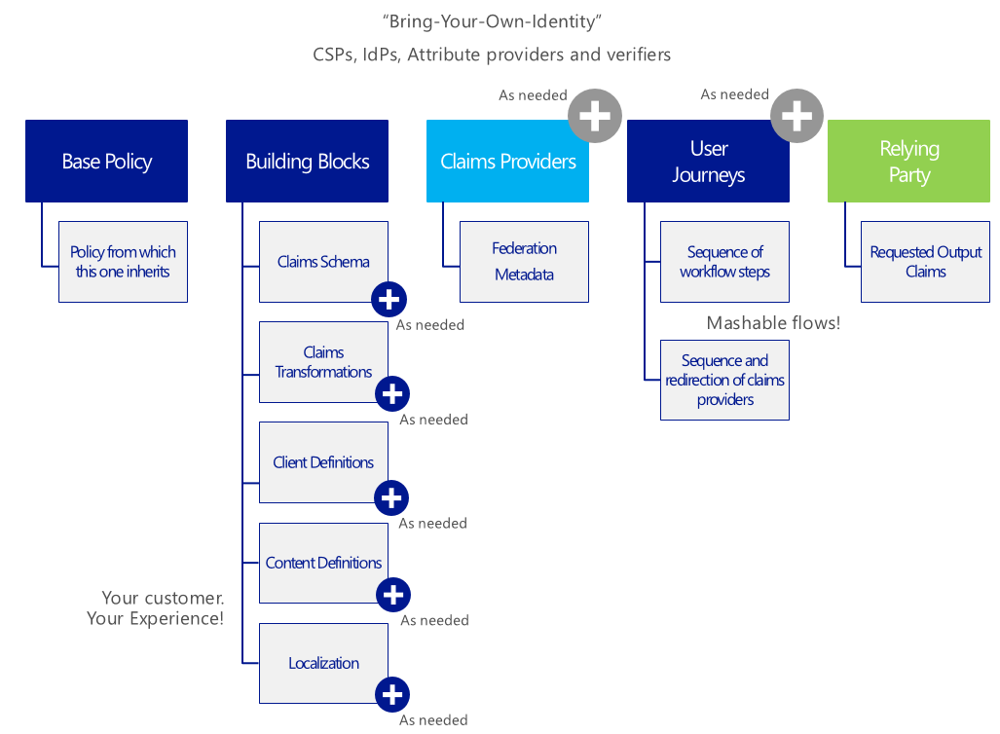

For example, all claims must correspond to one of the above claim schema
definitions and all claims providers that participate in various user
journeys must appear in the policy XML file. The user journeys bind the
claims to the claims provider whenever a claims provider is called.

**The following sections depict how to the above operational details.**

Specifying a base policy
========================

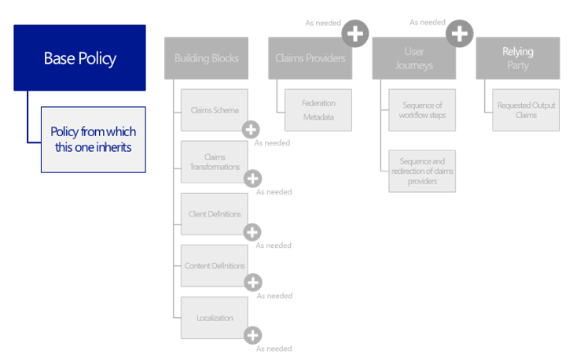

If the considered policy derives from a base policy in accordance to the
supported inheritance model (see below), a *BasePolicy* XML element must
then be declared under the above top-level *TrustFrameworkPolicy* XML
element of the policy XML file.

The inheritance model as implemented by Azure AD B2C Premium is as
follows:

-   The parent policy and child policy are of the same schema and
    flexibility.

-   Child policy can inherit the parent policy functionality and
    ‘*extend it*’.

-   Adding a new element effectively extends the parent policy.

-   There is NO limit on the number of levels.

And, in terms of override:

-   The child policy can override ‘allowed’ aspects of the parent
    policy.

-   Same element in the child policy and parent policy implies, child
    policy is overriding that element of the parent policy.

Policies and counterpart policy XML files are designed to enable
defining such policies, that various applications could use and thereby
be compliant.

Consequently, this *BasePolicy* XML element is a reference to the base
policy from which this policy is derived, or if you prefer under which
the current policy is operational. The reference can be across B2C
tenants.

This element is optional. This element contains the following XML
elements:

  --------------------------------------------------------------------------------------------------------------------------------------------------------------------------------
  XML element   Occurrences   Description
  ------------- ------------- ----------------------------------------------------------------------------------------------------------------------------------------------------
  *TenantId*    1:1           Specify the identifier of the B2C tenant that published the base policy. The base policy is looked up inside the directory tenant specified here.

                              Type: String

  *PolicyId*    1:1           Specify the identifier of the base policy. The policy is looked up using this identifier within the B2C tenant specified by the above XML element.

                              Type: String
  --------------------------------------------------------------------------------------------------------------------------------------------------------------------------------

The following XML snippet illustrates how to specify a base policy from
which this policy is derived:

&lt;?xml version="1.0" encoding="utf-8"?&gt;

&lt;TrustFrameworkPolicy
xmlns:xsi="http://www.w3.org/2001/XMLSchema-instance"

xmlns:xsd="http://www.w3.org/2001/XMLSchema"

xmlns="http://schemas.microsoft.com/online/cpim/schemas/2013/06"

PolicySchemaVersion="0.3.0.0"

…&gt;

…

&lt;BasePolicy&gt;

&lt;TenantId&gt;contoso369b2c.onmicrosoft.com&lt;/TenantId&gt;

&lt;PolicyId&gt;B2C\_1A\_base-v2&lt;/PolicyId&gt;

&lt;/BasePolicy&gt;

…

&lt;/TrustFrameworkPolicy&gt;

Specifying the building blocks
==============================

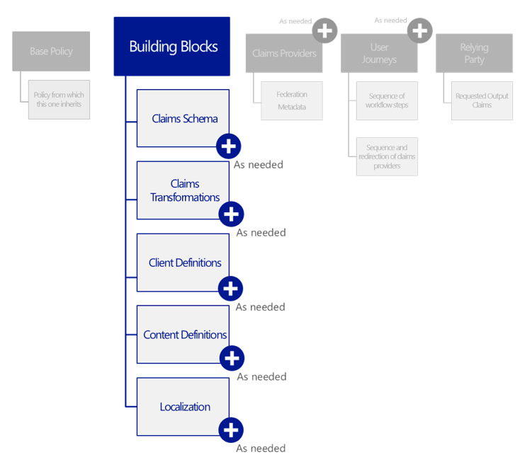

User journeys may rely on various definitions. To provide all the
definitions that are used by the user journeys, a *BuildingBlocks* XML
element should be added under the top-level *TrustFrameworkPolicy* XML
element of the policy XML file. The element consists of the claims
schema, the claims transformations, the client definitions, the content
definitions, and the localization support that are used elsewhere in the
policy XML file.

This element is optional.

This element contains the following XML elements that define specific
sections:

  XML element               Occurrences   Description
  ------------------------- ------------- --------------------------------------------------------------------------------------------------------------
  *ClaimsSchema*            0:1           Provide all the claim types that can be referenced as part of the policy.
  *ClaimsTransformations*   0:1           Contain a list of claims transformations that can be used in the user journeys as part of the policy.
  *ClientDefinitions*       0:1           Specify various properties specific to the end-user device for which the policy is being executed.
  *ContentDefinitions*      0:1           Contain URLs to external content, for example, URLs to pages used in claims providers as part of the policy.
  *Localization*            0:1           Define the supported cultures and contains strings and collections in those cultures

The following XML snippet illustrates how to declare this
*BuildingBlocks* XML element:

&lt;?xml version="1.0" encoding="utf-8"?&gt;

&lt;TrustFrameworkPolicy
xmlns:xsi="http://www.w3.org/2001/XMLSchema-instance"

xmlns:xsd="http://www.w3.org/2001/XMLSchema"

xmlns="http://schemas.microsoft.com/online/cpim/schemas/2013/06"

PolicySchemaVersion="0.3.0.0"

…&gt;

…

&lt;BuildingBlocks&gt;

&lt;ClaimsSchema&gt;

…

&lt;/ClaimsSchema&gt;

&lt;ClaimsTransformations&gt;

…

&lt;/ClaiClaimsTransformations&gt;

&lt;ClientDefinitions&gt;

…

&lt;/ClientDefinitions&gt;

&lt;ContentDefinitions&gt;

…

&lt;/ContentDefinitions&gt;

&lt;Localization&gt;

…

&lt;/Localization&gt;

&lt;/BuildingBlocks&gt;

…

&lt;/TrustFrameworkPolicy&gt;

The next sections depict each type of definitions: claims, claims
transformations, client definitions, content definitions, and
localization.

Specifying the claims listing
-----------------------------

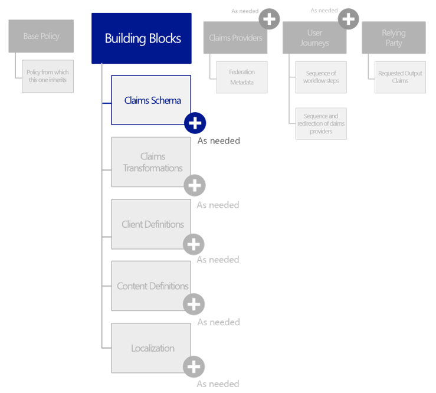

The purpose of the claims listing (a.k.a. claims schema) in the policy
aims at defining all the claim types that

that are dealt with in the policy XML file, and thus that can be
referenced from other XML elements of the policy XML file to. These are
referenced (see *ClaimTypeReferenceId* XML attribute) from other places
in the policy XML file such as technical profile’s input/output claim’s
as well as claims transformations.

To specify the list of supported claims for the policy, a *ClaimsSchema*
XML element must be declared under the *BuildingBlocks* section of the
policy XML file. This element is optional.

This element contains the following XML element:

  XML element   Occurrences   Description
  ------------- ------------- -----------------------------------------------------------------------------------------------------------------------------------------------------------------------------------
  *ClaimType*   1:n           Provide a valid single claim type definition that can be used within the community of interested, and thus that can be referenced from other XML elements of the policy XML file.

The *ClaimType* XML element contains the following attribute:

  ----------------------------------------------------------------------------------------------------------------------------------------------------------------------------------------------------------------------------------------------------------------------------------------------------------------
  Attribute         Required   Description
  ----------------- ---------- -----------------------------------------------------------------------------------------------------------------------------------------------------------------------------------------------------------------------------------------------------------------------------------
  *Id*              True       Specify a machine understandable identifier that is used to uniquely identify this particular claim type, and reference it from other XML elements in the policy XML file.

  *StatementType*   False      Specify the type of statement the claim type represents. This type may be used by claims transformations and may thus participate in comparison or arithmetic operations. Associating an appropriate type ensures that these operations are performed correctly by the transforms

                               Value: one of the following values as per *StatementType* enumeration in the Azure AD B2C Premium XML schema;

                               -   **Attribute**. Default value if not specified.

                               -   **Authentication**.

                               -   **Subject**.

  ----------------------------------------------------------------------------------------------------------------------------------------------------------------------------------------------------------------------------------------------------------------------------------------------------------------

and the following XML elements.

  ------------------------------------------------------------------------------------------------------------------------------------------------------------------------------------------------------------------------------------------------------------------------------------------------------------------------------
  XML element                  Occurrences   Description
  ---------------------------- ------------- -----------------------------------------------------------------------------------------------------------------------------------------------------------------------------------------------------------------------------------------------------------------------------------
  *DisplayName*                0:1           Specify the human understandable name of the claim type that is displayed to the users on various screens.

                                             Type: String

  *DataType*                   0:1           Specify the type of data stored in the claim type. This type may be used by claims transformations and may thus participate in comparison or arithmetic operations. Associating an appropriate type ensures that these operations are performed correctly by the transformations.

                                             Value: one the following supported data types as per *DataType* enumeration in the Azure AD B2C Premium XML schema. These types are a subset of the types specified by [W3C XML Schema documentation](http://www.w3.org/TR/xmlschema-2/):

                                             -   **boolean**. Any Boolean value (“true”, ”false”,1, or 0).

                                             -   **date.** Any valid date value, which consists of top-open intervals of exactly one day in length on the timelines of dateTime.

                                             -   **dateTime**. Any valid date and/or time value.

                                             -   **duration**. Any valid duration of time value.

                                             -   **int**. Any integer value.

                                             -   **string**. Any alphanumeric string value.

                                             -   **stringCollection**. Any collection of alphanumeric string value.

                                             Type: String (enumeration)

  *DefaultPartnerClaimTypes*   0:n           Enable to specify the partner claim types to use for a specified protocol if a partner claim type is not provided in a claim mapping.

                                             Type: complex type

  *Mask*                       0:1           Specify an optional string of masking characters that can be applied to the claim when displaying the claim for example the phone number 324-232-4343 masked as XXX-XXX-4343

                                             Type: String

  *AdminHelpText*              0:1           Specify a description of the claim type that can be helpful for the administrators to understand the purpose and/or usage of the claim type.

                                             Due to formatting and localization concerns Azure AD B2C Premium has to deal with, this is a link to the actual content. This enables representing the actual content in a more suitable medium, such as an HTML page or a document

                                             Type: String

  *UserHelpText*               0:1           Specify a description of the claim type that can be helpful for the end users to understand the purpose and/or usage of the claim type.

                                             Due to formatting and localization concerns Azure AD B2C Premium has to deal with, this is a link to the actual content. This enables representing the actual content in a more suitable medium, such as an HTML page or a document

                                             Type: String

  *UserInputType*              0:1           Specify the type of input control that should be available to the end user when manually entering claim data for this claim type.

                                             Type: String (enumeration)

                                             Value: one of the following supported type of input controls as per *UserInputType* enumeration in the Azure AD B2C Premium XML schema:

                                             -   **TextBox**.

                                             -   **DateTimeDropdown. **

                                             -   **RadioSingleSelectduration**.

                                             -   **DropdownSingleSelect**.

                                             -   **CheckboxMultiSelect**.

                                             -   **Password**.

                                             -   **Readonly**.

                                             -   **Button**.

  *Restriction*                0:1           Provide The value restrictions for this claim, such as a regular expression (Regex) or a list of acceptable values.

                                             Type: complex type
  ------------------------------------------------------------------------------------------------------------------------------------------------------------------------------------------------------------------------------------------------------------------------------------------------------------------------------

The *DefaultPartnerClaimTypes* XML may contain the following XML
element:

  XML element   Occurrences   Description
  ------------- ------------- --------------------------------------------------------------------------------------------
  *Protocol*    0:n           Specify a technical profile that is allowed to be used against a claims provider selection

Each *Protocol* XML element of the above *DefaultPartnerClaimTypes*
section contains in turn the following attributes:

  --------------------------------------------------------------------------------------------------------------------------------------------------------------------------------------------------------------------------
  Attribute            Required   Description
  -------------------- ---------- ------------------------------------------------------------------------------------------------------------------------------------------------------------------------------------------
  *Name*               True       Specify the name of a valid protocol supported by Azure AD B2C Premium. This name is one of the following list as per *ProtocolName* enumeration in the Azure AD B2C Premium XML schema:

                                  -   **None**.

                                  -   **OAuth1**. OAuth 1.0 protocol standard as per IETF specification.

                                  -   **OAuth2**. OAuth 2.0 protocol standard as per IETF specification.

                                  -   **SAML2**. SAML 2.0 protocol standard as per OASIS specification.

                                  -   **OpenIdConnect**. OpenID Connect 1.0 protocol standard as per OpenID foundation specification.

                                  -   **WsFed**. WS-Federation protocol standard as per OASIS specification.

                                  -   **WsTrust**. WS-Trust protocol standard as per OASIS specification.

                                  -   **Proprietary**.

                                  References for the above specifications are provided late in this document.

  *PartnerClaimType*   True       Specify the claim type to use in this case
  --------------------------------------------------------------------------------------------------------------------------------------------------------------------------------------------------------------------------

The *Mask* XML element in the above table contains the following
attributes:

  ---------------------------------------------------------------------------------------------------------------------------------------------------------------------------------------
  Attribute   Required   Description
  ----------- ---------- ----------------------------------------------------------------------------------------------------------------------------------------------------------------
  *Type*      True       Specify the type of the claim mask. This attribute takes one of the following values as per *MaskTypeTYPE* enumeration in the Azure AD B2C Premium XML schema:

                         -   **Simple**. A simple text mask that is applied to the leading portion of a string claim.

                         -   **Regex**. A regular expression that can be applied to the string claim as whole.

                         If the latter value is specified, an optional eponym attribute must also be filled with the regular expression to use (see below).

  *Regex*     False      If *Type* is set to **Regex**, specify the regular expression to use
  ---------------------------------------------------------------------------------------------------------------------------------------------------------------------------------------

The optional *Restriction* XML element of the above *ClaimType* section
contains in turn one of the following attribute:

  -----------------------------------------------------------------------------------------------------------------------------------------------------------------------------------------------------------------------------------------------------------------------------------------------
  Attribute         Required   Description
  ----------------- ---------- ------------------------------------------------------------------------------------------------------------------------------------------------------------------------------------------------------------------------------------------------------------------
  *MergeBehavior*   False      Specify how the enumeration values will be merged together with any *ClaimType* present in a parent policy with the same identifier. This attribute takes one of the following values as per *MergeBehavior* enumeration in the Azure AD B2C Premium XML schema:

                               -   **Append**. Specify that the collection of data present should be appended to the end of the collection specified in the parent policy.

                               -   **Prepend**. Specify that the collection of data present should be added before the collection specified in the parent policy.

                               -   **ReplaceAll**. Specify that the collection of data specified in the parent policy should be ignored, using instead the data specified in the current policy.

  -----------------------------------------------------------------------------------------------------------------------------------------------------------------------------------------------------------------------------------------------------------------------------------------------

Along with the following XML elements:

  XML element     Occurrences   Description
  --------------- ------------- ---------------------------------------------------------------------------------------------------------
  *Enumeration*   1:n           Define an available option for the user to select for a claim in the UI, such as a value in a dropdown.
  *Pattern*       1:1           Specify the regular expression to use.

The *Enumeration* XML element contains in turn one of the following
attributes:

  -------------------------------------------------------------------------------------------------------------------------------------
  Attribute           Required   Description
  ------------------- ---------- ------------------------------------------------------------------------------------------------------
  *Text*              True       Specify the user-friendly display string that should be shown to the user in the UI for this option.

                                 Value: String

  *Value*             True       Specify the claim value associated with selecting this option.

                                 Value: String

  *SelectByDefault*   False      Indicating whether or not this option should be selected by default in the UI.

                                 Value: Boolean
  -------------------------------------------------------------------------------------------------------------------------------------

The *Pattern* XML element contains in turn one of the following
attributes:

  Attribute             Required   Description
  --------------------- ---------- ------------------------------------------------------------------------------------------
  *RegularExpression*   True       Specify the regular expression that claims of this type must match in order to be valid.
  *HelpText*            False      Describe the pattern/regular expression for this claim to the user.

The following XML snippet illustrates how to specify claim types based
on the above definitions:

&lt;?xml version="1.0" encoding="utf-8"?&gt;

&lt;TrustFrameworkPolicy
xmlns:xsi="http://www.w3.org/2001/XMLSchema-instance"

xmlns:xsd="http://www.w3.org/2001/XMLSchema"

xmlns="http://schemas.microsoft.com/online/cpim/schemas/2013/06"

PolicySchemaVersion="0.3.0.0"

…&gt;

…

&lt;BuildingBlocks&gt;

…

&lt;ClaimSchemas&gt;

…

&lt;ClaimType Id="phoneNumber"&gt;

&lt;DisplayName&gt;Office Phone&lt;/DisplayName&gt;

&lt;DataType&gt;string&lt;/DataType&gt;

&lt;Mask Type="Simple"&gt;XXX-XXX-&lt;/Mask&gt;

&lt;AdminHelpText&gt;User's telephone number&lt;/AdminHelpText&gt;

&lt;UserHelpText&gt;Your telephone number&lt;/UserHelpText&gt;

&lt;/ClaimType&gt;

…

&lt;ClaimType Id="email"&gt;

&lt;DisplayName&gt;Email address&lt;/DisplayName&gt;

&lt;DataType&gt;string&lt;/DataType&gt;

&lt;DefaultPartnerClaimTypes&gt;

&lt;Protocol Name="OpenIdConnect" PartnerClaimType="email" /&gt;

&lt;/DefaultPartnerClaimTypes&gt;

&lt;AdminHelpText/&gt;

&lt;UserHelpText&gt;Email address that can be used to contact
you.&lt;/UserHelpText&gt;

&lt;UserInputType&gt;TextBox&lt;/UserInputType&gt;

&lt;Restriction&gt;

&lt;Pattern
RegularExpression="\^\[a-zA-Z0-9.!\#\$%&amp;&\#8217;\*+/=?\^\_\`{|}\~-\]+@\[a-zA-Z0-9-\]+(?:\\.\[a-zA-Z0-9-\]+)\*\$"

HelpText="Please enter a valid email address" /&gt;

&lt;/Restriction&gt;

&lt;/ClaimType&gt;

&lt;ClaimType Id="emails"&gt;

&lt;DisplayName&gt;Emails&lt;/DisplayName&gt;

&lt;DataType&gt;stringCollection&lt;/DataType&gt;

&lt;AdminHelpText&gt;Email addresses of the user.&lt;/AdminHelpText&gt;

&lt;UserHelpText&gt;Your email addresses.&lt;/UserHelpText&gt;

&lt;/ClaimType&gt;

…

&lt;/ClaimSchemas&gt;

…

&lt;BuildingBlocks&gt;

…

&lt;/TrustFrameworkPolicy&gt;

Specifying the claims transformation
------------------------------------

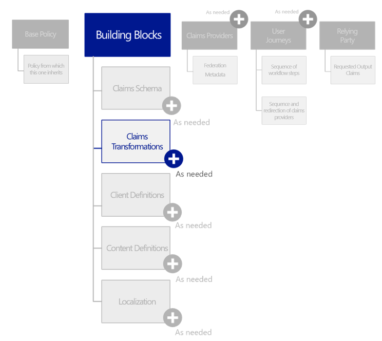

As described above, the policy claims listing is fixed (at any given
moment) in terms of the claims that can be provided to claims providers
or relying parties as part of a user journey.

Individual claims providers may not issue claims using the same type or
naming conventions. In such cases, the policy XML file must specify the
claims transformation functions that will be performed to map issued
claims to the schema. This mapping information needs to be recorded to
ensure that Azure AD B2C Premium performs the necessary transformations.

Furthermore, we expect that some policy may return derived attributes to
comply with some privacy policies, such as age is in a certain category
(e.g. above a given number of years) rather than divulging the user’s
actual birthdate. In these cases, the claims listing must advertise the
derived attribute types, and the claims transformation functions must
describe the mapping from the raw data delivered from the original
issuer.

Some Trust Framework policies may also include attribute value
substitution policies (such as mapping specific domain name suffixes to
generic ones). The claims transformation functions must include the
value that will result from such mappings.

Considering the above descriptions and needs, a claims transformation
function essentially converts a given claim into another one. In other
words, it can be used to modify existing *ClaimsSchema* claims or
generate new ones.

To include the list of claims transformation functions that can be used
in the user journeys, a *ClaimsTransformations* XML element must be
declared under the *BuildingBlocks* section of the policy XML file. If a
claims transformation function is not included in the policy, then it
cannot be used in any user journey within that policy. This element is
optional.

This element contains the following XML element:

  XML element              Occurrences   Description
  ------------------------ ------------- ----------------------------------------------------------------------------------------------------------------------------------------------------------------------------------------------------------
  *ClaimsTransformation*   1:n           Specify a supported claims transformation function that can be used within the community of interested. The claims transformation takes a set of claims, process them, and output another set of claims.

The *ClaimsTransformation* XML elements contain the following
attributes:

  ---------------------------------------------------------------------------------------------------------------------------------------------------------------------------------------------------------------------------------
  Attribute                Required   Description
  ------------------------ ---------- ---------------------------------------------------------------------------------------------------------------------------------------------------------------------------------------------
  *id*                     True       Specify a machine understandable identifier that is used to uniquely identify this particular claim transformation, and reference it from other XML elements in the policy XML file.

  *TransformationMethod*   True       Specify the suitable transform method as its name suggest. It’s a machine understandable identifier to reference a published transform method to be used to define a claims transformation.

                                      Value: one of the supported transform methods such as:

                                      -   **AddItemToStringCollection**.

                                      -   **AddParameterToStringCollection**.

                                      -   **AssertStringClaimsAreEqual**.

                                      -   **ChangeCase**.

                                      -   Etc.

                                      See below table for a complete list of the available transform methods.
  ---------------------------------------------------------------------------------------------------------------------------------------------------------------------------------------------------------------------------------

And in turn the following XML elements:

  XML element         Occurrences   Description
  ------------------- ------------- --------------------------------------------------------------------------------------------------------------------------------------------------------------------------------------------------------------
  *InputClaims*       0:1           Specify an optional list of the claim types that are taken as input to the claims transformation. Each of these elements contains reference to a *ClaimType* already defined in the *ClaimsSchema* section.
  *InputParameters*   0:1           Specify an optional list of the parameters that are provided as input to the claims transformation. Each of these elements contains a value that is passed verbatim to the transformation.
  *OutputClaims*      0:1           Specify an optional list of the claim types that are taken as output to the claims transformation. Each of these elements contains reference to a *ClaimType* already defined in the *ClaimsSchema* section.

The above *InputClaims* XML elements contain the following XML element:

  XML element    Occurrences   Description
  -------------- ------------- ---------------------------------
  *InputClaim*   0:n           Specify an expected claim type.

Each *InputClaim* XML element contains the following attributes:

  Attribute                   Required   Description
  --------------------------- ---------- ------------------------------------------------------------------------------------------------------------
  *ClaimTypeReferenceId*      True       Specify a reference to a *ClaimType* already defined in the *ClaimsSchema* section in the policy XML file.
  *TransformationClaimType*   True       Is set to "*InputClaim*”.

Likewise, the *InputParameters* XML elements contain the following XML
element:

  XML element        Occurrences   Description
  ------------------ ------------- ------------------------------------------------------------------------------------------------
  *InputParameter*   0:n           Specify an input parameter that are provided as input to the considered claims transformation.

Each *InputParameter* XML elements contain the following attributes:

  Attribute    Required   Description
  ------------ ---------- -------------------------------------------------------------------------------------------------------------------------------------------------------------------------------------------------------------------------
  *id*         True       Specify an identifier that is a reference to a parameter of the considered transformation method as specified by the *TransformationMethod* attribute of the above *ClaimsTransformation* XML element.
  *DataType*   True       Specify the type of data of the parameter, such as String, Boolean, Int or DateTime as per *DataType* enumeration in the Azure AD B2C Premium XML schema. This type is used to perform arithmetic operations correctly.
  *Value*      True       Specify a value that is passed verbatim to the transformation.

Eventually, the *OutputClaims* XML elements contain the following XML
element:

  XML element     Occurrences   Description
  --------------- ------------- ---------------------------------
  *OutputClaim*   0:n           Specify an expected claim type.

Each *OutputClaim* XML element contains the following attributes:

  Attribute                   Required   Description
  --------------------------- ---------- ------------------------------------------------------------------------------------------------------------
  *ClaimTypeReferenceId*      True       Specify a reference to a *ClaimType* already defined in the *ClaimsSchema* section in the policy XML file.
  *TransformationClaimType*   True       Is set to *“OutputClaim*”.

As of this writing, the following table lists the supported transform
methods along with their input/output claims and input parameters.

  -----------------------------------------------------------------------------------------------------------------------------------------------------------------------------------------------------------------------------------------------------------------------------------------------------------------------------------------------------------------------------------------------------------------------------------------------------------------------------------------------------------------------------
  Transform method                        Description                                                                                                                                                                                                                                                                                                                                              InputClaim                                 InputParameter                                    OutputClaim
  --------------------------------------- -------------------------------------------------------------------------------------------------------------------------------------------------------------------------------------------------------------------------------------------------------------------------------------------------------------------------------------------------------- ------------------------------------------ ------------------------------------------------- -------------------------------
  **AddItemToStringCollection**           Add the provided string claim to a that contains collection of strings                                                                                                                                                                                                                                                                                   item (String)                                                                                collection (StringCollection)

                                                                                                                                                                                                                                                                                                                                                                                                   collection (StringCollection)                                                                

  **AddParameterToStringCollection**      Add the provided string parameter to a claim that contains collection of strings                                                                                                                                                                                                                                                                         collection (StringCollection)              item                                              collection (StringCollection)

  **AssertStringClaimsAreEqual**          Compare two claims, and throws an exception if they are not equal according to the specified comparison                                                                                                                                                                                                                                                  inputClaim1 (String)                       stringComparison \[ordinal, ordinalIgnoreCase\]   

                                                                                                                                                                                                                                                                                                                                                                                                   inputClaim2 (String)                                                                         

  **ChangeCase**                          Change the case of the provided string claim to the one specified                                                                                                                                                                                                                                                                                        inputClaim1 (String)                       toCase \[lower, upper\]                           outputClaim (String)

  **CompareClaimToValue**                 Compare claim to the provided parameter, and returns a claim with true indicating that the values match, false otherwise                                                                                                                                                                                                                                 inputClaim1 (String)                       operator \[equal, not equal\]                     outputClaim (Boolean)

                                                                                                                                                                                                                                                                                                                                                                                                                                              compareTo                                         

                                                                                                                                                                                                                                                                                                                                                                                                                                              ignoreCase (true, false)                          

  **CompareClaims**                       Compares two claims and returns a claim with true indicating that the claims match, false otherwise                                                                                                                                                                                                                                                      inputClaim1 (String)                       operator \[equal, not equal\]                     outputClaim (Boolean)

                                                                                                                                                                                                                                                                                                                                                                                                   inputClaim2 (String)                       ignoreCase (true, false)                          

  **CreateAlternativeSecurityId**         Creates a JSON representation of the user’s *alternativeSecurityId* property that can be used in calls to Graph API. This string is consumed by the Azure AD claims provider when *PartnerClaimType* is alternativeSecurityId                                                                                                                            key (String)                                                                                 alternativeSecurityId

                                                                                                                                                                                                                                                                                                                                                                                                   identityProvider (String)                                                                    

  **CreateStringClaim**                   Creates a string claim from the provided parameter in the policy                                                                                                                                                                                                                                                                                                                                    value (String)                                    createdClaim (String)

  **CreateRandomString**                  Creates a random string using the random number generator used. If the random number generator is of type “integer”, optionally a seed parameter and a maximum number may be provided. An optional string format parameter allows the output to be formatted using it, and an optional base64 parameter specifies whether the output is base64 encoded                                              randomGeneratorType \[guid, integer\]             outputClaim (String)

                                                                                                                                                                                                                                                                                                                                                                                                                                              seed (Int32)                                      

                                                                                                                                                                                                                                                                                                                                                                                                                                              maximumNumber (Int32)                             

                                                                                                                                                                                                                                                                                                                                                                                                                                              stringFormat (String)                             

                                                                                                                                                                                                                                                                                                                                                                                                                                              base64 \[true, false\]                            

  **~~CreateJsonArray~~**                                                                                                                                                                                                                                                                                                                                                                                                                                                                       

  **FormatStringClaim**                   Format a given claim according to the provided format string. This transformation uses the C\# String.Format method. Please see its documentation for more details                                                                                                                                                                                       inputClaim (String)                        stringFormat (String)                             outputClaim (String)

  **~~FormatStringMultipleClaims~~**      *This transformation needs to be renamed because it formats exactly two claims*                                                                                                                                                                                                                                                                                                                                                                       

  **GetClaimFromJson**                    Given a JSON string of key value pairs, extract the specified claim                                                                                                                                                                                                                                                                                      inputJson (String)                         claimToExtract (String)                           extractedClaim (String)

  **GetSingleItemFromStringCollection**   Gets the first item from the provided string collection. *This transformation should ideally be renamed to GetFirstItemFromStringCollection*                                                                                                                                                                                                             collection (StringCollection) - optional                                                     extractedItem (String)

  **GetSingleValueFromJsonArray**         Gets the first item from the provided JSON string. *This transformation should ideally be renamed to GetFirstItemFromJsonArray.*                                                                                                                                                                                                                         inputJsonClaim (String)                                                                      extractedClaim (String)

  **Hash**                                Hash the provided plain text using the salt and a secret whose identifier is provided as a parameter                                                                                                                                                                                                                                                     plaintext (String)                         randomizerSecret (String)                         hash (String)

                                                                                                                                                                                                                                                                                                                                                                                                   salt (String)                                                                                

  **NullClaim**                           Replace the value of a claim with null                                                                                                                                                                                                                                                                                                                   claim\_to\_null (String)                                                                     claim\_to\_null (String)
  -----------------------------------------------------------------------------------------------------------------------------------------------------------------------------------------------------------------------------------------------------------------------------------------------------------------------------------------------------------------------------------------------------------------------------------------------------------------------------------------------------------------------------

Considering the above, the following XML snippet illustrates how to
define a list of applicable claims transformation functions:

&lt;?xml version="1.0" encoding="utf-8"?&gt;

&lt;TrustFrameworkPolicy
xmlns:xsi="http://www.w3.org/2001/XMLSchema-instance"

xmlns:xsd="http://www.w3.org/2001/XMLSchema"

xmlns="http://schemas.microsoft.com/online/cpim/schemas/2013/06"

PolicySchemaVersion="0.3.0.0"

…&gt;

…

&lt;BuildingBlocks&gt;

…

&lt;ClaimsTransformations&gt;

&lt;ClaimsTransformation Id="CreateDisplayNameFromFirstNameAndLastName"

TransformationMethod="FormatStringMultipleClaims"&gt;

&lt;InputClaims&gt;

&lt;InputClaim ClaimTypeReferenceId="givenName"
TransformationClaimType="inputClaim1" /&gt;

&lt;InputClaim ClaimTypeReferenceId="surName"
TransformationClaimType="inputClaim2" /&gt;

&lt;/InputClaims&gt;

&lt;InputParameters&gt;

&lt;InputParameter Id="stringFormat" DataType="string" Value="{0} {1}"
/&gt;

&lt;/InputParameters&gt;

&lt;OutputClaims&gt;

&lt;OutputClaim ClaimTypeReferenceId="displayName"
TransformationClaimType="outputClaim" /&gt;

&lt;/OutputClaims&gt;

&lt;/ClaimsTransformation&gt;

…

&lt;/ClaimsTransformations&gt;

…

&lt;BuildingBlocks&gt;

…

&lt;/TrustFrameworkPolicy&gt;

Specifying the client definitions
---------------------------------

Client definitions specify various properties specific to the end-user
device for which the policy is being executed. **These definitions
should be considered deprecated.**

To include the list of client definitions that can be used in the user
journeys, a *ClientDefinitions* XML element must be declared under the
*BuildingBlocks* section of the policy XML file. This element is
optional.

It contains the following XML element:

  XML element          Occurrences   Description
  -------------------- ------------- -----------------------------
  *ClientDefinition*   0:n           Define a client definition.

Each *ClientDefinition* XML element contains the following attribute:

  Attribute   Required   Description
  ----------- ---------- --------------------------------------------------------------------------------------------------------------------------------------------------------------------------------
  *Id*        True       Specify a machine understandable identifier that is used to uniquely identify a particular client definition, and reference it from other XML elements in the policy XML file.

Along with the following XML element:

  ---------------------------------------------------------------------------------------------------------
  XML element             Occurrences   Description
  ----------------------- ------------- -------------------------------------------------------------------
  *ClientUIFilterFlags*   0:1           Specify a comma-separated list of filter flags for the client UI.

                                        Type: String (enumeration: LineMarkers, MetaRefresh)
  ---------------------------------------------------------------------------------------------------------

The following XML snippet illustrates how to define a list of client
definitions:

&lt;?xml version="1.0" encoding="utf-8"?&gt;

&lt;TrustFrameworkPolicy
xmlns:xsi="http://www.w3.org/2001/XMLSchema-instance"

xmlns:xsd="http://www.w3.org/2001/XMLSchema"

xmlns="http://schemas.microsoft.com/online/cpim/schemas/2013/06"

PolicySchemaVersion="0.3.0.0"

…&gt;

…

&lt;BuildingBlocks&gt;

…

&lt;ClientDefinitions&gt;

&lt;ClientDefinition Id="DefaultWeb"&gt;

&lt;ClientUIFilterFlags&gt;LineMarkers,
MetaRefresh&lt;/ClientUIFilterFlags&gt;

&lt;/ClientDefinition&gt;

…

&lt;/ClientDefinitions&gt;

…

&lt;BuildingBlocks&gt;

…

&lt;/TrustFrameworkPolicy&gt;

Specifying the content definitions
----------------------------------

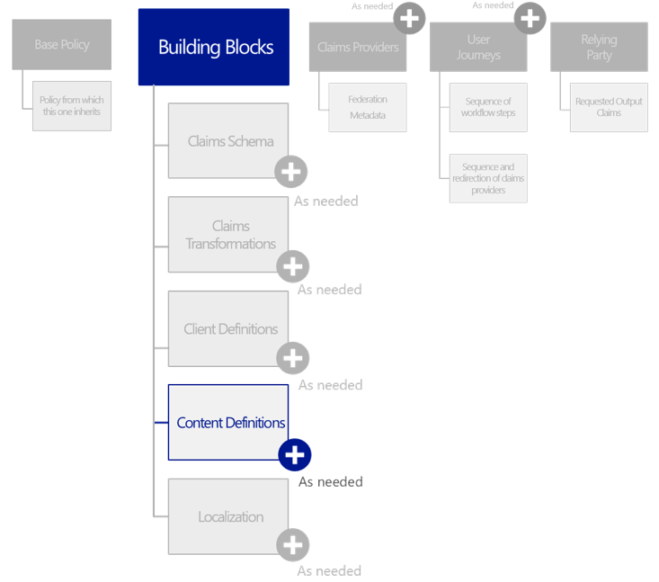

Content definitions define the HTML and page template that are used for
a given UI step, for example the claims providers’ selection.

A parent policy can define the default look and feel via the URI to the
HTML5 (it refers its CSS). A child policy can modify the look and feel
by overriding the LoadUri for that HTML5 (see below).

As such, content definitions contain URLs to external content, for
example, URLs to pages used in claims providers’ selection.

Related external content is defined by crafting HTML5/CSS files
(.*cshtml* files) as appropriate.

> **Note** For security reasons, the use of JavaScript is currently
> blocked for customization.

Azure AD B2C Premium allows running code in your consumer's browser and
uses the modern and standard approach [Cross-Origin Resource Sharing
(CORS)](http://www.w3.org/TR/cors/) to load content from a specific
URL that you specify in a policy to point to the above HTML5/CSS files.
You can specify different URLs for different pages thanks to content
definitions.

> **Note** For additional information, see the article [Azure Active Directory B2C preview:
> How to Customize the Azure AD B2C User Interface
> (UI)](https://azure.microsoft.com/en-us/documentation/articles/active-directory-b2c-reference-ui-customization/).

To include the list of content definitions that can be used in the user
journeys, a *ContentDefinitions* XML element must be declared under the
*BuildingBlocks* section of the policy XML file. This element is
optional.

It contains the following XML element:

  XML element           Occurrences   Description
  --------------------- ------------- ------------------------------
  *ContentDefinition*   0:n           Define a content definition.

Each *ContentDefinition* XML element contains the following attribute:

  --------------------------------------------------------------------------------------------------------------------------------------------------------------------------------------------------------
  Attribute   Required   Description
  ----------- ---------- ---------------------------------------------------------------------------------------------------------------------------------------------------------------------------------
  *Id*        True       Specify a machine understandable identifier that is used to uniquely identify a particular content definition, and reference it from other XML elements in the policy XML file.

                         Value: one of the following supported type:

                         -   **api.error**. Error page

                         -   **api.idpselections.** Identity provider selection page

                         -   **api.idpselections.signup**. Identity provider selection for sign-up

                         -   **api.localaccountpasswordreset**. Forgot password page

                         -   **api.localaccountsignin**. Local account sign-in page

                         -   **api.localaccountsignup**. Local account sign-up page

                         -   **api**.**phonefactor**. Multi-factor authentication page

                         -   **api.selfasserted**. Social account sign-up page

                         -   **api.selfasserted.profileupdate**. Profile update page

                         -   **api.signuporsignin**. Unified sign-up or sign-in page

  --------------------------------------------------------------------------------------------------------------------------------------------------------------------------------------------------------

Along with the following XML elements:

  -------------------------------------------------------------------------------------------------------------------------------------------------------------
  XML element     Occurrences   Description
  --------------- ------------- -------------------------------------------------------------------------------------------------------------------------------
  *LoadUri*       0:1           Specify the relative URL of the CSHTML page (i.e. an ASP.NET Razor Web page) or an HTML5/CSS page for the content definition.

                                Type: String

  *RecoveryUri*   0:1           Specify the relative URL of the HTML page for displaying an error relating to the content definition.

                                Type: String

  *DataUri*       0:1           Specify the relative URL of a XML file that provides user experience to invoke for the considered step.

                                Type: String

  *Metadata*      0:1           Specify the metadata utilized by the content definition.

                                Type: collection of *Item* of key/value pairs.
  -------------------------------------------------------------------------------------------------------------------------------------------------------------

The following metadata item keys must or may be present in the
*Metadata* XML element:

  ------------------------------------------------------------------------------------------------------------------
  Item key      Required   Description
  ------------- ---------- -----------------------------------------------------------------------------------------
  DisplayName   True       Specify the display name for the page in which the content definition will be rendered.

                           Type: String
  ------------------------------------------------------------------------------------------------------------------

The following XML snippet illustrates how to define a list of content
definitions:

&lt;?xml version="1.0" encoding="utf-8"?&gt;

&lt;TrustFrameworkPolicy
xmlns:xsi="http://www.w3.org/2001/XMLSchema-instance"

xmlns:xsd="http://www.w3.org/2001/XMLSchema"

xmlns="http://schemas.microsoft.com/online/cpim/schemas/2013/06"

PolicySchemaVersion="0.3.0.0"

…&gt;

…

&lt;BuildingBlocks&gt;

…

&lt;ContentDefinitions&gt;

&lt;ContentDefinition Id="api.error"&gt;

&lt;LoadUri&gt;\~/tenant/default/exception.cshtml&lt;/LoadUri&gt;

&lt;RecoveryUri&gt;\~/common/default\_page\_error.html&lt;/RecoveryUri&gt;

&lt;DataUri&gt;\~/elements/exception/globalexception.xml&lt;/DataUri&gt;

&lt;Metadata&gt;

&lt;Item Key="DisplayName"&gt;Error page&lt;/Item&gt;

&lt;/Metadata&gt;

&lt;/ContentDefinition&gt;

&lt;ContentDefinition Id="api.idpselections"&gt;

&lt;LoadUri&gt;\~/tenant/default/idpSelector.cshtml&lt;/LoadUri&gt;

&lt;RecoveryUri&gt;\~/common/default\_page\_error.html&lt;/RecoveryUri&gt;

&lt;DataUri&gt;\~/elements/homerealm/homerealm.xml&lt;/DataUri&gt;

&lt;Metadata&gt;

&lt;Item Key="DisplayName"&gt;Idp selection page&lt;/Item&gt;

&lt;Item Key="language.intro"&gt;Sign in&lt;/Item&gt;

&lt;/Metadata&gt;

&lt;/ContentDefinition&gt;

&lt;ContentDefinition Id="api.idpselections.signup"&gt;

&lt;LoadUri&gt;\~/tenant/default/idpSelector.cshtml&lt;/LoadUri&gt;

&lt;RecoveryUri&gt;\~/common/default\_page\_error.html&lt;/RecoveryUri&gt;

&lt;DataUri&gt;\~/elements/homerealm/homerealm.xml&lt;/DataUri&gt;

&lt;Metadata&gt;

&lt;Item Key="DisplayName"&gt;Idp selection page&lt;/Item&gt;

&lt;Item Key="language.intro"&gt;Sign up&lt;/Item&gt;

&lt;/Metadata&gt;

&lt;/ContentDefinition&gt;

…

&lt;ContentDefinitions&gt;

…

&lt;BuildingBlocks&gt;

…

&lt;/TrustFrameworkPolicy&gt;

Specifying the supported locales
--------------------------------

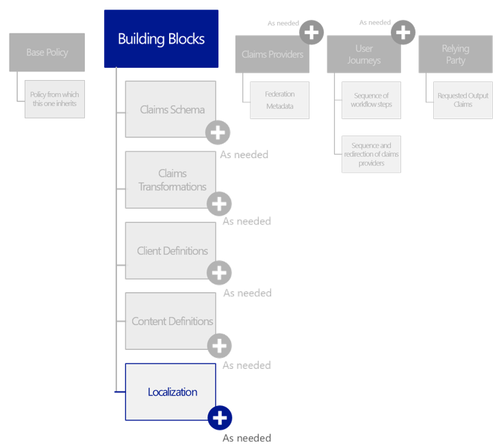

Localization allow you to support multiple locales, i.e. languages, in
the policy for the user journeys (see section § *Specifying the user
journeys* later in this document).

As you already can infer from the above sections, policies control all
elements of customer-facing content including text (strings).

The localization support in policies allows you to:

1.  Setup the explicit list of the supported language in a policy, and
    > pick a default language.

2.  Provide language-specific strings and collections.

For that purpose, a *Localization* XML element must be declared under
the *BuildingBlocks* section of the policy XML file. This element is
optional.

It contains the following attribute:

  ----------------------------------------------------------------------------------------------------------------------------------------------------------------------------------------------------------------------------------------------------------------------------------------------------------------------------------
  Attribute          Required   Description
  ------------------ ---------- ----------------------------------------------------------------------------------------------------------------------------------------------------------------------------------------------------------------------------------------------------------------------------------------------------
  *PolicyLanguage*   True       Specify the default language that the user will see in user journeys if any other supported culture is specified.

                                Value: String that represents a culture for displaying content and that conforms to languages using language tag as per [RFC 5646 Tags for Identifying Languages](http://tools.ietf.org/html/rfc5646), for example in a non-exhaustive manner:

                                -   **zh-HANS**. Chinese (simplified)

                                -   **zh-HANT**. Chinese (traditional)

                                -   **cz**. Czech

                                -   **nl**. Dutch

                                -   **en-US**. English (US)

                                -   **fr**. French

                                -   **de**. German

                                -   **hu**. Hungarian

                                -   **ja**. Japanese

                                -   **ko**. Korean

                                -   **it**. Italian

                                -   **pl**. Polish

                                -   **pt**. Portuguese

                                -   **pt-BR**. Portuguese (Brazil)

                                -   **ru**. Russian

                                -   **es**. Spanish

                                -   **sv**. Swedish

                                -   **tr**. Turkish

  ----------------------------------------------------------------------------------------------------------------------------------------------------------------------------------------------------------------------------------------------------------------------------------------------------------------------------------

Along with the following XML elements:

  XML element            Occurrences   Description
  ---------------------- ------------- -----------------------------------------------------------
  *SupportedLanguages*   0:1           Define all the cultures that are supported by this policy
  *LocalizedResources*   0:n           Contain all the translated strings for a specific culture

The *SupportedLanguages* XML element contains the contains the following
attribute:

  -----------------------------------------------------------------------------------------------------------------------------------------------------------------------------------------------------------------------------------------------
  Attribute           Required   Description
  ------------------- ---------- ----------------------------------------------------------------------------------------------------------------------------------------------------------------------------------------------------------------
  *DefaultLanguage*   True       Specify one supported language for the localized resources.

                                 Value: String that represents a culture for displaying content and that conforms to languages using language tag as per RFC 5646 Tags for Identifying Languages.
  -----------------------------------------------------------------------------------------------------------------------------------------------------------------------------------------------------------------------------------------------

Along with the following XML elements:

  ----------------------------------------------------------------------------------------------------------------------------------------------------------------------------------------------------------------------------------------------------
  XML element           Occurrences   Description
  --------------------- ------------- ----------------------------------------------------------------------------------------------------------------------------------------------------------------------------------------------------------------
  *SupportedLanguage*   0:n           Specify one supported language for the policy.

                                      Value: String that represents a culture for displaying content and that conforms to languages using language tag as per RFC 5646 Tags for Identifying Languages.
  ----------------------------------------------------------------------------------------------------------------------------------------------------------------------------------------------------------------------------------------------------

The *LocalizedResources* XML element contains the following attribute:

  ---------------------------------------------------------------------------------------------------------------------------------------------------------------------------------------------------------------------------------------
  Attribute   Required   Description
  ----------- ---------- ----------------------------------------------------------------------------------------------------------------------------------------------------------------------------------------------------------------
  *Culture*   True       Specify one supported language for the localized resources.

                         Value: String that represents a culture for displaying content and that conforms to languages using language tag as per RFC 5646 Tags for Identifying Languages.
  ---------------------------------------------------------------------------------------------------------------------------------------------------------------------------------------------------------------------------------------

Along with the following XML elements:

  XML element              Occurrences   Description
  ------------------------ ------------- -----------------------------------------------------------------------------------------------------------------------------------------------------------------------------------------------------------------------------------------------------------------------------------------------------------
  *LocalizedCollections*   0:1           Allow defining entire collections in various cultures. A collection can have different number of items, and different strings for various cultures. Examples of collections include the enumerations that appear in claim types, e.g. country/region list, and are shown to the user in a drop down list.
  *LocalizedStrings*       0:1           Define all the strings, except those that appear in collections, in various cultures.

The following XML snippet illustrates how to define the localization
support for both English (US) (default) and French (France
Metropolitan):

&lt;?xml version="1.0" encoding="utf-8"?&gt;

&lt;TrustFrameworkPolicy
xmlns:xsi="http://www.w3.org/2001/XMLSchema-instance"

xmlns:xsd="http://www.w3.org/2001/XMLSchema"

xmlns="http://schemas.microsoft.com/online/cpim/schemas/2013/06"

PolicySchemaVersion="0.3.0.0"

…&gt;

…

&lt;BuildingBlocks&gt;

…

&lt;Localization PolicyLanguage="en-us"&gt;

&lt;SupportedLanguages&gt;

&lt;SupportedLanguage&gt;en-us&lt;/SupportedLanguage&gt;

&lt;SupportedLanguage&gt;fr-fr&lt;/SupportedLanguage&gt;

&lt;/SupportedLanguages&gt;

&lt;LocalizedResources Culture="en-us"&gt;

…

&lt;/LocalizedResources&gt;

&lt;LocalizedResources Culture="fr-fr"&gt;

…

&lt;/LocalizedResources&gt;

&lt;/Localization&gt;

…

&lt;BuildingBlocks&gt;

…

&lt;/TrustFrameworkPolicy&gt;

Now that we have depicted the overall structure for localization
support, let’s consider in more details the inner XML elements.

Each *LocalizedCollection* XML element under the *LocalizedCollections*
XML element contains the following attributes:

  ---------------------------------------------------------------------------------------------------------------------------------------------------------------
  Attribute            Required   Description
  -------------------- ---------- -------------------------------------------------------------------------------------------------------------------------------
  *ElementType*        True       References a ClaimType XML element or a UI element in the policy XML file.

                                  Value: one the following supported data types:

                                  -   **ClaimType**.

                                  -   TBD.

                                  Type: String (enumeration)

                                  Value: String

  *ElementId*          True       If *ElementType* is set to **ClaimType**, contains a reference to a claim type already defined in the *ClaimsSchema* section.

                                  Value: String

  *TargetCollection*   True       Specify TBD.

                                  Value: String
  ---------------------------------------------------------------------------------------------------------------------------------------------------------------

Along with the following XML elements:

  XML element   Occurrences   Description
  ------------- ------------- ---------------------------------------------------------------------------------------------------------
  *Item*        0:n           Define an available option for the user to select for a claim in the UI, such as a value in a dropdown.

In turn, the *Item* XML element contains the following attributes:

  -------------------------------------------------------------------------------------------------------------------------------------
  Attribute           Required   Description
  ------------------- ---------- ------------------------------------------------------------------------------------------------------
  *Text*              True       Specify the user-friendly display string that should be shown to the user in the UI for this option.

                                 Value: String

  *Value*             True       Specify the claim value associated with selecting this option.

                                 Value: String

  *SelectByDefault*   False      Indicating whether or not this option should be selected by default in the UI.

                                 Value: Boolean
  -------------------------------------------------------------------------------------------------------------------------------------

This XML element allows providing language specific claims listing, as
an illustration for the *country* claim type:

&lt;?xml version="1.0" encoding="utf-8"?&gt;

&lt;TrustFrameworkPolicy
xmlns:xsi="http://www.w3.org/2001/XMLSchema-instance"

xmlns:xsd="http://www.w3.org/2001/XMLSchema"

xmlns="http://schemas.microsoft.com/online/cpim/schemas/2013/06"

PolicySchemaVersion="0.3.0.0"

…&gt;

…

&lt;BuildingBlocks&gt;

…

&lt;Localization PolicyLanguage="en-us"&gt;

&lt;SupportedLanguages&gt;

…

&lt;/SupportedLanguages&gt;

&lt;LocalizedResources Culture="en-us"&gt;

&lt;/LocalizedCollections&gt;

&lt;LocalizedCollection ElementType="ClaimType" ElementId="country"
TargetCollection="Restriction"&gt;

…

&lt;Item Text="France" Value="France" /&gt;

&lt;Item Text="French Guiana" Value="French Guiana" /&gt;

&lt;Item Text="French Polynesia" Value="French Polynesia" /&gt;

&lt;Item Text="French Southern Territories" Value="French Southern
Territories" /&gt;

&lt;Item Text="U.S. Outlying Islands" Value="U.S. Outlying Islands"
/&gt;

&lt;Item Text="U.S. Virgin Islands" Value="U.S. Virgin Islands" /&gt;

&lt;Item Text="United Kingdom" Value="United Kingdom" /&gt;

&lt;Item Text="United States" Value="United States" /&gt;

…

&lt;/LocalizedCollection&gt;

…

&lt;/LocalizedCollections&gt;

&lt;LocalizedStrings&gt;

…

&lt;/LocalizedStrings&gt;

&lt;/LocalizedResources&gt;

…

&lt;/Localization&gt;

…

&lt;BuildingBlocks&gt;

…

&lt;/TrustFrameworkPolicy&gt;

Similarly, the *LocalizedStrings* XML element contains the following XML
elements:

  XML element         Occurrences   Description
  ------------------- ------------- -----------------------------------------------------
  *LocalizedString*   0:n           Specify one localized string as its name indicates.

In turn, the *LocalizedString* XML element contains the following
attributes:

  ---------------------------------------------------------------------------------------------------------------------------------------------------------------------------------------------------------------------------------------------------------------------------------------------------------------------------------
  Attribute       Required   Description
  --------------- ---------- ------------------------------------------------------------------------------------------------------------------------------------------------------------------------------------------------------------------------------------------------------------------------------------------------------
  *ElementType*   True       References a ClaimType XML element or a UI element in the policy XML file.

                             Value: one the following supported data types:

                             -   **ClaimType**.

                             -   **TechnicalProfile**.

                             Type: String (enumeration)

  *ElementId*     True       If *ElementType* is set to **ClaimType**, contains a reference to a claim type already defined in the *ClaimsSchema* section. Otherwise, contains a reference to a particular technical profile (see section § *Specifying technical profile(s) for a given claims provider* later in this document)

  *StringId*      True       If *ElementType* is set to **ClaimType**, specifies the attribute of a particular claim type.

                             Value: one the following attributes as per *ClaimType* XML element definition in the Azure AD B2C Premium XML schema:

                             -   **DisplayName**.

                             -   **AdminHelpText**.

                             -   **UserHelpText**.

                             Conversely, if *ElementType* is set to **TechnicalProfile**, specifies the attribute of a particular claim type.

                             Value: TBD, *BTW, the self-asserted provider references in its metadata a Content Definition*.
  ---------------------------------------------------------------------------------------------------------------------------------------------------------------------------------------------------------------------------------------------------------------------------------------------------------------------------------

The value of this XML element corresponds the actual localized string.

This XML element allows providing language specific claims listing, as
an illustration for the *password* claim type:

&lt;?xml version="1.0" encoding="utf-8"?&gt;

&lt;TrustFrameworkPolicy
xmlns:xsi="http://www.w3.org/2001/XMLSchema-instance"

xmlns:xsd="http://www.w3.org/2001/XMLSchema"

xmlns="http://schemas.microsoft.com/online/cpim/schemas/2013/06"

PolicySchemaVersion="0.3.0.0"

…&gt;

…

&lt;BuildingBlocks&gt;

…

&lt;Localization PolicyLanguage="en-us"&gt;

&lt;SupportedLanguages&gt;

…

&lt;/SupportedLanguages&gt;

&lt;LocalizedResources Culture="en-us"&gt;

&lt;LocalizedCollections&gt;

…

&lt;/LocalizedCollections&gt;

&lt;LocalizedStrings&gt;

&lt;LocalizedString ElementType="ClaimType" ElementId="password"
StringId="DisplayName"&gt;

Password

&lt;/LocalizedString&gt;

&lt;LocalizedString ElementType="ClaimType" ElementId="password"
StringId="AdminHelpText"&gt;

Enter password

&lt;/LocalizedString&gt;

&lt;LocalizedString ElementType="ClaimType" ElementId="password"
StringId="UserHelpText"&gt;

Enter password

&lt;/LocalizedString&gt;

…

&lt;/LocalizedStrings&gt;

&lt;/LocalizedResources&gt;

…

&lt;/Localization&gt;

…

&lt;BuildingBlocks&gt;

…

&lt;/TrustFrameworkPolicy&gt;

In the above illustration, “*Password*” and "*Enter password*" are the
actual string that can be set in accordance to the specified culture for
the *password* claim type for respectively the *DisplayName* attribute
value and the *AdminHelpText* and *UserHelpText* attributes’ value.

Specifying the claims providers
===============================

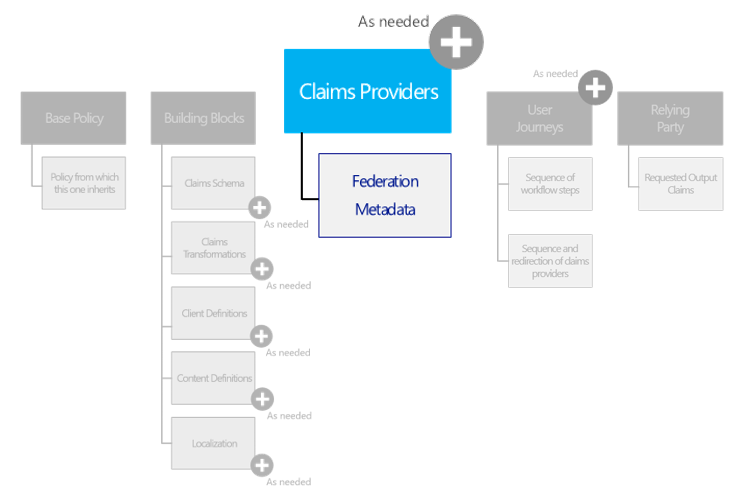

Identity providers, attribute providers, attribute verifiers, directory
provider, MFA provider, self-asserted attribute provider, etc. are all
modelled as claims providers.

To include a list of claims providers along with their technical
profiles that may be used in the various user journeys, a
*ClaimsProviders* XML element must be declared under the above top-level
*TrustFrameworkPolicy* XML element of the policy XML file. This element
is optional.

This element contains the following XML element:

  XML element        Occurrences   Description
  ------------------ ------------- ------------------------------------------------------------------------------------------------------------------------------
  *ClaimsProvider*   1:n           Declare an accredited claims provider that can be leveraged within the community of interested in the various user journeys.

The *ClaimsProvider* XML elements represents a claims provider, along
with its supported technical profiles. Such an element contains the
following XML elements:

  ------------------------------------------------------------------------------------------------------------------------------------------------------------------------------------------------------------------------------------------------------------------------------------------------------------------------------------------------------------------------------------------------------------------------------------------------------
  XML element           Occurrences   Description
  --------------------- ------------- ------------------------------------------------------------------------------------------------------------------------------------------------------------------------------------------------------------------------------------------------------------------------------------------------------------------------------------------------------------------------------------------------------------------
  *Domain*              0:1           Specify The human understandable domain name for the claim provider.

                                      Type: String

  *DisplayName*         0:1           Specify the human understandable name of the claims provider that can be displayed to the users.

                                      Type: String

  *TechnicalProfiles*   1:1           Specify a list of technical profiles supported by the claim provider.

                                      Every claims provider must have one or more technical profiles which determines the end points and the protocols needed to communicate with that claims provider. In fact, in Azure AD B2C Premium, it is the technical profile that is referenced elsewhere for communication with a particular claims provider.

                                      A claims provider can have multiple technical profiles for various reasons. For example, multiple technical profiles may be defined because the considered claims provider supports multiple protocols, various endpoints with different capabilities, or releases different claims at different assurance levels. It may be acceptable to release sensitive claims in one user journey, but not in another one.

                                      See next section(s).
  ------------------------------------------------------------------------------------------------------------------------------------------------------------------------------------------------------------------------------------------------------------------------------------------------------------------------------------------------------------------------------------------------------------------------------------------------------

The following XML snippet illustrates how to define a claim provider:

&lt;?xml version="1.0" encoding="utf-8"?&gt;

&lt;TrustFrameworkPolicy
xmlns:xsi="http://www.w3.org/2001/XMLSchema-instance"

xmlns:xsd="http://www.w3.org/2001/XMLSchema"

xmlns="http://schemas.microsoft.com/online/cpim/schemas/2013/06"

PolicySchemaVersion="0.3.0.0"

…&gt;

…

&lt;ClaimsProviders&gt;

&lt;ClaimsProvider&gt;

&lt;DisplayName&gt;Some Claims Provider&lt;/DisplayName&gt;

&lt;TechnicalProfiles&gt;

&lt;TechnicalProfile …&gt;

…

&lt;/TechnicalProfile&gt;

…

&lt;/TechnicalProfiles&gt;

&lt;/ClaimsProvider&gt;

…

&lt;/ClaimsProviders&gt;

…

&lt;/TrustFrameworkPolicy&gt;

**The subsections describe how to define a valid technical profile via
the *TechnicalProfile* XML element that specifically represents a given
technical profile supported by a claims provider. **

Specifying technical profile(s) for a given claims provider
-----------------------------------------------------------

As per the aforementioned OIX model, a technical profile consists in a
set of constraints on the use of a specific technology for the exchange
of digital identity information to ensure interoperability and maintain
compliance with required LOA (and/or LOP).

A policy XML file uses technical profiles for two purposes:

1.  Technical details are published as connection metadata to ensure
    on-the-wire interoperability between participants in the community

2.  Technical profiles must be tagged with unique names that are used to
    “label” the interface(s) for which claims providers have been
    certified for conformance to LOA requirements.

Azure AD B2C Premium mediates connections between relying parties and
claims providers. As part of the Trust Framework policy, technical
profiles provide a contract for Azure AD B2C Premium to contact claims
providers. A claims provider can have multiple technical profiles, each
technical profile defining a specific contract for federating with that
specific provider.

For that purpose, it notably consists of:

1.  Protocol – SAML 2.0, WS-Federation/WS-Trust, OpenID Connect (OIDC),
    OAuth 2.0, etc.

2.  Metadata

3.  Cryptographic references – i.e. reference to a secret in the B2C
    tenant secret store.

4.  Input/persited/output claims:

    a.  Mentions the list of the claims provider can expect in
        request/persist/respond with.

    b.  And their mapping from the *PartnerClaimType* to the claim’s
        > used in the policy XML file.

5.  Input/output claims transformations:

    a.  Reference to the *ClaimsTransformation*’s defined in the policy
        XML file.

    b.  Input transforms are run prior to sending the request to the
        provider and output transforms are run on receiving the response
        from the provider.

In addition, a technical profile is usually certified for a LOA and thus
one claims provider may have multiple technical profiles for different
LOAs. As described later in this document for the relying party,
technical profiles similarly provide a contract for relying parties to
contact Azure AD B2C Premium services.

The *TechnicalProfiles* section of the above *ClaimsProviders* XML
element contains the following XML element:

  XML element          Occurrences   Description
  -------------------- ------------- -------------------------------------------------------------
  *TechnicalProfile*   0:n           Define a technical profile supported by the claim provider.

Each *TechnicalProfile* XML element contains the following attribute:

  Attribute   Required   Description
  ----------- ---------- ------------------------------------------------------------------------------------------------------------------------------------------------------------------------------------------------------------------------------------------
  *Id*        True       Specify a machine understandable identifier that is used to uniquely identify a particular technical profile, and reference it from other XML elements in the policy XML file, for example *OrchestrationSteps* and *InputTokenSources.*

Along with the following XML elements:

  ----------------------------------------------------------------------------------------------------------------------------------------------------------------------------------------------------------------------------------------------------------------------------------------------------------------------------------------------------------
  XML element                                 Occurrences   Description
  ------------------------------------------- ------------- ------------------------------------------------------------------------------------------------------------------------------------------------------------------------------------------------------------------------------------------------------------------------------------------------
  *Domain*                                    0:1           Specify the he human understandable domain name for the technical profile.

                                                            Type: String

  *DisplayName*                               0:1           Specify the human understandable name of the technical profile that can be displayed to the users.

                                                            Type: String

  *Description*                               0:1           Specify a human understandable description of the technical profile that can be displayed to the users.

                                                            Type: String

  *Protocol*                                  0:1           Specify the protocol used for the federation.

  *InputTokenFormat*                          0:1           Specify the format of the input token.

                                                            Type: String (enumeration)

                                                            Value: one of the types as per *TokenFormat* enumeration in the Azure AD B2C Premium XML schema:

                                                            -   **JSON**.

                                                            -   **JWT**. JSON Web Token as per IETF specification.

                                                            -   **SAML11**. SAML 1.1 security token as per OASIS specification.

                                                            -   **SAML2**. SAML 2.0 security token as per OASIS specification.

                                                            -   **CpimUnsigned**.

  *OutputTokenFormat*                         0:1           Specify the format of the output token.

                                                            Type: String (enumeration)

                                                            Value: one of the types as per *TokenFormat* enumeration in the Azure AD B2C Premium XML schema. See above.

  *AssuranceLevelOfOutputClaims*              0:1           List the assurance level of the claims that are retrieved from the technical profile.

                                                            Type: String

  *RequiredAssuranceLevelsOfInputClaims*      0:1           Lists the assurance levels that a claim must have in order for it to be used as an input claim to the technical profile.

                                                            Type: String

  *SubjectAuthenticationRequirements*         0:1           Specify the requirements regarding the conscious and active participation of the subject in authentication.

  *Metadata*                                  0:1           Specify the metadata utilized by the protocol for communicating with the endpoint in the course of a transaction to plumb “on the wire” interoperability between Azure AD B2C Premium and other community participants.

                                                            Type: collection of *Item* of key/value pairs.

  *CryptographicKeys*                         0:1           Specify a list of cryptographic keys used in this technical profile.

                                                            For additional information, see section § *Managing your key containers for Trust Framework (policies)* in the third part of this series of document.

  *Suppressions*                              0:1           Specify a list of suppressions supported by the protocol.

                                                            Type: String

  *PreferredBinding*                          0:1           If the protocol supports multiple bindings, represent binding preferred by the protocol, for example HTTP POST or HTTP GET in the case of SAML 2.0

                                                            Type: String

  *IncludeInSSO*                              0:1           Indicate whether usage of this technical profile should apply single sign-on (SSO) behavior for the session and instead require explicit interaction.

                                                            **To be deprecated in favor of *UseTechnicalProfileForSessionManagement* that allows a more granular control on SSO behavior**.

  *InputTokenSources*                         0:1           Represent the list of technical profiles of the claims providers from which the original tokens are to be sent. Azure AD B2C Premium can indeed send the original token from one claims provider to another claims provider.

  *InputClaimsTransformations*                0:1           Specify an optional list of references to claims transformations that should be executed before any claims are sent to the claims provider or the relying party.

                                                            Each of these elements contains reference to a *ClaimsTransformation* already defined in the *ClaimsTransformations* section.

  *InputClaims*                               0:1           Specify an optional list of the claim types that are taken as input in the technical profile. Each of these elements contains reference to a *ClaimType* already defined in the *ClaimsSchema* section.

  *PersistedClaims*                           0:1           Specify an optional list of the claim types that are persisted by the claims provider that relates to the technical profile. Each of these elements contains reference to a *ClaimType* already defined in the *ClaimsSchema* section.

  *OutputClaims*                              0:1           Specify an optional list of the claim types that are taken as output in the technical profile. Each of these elements contains reference to a *ClaimType* already defined in the *ClaimsSchema* section.

  *OutputClaimsTransformations*               0:1           Specify an optional list of references to claims transformations that should be executed after claims are received from the claims provider.

                                                            Each of these elements contains reference to a *ClaimsTransformation* already defined in the *ClaimsTransformations* section.

  *ValidationTechnicalProfiles *              0:n           Specify a list of other technical profiles that the technical profile uses for validation purposes.

  *SubjectNamingInfo*                         0:1           Control the production of the subject name in tokens (e.g. SAML) where subject name is specified separately from claims.

  *SubjectAuthenticationRequirements*         0:1           Specify the requirements regarding the conscious and active participation of the subject in authentication

  *Extensions*                                0:1           Allow any xml from any namespace outside of the document namespaces to be included in the element. This represents an extension point for elements as its name indicates.

  *IncludeClaimsFromTechnicalProfile*         0:1           Indicate a machine understandable identifier that is used to uniquely identify a different technical profile. All input and output claims from referenced technical profile will be added to this technical profile. Referenced technical profile must be defined in the same policy XML file.

                                                            Type: String

  *IncludeTechnicalProfile*                   0:1           Indicate a machine understandable identifier that is used to uniquely identify a different technical profile. All data from referenced technical profile will be added to this technical profile. Referenced technical profile must exist in the same policy XML file.

  *UseTechnicalProfileForSessionManagement*   0:1           Indicate a machine understandable identifier to uniquely identify a different technical profile to be used for session management.

  *EnableForUserJourney*                      0:1           Specify if the technical user profile is enable for a user journey. if the technical profile should be used within a user journey, this includes *ClaimProviderSelections*. If this value is set to **true**, it will disable the selection.

                                                            Value: one of the following values as per *EnabledForUserJourneysValues* enumeration in the Azure AD B2C Premium XML schema:

                                                            -   **true**. Execute the technical profile.

                                                            -   **false**. Always skip the technical profile.

                                                            -   **OnClaimsExistence**. Only execute the technical profile if the claim specified in the technical profile's metadata is present in the user journey storage.

                                                            -   **Always**. (default) Execute the technical profile.

                                                            -   **Never**. Always skip the technical profile.

  ----------------------------------------------------------------------------------------------------------------------------------------------------------------------------------------------------------------------------------------------------------------------------------------------------------------------------------------------------------

The *Protocol* XML element in the above table contains the following
attributes:

  -----------------------------------------------------------------------------------------------------------------------------------------------------------------------------------------------------------------------------------------------------------------------------
  Attribute   Required   Description
  ----------- ---------- ------------------------------------------------------------------------------------------------------------------------------------------------------------------------------------------------------------------------------------------------------
  *Name*      True       Specify the name of a valid protocol supported by Azure AD B2C Premium that is used as part of the technical profile.

                         Type: String (enumeration)

                         Value: one of the following types as per *ProtocolName* enumeration in the Azure AD B2C Premium XML schema:

                         -   **None**.

                         -   **OAuth1**. OAuth 1.0 protocol standard as per IETF specification.

                         -   **OAuth2**. OAuth 2.0 protocol standard as per IETF specification.

                         -   **SAML2**. SAML 2.0 protocol standard as per OASIS specification.

                         -   **OpenIdConnect**. OpenID Connect 1.0 protocol standard as per OpenID foundation specification.

                         -   **WsFed**. WS-Federation (WS-Fed) 1.2 protocol standard as per OASIS specification.

                         -   **WsTrust**. WS-Trust 1.3 protocol standard as per OASIS specification.

                         -   **Proprietary**. For a RESTful based provider.

  *Handler*   False      Specify the fully-qualified name of the assembly that will be used by Azure AD B2C Premium to determine the protocol handler if the protocol name is set to "Proprietary". **It is invalid to provide this attribute with any other protocol name.**

                         Type: String
  -----------------------------------------------------------------------------------------------------------------------------------------------------------------------------------------------------------------------------------------------------------------------------

The *RequiredAssuranceLevelsOfInputClaims* XML element in the above
table contains the following XML element:

  XML element                             Occurrences   Description
  --------------------------------------- ------------- -----------------------------------------------------------------------------------------------------------------------
  *RequiredAssuranceLevelOfInputClaims*   0:n           List an assurance level that a claim must have in order for it to be used as an input claim to the technical profile.

The *SubjectAuthenticationRequirements* XML element in the above table
contains the following XML attributes:

  ------------------------------------------------------------------------------------------------------------------------------------------------------------------------------------------------------------------
  Attribute                      Required   Description
  ------------------------------ ---------- ------------------------------------------------------------------------------------------------------------------------------------------------------------------------
  *TimeToLive*                   True       Specify The maximum number of minutes cached credentials can be used following an active authentication by the subject.

                                            Type: Integer

  *ResetExpiryWhenTokenIssued*   False      If **true** then whenever a token is issued (even using a cached credential), set the expiry time to the current time plus the TimeToLive value. Default is **false**.

                                            Type: Boolean
  ------------------------------------------------------------------------------------------------------------------------------------------------------------------------------------------------------------------

The *CryptographicKeys* XML element in the above table contains the
following XML element:

  XML element   Occurrences   Description
  ------------- ------------- ------------------------------------------------------------
  *Key*         0:n           Define a cryptographic key used in this technical profile.

Each *Key* XML element contains in turn the following attribute:

  ------------------------------------------------------------------------------------------------------------------------------------------------------------------------------------------------------------------------------------------------------------------------------------------------------------------------------------------------------------------------
  Attribute              Required   Description
  ---------------------- ---------- --------------------------------------------------------------------------------------------------------------------------------------------------------------------------------------------------------------------------------------------------------------------------------------------------------------------------------------
  *Id*                   True       Specify a machine understandable identifier that is used to uniquely identify a particular key (pair), and reference it from other XML elements in the policy XML file.

                                    Type: String

  *StorageReferenceId*   True       Specify a machine understandable identifier that is used to uniquely identify a particular storage key container, and reference it from other XML elements in the policy XML file. For additional information, see section § *Managing your key containers for Trust Framework (policies)* in third part of this series of document.

                                    Type: String
  ------------------------------------------------------------------------------------------------------------------------------------------------------------------------------------------------------------------------------------------------------------------------------------------------------------------------------------------------------------------------

The *InputTokenSources* XML elements contain the following XML element:

  XML element          Occurrences   Description
  -------------------- ------------- ------------------------------------------------------------------------------------------
  *TechnicalProfile*   1:n           Specify a source for that can be the input assertions for the current technical profile.

Each *TechnicalProfile* XML element contains the following attribute:

  ----------------------------------------------------------------------------------------------------------------------------------------------------------------------------
  Attribute   Required   Description
  ----------- ---------- -----------------------------------------------------------------------------------------------------------------------------------------------------
  *Id*        True       Specify a reference to a machine understandable identifier that is used to uniquely identify a particular technical profile in the policy XML file.

                         Type: String
  ----------------------------------------------------------------------------------------------------------------------------------------------------------------------------

Each *InputClaim* XML element contains the following attribute:

  ------------------------------------------------------------------------------------------------------------------------------------------------
  Attribute                Required   Description
  ------------------------ ---------- ------------------------------------------------------------------------------------------------------------
  *ClaimTypeReferenceId*   True       Specify a reference to a *ClaimType* already defined in the *ClaimsSchema* section in the policy XML file.

                                      Type: String
  ------------------------------------------------------------------------------------------------------------------------------------------------

The *InputClaimsTransformations* XML elements contain the following XML
element:

  XML element                   Occurrences   Description
  ----------------------------- ------------- -------------------------------------------------------------------------------------------------------------------------------------------------------------------------------------------------------------------------------------------
  *InputClaimsTransformation*   0:n           Specify a claims transformation that should be executed before any claims are sent to the claims provider or the relying party. A claims transformation can indeed be used to modify existing *ClaimsSchema* claims or generate new ones.

Each *InputClaimsTransformation* XML element contains the following
attribute:

  -----------------------------------------------------------------------------------------------------------------------------------------------------------
  Attribute       Required   Description
  --------------- ---------- --------------------------------------------------------------------------------------------------------------------------------
  *ReferenceId*   True       Specify a reference to a *ClaimsTransformation* already defined in the *ClaimsTransformations* section in the policy XML file.

                             Type: String
  -----------------------------------------------------------------------------------------------------------------------------------------------------------

The *InputClaims* XML elements contain the following XML element:

  XML element    Occurrences   Description
  -------------- ------------- --------------------------------- --
  *InputClaim*   0:n           Specify an expected claim type.   

Each *InputClaim* XML element contains the following attribute:

  ------------------------------------------------------------------------------------------------------------------------------------------------
  Attribute                Required   Description
  ------------------------ ---------- ------------------------------------------------------------------------------------------------------------
  *ClaimTypeReferenceId*   True       Specify a reference to a *ClaimType* already defined in the *ClaimsSchema* section in the policy XML file.

                                      Type: String
  ------------------------------------------------------------------------------------------------------------------------------------------------

the *PersistedClaims* XML elements contain the following XML element:

  XML element        Occurrences   Description
  ------------------ ------------- -------------------------------------------------------------------------------------------------------------------------------------
  *PersistedClaim*   0:n           Specify an expected claim type. Claim mappings are used to determine the provider claim type before sending to the claims provider.

Each *PersistedClaim* XML element contains the following attributes:

  -------------------------------------------------------------------------------------------------------------------------------------------------------------------------------------------------------------------------------------------------------------------------------------
  Attribute                Required   Description
  ------------------------ ---------- -------------------------------------------------------------------------------------------------------------------------------------------------------------------------------------------------------------------------------------------------
  *ClaimTypeReferenceId*   True       Specify a reference to a *ClaimType* already defined in the *ClaimsSchema* section in the policy XML file.

                                      Type: String

  *DefaultValue *          False      Specify a default value to create a claim if the claim indicated by *ClaimTypeReferenceId* does not exist so that the resulting claim can be used as an *InputClaim* by the technical profile.

                                      Type: String

  *PartnerClaimType*       False      Identify the *ClaimType* of the external partner that the specified policy claim type maps to. If the *PartnerClaimType* attribute is not specified, then the specified policy claim type is mapped to the partner claim type of the same name.

                                      Type: String

  *OverwriteIfExists*      False      Provides an optional property to the claims provider indicating whether the claim can be overwritten in the claims provider records if the claim provider supports overwriting.

                                      Type: true or false
  -------------------------------------------------------------------------------------------------------------------------------------------------------------------------------------------------------------------------------------------------------------------------------------

Eventually, the *OutputClaims* XML elements contain the following XML
element:

  XML element     Occurrences   Description
  --------------- ------------- ---------------------------------
  *OutputClaim*   0:n           Specify an expected claim type.

Each *OutputClaim* XML element contains the following attributes:

  ------------------------------------------------------------------------------------------------------------------------------------------------
  Attribute                Required   Description
  ------------------------ ---------- ------------------------------------------------------------------------------------------------------------
  *ClaimTypeReferenceId*   True       Specify a reference to a *ClaimType* already defined in the *ClaimsSchema* section in the policy XML file.

                                      Type: String

  *DefaultValue *          False      Specify a default value if not set.

                                      Type: String

  *PartnerClaimType*       False      Specify the partner claim type.

                                      Type: String

  *Required*               False      Specify this claim is required.

                                      Type: String
  ------------------------------------------------------------------------------------------------------------------------------------------------

The *OutputClaimsTransformations* XML elements contain the following XML
element:

  XML element                    Occurrences   Description
  ------------------------------ ------------- -----------------------------------------------------------------------------------------------------------------------------------------------------------------------------------------------------------------------
  *OutputClaimsTransformation*   0:n           Specify a claims transformation that should be executed after claims are received from the claims provider. A claims transformation can indeed be used to modify existing *ClaimsSchema* claims or generate new ones.

Each *OutputClaimsTransformation* XML element contains the following
attribute:

  -----------------------------------------------------------------------------------------------------------------------------------------------------------
  Attribute       Required   Description
  --------------- ---------- --------------------------------------------------------------------------------------------------------------------------------
  *ReferenceId*   True       Specify a reference to a *ClaimsTransformation* already defined in the *ClaimsTransformations* section in the policy XML file.

                             Type: String
  -----------------------------------------------------------------------------------------------------------------------------------------------------------

The *ValidationTechnicalProfiles* XML element in the above table
contains the following XML element:

  XML element                    Occurrences   Description
  ------------------------------ ------------- ------------------------------------------------------------------------------------------------------------------------------------------------------------------------------------------------------------------------------------------------------
  *ValidationTechnicalProfile*   1:n           Define a to be used for validating some or all of the output claims of the referencing technical profile. Therefore, all the input claims of the referenced technical profile must appear in the output claims of the referencing technical profile.

*ValidationTechnicalProfile* and *IncludeTechnicalProfile* XML elements
contain in turn the following attributes:

  Attribute       Required   Description
  --------------- ---------- ---------------------------------------------------------------------------------------------------------------------------------------------------------------------
  *ReferenceId*   True       Specify a reference to a machine understandable identifier that is used to uniquely identify a particular technical profile already defined in the policy XML file.

The *SubjectNamingInfo* XML element in the above table contains the
following attributes:

  -------------------------------------------------------------------------------------------------------------------------------------------
  Attribute           Required   Description
  ------------------- ---------- ------------------------------------------------------------------------------------------------------------
  *ClaimType*         True       Specify a reference to a *ClaimType* already defined in the *ClaimsSchema* section in the policy XML file.

                                 Type: String

  *NameQualifier*     False      Provide a description

                                 Type: String

  *SPNameQualifier*   False      Provide a description

                                 Type: String

  *Format*            False      Provide a description

                                 Type: String

  *SPProvidedID*      False      Provide a description

                                 Type: String
  -------------------------------------------------------------------------------------------------------------------------------------------

*IncludeTechnicalProfile* and *UseTechnicalProfileForSessionManagement*
XML elements in the above table contain the following attribute:

  Attribute       Required   Description
  --------------- ---------- ---------------------------------------------------------------------------------------------------------------------------------------------------------------------
  *ReferenceId*   True       Specify a reference to a machine understandable identifier that is used to uniquely identify a particular technical profile already defined in the policy XML file.

The following XML snippet illustrates how to define a technical profile
for a claim provider:

&lt;?xml version="1.0" encoding="utf-8"?&gt;

&lt;TrustFrameworkPolicy
xmlns:xsi="http://www.w3.org/2001/XMLSchema-instance"

xmlns:xsd="http://www.w3.org/2001/XMLSchema"

xmlns="http://schemas.microsoft.com/online/cpim/schemas/2013/06"

PolicySchemaVersion="0.3.0.0"

…&gt;

…

&lt;ClaimsProviders&gt;

&lt;ClaimsProvider&gt;

&lt;DisplayName&gt;Some Claims Provider&lt;/DisplayName&gt;

&lt;TechnicalProfiles&gt;

&lt;TechnicalProfile …&gt;

…

&lt;/TechnicalProfile&gt;

…

&lt;/TechnicalProfiles&gt;

&lt;/ClaimsProvider&gt;

…

&lt;/ClaimsProviders&gt;

…

&lt;/TrustFrameworkPolicy&gt;

**The next sections further detail how to specify adequate technical
profiles depending on the nature of the claims provider.** It more
particularly describes the related metadata information to specify.

Specifying a technical profile for an Azure AD claims provider
--------------------------------------------------------------

This section outlines the specifics of a technical profile for
interacting with an Azure AD provider.

A suitable technical profile definition for an Azure AD provider implies
the followings.

The *Name* attribute of the *Protocol* XML element has to be set to
**Proprietary** as per *ProtocolName* enumeration in the Azure AD B2C
Premium XML schema. Thus, the handler attribute must contain the
fully-qualified name of the protocol handler assembly that will be used
by Azure AD B2C Premium in this case:

*"Web.TPEngine.Providers.AzureActiveDirectoryProvider, Web.TPEngine,
Version=1.0.0.0, Culture=neutral, PublicKeyToken=null*”

The following metadata item key may or must be present in the *Metadata*
XML element:

  ------------------------------------------------------------------------------------------------------------------------------------------------------------------------------------------------------------------------------------------------------------------
  Item key                                    Required   Description
  ------------------------------------------- ---------- -----------------------------------------------------------------------------------------------------------------------------------------------------------------------------------------------------------
  Operation                                   True       Determine the operation to be performed.

                                                         Value: one of the following types:

                                                         -   **Read**.

                                                         -   **Write**.

                                                         -   **DeleteClaims**.

                                                         -   **DeleteClaimsPrincipal**.

  DeleteAllPersistedClaims                    False      Apply when *Operation* is set to **DeleteClaims**.

                                                         Value: true or false. If true, delete all claims specified in the *PersistedClaims* XML element in the policy. If false, only delete those claims that are passed at run-time.

  ClaimsPersistenceTenant                     False      If the Azure AD B2C Premium directory tenant is different from the relying party, determine in which directory tenant is the user object created and claims stored.

                                                         Value: one of the followings:

                                                         -   **{TRUSTFRAMEWORK}**.

                                                         -   **{RELYINGPARTY}**.

                                                         Curly brackets are part of the value.

  CreateClaimsPrincipalIfItDoesNotExist       False      Apply when *Operation* is set to **Write**.

                                                         Value: true or false. If true, then a new user object is created if it does not exist. If false, then the user object is not created and the claims may not be written if the user object does not exist.

  RaiseErrorIfClaimsPrincipalDoesNotExist     False      Enable to raise an error.

                                                         Value: true or false. If true, raises an error if the user object does not exist in the directory.

  UserMessageIfClaimsPrincipalDoesNotExis​t   False      If an error is to be raised (see previous key setting), specify the message to show to the user if user object does not exist.

                                                         Value: String

  RaiseErrorIfClaimsPrincipalAlreadyExists    False      Apply when *Operation* is set to **Write**.

                                                         Value: true or false. If true, raises an error if the user object already exists.

  UserMessageIfClaimsPrincipalAlreadyExists              If an error is to be raised (see previous key setting), specify the message to show to the user if user object already exists.

                                                         Value: String

  ApplicationObjectId                         False      Specify the application object identifier for extension attributes.

                                                         Value: ObjectId of an application in the directory tenant

  ClientId                                    False      Specify the client id for accessing the directory tenant as third party.

                                                         Value: ClientId of an application in the directory tenant

  Key                                         False      Specify the key for accessing the directory tenant as third party.

                                                         Value: Key of an application in the directory tenant

  SchemaExtensionTenant                                  If the Azure AD B2C Premium directory tenant is different from the relying party, determine in which tenant are the extension attributes created.

                                                         Value: one of the followings:

                                                         -   **{TRUSTFRAMEWORK}**.

                                                         -   **{RELYINGPARTY}**.

                                                         Curly brackets are part of the value.

  ConvertEmptyClaimsToNull                    False      If an empty string is encountered as a claim value, convert it to null.

                                                         Value: true or false (default: true)

  ProvideDefaultValueForDisplayName           False      If an empty or null value is encountered for *displayName*, replace it with "unknown”.

                                                         Value: true or false (default: true)

  DefaultClaimValueForDisplayName                        Use the specified value instead of "unknown" for *displayName* if an empty or null value is encountered. (see previous key setting)

                                                         Value: any valid *displayName* string
  ------------------------------------------------------------------------------------------------------------------------------------------------------------------------------------------------------------------------------------------------------------------

The *InputClaimsTransformations* XML element may contain a collection of
*InputClaimsTransformation* that should be executed before any claims
are sent to the Azure AD provider. It can thus generate new input
claims.

The *InputClaims* XML element contains the claims bag as the input with
possible mapping information between a *ClaimType* already defined in
the *ClaimsSchema* section in the policy XML file and that Azure AD
claim type.

The *PersistedClaims* XML element may contain the claims bag as all the
values that should be persisted by Azure AD with possible mapping
information between a *ClaimType* already defined in the *ClaimsSchema*
section in the policy XML file and that Azure AD claim type.

The *OutputClaims* XML element contains the claims bag as the output
with possible mapping information between a *ClaimType* already defined
in the *ClaimsSchema* section in the policy XML file and that Azure AD
claim type.

The *OutputClaimsTransformations* XML element may contain a collection
of *OutputClaimsTransformation* to be used to modify the output claims
or generate new ones.

The following XML snippet illustrates a series of technical profiles
(with includes) for an Azure AD provider:

&lt;TechnicalProfile Id="AAD-Common"&gt;

&lt;DisplayName&gt;Azure Active Directory&lt;/DisplayName&gt;

&lt;Protocol Name="Proprietary"

Handler="Web.TPEngine.Providers.AzureActiveDirectoryProvider,
Web.TPEngine, Version=1.0.0.0,

Culture=neutral, PublicKeyToken=null" /&gt;

&lt;/TechnicalProfile&gt;

&lt;TechnicalProfile Id="AAD-WriteCommon"&gt;

&lt;Metadata&gt;

&lt;Item Key="Operation"&gt;Write&lt;/Item&gt;

&lt;Item
Key="RaiseErrorIfClaimsPrincipalAlreadyExists"&gt;true&lt;/Item&gt;

&lt;/Metadata&gt;

&lt;PersistedClaims&gt;

&lt;PersistedClaim ClaimTypeReferenceId="displayName"
DefaultValue="unknown" /&gt;

&lt;PersistedClaim ClaimTypeReferenceId="passwordPolicies"
DefaultValue="DisablePasswordExpiration" /&gt;

&lt;PersistedClaim
ClaimTypeReferenceId="Verified.strongAuthenticationPhoneNumber"

PartnerClaimType="strongAuthenticationPhoneNumber" /&gt;

&lt;PersistedClaim
ClaimTypeReferenceId="strongAuthenticationEmailAddress" /&gt;

&lt;/PersistedClaims&gt;

&lt;OutputClaimsTransformations&gt;

&lt;OutputClaimsTransformation
ReferenceId="CreateEmailsFromOtherMailsAndSignInNamesInfo" /&gt;

&lt;OutputClaimsTransformation
ReferenceId="AddStrongAuthenticationEmailToEmails" /&gt;

&lt;/OutputClaimsTransformations&gt;

&lt;IncludeTechnicalProfile ReferenceId="AAD-Common" /&gt;

&lt;/TechnicalProfile&gt;

&lt;TechnicalProfile Id="AAD-UserWriteUsingAlternativeSecurityId"&gt;

&lt;Metadata&gt;

&lt;Item Key="UserMessageIfClaimsPrincipalAlreadyExists"&gt;You are
already registered, please press the back button and

sign in instead.&lt;/Item&gt;

&lt;/Metadata&gt;

&lt;InputClaimsTransformations&gt;

&lt;InputClaimsTransformation ReferenceId="CreateOtherMailsFromEmail"
/&gt;

&lt;/InputClaimsTransformations&gt;

&lt;InputClaims&gt;

&lt;InputClaim ClaimTypeReferenceId="AlternativeSecurityId"
PartnerClaimType="alternativeSecurityId"

Required="true" /&gt;

&lt;/InputClaims&gt;

&lt;PersistedClaims&gt;

&lt;PersistedClaim ClaimTypeReferenceId="alternativeSecurityId" /&gt;

&lt;PersistedClaim ClaimTypeReferenceId="userPrincipalName" /&gt;

&lt;PersistedClaim ClaimTypeReferenceId="otherMails" /&gt;

&lt;PersistedClaim ClaimTypeReferenceId="mailNickName"
DefaultValue="unknown" /&gt;

&lt;/PersistedClaims&gt;

&lt;OutputClaims&gt;

&lt;OutputClaim ClaimTypeReferenceId="objectId" /&gt;

&lt;OutputClaim ClaimTypeReferenceId="newUser"
PartnerClaimType="newClaimsPrincipalCreated" /&gt;

&lt;OutputClaim ClaimTypeReferenceId="otherMails" /&gt;

&lt;/OutputClaims&gt;

&lt;IncludeTechnicalProfile ReferenceId="AAD-WriteCommon" /&gt;

&lt;/TechnicalProfile&gt;

### Implementation notes on the technical profile

#### Fulfilling the requirements to perform an operation

Unless the technical profile performs a **Read** operation, there must
be exactly one *InputClaim* XML element in the claims bag. If the
*Operation* is **Write**, then it must also be appearing in a
*PersistedClaims* XML element (see below).

If the technical profile performs **Write** or **DeleteClaims**
operations, then it must also have an *PersistedClaims* XML element.
Azure AD B2C Premium passes all the values as-is to the underlying Azure
AD directory tenant. This gives maximum control at the policy level.

The following table lists the required claims in the *PersistedClaims*
XML element for a technical profile that will performs a **Write**
operation to create a user (i.e. the metadata key
*CreateClaimsPrincipalIfItDoesNotExist* is set to true).

  Type of account            InputClaims                                                     Required claims in PersistedClaims
  -------------------------- --------------------------------------------------------------- -------------------------------------------------------------------------------------------------------------------------------------------
  Social IDP-based           *alternativeSecurityId*                                         *alternativeSecurityId*, *userPrincipalName*, *displayName*, *mailNickname*
  Name coexistence account   ​*logonIdentifier.emailAddress* or *logonIdentifier.username*   *displayName*, *mailNickname* and either *logonIdentifier.emailAddress* or *logonIdentifier.username* (whichever is in the *InputClaims*)
  Regular account            *userPrincipalName*​                                            *userPrincipalName*, ​*displayName*, *mailNickname*​

> **Note** See section [User
> Entity](https://msdn.microsoft.com/Library/Azure/Ad/Graph/api/entity-and-complex-type-reference#EntityreferenceUserEntity)
> in the article Entity and
> complex type reference | Graph API reference for all the
> properties that can be provided when a user is created. The required
> fields listed on the article are trumped by the required fields in the
> above table. This is because the article only considers regular
> accounts since other types of accounts are internal only.
>
> **Note** When a value is provided for certain properties, it is passed
> to the directory by Azure AD B2C Premium even if it is null. This is
> because a policy could overwrite a property value to delete it.

This also means that you as the policy author have to know certain rules
about acceptable claim values:

1.  The required attributes from the above table must be provided in the
    *PersistedClaims*, in addition to any other claims that need to be
    stored.

2.  *userPrincipalName* must be of the format
    > [user@tenant.onmicrosoft.com](mailto:user@tenant.onmicrosoft.com),
    > i.e. @tenant domain name.

3.  *displayName* is required and cannot be an empty string.

#### Processing of claim mapping and transformations

The table below shows how the transformations and mappings referenced in
the technical profile are processed.

Regardless of the provider, after any claim transformation is executed,
the output claims from it are immediately stored in the User Journey
storage. User Journeys are covered in section Specifying the user journeys.

&lt;include a figure&gt;

Thus, the result of input claims transformations ends up in User Journey
storage from where it can be used in input claims, persisted claims, and
even as the input claims of output claims transformations.

  ---------------------------------------------------------------------------------------------------------------------------------------------------------------------------------------------------------------------------------------------------------------------------------------------------------------------------------------------------------------------------------------------
  Order   Policy construct                Required claims in PersistedClaims
  ------- ------------------------------- -----------------------------------------------------------------------------------------------------------------------------------------------------------------------------------------------------------------------------------------------------------------------------------------------------------------------------------------------------
  1       *InputClaimsTransformation*     -   Input claims of every InputClaimsTransformation are picked up from the User Journey storage, and after execution, the output claims are put back in the User Journey storage. Thus output claims of an input claims transformation can be input claims of a subsequent input claims transformation as well.

  2       *​InputClaims*                  -   Claims are picked up from the User Journey storage – this allows all output claims of input claims transformations to be used as input claims as well (see above).

  3       *PersistedClaims​*              -   Claims are picked up from the UserJourney storage – this allows all output claims of input claims transformations to be used as persisted claims as well.

                                          -   If a claim has an empty string value, it is replaced with null (empty strings are not allowed).

                                          -   If displayName property is provided wtih empty or null value, it is replaced with a default name.

                                          -   Please see the above information relating to the metadata keys and their interpretation on controlling this behavior.

  4       *OutputClaims*                  -   If Operation is **Read**: this is just the claims read.

                                          -   If Operation is **Write**: an object is returned from Azure AD after a write, any claims that are returned in that object are returned. If a value of an input claim changed during write, it will come back with an updated value. The claims that are listed (and mapped) in the output claims collection are put in the UserJourney storage.

  5       *OutputClaimsTransformations*   -   Input claims of every output claims Transformation are picked up from the User Journey storage. Thus, output claims ot the technical profile (previous step) as well as output claims of the input claims transformations (step \#1) can be input claims of an output claims transformation.

                                          -   After execution, the output claims are put back in the User Journey storage. Thus, output claims of an output claims transformation can also be input claims of a subsequent output claims transformation.

  ---------------------------------------------------------------------------------------------------------------------------------------------------------------------------------------------------------------------------------------------------------------------------------------------------------------------------------------------------------------------------------------------

#### Supporting extension attributes

Azure AD has a few predefined set of attributes, such as *givenName*,
*lastName*, *telephoneNumber*, *userPrincipalName*, etc. for a *User*
object.

**Note** For additional information, see section [User
Entity](https://msdn.microsoft.com/Library/Azure/Ad/Graph/api/entity-and-complex-type-reference#EntityreferenceUserEntity)
in the article Entity and complex
type reference | Graph API reference.

This said, Azure AD also allows the creation of additional custom
attributes and refers to them as *extension* attributes. They can be
defined on various objects types, such as User, Application, Service
Principal, and others. However, Azure AD B2C (Premium) policy supports
adding extension attributes only on users though.

Such a support implies to register extension attributes on an
Application object.

**Note** For additional information, see section § *Supporting custom
attributes for Azure AD claims providers* in fourth part of this series
of document.

Specifying a technical profile for a SAML 2.0 claims provider
-------------------------------------------------------------

Azure AD B2C Premium provides a support for the SAML 2.0. This section
outlines the specifics of a technical profile for interacting with
claims provider supporting this standardized protocol.

SAML 2.0, as a token format and a protocol, is very popular in the
public sector with government agencies as well as with enterprises and
educational institutions.

SAML 2.0 is a suite of specifications and, as such, comprises a set of
normative and non-normative documents. SAML 2.0 essentially defines
XML-based **assertions** and **protocols**, **bindings**, and
**profiles**.

**A prior understanding or even better a knowledge of the underlying
concepts is necessary to appropriately define a technical profile in
this space.**

If you’re not familiar with all of these concepts, the critical aspects
of SAML 2.0 are covered in detail in the following four normative
documents:

1.  [Assertions and Protocols
    for the OASIS Security Assertion Markup Language
    (SAML) V2.0](http://docs.oasis-open.org/security/saml/v2.0/saml-core-2.0-os.pdf)
    (SAMLCore), the core specification.

2.  [Bindings for the OASIS
    Security Assertion Markup Language
    (SAML) V2.0](http://docs.oasis-open.org/security/saml/v2.0/saml-bindings-2.0-os.pdf)
    (SAMLBind), which maps the SAML messages onto the standard messaging
    or communication protocols.

3.  [Profiles for the OASIS
    Security Assertion Markup Language
    (SAML) V2.0](http://docs.oasis-open.org/security/saml/v2.0/saml-profiles-2.0-os.pdf)
    (SAMLProf), the use cases or the “*How-to*” in regards to the use of
    SAML in various situations.

4.  And [Conformance
    Requirements for the OASIS Security Assertion Markup Language
    (SAML) V2.0](http://docs.oasis-open.org/security/saml/v2.0/saml-conformance-2.0-os.pdf)
    (SAMLConform), the operational modes for the SAML 2.0
    implementations.

The term SAML Core, in relationship with the SAMLCore core
specification, refers to the general syntax and semantics of SAML
assertions (a.k.a. tokens) as well as the protocol used to request and
transmit those assertions from one system entity to another. Most of the
time, the SAML assertion you may have to consider will be the so-called
"bearer" assertion, a short-lived bearer token (i.e. without a proof of
possession). Such an assertion may include both an authentication
statement and an attribute statement.

A SAML 2.0 protocol describes how certain SAML elements (including
assertions) are packaged within SAML request and response elements, and
gives the processing rules that SAML entities like an IdP in our context
must follow when producing or consuming these elements. For the most
part, a SAML protocol is a simple request-response protocol. It is
important to keep in mind that a SAML protocol always refers to what is
transmitted, and not how (the latter is determined by the choice of
binding). In the context of this paper, the most interesting SAML
protocols are the Authentication Request Protocol, and the Artifact
Resolution Protocol,

A SAML 2.0 binding determines how SAML requests and responses map onto
standard messaging or communications protocols. In other words, it’s a
mapping of a SAML protocol message onto standard messaging formats
and/or communications protocols. SAML 2.0 completely separates the
binding concept from the underlying profile (see below).

The SAML 2.0 standard defines several bindings:

-   HTTP Redirect (GET) binding,

-   HTTP POST binding,

-   HTTP Artifact binding,

-   Etc.

A SAML 2.0 profile is a concrete manifestation of a defined use case or
the “*How-to*” using a particular combination of assertions, protocols,
and bindings, assertions. Indeed, it describes in detail how SAML 2.0
assertions, protocols, and bindings combine to support the considered
use case. These

The SAML 2.0 standard defines several profiles:

-   Web Browser SSO profile,

-   Artifact Resolution profile,

-   Enhanced Client or Proxy (ECP) profile,

-   Etc.

The most important one is certainly the web Browser SSO profile since
this is the primary SAML use case for web SSO and federation. One should
also note that these profiles support various possible deployment
models.

Based on the above short introduction on SAML 2.0, and the related
concepts and normative documents, let’s consider how to define a
suitable technical profile.

The *Name* attribute of the *Protocol* XML element has to be set to
**SAML2** as per *ProtocolName* enumeration in the Azure AD B2C Premium
XML schema.

The following metadata item keys must or may be present in the
*Metadata* XML element:

  --------------------------------------------------------------------------------------------------------------------------------------------------------------------------------------------
  Item key                            Required   Description
  ----------------------------------- ---------- ---------------------------------------------------------------------------------------------------------------------------------------------
  PartnerEntity                       True       Allow to specify a CDATA section (ignored by the XML parser). This section contains the SAML 2.0 metadata of the SAML 2.0 claims provider.

  IssuerUri                           False      Specify the Issuer Uri in the SAML 2.0 assertion. What is IssuerUri definition provided by Kim

  TreatUnsolicitedResponseAsRequest   False      Allow an unsolicited response to serve as an authentication request.

                                                 Value: true or false. When set to true, this allows to send an assertion to an IDP by an IDP: IDP initiated SSO.

  WantsSignedRequests                 False      Indicate if you want signed request.

                                                 Value: true or false. Set to false (i.e. turned that off) for testing when you don’t have the production keys from the testing environment.

  WantsSignedAssertions               False      Indicate if you want signed assertions.

                                                 Value: true or false.

  RequestsSigned                      False      Value: true or false.

  WantsSignedResponses                False      Indicate if you want signed response.

                                                 Value: true or false.

  ResponsesSigned                     False      Value: true or false.

  AssertionsEncrypted                 False      Specify that the assertion must be encrypted before being sent.

                                                 Value: true or false.
  --------------------------------------------------------------------------------------------------------------------------------------------------------------------------------------------

The *Suppressions* XML element - IN SPECIAL INTERRUPT CASES - provides
the ability to unblock the situation, suppress certain things in the
authentication request.

The following metadata item keys may be present in the *Suppressions*
XML element:

  ----------------------------------------------------------------------------------------------------------------------------------------------------------------------------------------------------------------------------------------------------------------------------------------------------------------------------
  Item key        Required   Description
  --------------- ---------- -------------------------------------------------------------------------------------------------------------------------------------------------------------------------------------------------------------------------------------------------------------------------------------------------
  AuthnRequest    False      Specify for the authentication request message a comma-separated list of optional attribute/element of the SAML message since some implementations don’t support all the optional attribute/element as per protocol and above specifications, what is considered optional.

                             Values in the list: Consent, Destination, Issuer, Extensions, AssertionConsumerServiceUrl, AssertionConsumerServiceIndex, AttributeConsumingServiceIndex, ProtocolBinding, IsPassive, ForceAuthn, ProviderName, Scoping, RequestedAuthenticationcontext, Conditions, NameIDPolicy, and Subject.

  LogoutRequest   False      Specify for the logout request message a comma-separated list of optional attribute/element of the SAML message since some implementations don’t support all the optional attribute/element as per protocol and above specifications, what is considered optional.

                             Values in the list: Consent, Destination, Issuer, Extensions, NotOnOrAfter, Reason, and SessionIndex.
  ----------------------------------------------------------------------------------------------------------------------------------------------------------------------------------------------------------------------------------------------------------------------------------------------------------------------------

**Note** This is very unusual to suppress them.

The *InputClaimsTransformations* XML element is absent.

The *InputClaims* XML element is empty or absent.

The *PersistedClaims* XML element is absent.

The *OutputClaims* XML element contains the claims bag as the output
with possible mapping information between a *ClaimType* already defined
in the *ClaimsSchema* section in the policy XML file and that partner
claim type. **This also enables to take the subject name of the SAML
assertion instead of as an attribute**:

&lt;OutputClaim ClaimTypeReferenceId="UserId"
PartnerClaimType="assertionSubjectName" /&gt;

The *OutputClaimsTransformations* XML element may contain a collection
of *OutputClaimsTransformation* to be used to check or modify the output
claims, or generate new ones.

The following XML snippet illustrates a technical profile for a SAML 2.0
claims provider:

&lt;TechnicalProfile Id="IdP-SAML2-Outbound"&gt;

&lt;DisplayName&gt;Foo IdP&lt;/DisplayName&gt;

&lt;Description&gt;Some suitable description for foo
IdP&lt;/Description&gt;

&lt;Protocol Name="SAML2" /&gt;

&lt;Metadata&gt;

&lt;Item Key="WantsSignedAssertions"&gt;false&lt;/Item&gt;

&lt;Item Key="TreatUnsolicitedResponseAsRequest"&gt;true&lt;/Item&gt;

&lt;Item Key="ResponsesSigned"&gt;false&lt;/Item&gt;

&lt;Item
Key="IssuerUri"&gt;https://te.cpim.windows.net/csdii.onmicrosoft.com/B2C\_1A\_casinitiated&lt;/Item&gt;

&lt;Item Key="PartnerEntity"&gt;

&lt;!\[CDATA\[

&lt;md:EntityDescriptor entityID="https://web.dev1.foo.com/saml20"

xmlns:md="urn:oasis:names:tc:SAML:2.0:metadata"&gt;

&lt;md:IDPSSODescriptor WantAuthnRequestsSigned="true"

protocolSupportEnumeration="urn:oasis:names:tc:SAML:2.0:protocol"&gt;

&lt;md:KeyDescriptor use="signing"&gt;

&lt;KeyInfo xmlns="http://www.w3.org/2000/09/xmldsig\#"&gt;

&lt;X509Data&gt;

&lt;X509Certificate&gt;MIIF1DCCA7ygAwIBAgIHC4Dr2wGTODMA…15lH8uDLHNp/ctEQ=&lt;/X509Certificate&gt;

&lt;/X509Data&gt;

&lt;/KeyInfo&gt;

&lt;/md:KeyDescriptor&gt;

&lt;md:KeyDescriptor use="encryption"&gt;

&lt;KeyInfo xmlns="http://www.w3.org/2000/09/xmldsig\#"&gt;

&lt;X509Data&gt;

&lt;X509Certificate&gt;MIIF0jCCA7qgAwIBAgIHC4D4+…P4V2neBrOzAQWFo&lt;/X509Certificate&gt;

&lt;/X509Data&gt;

&lt;/KeyInfo&gt;

&lt;md:EncryptionMethod
Algorithm="http://www.w3.org/2001/04/xmlenc\#rsa-1\_5"/&gt;

&lt;/md:KeyDescriptor&gt;

&lt;md:ArtifactResolutionService
Binding="urn:oasis:names:tc:SAML:2.0:bindings:SOAP"

Location="https://web.dev1.foo.com/saml20/soap"

index="0"

isDefault="true"/&gt;

&lt;md:SingleLogoutService
Binding="urn:oasis:names:tc:SAML:2.0:bindings:HTTP-Artifact"

Location="https://web.dev1.foo.com/saml20/slo"/&gt;

&lt;md:SingleLogoutService
Binding="urn:oasis:names:tc:SAML:2.0:bindings:HTTP-POST"

Location="https://web.dev1.foo.com/saml20/slo"/&gt;

&lt;md:SingleLogoutService
Binding="urn:oasis:names:tc:SAML:2.0:bindings:SOAP"

Location="https://web.dev1.foo.com/saml20/soap"/&gt;

&lt;md:NameIDFormat&gt;urn:oasis:names:tc:SAML:2.0:nameid-format:persistent&lt;/md:NameIDFormat&gt;

&lt;md:NameIDFormat&gt;urn:oasis:names:tc:SAML:2.0:nameid-format:transient&lt;/md:NameIDFormat&gt;

&lt;md:NameIDFormat&gt;urn:oasis:names:tc:SAML:1.1:nameid-format:emailAddress&lt;/md:NameIDFormat&gt;

&lt;md:NameIDFormat&gt;urn:oasis:names:tc:SAML:2.0:nameid-format:encrypted&lt;/md:NameIDFormat&gt;

&lt;md:NameIDFormat&gt;urn:oasis:names:tc:SAML:1.1:nameid-format:unspecified&lt;/md:NameIDFormat&gt;

&lt;md:SingleSignOnService
Binding="urn:oasis:names:tc:SAML:2.0:bindings:HTTP-Artifact"

Location="https://web.dev1.foo.com/saml20/login"/&gt;

&lt;md:SingleSignOnService
Binding="urn:oasis:names:tc:SAML:2.0:bindings:HTTP-POST"

Location="https://web.dev1.foo.com/saml20/login"/&gt;

&lt;/md:IDPSSODescriptor&gt;

&lt;md:Organization&gt;

&lt;md:OrganizationName xml:lang="en"&gt;Foo
Inc.&lt;/md:OrganizationName&gt;

&lt;md:OrganizationDisplayName xml:lang="en"&gt;Foo
Inc.&lt;/md:OrganizationDisplayName&gt;

&lt;md:OrganizationURL xml:lang="en"/&gt;

&lt;/md:Organization&gt;

&lt;md:ContactPerson contactType="technical"&gt;

&lt;md:Company&gt;Foo Inc.&lt;/md:Company&gt;

&lt;md:GivenName&gt;John&lt;/md:GivenName&gt;

&lt;md:SurName&gt;Doe&lt;/md:SurName&gt;

&lt;md:EmailAddress&gt;john.doe@foo.com&lt;/md:EmailAddress&gt;

&lt;md:TelephoneNumber&gt;4254166431&lt;/md:TelephoneNumber&gt;

&lt;/md:ContactPerson&gt;

&lt;/md:EntityDescriptor&gt;

\]\]&gt;

&lt;/Item&gt;

&lt;/Metadata&gt;

&lt;InputClaims /&gt;

&lt;OutputClaims&gt;

&lt;OutputClaim ClaimTypeReferenceId="AccessLevel"
PartnerClaimType="accessLevel" /&gt;

&lt;OutputClaim ClaimTypeReferenceId="AddressCity"
PartnerClaimType="city" /&gt;

&lt;OutputClaim ClaimTypeReferenceId="GivenName" PartnerClaimType="cn"
/&gt;

&lt;OutputClaim ClaimTypeReferenceId="Email" PartnerClaimType="email"
/&gt;

&lt;OutputClaim ClaimTypeReferenceId="Gender" PartnerClaimType="gender"
/&gt;

&lt;OutputClaim ClaimTypeReferenceId="MiddleName"
PartnerClaimType="middleName" /&gt;

&lt;OutputClaim ClaimTypeReferenceId="AddressZip"
PartnerClaimType="postalCode" /&gt;

&lt;OutputClaim ClaimTypeReferenceId="SurName" PartnerClaimType="sn"
/&gt;

&lt;OutputClaim ClaimTypeReferenceId="AddressState"
PartnerClaimType="stateCode" /&gt;

&lt;OutputClaim ClaimTypeReferenceId="AddressLine2"
PartnerClaimType="streetAddressLine2" /&gt;

&lt;OutputClaim ClaimTypeReferenceId="AddressLine1"
PartnerClaimType="streetAddressLine1" /&gt;

&lt;OutputClaim ClaimTypeReferenceId="UserId"
PartnerClaimType="assertionSubjectName" /&gt; 

&lt;/OutputClaims&gt;

&lt;/TechnicalProfile&gt;

Specifying a technical profile for a WS-Fed claims provider
-----------------------------------------------------------

Azure AD B2C Premium provides a support for the WS-Federation (WS-Fed)
passive protocol. This can be used for instance to connect to an
on-premises AD FS infrastructure.

This section outlines the specifics of a technical profile for
interacting with claims provider supporting this standardized protocol.

> **Note** For more information about and details that pertain to
> WS-Federation 1.2, see the [Web Services Federation Language
> (WS-Federation) Version 1.2 OASIS
> Standard](http://docs.oasis-open.org/wsfed/federation/v1.2/os/ws-federation-1.2-spec-os.html).

The WS-Fed protocol provides a federation metadata document format. The
general syntax and semantics of metadata are defined in the
aforementioned specification.

The *Name* attribute of the *Protocol* XML element has to be set to
**WsFed** as per *ProtocolName* enumeration in the Azure AD B2C Premium
XML schema.

The following metadata item keys must or may be present in the
*Metadata* XML element:

  -------------------------------------------------------------------------------------------------------------------------------------------------------------------------------------
  Item key                     Required   Description
  ---------------------------- ---------- ---------------------------------------------------------------------------------------------------------------------------------------------
  PartnerEntity                True       Allow to specify a link to the federation metadata XML file of the WS-Fed claims provider.

                                          Type: String

  IssuerUri                    False      Allow to override the *wtRealm* parameter of the WS-Fed request by the specified value.

                                          Type: String

  Saml2AttributeEncodingInfo   False      Allow to specify a CDATA section (ignored by the XML parser). This section contains SAML attribute statement of the WS-Fed claims provider.

                                          Type: String

  client\_id                   False      Should be considered as a "vestigal remanent of protocol signal": protocol gas

                                          Type: String
  -------------------------------------------------------------------------------------------------------------------------------------------------------------------------------------

Similarly, the following key may be present in the *CryptographicKeys*
XML element:

  Key                  Required   Description
  -------------------- ---------- --------------------------------------------------------------------------
  SamlMessageSigning   True       Specify the X509 certificate (RSA key set) to use to sign SAML messages.

The *InputClaimsTransformations* XML element is absent.

The *InputClaims* XML element is empty or absent.

The *PersistedClaims* XML element is absent.

The *OutputClaims* XML element contains the claims bag as the output
with possible mapping information between a *ClaimType* already defined
in the *ClaimsSchema* section in the policy XML file and that partner
claim type.

The *OutputClaimsTransformations* XML element may contain a collection
of *OutputClaimsTransformation* to be used to modify the output claims
or generate new ones.

The *OutputTokenFormat* XML element enables to specify the SAML token
format (**SAML11** vs. **SAML2**) as per *TokenFormat* enumeration in
the Azure AD B2C Premium XML schema. if omitted, **SAML11** is the
default.

The *SubjectAuthenticationRequirements* XML element enables to specify
the requirements if any regarding the conscious and active participation
of the subject in authentication.

The *SubjectNamingInfo* XML element enables to control the production of
the subject name in tokens (e.g. SAML) where subject name is specified
separately from claims. This is the exact opposite of the
*assertionSubjectName* described for the SAML 2.0 claims provider.

The following XML snippet illustrates a technical profile for a WS-Fed
claims provider:

&lt;TechnicalProfile Id="ADFS-WSFED-Outbound"&gt;

&lt;DisplayName&gt;Foo ADFS Passive&lt;/DisplayName&gt;

&lt;Description&gt;Some suitable description for foo
ADFS&lt;/Description&gt;

&lt;Protocol Name="WsFed" /&gt;

&lt;Metadata&gt;

&lt;Item
Key="PartnerEntity"&gt;https://adfs.foo.com/FederationMetadata/2007-06/FederationMetadata.xml&lt;/Item&gt;

&lt;Item
Key="IssuerUri"&gt;https://te.identityblog.org/identityblog.onmicrosoft.com/MsolPassword&lt;/Item&gt;

&lt;/Metadata&gt;

&lt;OutputClaims&gt;

&lt;OutputClaim ClaimTypeReferenceId="ImmutableId"
PartnerClaimType="ImmutableID" /&gt;

&lt;OutputClaim ClaimTypeReferenceId="UserId" PartnerClaimType="UPN"
/&gt;

&lt;/OutputClaims&gt;

&lt;/TechnicalProfile&gt;

The second XML snippet further illustrates how to specify the token
format (**SAML11** vs. **SAML2**) as well as the format customization
for the outbound claims:

&lt;TechnicalProfile Id=" ADFS-WSFED"&gt;

&lt;DisplayName&gt;Foo ADFS Passive&lt;/DisplayName&gt;

&lt;Protocol Name="WsFed" /&gt;

&lt;OutputTokenFormat&gt;SAML11&lt;/OutputTokenFormat&gt;

&lt;SubjectAuthenticationRequirements TimeToLive="4"
ResetExpiryWhenTokenIssued="false" /&gt;

&lt;Metadata&gt;

&lt;Item Key="Saml2AttributeEncodingInfo"&gt;

&lt;!\[CDATA\[

&lt;saml2:AttributeStatement
xmlns:saml2="urn:oasis:names:tc:SAML:2.0:assertion"&gt;

&lt;saml2:Attribute FriendlyName="UserPrincipalName"

Name="IDPEmail"

NameFormat="urn:oasis:names:tc:SAML:2.0:attrname-format:uri"&gt;

&lt;saml2:AttributeValue
xmlns:xsi="http://www.w3.org/2001/XMLSchema-instance"

xsi:type="xs:string"&gt;

&lt;/saml2:AttributeValue&gt;

&lt;/saml2:Attribute&gt;

&lt;/saml2:AttributeStatement&gt;

\]\]&gt;

&lt;/Item&gt;

&lt;Item Key="Saml11AttributeEncodingInfo"&gt;

&lt;!\[CDATA\[

&lt;saml:AttributeStatement
xmlns:saml="urn:oasis:names:tc:SAML:1.0:assertion"&gt;

&lt;saml:Attribute AttributeName="ImmutableID"

AttributeNamespace="http://schemas.microsoft.com/LiveID/Federation/2008/05"&gt;

&lt;saml:AttributeValue&gt;&lt;/saml:AttributeValue&gt;

&lt;/saml:Attribute&gt;

&lt;saml:Attribute AttributeName="UPN"
AttributeNamespace="http://schemas.xmlsoap.org/claims"&gt;

&lt;saml:AttributeValue&gt;&lt;/saml:AttributeValue&gt;

&lt;/saml:Attribute&gt;

&lt;/saml:AttributeStatement&gt;

\]\]&gt;

&lt;/Item&gt;

&lt;Item
Key="PartnerEntity"&gt;https://www.identityblog.com/wp-content/uploads/2015/01/metadata.xml&lt;/Item&gt;

&lt;Item Key="client\_id"&gt;customClientId&lt;/Item&gt;

&lt;/Metadata&gt;

&lt;OutputClaims&gt;

&lt;OutputClaim ClaimTypeReferenceId="immutableId"
PartnerClaimType="ImmutableID" /&gt;

&lt;OutputClaim ClaimTypeReferenceId="userPrincipalName"
PartnerClaimType="UPN" /&gt;

&lt;OutputClaim ClaimTypeReferenceId="AuthenticationContext"
DefaultValue="urn:federation:authentication:windows" /&gt;

&lt;/OutputClaims&gt;

&lt;SubjectNamingInfo ClaimType="immutableId" /&gt;

&lt;/TechnicalProfile&gt;

### Implementation notes on the technical profile

In doing a WS-Fed outbound, the only required metadata item key is
*PartnerEntity*.

It can be either:

-   The URL of the partner’s federation metadata, for example, with AD
    FS that would be
    *https://adfs.hostname.example/FederationMetadata/2007-06/FederationMetadata.xml*
    in which case the metadata is fetched and cached.

-or-

-   The actual metadata contained within a CDATA section.

As per WS-Fed specification, the WS-Fed request includes a *wtRealm*
parameter.  If not specified in metadata, the Azure AD B2C identity
experience engine will default this to:

https://&lt;*b2c\_service\_hostname*&gt;/&lt;your\_*b2c\_tenant*&gt;/&lt;*your\_premium\_policy*&gt;

For example:

[https://login.microsoftonline.com/te/contoso369.onmicrosoft.com/B2C\_1A\_base](https://login.microsoftonline.com/te/contoso369.onmicrosoft.com/B2C_1A_base)
 

Where:

-   &lt;*b2c\_service\_hostname*&gt; is specified by
    *login.microsoftonline.com/te*.

-   &lt;*your*\_*b2c\_tenant*&gt; is specified by
    *contoso269.onmicrosoft.com*.

-   &lt;your\_*premium\_policy*&gt; is *B2C\_1A\_base\_extensions*.

> **Note** A base Trust Framework XML policy typically defines the core
> elements that Azure AD B2C Premium basically leverages: core claims
> schema and transformations definitions, some key claims providers, and
> core user journeys. For additional information, see section §
> *Leveraging the inheritance model* in third part of this series of
> document.

The *wtRealm* parameter of the WS-Fed request can be overridden by
adding an *IssuerUri* metadata item key.

> **Note** This name, which refers to the issuer of the request, will
> eventually be changed to be **WsRealm** Key.

Generally speaking, WS-Fed claim providers (a.k.a. IdP) must normally be
configured to return their assertions to specific addresses.  Hence, as
per WS-Fed specification, the WS-Fed request also includes a *wReply*
parameter, which is the URL to which the response should be posted. 

The identity experience engine generates this endpoint and includes it
in a *wReply* parameter in the WsFed request. This endpoint will be:

https://&lt;*b2c\_service\_hostname*&gt;/&lt;*your\_b2c\_tenant*&gt;/&lt;*your\_premium\_policy*&gt;/WSFED/SSO/ASSERTIONCONSUMER

The partner WS-Fed claim provider must post its response token to this
endpoint’s URL, for example:

[https://login.microsoftonline.com/te/contoso369b2c.onmicrosoft.com/B2C\_1A\_base\_extensions/WSFED/SSO/ASSERTIONCONSUMER](https://login.microsoftonline.com/te/contoso369b2c.onmicrosoft.com/B2C_1A_base_extensions/WSFED/SSO/ASSERTIONCONSUMER)

Additionally, no *CryptographicKeys* XML element is required because the
WsFed request is not signed and the *PartnerEntity* metadata item key
contains the certificate used by the partner to sign its assertions,
eliminating the need for this be configured separately.

Specifying a technical profile for a WS-Trust claims provider
-------------------------------------------------------------

Azure AD B2C Premium provides a support for the WS-Trust active
protocol. This can be used for instance to connect to an on-premises AD
FS infrastructure.

This section outlines the specifics of a technical profile for
interacting with claims provider supporting this standardized protocol.

> **Note** For more information about and details that pertain to
> WS-Federation 1.3, see the [WS-Trust Version 1.3 OASIS
> Standard](http://docs.oasis-open.org/wsfed/federation/v1.2/os/ws-federation-1.2-spec-os.html).

The *Name* attribute of the *Protocol* XML element has to be set to
**WsTrust** as per *ProtocolName* enumeration in the Azure AD B2C
Premium XML schema.

The following metadata item keys must or may be present in the
*Metadata* XML element:

  ----------------------------------------------------------------------------------------------------------------------------------------------------------------------------------------------------------------------------------
  Item key                      Required   Description
  ----------------------------- ---------- -----------------------------------------------------------------------------------------------------------------------------------------------------------------------------------------
  PartnerEntity                 True       Allow to specify a link to the federation metadata XML file of the WS-Fed claims provider.

  IssuerUri                     True       Specify the Issuer Uri in the token. What is IssuerUri definition provided by Kim

  ActiveEndpointUrl             True       Specify the URL of the active endpoint to be used with the WS-Trust claims provider. Such a provider may expose multiple endpoints to accommodate various situations or configurations.

  ValidationType                False      Specify the type of validation to conduct regarding the existence of the user account.

                                           Value: AccountDoesNotExist (default) or AccountDoesNotExist.

  ClaimsValidationUserMessage   False      Specify a message to display to the user as part of the validation process. It further refers to a validation technical profile, for use when employed a validation profile.
  ----------------------------------------------------------------------------------------------------------------------------------------------------------------------------------------------------------------------------------

Similarly, the following key must be present in the *CryptographicKeys*
XML element:

  Key                  Required   Description
  -------------------- ---------- --------------------------------------------------------------------------
  SamlMessageSigning   True       Specify the X509 certificate (RSA key set) to use to sign SAML messages.

The *InputClaimsTransformations* XML element is absent.

The *InputClaims* XML element contains the claims bag as the input with
possible mapping information between a *ClaimType* already defined in
the *ClaimsSchema* section in the policy XML file and that partner claim
type.

The *PersistedClaims* XML element is absent.

The *OutputClaims* XML element contains the claims bag as the output
with possible mapping information between a *ClaimType* already defined
in the *ClaimsSchema* section in the policy XML file and that partner
claim type.

The *OutputClaimsTransformations* XML element may contain a collection
of *OutputClaimsTransformation* to be used to modify the output claims
or generate new ones.

The following XML snippet illustrates a technical profile for a WS-Trust
claims provider:

&lt;TechnicalProfile Id="ADFS-WSTRUST-Outbound"&gt;

&lt;DisplayName&gt;Foo ADFS Active&lt;/DisplayName&gt;

&lt;Description&gt;Some suitable description for foo
ADFS&lt;/Description&gt;

&lt;Protocol Name="WsTrust" /&gt;

&lt;Metadata&gt;

&lt;Item
Key="PartnerEntity"&gt;https://adfs.foo.com/FederationMetadata/2007-06/FederationMetadata.xml&lt;/Item&gt;

&lt;Item
Key="IssuerUri"&gt;https://te.identityblog.org/identityblog.onmicrosoft.com/MsolPassword&lt;/Item&gt;

&lt;Item
Key="ActiveEndpointUrl"&gt;https://adfs.foo.com/adfs/services/trust/2005/usernamemixed&lt;/Item&gt;

&lt;Item Key="ValidationType"&gt;AccountDoesNotExist&lt;/Item&gt;

&lt;Item Key="ClaimsValidationUserMessage"&gt;

That password is your foo password. Please choose a different password
for use in the cloud.

&lt;/Item&gt;

&lt;/Metadata&gt;

&lt;CryptographicKeys&gt;

&lt;Key Id="SamlMessageSigning"
StorageReferenceId="B2CSigningCertificate" /&gt;

&lt;/CryptographicKeys&gt;

&lt;InputClaims&gt;

&lt;InputClaim ClaimTypeReferenceId="UserId"
PartnerClaimType="userPrincipalName" /&gt;

&lt;InputClaim ClaimTypeReferenceId="password"
PartnerClaimType="test\_password" /&gt;

&lt;/InputClaims&gt;

&lt;OutputClaims&gt;

&lt;OutputClaim ClaimTypeReferenceId="UserId" PartnerClaimType="UPN"
/&gt;

&lt;/OutputClaims&gt;

&lt;ValidationTechnicalProfiles&gt;

&lt;ValidationTechnicalProfile ReferenceId="CheckPassword"&gt;

&lt;ValidationTechnicalProfiles&gt;

&lt;/TechnicalProfile&gt;

Specifying a technical profile for an OAuth 1.0 claims provider
---------------------------------------------------------------

Azure AD B2C Premium provides a support for the OAuth 1.0 protocol. This
section outlines the specifics of a technical profile for interacting
with claims provider supporting this standardized protocol.

OAuth 1.0 is the very first generation of an authorization protocol for
accessing information. Many organizations have already deprecated its
usage in favor of OAuth 2.0. It’s generally encouraged to migrate to
OAuth 2.0 as soon as possible (see next section).

**Note** For more information about and details that pertain to OAuth
1.0, see the [RFC 5849 The OAuth
1.0 Protocol](http://tools.ietf.org/html/rfc5849).

A suitable technical profile definition for an OAuth 1.0 claims provider
implies the followings.

The *Name* attribute of the *Protocol* XML element has to be set to
**OAuth1** as per *ProtocolName* enumeration in the Azure AD B2C Premium
XML schema.

The following keys must be present in the *Metadata* XML element:

  ------------------------------------------------------------------------------------------------------------------------------------------------------------
  Key                        Required   Description
  -------------------------- ---------- ----------------------------------------------------------------------------------------------------------------------
  client\_id                 False      Specify the identifier attributed by the OAuth 1.0 provider.

  ProviderName               False      Specify the name of the OAuth1 provider.

  request\_token\_endpoint   True       Indicate the URL of the request token endpoint as per RFC 5849.

  authorization\_endpoint    True       Indicate the URL of the authorization endpoint as per RFC 5849.

  access\_token\_endpoint    True       Indicate the URL of the token endpoint as per RFC 5849. The callback The callback endpoint is:

                                        https://login.microsoftonline.com/&lt;*YourDirectoryTenant*&gt;.onmicrosoft.com | &lt;*YourTenantID*&gt;/oauth1/auth
  ------------------------------------------------------------------------------------------------------------------------------------------------------------

Similarly, the following key must be present in the *CryptographicKeys*
XML element:

  Key              Required   Description
  ---------------- ---------- -----------------------------------------------------------------------------------------------
  client\_secret   True       Specify the client secret attributed by the OAuth 1.0 provider. Define the key and algorithm.

The *InputClaimsTransformations* XML element is absent.

The *InputClaims* XML element is empty or absent.

The *PersistedClaims* XML element is absent.

The *OutputClaims* XML element contains the claims bag as the output
with possible mapping information between a *ClaimType* already defined
in the *ClaimsSchema* section in the policy XML file and that partner
claim type, and/or a default value.

The *OutputClaimsTransformations* XML element may contain a collection
of *OutputClaimsTransformation* to be used to modify the output claims
or generate new ones.

The following XML snippet illustrates a technical profile for Twitter:

&lt;TechnicalProfile Id="Twitter-OAuth1"&gt;

&lt;DisplayName&gt;Twitter&lt;/DisplayName&gt;

&lt;Protocol Name="OAuth1" /&gt;

&lt;Metadata&gt;

&lt;Item Key="ProviderName"&gt;twitter&lt;/Item&gt;

&lt;Item
Key="request\_token\_endpoint"&gt;https://api.twitter.com/oauth/request\_token&lt;/Item&gt;

&lt;Item
Key="authorization\_endpoint"&gt;https://api.twitter.com/oauth/authenticate&lt;/Item&gt;

&lt;Item
Key="access\_token\_endpoint"&gt;https://api.twitter.com/oauth/access\_token&lt;/Item&gt;

&lt;Item Key="client\_id"&gt;CMoQQI355stTG3lumdgYRsf8a&lt;/Item&gt;

&lt;/Metadata&gt;

&lt;CryptographicKeys&gt;

&lt;Key Id="client\_secret" StorageReferenceId="TwitterSecret" /&gt;

&lt;/CryptographicKeys&gt;

&lt;InputClaims /&gt;

&lt;OutputClaims&gt;

&lt;OutputClaim ClaimTypeReferenceId="userId"
PartnerClaimType="user\_id" /&gt;

&lt;OutputClaim ClaimTypeReferenceId="givenName"
PartnerClaimType="given\_name" /&gt;

&lt;OutputClaim ClaimTypeReferenceId="surname"
PartnerClaimType="family\_name" /&gt;

&lt;OutputClaim ClaimTypeReferenceId="displayName"
PartnerClaimType="screen\_name" /&gt;

&lt;OutputClaim ClaimTypeReferenceId="email" PartnerClaimType="email"
/&gt;

&lt;OutputClaim ClaimTypeReferenceId="identityProvider"
DefaultValue="twitter.com" /&gt;

&lt;OutputClaim ClaimTypeReferenceId="authenticationSource"
DefaultValue="socialIdpAuthentication" /&gt;

&lt;/OutputClaims&gt;

&lt;OutputClaimsTransformations&gt;

&lt;OutputClaimsTransformation ReferenceId="CreateUserPrincipalName"
/&gt;

&lt;OutputClaimsTransformation ReferenceId="CreateAlternativeSecurityId"
/&gt;

&lt;OutputClaimsTransformation
ReferenceId="CreateSubjectClaimFromAlternativeSecurityId" /&gt;

&lt;/OutputClaimsTransformations&gt;

&lt;/TechnicalProfile&gt;

Specifying a technical profile for an OAuth 2.0 claims provider
---------------------------------------------------------------

Azure AD B2C Premium provides a support for the OAuth 2.0 protocol. This
section outlines the specifics of a technical profile for interacting
with claims provider supporting this standardized protocol.

OAuth 2.0 is more than gaining popularity in the Internet as an
authorization protocol for accessing information. This is the primarily
protocol for authorization and delegated authentication. Generally
speaking, using OAuth 2.0, an application can gain access (with consent
from the resource owner – which could be the end user or the
administrator user) to impersonate the user, or users in his
organization to access the resource.

> **Note** For more information about and details that pertain to OAuth
> 2.0, see the [RFC 6749 The
> OAuth 2.0 Authorization
> Framework](http://tools.ietf.org/html/rfc6749) and [RFC 6750 The OAuth 2.0 Authorization
> Framework: Bearer Token
> Usage](http://tools.ietf.org/html/rfc6750).

A suitable technical profile definition for an OAuth 2.0 claims provider
implies the followings.

The *Name* attribute of the *Protocol* XML element has to be set to
**OAuth2** as per *ProtocolName* enumeration in the Azure AD B2C Premium
XML schema.

The following keys must or may be present in the *Metadata* XML element:

  ------------------------------------------------------------------------------------------------------
  Key                       Required   Description
  ------------------------- ---------- -----------------------------------------------------------------
  client\_id                False      Specify the identifier attributed by the OAuth 2.0 provider.

  ProviderName              False      Specify the name of the OAuth2 provider.

  authorization\_endpoint   True       Indicate the URL of the authorization endpoint as per RFC 6749.

  AccessTokenEndpoint       True       Indicate the URL of the token endpoint as per RFC 6749.

  ClaimsEndpoint            True       Indicate the URL of the user info endpoint as per RFC 6749.

  redirect\_uri             False      Indicate the redirection point URL as per RFC 6749.

  response\_types           False      Specify the response type as per RFC6749.

                                       Value: code or token

  scope                     False      Specify the scope of the access request as per RFC 6749

  issuer                    False      Specify the issuer of the access request as per RFC 6749

  HttpBinding               False      Specify the expected HTTP binding.

                                       Value: **GET** or **POST**
  ------------------------------------------------------------------------------------------------------

The *InputClaimsTransformations* XML element is absent.

The *InputClaims* XML element is empty or absent.

The *PersistedClaims* XML element is absent.

The *OutputClaims* XML element contains the claims bag as the output
with possible mapping information between a *ClaimType* already defined
in the *ClaimsSchema* section in the policy XML file and that partner
claim type, and/or a default value.

The *OutputClaimsTransformations* XML element may contain a collection
of *OutputClaimsTransformation* to be used to modify the output claims
or generate new ones.

The following XML snippet illustrates a technical profile for Google:

&lt;TechnicalProfile Id="Google"&gt;

&lt;DisplayName&gt;Google&lt;/DisplayName&gt;

&lt;Protocol Name="OAuth2" /&gt;

&lt;Metadata&gt;

&lt;Item Key="ProviderName"&gt;google&lt;/Item&gt;

&lt;Item
Key="authorization\_endpoint"&gt;https://accounts.google.com/o/oauth2/auth&lt;/Item&gt;

&lt;Item
Key="AccessTokenEndpoint"&gt;https://accounts.google.com/o/oauth2/token&lt;/Item&gt;

&lt;Item
Key="ClaimsEndpoint"&gt;https://www.googleapis.com/oauth2/v1/userinfo&lt;/Item&gt;

&lt;Item Key="scope"&gt;email&lt;/Item&gt;

&lt;Item Key="HttpBinding"&gt;POST&lt;/Item&gt;

&lt;/Metadata&gt;

&lt;InputClaims /&gt;

&lt;OutputClaims&gt;

&lt;OutputClaim ClaimTypeReferenceId="userId" PartnerClaimType="id"
/&gt;

&lt;OutputClaim ClaimTypeReferenceId="email" PartnerClaimType="email"
/&gt;

&lt;OutputClaim ClaimTypeReferenceId="givenName"
PartnerClaimType="given\_name" /&gt;

&lt;OutputClaim ClaimTypeReferenceId="surname"
PartnerClaimType="family\_name" /&gt;

&lt;OutputClaim ClaimTypeReferenceId="displayName"
PartnerClaimType="name" /&gt;

&lt;OutputClaim ClaimTypeReferenceId="identityProvider"
DefaultValue="google.com" /&gt;

&lt;OutputClaim ClaimTypeReferenceId="authenticationSource"
DefaultValue="socialIdpAuthentication" /&gt;

&lt;/OutputClaims&gt;

&lt;OutputClaimsTransformations&gt;

&lt;OutputClaimsTransformation ReferenceId="CreateUserPrincipalName"
/&gt;

&lt;OutputClaimsTransformation ReferenceId="CreateAlternativeSecurityId"
/&gt;

&lt;OutputClaimsTransformation
ReferenceId="CreateSubjectClaimFromAlternativeSecurityId" /&gt;

&lt;/OutputClaimsTransformations&gt;

&lt;/TechnicalProfile&gt;

Specifying a technical profile for an OpenID Connect claims provider
--------------------------------------------------------------------

Azure AD B2C Premium provides a support for the OpenID Connect protocol.
This section outlines the specifics of a technical profile for
interacting with claims provider supporting this standardized protocol.

OpenID Connect 1.0 defines an identity layer on top of OAuth 2.0 and
represents the state of the art in modern authentication protocols. It’s
a suite of lightweight specifications that provide a framework for
identity interactions via REST like APIs. It is based on OAuth 2.0.

> **Note** For more information about and details that pertain to OpenID
> Connect, see the specification [OpenID Connect Core
> 1.0](http://openid.net/specs/openid-connect-core-1_0.html).
>
> **Note** The OpenID Foundation has recently launched a certification
> program for OpenID Connect 1.0 implementations. For more information,
> see the article [The OpenID
> Foundation Launches OpenID Connect Certification
> Program](http://openid.net/2015/04/17/openid-connect-certification-program/).
>
> Having an OpenID Connect certification program provides confidence
> that certified implementations will "just work" together. This
> represents another important step on the road to widely-available
> secure interoperable digital identity for all the devices and
> applications that people use. Microsoft is proud to be a key
> contributor to the development of OpenID Connect 1.0 and now of its
> certification program. Azure AD has successfully passed the
> certification and is
> [certified](http://openid.net/certification/) as an OpenID
> Connect 1.0 identity provider.

OpenID Connect 1.0 provides a JSON configuration document
(*openid-configuration.json*) as per [OpenID Connect
Discovery](http://openid.net/specs/openid-connect-discovery-1_0.html)
specification. This metadata information in JSON format provides
configuration information such as the OAuth 2.0 endpoint locations, the
signing key and issuer values to validate, etc. in analogy to what
happens for WS-Federation and SAML 2.0 as described before.

With this in mind, a suitable technical profile definition for an OAuth
2.0 claims provider implies the followings.

The *Name* attribute of the *Protocol* XML element has to be set to
**OpenIdConnect** as per *ProtocolName* enumeration in the Azure AD B2C
Premium XML schema.

The following keys must or may be present in the *Metadata* XML element:

  -----------------------------------------------------------------------------------------------------------------------------------
  Key                       Required   Description
  ------------------------- ---------- ----------------------------------------------------------------------------------------------
  client\_id                False      Specify the identifier attributed by the OpenID Connect provider.

  IdTokenAudience           False      Specify the audience of the id token.

  ProviderName              True       Specify the name of the OpenID Connect provider.

  METADATA                  False      Specify the JSON configuration document as per OpenID Connect Discovery specification.

  authorization\_endpoint   True       Indicate the URL of the authorization endpoint as per OpenID Connect Core 1.0 specification.

  redirect\_uri             False      Indicate the redirection point URL as per OpenID Connect Core 1.0 specification.

  response\_types           False      Specify the response type as per OpenID Connect Core 1.0 specification.

                                       Value: id\_token, code or token

  response\_mode            False      Specify the response mode.

                                       Value: query

  scope                     False      Specify the scope of the access request as per OpenID Connect Core 1.0 specification.

  issuer                    False      Specify the issuer of the access request as per OpenID Connect Core 1.0 specification.

  HttpBinding               False      Specify the expected HTTP binding.

                                       Value: **GET** or **POST**

  LocalAccountProfile       False      TBD.

                                       Value: true or false
  -----------------------------------------------------------------------------------------------------------------------------------

The *InputClaimsTransformations* XML element is absent.

The *InputClaims* XML element contains the claims bag as the input with
possible mapping information between a *ClaimType* already defined in
the *ClaimsSchema* section in the policy XML file and that partner claim
type.

The *PersistedClaims* XML element is absent.

The *OutputClaims* XML element contains the claims bag as the output
with possible mapping information between a *ClaimType* already defined
in the *ClaimsSchema* section in the policy XML file and that partner
claim type, and/or a default value.

The *OutputClaimsTransformations* XML element may contain a collection
of *OutputClaimsTransformation* to be used to modify the output claims
or generate new ones.

The following XML snippet illustrates a technical profile for an OpenID
Connect claims provider:

&lt;TechnicalProfile Id="LocalAccountSignInWithEvoSts"&gt;

&lt;DisplayName&gt;Local Account SignIn&lt;/DisplayName&gt;

&lt;Protocol Name="OpenIdConnect" /&gt;

&lt;Metadata&gt;

&lt;Item Key="ProviderName"&gt;https://sts.windows.net/&lt;/Item&gt;

&lt;Item
Key="METADATA"&gt;https://login.microsoftonline.com/{tenant}/.well-known/openid-configuration&lt;/Item&gt;

&lt;Item
Key="authorization\_endpoint"&gt;https://login.microsoftonline.com/{tenant}/oauth2/authorize&lt;/Item&gt;

&lt;Item Key="response\_types"&gt;id\_token&lt;/Item&gt;

&lt;Item Key="response\_mode"&gt;query&lt;/Item&gt;

&lt;Item Key="scope"&gt;email openid&lt;/Item&gt;

&lt;Item
Key="client\_id"&gt;bb2a2e3a-c5e7-4f0a-88e0-8e01fd3fc1f4&lt;/Item&gt;

&lt;Item
Key="IdTokenAudience"&gt;bb2a2e3a-c5e7-4f0a-88e0-8e01fd3fc1f4&lt;/Item&gt;

&lt;Item Key="UsePolicyInRedirectUri"&gt;false&lt;/Item&gt;

&lt;Item Key="HttpBinding"&gt;POST&lt;/Item&gt;

&lt;Item Key="LocalAccountProfile"&gt;true&lt;/Item&gt;

&lt;/Metadata&gt;

&lt;InputClaims&gt;

&lt;InputClaim ClaimTypeReferenceId="logonIdentifier"
PartnerClaimType="login\_hint" /&gt;

&lt;InputClaim ClaimTypeReferenceId="nux" PartnerClaimType="nux"
DefaultValue="1" /&gt;

&lt;InputClaim ClaimTypeReferenceId="nca" PartnerClaimType="nca"
DefaultValue="1" /&gt;

&lt;InputClaim ClaimTypeReferenceId="tenantId"
PartnerClaimType="domain\_hint"

DefaultValue="{Policy:RelyingPartyTenantId}" /&gt;

&lt;InputClaim ClaimTypeReferenceId="prompt" PartnerClaimType="prompt"
DefaultValue="{OIDC:prompt}" /&gt;

&lt;InputClaim ClaimTypeReferenceId="mkt" PartnerClaimType="mkt"
DefaultValue="{Culture:RFC5646}" /&gt;

&lt;InputClaim ClaimTypeReferenceId="lc" PartnerClaimType="lc"
DefaultValue="{Culture:LCID}" /&gt;

&lt;/InputClaims&gt;

&lt;OutputClaims&gt;

&lt;OutputClaim ClaimTypeReferenceId="objectId" PartnerClaimType="oid"
/&gt;

&lt;OutputClaim ClaimTypeReferenceId="tenantId" PartnerClaimType="tid"
/&gt;

&lt;OutputClaim ClaimTypeReferenceId="givenName"
PartnerClaimType="given\_name" /&gt;

&lt;OutputClaim ClaimTypeReferenceId="surName"
PartnerClaimType="family\_name" /&gt;

&lt;OutputClaim ClaimTypeReferenceId="displayName"
PartnerClaimType="name" /&gt;

&lt;OutputClaim ClaimTypeReferenceId="userPrincipalName"
PartnerClaimType="upn" /&gt;

&lt;OutputClaim ClaimTypeReferenceId="authenticationSource"
DefaultValue="evoStsAuthentication" /&gt;

&lt;/OutputClaims&gt;

&lt;OutputClaimsTransformations&gt;

&lt;OutputClaimsTransformation
ReferenceId="CreateSubjectClaimFromObjectID" /&gt;

&lt;/OutputClaimsTransformations&gt;

&lt;/TechnicalProfile&gt;

Specifying a technical profile for a self-asserted claims provider
------------------------------------------------------------------

A suitable technical profile definition for a self-asserted claims
provider implies the followings.

The *Name* attribute of the *Protocol* XML element has to be set to
**Proprietary** as per *ProtocolName* enumeration in the Azure AD B2C
Premium XML schema. Thus, the handler attribute must contain the
fully-qualified name of the protocol handler assembly that will be used
by Azure AD B2C Premium, for example in the below illustrations:

“*Web.TPEngine.Providers.SelfAssertedAttributeProvider, Web.TPEngine,
Version=1.0.0.0, Culture=neutral, PublicKeyToken=null*”

The following keys must present in the *Metadata* XML element:

  Key                            Required   Description
  ------------------------------ ---------- -----------------------
  IpAddressClaimReferenceId      True       Provide a description
  ContentDefinitionReferenceId   True       Provide a description
  TokenLifeTimeInSeconds         True       Provide a description
  LocalAccountType               False      Provide a description
  LocalAccountProfile            False      Provide a description

The *InputClaimsTransformations* XML element is absent.

The *InputClaims* XML element can be empty or absent, or may contain the
claims bag as the input with possible mapping information between a
*ClaimType* already defined in the *ClaimsSchema* section in the policy
XML file and that partner claim type, and/or a default value.

The *PersistedClaims* XML element is absent.

The *OutputClaims* XML element contains the claims bag as the output
with possible mapping information between a *ClaimType* already defined
in the *ClaimsSchema* section in the policy XML file and that partner
claim type, and/or a default value.

The *OutputClaimsTransformations* XML element may contain a collection
of *OutputClaimsTransformation* to be used to modify the output claims
or generate new ones.

The following XML snippet illustrates a technical profile for a
self-asserted claims provider:

&lt;TechnicalProfile Id="SocialLoginSetPasswordHash"&gt;

&lt;DisplayName&gt;Set Password Hash for Social
Account&lt;/DisplayName&gt;

&lt;Protocol Name="Proprietary"

Handler="Web.TPEngine.Providers.SelfAssertedAttributeProvider,
Web.TPEngine, Version=1.0.0.0,

Culture=neutral, PublicKeyToken=null"/&gt;

&lt;Metadata&gt;

&lt;Item Key="IpAddressClaimReferenceId"&gt;IpAddress&lt;/Item&gt;

&lt;Item
Key="ContentDefinitionReferenceId"&gt;api.localaccountsignup&lt;/Item&gt;

&lt;Item Key="TokenLifeTimeInSeconds"&gt;3600&lt;/Item&gt;

&lt;/Metadata&gt;

&lt;OutputClaims&gt;

&lt;OutputClaim ClaimTypeReferenceId="CloudPassword" /&gt;

&lt;OutputClaim ClaimTypeReferenceId="password" Required="true"/&gt;

&lt;OutputClaim ClaimTypeReferenceId="reenterPassword"
Required="true"/&gt;

&lt;/OutputClaims&gt;

&lt;ValidationTechnicalProfiles&gt;

&lt;ValidationTechnicalProfile ReferenceId="ADFS-WSTRUST-Outbound"/&gt;

&lt;ValidationTechnicalProfile
ReferenceId="AAD-UserWriteHashedPassword"/&gt;

&lt;/ValidationTechnicalProfiles&gt;

&lt;/TechnicalProfile&gt;

This second XML code snippet further illustrates the use of the
*IncludeClaimsFromTechnicalProfile* XML element where only the output
claims are considered from the profile, and all the rest of the
technical profile is ignored:

&lt;TechnicalProfile Id="LocalAccountSignUpWithLogonName"&gt;

&lt;DisplayName&gt;User ID signup&lt;/DisplayName&gt;

&lt;Protocol Name="Proprietary"

Handler="Web.TPEngine.Providers.SelfAssertedAttributeProvider,
Web.TPEngine, Version=1.0.0.0,

Culture=neutral, PublicKeyToken=null" /&gt;

&lt;Metadata&gt;

&lt;Item Key="IpAddressClaimReferenceId"&gt;IpAddress&lt;/Item&gt;

&lt;Item
Key="ContentDefinitionReferenceId"&gt;api.localaccountsignup&lt;/Item&gt;

&lt;Item Key="TokenLifeTimeInSeconds"&gt;3600&lt;/Item&gt;

&lt;Item Key="LocalAccountType"&gt;Username&lt;/Item&gt;

&lt;Item Key="LocalAccountProfile"&gt;true&lt;/Item&gt;

&lt;/Metadata&gt;

&lt;CryptographicKeys&gt;

&lt;Key Id="issuer\_secret"
StorageReferenceId="JwtTokenSigningKeyContainer" /&gt;

&lt;/CryptographicKeys&gt;

&lt;InputClaims&gt;

&lt;InputClaim ClaimTypeReferenceId="UserId" /&gt;

&lt;/InputClaims&gt;

&lt;OutputClaims&gt;

&lt;OutputClaim ClaimTypeReferenceId="objectId" Required="true" /&gt;

&lt;OutputClaim ClaimTypeReferenceId="userId" Required="true" /&gt;

&lt;OutputClaim ClaimTypeReferenceId="password" Required="true" /&gt;

&lt;OutputClaim ClaimTypeReferenceId="reenterPassword" Required="true"
/&gt;

&lt;OutputClaim ClaimTypeReferenceId="email"
PartnerClaimType="Verified.Email" Required="true" /&gt;

&lt;OutputClaim ClaimTypeReferenceId="emails" /&gt;

&lt;OutputClaim ClaimTypeReferenceId="strongAuthenticationEmailAddress"
/&gt;

&lt;OutputClaim ClaimTypeReferenceId="sub" Required="true" /&gt;

&lt;OutputClaim ClaimTypeReferenceId="executed-SelfAsserted-Input"
DefaultValue="true" /&gt;

&lt;OutputClaim ClaimTypeReferenceId="newUser" /&gt;

&lt;OutputClaim ClaimTypeReferenceId="authenticationSource" /&gt;

&lt;OutputClaim ClaimTypeReferenceId="userPrincipalName" /&gt;

&lt;/OutputClaims&gt;

&lt;ValidationTechnicalProfiles&gt;

&lt;ValidationTechnicalProfile ReferenceId="AAD-UserWriteUsingLogonName"
/&gt;

&lt;/ValidationTechnicalProfiles&gt;

&lt;IncludeClaimsFromTechnicalProfile&gt;SelfAsserted-Input&lt;/IncludeClaimsFromTechnicalProfile&gt;

&lt;IncludeTechnicalProfile ReferenceId="LocalAccountContentOverrides"
/&gt;

&lt;/TechnicalProfile&gt;

Specifying a technical profile for a RESTful claims provider
------------------------------------------------------------

A suitable technical profile definition for a RESTful claims provider
implies the followings.

The *Name* attribute of the *Protocol* XML element has to be set to
**Proprietary** as per *ProtocolName* enumeration in the Azure AD B2C
Premium XML schema. Thus, the handler attribute must contain the
fully-qualified name of the protocol handler assembly that will be used
by Azure AD B2C Premium, for example in the below illustrations:

“*Web.TPEngine.Providers.RestfulProvider, Web.TPEngine, Version=1.0.0.0,
Culture=neutral, PublicKeyToken=null*”

The following keys must or may be present in the *Metadata* XML element:

  -------------------------------------------------------------------------------------------------------------------------------------------------------------------
  Item key                        Required   Description
  ------------------------------- ---------- ------------------------------------------------------------------------------------------------------------------------
  userinfo\_endpoint              True       Indicate the URL of the user info endpoint.

  AuthenticationType              True       Specify the type of authentication being performed by the RESTful claims provider.

                                             Type: String

                                             Value: one of the following types:

                                             -   **None**.

                                             -   **Basic**.

                                             -   **ClientCertificate**.

  Username                        False      Specify the username in the form of an email address as per RFC 822 if the type of authentication is set to **Basic**.

  ClientCertificate               False      Specify the client certificate to use if the type of authentication is set to **ClientCertificate**.

  SendClaimsIn                    False      Specify how the input claims are sent to the RESTful claims provider.

                                             Type: String

                                             Value: one of the following types:

                                             -   **Body** (default). Should be sent in the request body (JSON format).

                                             -   **Form**. Should be sent in the request body (& separated key value format, same as query string but in the body).

                                             -   **Header**. Should be sent in the request header.

                                             -   **QueryString**, should be sent in the request query string.

  ClaimsFormat                    True       Specify the format for the output claims.

                                             Type: String

                                             Value: one of the above types (**Body**, **Form**, **Header**, and **QueryString**).

  IgnoreServerCertificateErrors   True       Specify how to handle the certificate chains checking:

                                             Value: one of the following types:

                                             -   **True**. Ignore certificate chains checking.

                                             -   **False**. Do certificate chains checking.

  -------------------------------------------------------------------------------------------------------------------------------------------------------------------

Depending of the type of authentication, the *CryptographicKeys* XML
element is absent or present. More specifically, if the type of
authentication is set to **None**, the *CryptographicKeys* XML element
is absent. It will be otherwise present for any other value.

Thus, if the type of authentication is set to **Basic**, the following
keys must be present in the *CryptographicKeys* XML element:

  Key                           Required   Description
  ----------------------------- ---------- ----------------------------------------------
  BasicAuthenticationUsername   True       Specify the username to use to authenticate.
  BasicAuthenticationPassword   True       Specify the password to use to authenticate.

Similarly, if the type of authentication is set to
**ClientCertificate**, the following key must be present in the
*CryptographicKeys* XML element:

  Key                 Required   Description
  ------------------- ---------- -----------------------------------------------------------------------------------------------------------------------------------
  ClientCertificate   True       Specify the X509 certificate (RSA key set) to use to authenticate. Mutual authentication will be potentially supported in future.

The *InputClaimsTransformations* XML element is absent.

The *InputClaims* XML element contains the claims bag as the input with
possible mapping information between a *ClaimType* already defined in
the *ClaimsSchema* section in the policy XML file and that partner claim
type, and/or a default value.

The *PersistedClaims* XML element is absent.

The *OutputClaims* XML element contains the claims bag as the output
with possible mapping information between a *ClaimType* already defined
in the *ClaimsSchema* section in the policy XML file and that partner
claim type, and/or a default value.

The *OutputClaimsTransformations* XML element may contain a collection
of *OutputClaimsTransformation* to be used to modify the output claims
or generate new ones.

Considering the above, the following XML snippet illustrates three
technical profiles for the same RESTful claims provider, i.e.:

1.  A first one (identified as “*RestfulProvider-NoAuth*”) with no
    > authentication required,

2.  A second one (identified as “*RestfulProvider-BasicAuth*”) with
    > Basic authentication,

3.  And eventually a third one (identified as
    > “*RestfulProvider-BasicAuth*”) with client-based X509 certificate
    > authentication.

As illustrated, the type of authentication to perform if any (partially)
guides the definition of the related profile as you can now imagine:

&lt;TechnicalProfiles&gt;

&lt;TechnicalProfile Id="RestfulProvider-NoAuth"&gt;

&lt;DisplayName&gt;Restful Claims Provider&lt;/DisplayName&gt;

    &lt;Protocol Name="Proprietary"
Handler="Web.TPEngine.Providers.RestfulProvider, Web.TPEngine,
Version=1.0.0.0,

Culture=neutral, PublicKeyToken=null"/&gt;

&lt;Metadata&gt;

     &lt;Item
Key="userinfo\_endpoint"&gt;https://reflector.trafficmanager.net/rest/restfulresponder.aspx&lt;/Item&gt;

&lt;Item Key="AuthenticationType"&gt;None&lt;/Item&gt;

&lt;Item Key="SendClaimsIn"&gt;Body&lt;/Item&gt;

&lt;Item Key="ClaimsFormat"&gt;Body&lt;/Item&gt;

&lt;Item Key="IgnoreServerCertificateErrors"&gt;true&lt;/Item&gt;

&lt;/Metadata&gt;

&lt;InputClaims&gt;

    &lt;InputClaim ClaimTypeReferenceId="SendToProvider"
DefaultValue="Hello World!" /&gt;

   &lt;/InputClaims&gt;

   &lt;OutputClaims&gt;

    &lt;OutputClaim ClaimTypeReferenceId="RestfulResponse" /&gt;

     &lt;/OutputClaims&gt;

&lt;/TechnicalProfile&gt;

  &lt;TechnicalProfile Id="RestfulProvider-BasicAuth"&gt;

  &lt;DisplayName&gt;Restful Claims Provider&lt;/DisplayName&gt;

  &lt;Protocol Name="Proprietary"
Handler="Web.TPEngine.Providers.RestfulProvider, Web.TPEngine,
Version=1.0.0.0,

Culture=neutral, PublicKeyToken=null"/&gt;

  &lt;Metadata&gt;

   &lt;Item
Key="userinfo\_endpoint"&gt;https://reflector.trafficmanager.net/rest/basic/restfulbasicauthresponder.aspx&lt;/Item&gt;

    &lt;Item Key="AuthenticationType"&gt;Basic&lt;/Item&gt;

    &lt;!-- -- &gt;

    &lt;Item Key="Username"&gt;some@username&lt;/Item&gt;

&lt;/Metadata&gt;

  &lt;CryptographicKeys&gt;

   &lt;Key Id="BasicAuthenticationUsername"
StorageReferenceId="SomeKeyName" /&gt;

    &lt;Key Id="BasicAuthenticationPassword"
StorageReferenceId="PasswordSecret" /&gt;

  &lt;/CryptographicKeys&gt;

  &lt;InputClaims&gt;

   &lt;InputClaim ClaimTypeReferenceId="SendToProvider"
DefaultValue="Hello World!" /&gt;

  &lt;/InputClaims&gt;

  &lt;OutputClaims&gt;

   &lt;OutputClaim ClaimTypeReferenceId="RestfulResponse" /&gt;

  &lt;/OutputClaims&gt;

  &lt;/TechnicalProfile&gt;

  

&lt;TechnicalProfile Id="RestfulProvider-ClientCertificate"&gt;

  &lt;DisplayName&gt;Restful Claims Provider&lt;/DisplayName&gt;

  &lt;Protocol Name="Proprietary"
Handler="Web.TPEngine.Providers.RestfulProvider, Web.TPEngine,
Version=1.0.0.0,

Culture=neutral, PublicKeyToken=null"/&gt;

&lt;Metadata&gt;

   &lt;Item Key="userinfo\_endpoint"&gt;

https://reflector.trafficmanager.net/rest/clientcertificate/restfulclientcertificateresponder.aspx

&lt;/Item&gt;

    &lt;Item Key="AuthenticationType"&gt;ClientCertificate&lt;/Item&gt; 

&lt;/Metadata&gt;

   &lt;CryptographicKeys&gt;

    &lt;Key Id="ClientCertificate" StorageReferenceId="TestCertificate"
/&gt;

   &lt;/CryptographicKeys&gt;

   &lt;InputClaims&gt;

    &lt;InputClaim ClaimTypeReferenceId="SendToProvider"
DefaultValue="Hello World!" /&gt;

   &lt;/InputClaims&gt;

   &lt;OutputClaims&gt;

    &lt;OutputClaim ClaimTypeReferenceId="RestfulResponse" /&gt;

   &lt;/OutputClaims&gt;                    

 &lt;/TechnicalProfile&gt;

&lt;/TechnicalProfiles&gt;

### Implementation notes on the technical profile

None.

Specifying a technical profile for session management
-----------------------------------------------------

A suitable technical profile definition for session management implies
the followings.

The *Name* attribute of the *Protocol* XML element has to be set to
**Proprietary** as per *ProtocolName* enumeration in the Azure AD B2C
Premium XML schema. Thus, the handler attribute must contain the
fully-qualified name of the protocol handler assembly that will be used
by Azure AD B2C Premium for example:

-   “*Web.TPEngine.SSO.DefaultSSOSessionProvider, Web.TPEngine,
    Version=1.0.0.0, Culture=neutral, PublicKeyToken=null*”

-or-

-   “*Web.TPEngine.SSO.ExternalLoginSSOSessionProvider, Web.TPEngine,
    Version=1.0.0.0, Culture=neutral, PublicKeyToken=null*”

### Implementation notes on the technical profile

None.

Specifying the token issuers
============================

The technical profile definition in the policy XML file described for a
claim provider in the previous section also applies in the case of a
token issuer that can be Azure AD B2C Premium service itself or a remote
token issuer that your organization hosts.

This section highlights the few differences if any and the specifics in
the related technical profile definitions.

Using a remote token issuer service
-----------------------------------

If you want to use a remote token issuer service in lieu of the ones
provided by the Azure AD B2C Premium service, you must add a
*RequestOperation* key item in the metadata of the technical profile as
follows:

&lt;TechnicalProfiles&gt;

&lt;TechnicalProfile …&gt;

&lt;Metadata&gt;

&lt;Item Key="RequestOperation"&gt;HttpRequest&lt;/Item&gt;

…

&lt;Metadata&gt;

…

&lt;/TechnicalProfile&gt;

…

&lt;/TechnicalProfile&gt;

**If such a key is not specified, no remote token issuer service will be
used in the technical profiles described in the next section.**

If a remote token issuer service is specified, you also need to specify
a cryptographic key with an identifier that is set to “client\_secret”
as follows.

&lt;TechnicalProfile …&gt;

&lt;Metadata&gt;

&lt;Item Key=" RequestOperation"&gt;HttpRequest&lt;/Item&gt;

…

&lt;Metadata&gt;

…

&lt;CryptographicKeys&gt;

&lt;Key Id="client\_secret" StorageReferenceId="PairwiseClientSecret"
/&gt;

…

&lt;/CryptographicKeys&gt;

…

&lt;/TechnicalProfile&gt;

The “PairwiseClientSecret” identifier in the above XML snippet is used
to uniquely identify a particular storage key container. For additional
information, see section § *Managing your key containers for Trust
Framework (policies)* in the third part of this series of document.

**This key is used to authenticate the Azure AD B2C Premium service to
the remote token issuer service.**

Specifying a technical profile for a SAML 2.0 token issuer
----------------------------------------------------------

A suitable technical profile definition for a SAML 2.0 token issuer
implies the followings.

The *Name* attribute of the *Protocol* XML element has to be set to
**None** as per *ProtocolName* enumeration in the Azure AD B2C Premium
XML schema - this should become default overtime but **None** will be
deprecated - while the *OutputTokenFormat* XML element has to be set to
**SAML2** (for SAML 2.0 assertions) as per *TokenFormat* enumeration in
the Azure AD B2C Premium XML schema.

The following keys must or may be present in the *Metadata* XML element:

  -------------------------------------------------------------------------------------------------------------------------------------------------------------------------------------------------------------------
  Key                      Required   Description
  ------------------------ ---------- -------------------------------------------------------------------------------------------------------------------------------------------------------------------------------
  IssuerUri                False      Specify the issuer in the SAML assertion. If not specified, default to something rational.

                                      Type: String

  TokenLifeTimeInSeconds   False      Specify the lifetime of the SAML assertion.

                                      Type: Integer

  RequestOperation         False      Allow if specified to use a remote token issuer service in lieu of the one provided by the Azure AD B2C Premium service. See section § *Using a remote token issuer service*.

                                      Type: String

                                      Value: Must be set to **HttpRequest**.

  client\_secret           False      Specify a cryptographic key to use if a remote token issuer service is being used. Define the key and algorithm.
  -------------------------------------------------------------------------------------------------------------------------------------------------------------------------------------------------------------------

Similarly, the following keys must or may be present in the
*CryptographicKeys* XML element:

  Key                       Required   Description
  ------------------------- ---------- --------------------------------------------------------------------------------------------
  SamlMessageSigning        True       Specify the X509 certificate (RSA key set) to use to sign SAML messages.
  SamlAssertionSigning      True       Specify the X509 certificate (RSA key set) to use to sign SAML assertions.
  SamlAssertionDecryption   True       Specify the X509 certificate (RSA key set) to use to decrypt SAML messages if you have to.

> **Note** All the above keys may reference the same X509 certificate.

Both the *InputClaims* and *OutputClaims* XML elements are empty or
absent. Likewise, the *OutputClaimsTransformations* XML element is also
absent here.

The following XML snippet illustrates how to define a technical profile
for a SAML 2.0 token issuer:

&lt;TechnicalProfile Id="Saml2AssertionIssuer"&gt;

&lt;DisplayName&gt;Token Issuer&lt;/DisplayName&gt;

&lt;Protocol Name="None" /&gt;

&lt;OutputTokenFormat&gt;SAML2&lt;/OutputTokenFormat&gt;

&lt;Metadata&gt;

&lt;Item
Key="IssuerUri"&gt;https://te.cpim.windows.net/csdii.onmicrosoft.com/B2C\_1A\_casinitiated&lt;/Item&gt;

&lt;Item Key="TokenLifeTimeInSeconds"&gt;600&lt;/Item&gt;

&lt;/Metadata&gt;

&lt;CryptographicKeys&gt;

&lt;Key Id="SamlMessageSigning"
StorageReferenceId="B2CSigningCertificate" /&gt;

&lt;Key Id="SamlAssertionSigning"
StorageReferenceId="B2CSigningCertificate" /&gt;

&lt;Key Id="SamlAssertionDecryption"
StorageReferenceId="B2CSigningCertificate" /&gt;

&lt;/CryptographicKeys&gt;

&lt;InputClaims /&gt;

&lt;OutputClaims /&gt;

&lt;/TechnicalProfile&gt;

Specifying a technical profile for a WS-Fed token issuer
--------------------------------------------------------

A suitable technical profile definition for a WS-Fed token issuer
implies the followings.

The *Name* attribute of the *Protocol* XML element has to be set to
**None** as per *ProtocolName* enumeration in the Azure AD B2C Premium
XML schema - this should become default overtime but **None** will be
deprecated - while the *OutputTokenFormat* XML element has to be set to
**SAML11** (for SAML 1.1 assertions) or **SAML2** (for SAML 2.0
assertions) as per *TokenFormat* enumeration in the Azure AD B2C Premium
XML schema.

The following keys must or may be present in the *Metadata* XML element:

  -------------------------------------------------------------------------------------------------------------------------------------------------------------------------------------------------------------
  Item key           Required   Description
  ------------------ ---------- -------------------------------------------------------------------------------------------------------------------------------------------------------------------------------
  IssuerUri          False      Specify the issuer in the SAML assertion. If not specified, default to something rational.

                                Type: String

  RequestOperation   False      Allow if specified to use a remote token issuer service in lieu of the one provided by the Azure AD B2C Premium service. See section § *Using a remote token issuer service*.

                                Type: String

                                Value: Must be set to **HttpRequest**.

  client\_secret     False      Specify a cryptographic key to use if a remote token issuer service is being used. Define the key and algorithm.
  -------------------------------------------------------------------------------------------------------------------------------------------------------------------------------------------------------------

Similarly, the following keys must be present in the *CryptographicKeys*
XML element:

  Key                    Required   Description
  ---------------------- ---------- -----------------------------------------------------------------
  SamlAssertionSigning   True       Specify the X509 certificate used to signed the SAML assertion.
  SamlMessageSigning     True       Specify the X509 certificate used to signed the SAML message.

Both the *InputClaims* and *OutputClaims* XML elements are empty or
absent. Likewise, the *OutputClaimsTransformations* XML element is also
absent here.

The following XML snippet illustrates how to define a technical profile
for a WS-Fed token issuer:

&lt;TechnicalProfile Id="WsFedIssuer"&gt;

&lt;DisplayName&gt;Token Issuer&lt;/DisplayName&gt;

&lt;Protocol Name="None"/&gt;

&lt;OutputTokenFormat&gt;SAML11&lt;/OutputTokenFormat&gt;

&lt;Metadata&gt;

&lt;Item Key="IssuerUri"&gt;\[B2C\_ADFS\_ISSUER\_URI\]&lt;/Item&gt;

&lt;/Metadata&gt;

&lt;CryptographicKeys&gt;

&lt;Key Id="SamlAssertionSigning"
StorageReferenceId="B2CSigningCertificate" /&gt;

&lt;Key Id="SamlMessageSigning"
StorageReferenceId="B2CSigningCertificate" /&gt;

&lt;/CryptographicKeys&gt;

&lt;InputClaims /&gt;

&lt;OutputClaims /&gt;

&lt;/TechnicalProfile&gt;

Specifying a technical profile for a JWT token issuer
-----------------------------------------------------

The JSON Web Token (JWT) format is a compact token format that is
especially apt for REST-based development. JWT use is growing, and
products supporting the format are increasingly common in the industry.

> **Note** For more information about and details that pertain to the
> JWT format, see the [RFC 7519
> JSON Web Token
> (JWT)](http://tools.ietf.org/html/rfc7519).

A suitable technical profile definition for a JWT token issuer implies
the followings.

The *Name* attribute of the *Protocol* XML element has to be set to
**None** as per *ProtocolName* enumeration in the Azure AD B2C Premium
XML schema - this should become default overtime but **None** will be
deprecated - while the *OutputTokenFormat* XML element has to be set to
**JWT** as per *TokenFormat* enumeration in the Azure AD B2C Premium XML
schema.

The following keys may be present in the *Metadata* XML element that
will be absent if not set:

  -------------------------------------------------------------------------------------------------------------------------------------------------------------------------------------------------------------
  Item key           Required   Description
  ------------------ ---------- -------------------------------------------------------------------------------------------------------------------------------------------------------------------------------
  RequestOperation   False      Allow if specified to use a remote token issuer service in lieu of the one provided by the Azure AD B2C Premium service. See section § *Using a remote token issuer service*.

                                Type: String

                                Value: Must be set to **HttpRequest**.

  client\_secret     False      Specify a cryptographic key to use if a remote token issuer service is being used. Define the key and algorithm.
  -------------------------------------------------------------------------------------------------------------------------------------------------------------------------------------------------------------

Similarly, the following key must be present in the *CryptographicKeys*
XML element:

  -------------------------------------------------------------------------------------------------------------------------------------------------------------------------------------------------------------------------------------------------------------------------------------------------------------------------------------------------------------------------------------------------------------------------------------------------------------------------------------------------
  Key              Required   Description
  ---------------- ---------- ---------------------------------------------------------------------------------------------------------------------------------------------------------------------------------------------------------------------------------------------------------------------------------------------------------------------------------------------------------------------------------------------------------------------------------------------------------------------
  issuer\_secret   True       Specify the issuer secret, i.e. a default key for the JWT token issuer.

                              Define the algorithm that will be used for signing the JWT tokens. If refer to a symmetric key (referenced as “oct” in the [JSON Web Key (JWK)](http://self-issued.info/docs/draft-ietf-jose-json-web-key.html) standard, which means binary secret), the signature will be “HS256”. Conversely, if refer to a RSA key (referenced as “RSA” in the JWK standard), the signature will be “RS256”. “oct” and “RSA” are currently the only key types supported.

                              If multiple keys are specified in the key container, the last key will be used as the signature key. This mechanism may be extended in the future with validity parameters in the key container.
  -------------------------------------------------------------------------------------------------------------------------------------------------------------------------------------------------------------------------------------------------------------------------------------------------------------------------------------------------------------------------------------------------------------------------------------------------------------------------------------------------

Both the *InputClaims* and *OutputClaims* XML elements are empty or
absent. Likewise, the *OutputClaimsTransformations* XML element is also
absent here.

The following XML snippet illustrates how to define a technical profile
for a JWT token issuer:

&lt;TechnicalProfile Id="JwtIssuer"&gt;

&lt;DisplayName&gt;JWT Issuer&lt;/DisplayName&gt;

&lt;Protocol Name="None" /&gt;

&lt;OutputTokenFormat&gt;JWT&lt;/OutputTokenFormat&gt;

&lt;CryptographicKeys&gt;

&lt;Key Id="issuer\_secret" StorageReferenceId="PairwiseClientSecret"
/&gt;

&lt;/CryptographicKeys&gt;

&lt;/TechnicalProfile&gt;

**Now that you have some background in the definition of the various
possible type of claims provider, let’s consider the definition of the
user journeys as part of the policy XML file. **

Specifying the user journeys
============================

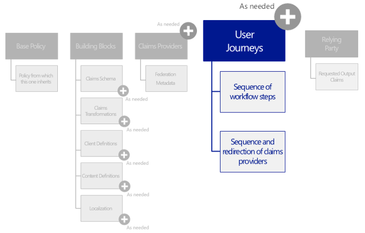

User journeys specify explicit paths through which a policy allows a
relying party application to obtain the desired claims for a user. The
user is taken through these paths to retrieve the claims that are to be
presented to the relying party. In other words, user journeys define the
business logic of what an end user goes through as the Azure AD B2C
Premium Identity Experience Engine processes the request.

These user journeys should essentially be considered as templates
available to satisfy the core need of the various replying parties of
the community of interest. As such, they greatly facilitate the
definition the relying party part of a policy (See next section).

A policy can define multiple user journeys. Each user journey is a
sequence of orchestration steps (see below). A policy needs to define
the user journey it enforces by picking one of them.

To define the user journeys supported by the policy, a *UserJourneys*
XML element must be declared under the top-level XML element of the
policy XML file. This element is optional.

This element contains the following XML element:

  XML element     Occurrences   Description
  --------------- ------------- --------------------------------------------------------------------------------------------
  *UserJourney*   1:n           Declare a user journey that defines all the constructs necessary for a complete user flow.

Each *UserJourney* XML elements contain in turn the following attribute:

  Attribute   Required   Description
  ----------- ---------- ---------------------------------------------------------------------------------------------------------------------------------------------------------------------------
  *Id*        True       Specify a machine understandable identifier that is used to uniquely identify a particular user journey, and reference it from other XML elements in the policy XML file.

And the following XML elements:

  -----------------------------------------------------------------------------------------------------------------------------------------------------------------------------------------------------------------------------------------------------------------------------------------------------------------------------------------------------------------------------------------------------------------------------
  XML element                   Occurrences   Description
  ----------------------------- ------------- ---------------------------------------------------------------------------------------------------------------------------------------------------------------------------------------------------------------------------------------------------------------------------------------------------------------------------------------------------------------------------------
  *AssuranceLevel*              0:1           Specify a measurement of identity assurance (LOA) when the claims are presented to the relying party at the conclusion of the orchestration steps contained in the user journey.

                                              Note: LOP is a privacy metric that is not yet widely adopted. In the absence of such a metric, the policy doesn’t include any specific information of privacy conformance level. A reference to the privacy policy may be simply specified in the policy documentation.

                                              Type: String

  *PreserveOriginalAssertion*   0:1           Specify if the original assertion should be preserved.

                                              Claims are presented to the relying party Application in a token generated by Azure AD B2C Premium. However, a user journey may state, using a true or a false for this element, that the original assertion which was returned from the claims provider(s) must also be preserved so that if needed, it can be looked at by relying party for auditing or diagnostic purposes.

                                              Type: Boolean

  *OrchestrationSteps*          0:1           Specify an orchestration sequence that must be followed through for a successful transaction, i.e. a complete user flow. Thus, every user journey consists of an ordered list of orchestration steps that are executed in sequence. If any step fails, the transaction fails. See later in this document.

  *ClientDefinition*            0:1           Reference settings definition section that determines the client behavior.

  *CryptographicKeys*           0:1           Specify a list of cryptographic keys used in this user journey.
  -----------------------------------------------------------------------------------------------------------------------------------------------------------------------------------------------------------------------------------------------------------------------------------------------------------------------------------------------------------------------------------------------------------------------------

These elements may be declared for any given user journey.

The *ClientDefinition* XML element in the above table contains the
following XML attribute:

  Attribute       Required   Description
  --------------- ---------- ------------------------------------------------
  *ReferenceId*   True       Reference the identifier of the policy to use.

The *CryptographicKeys* XML element in the above table contains the
following XML elements:

  ---------------------------------------------------------------------------------------------------------------------------------------------------------------------------------------------------------------------------------------------------------------------------
  XML element   Occurrences   Description
  ------------- ------------- -----------------------------------------------------------------------------------------------------------------------------------------------------------------------------------------------------------------------------------------------
  *Key*         1:n           Represent a cryptographic key that are used within the policy. Since this is a sensitive secret, the actual cryptographic key is stored outside of the policy and would generally reside in a system deemed secure for cryptographic storage.

                              For additional information, see section § *Managing your key containers for Trust Framework (policies)* in the third part of this series of document.
  ---------------------------------------------------------------------------------------------------------------------------------------------------------------------------------------------------------------------------------------------------------------------------

The subsections describe how to define a user journey via the
*UserJourney* XML element – along with the other XML sub-elements - that
specifically represents a given user journey supported by the considered
policy.

Providing property information for a given user journey
-------------------------------------------------------

As illustrated above, the information property for a given technical
policy are conveyed by some of the mandatory nested XML element of the
*UserJourney* XML element. More specifically, to provide such an
information, the *Id*, *AssuranceLevel*, and *PreserveOriginalAssertion*
XML elements should be filled in.

The following XML snippet illustrates the property information for a
given user journey:

&lt;?xml version="1.0" encoding="utf-8"?&gt;

&lt;TrustFrameworkPolicy
xmlns:xsi="http://www.w3.org/2001/XMLSchema-instance"

xmlns:xsd="http://www.w3.org/2001/XMLSchema"

xmlns="http://schemas.microsoft.com/online/cpim/schemas/2013/06"

PolicySchemaVersion="0.3.0.0"

…&gt;

…

&lt;UserJourneys&gt;

&lt;UserJourney Id="B2CSignUp\_2FA"&gt;

&lt;AssuranceLevel&gt;FAL-2&lt;/AssuranceLevel&gt;

&lt;PreserveOriginalAssertion&gt;true&lt;/PreserveOriginalAssertion&gt;

…

&lt;/UserJourney&gt;

…

&lt;/UserJourneys&gt;

…

&lt;/TrustFrameworkPolicy&gt;

Specifying the orchestration steps for a given user journey
-----------------------------------------------------------

To support the given type of transaction, a user journey is further
represented as an orchestration sequence that must be followed through
for a successful transaction. Thus, every user journey consistent of an
ordered list of *orchestration steps* that are executed in sequence. If
any step fails, the transaction fails.

These orchestration steps reference both the building blocks and the
claims providers allowed in the policy XML file. Any orchestration step
that is responsible to show/render end-user user experience also has a
reference to the corresponding content definition identifier (see
section § *Specifying the content definitions* earlier in this
document).

To specify the ordered list of orchestration steps, an
*OrchestrationSteps* XML element must be declared as part of the policy.
This element is mandatory.

This element contains the following XML element:

  XML element           Occurrences   Description
  --------------------- ------------- ----------------------------------------------------------------------------------------------------
  *OrchestrationStep*   1:n           Define a given ordered orchestration step in the overall technical policy choreography to sustain.

**A user journey contains at least an orchestration step.**

Each orchestration step is modelled by an *OrchestrationStep* XML
element. This element contains the following attributes:

  -------------------------------------------------------------------------------------------------------------------------------------------------------------------------------------------------------------------------------------------------------
  Attribute                                 Required   Description
  ----------------------------------------- ---------- --------------------------------------------------------------------------------------------------------------------------------------------------------------------------------------------------
  *Order*                                   Yes        Specify the order in list of orchestration steps.

                                                       Type: Number

  *Type*                                    *Yes*      Specify the type of the orchestration step.

                                                       Type: String (enumeration)

                                                       Value: one of the following types as per *OrchestrationStepType* enumeration in the Azure AD B2C Premium XML schema:

                                                       -   **ConsentScreen**. Indicate that the orchestration step presents text to the user to which the user must consent.

                                                       -   **ClaimsProviderSelection**. Indicate that the orchestration step presents various claims providers to the user for the user to select one.

                                                       -   **CombinedSignInAndSignUp**. Indicate that the orchestration step presents a combined social provider sign-in and local account sign-up page.

                                                       -   **ClaimsExchange**. Indicate that the orchestration step exchanges claims with a claims provider.

                                                       -   **ReviewScreen**. Indicates that the orchestration step presents a review screen for the user to review the claims which the user must accept.

                                                       -   **SendClaims**. Indicate that the orchestration step sends the claims to the relying party with a token issued by a claims issuer.

                                                       -   **UserDialog**. Indicates that the orchestration step presents a user dialog to the user for the capturing of information.

                                                       -   **Noop**. Indicate that the orchestration step does nothing and is included to cope with errors in layering.

  *ContentDefinitionReferenceId*            *No*       Specify a valid content identifier for a reference to an external content that the orchestration step can display to the user.

                                                       Due to formatting and localization concerns Azure AD B2C Premium has to deal with, this enables representing the actual content in a more suitable medium, such as an HTML page or a document.

                                                       Type: String

  *CpimIssuerTechnicalProfileReferenceId*   *No*       Used on *SendClaims* steps to define the technical profile identifier of the claims provider that will issue the token for the relying party. If absent, no relying party token will be created.

                                                       Type: String
  -------------------------------------------------------------------------------------------------------------------------------------------------------------------------------------------------------------------------------------------------------

The above five types of orchestration steps may occur multiple times in
the ordered list.

Each *OrchestrationStep* XML element also contains the following XML
elements depending on its type:

  XML element                  Occurrences   Description
  ---------------------------- ------------- ----------------------------------------------------------------------------------------------
  *Preconditions*              0:n           Define a list of preconditions that must be satisfied for the orchestration step to execute.
  *ClaimsProviderSelections*   0:n           Define a list of claims provider selection options for the orchestration step.
  *ClaimsExchanges*            0:n           Define a list of claims exchanges for the orchestration step.

The *Preconditions* XML element contains the following XML element:

  XML element      Occurrences   Description
  ---------------- ------------- ------------------------------------------------------------------------------------------------------------------------------------------------------------------------------------------------------------
  *Precondition*   0:n           Depending on the technical profile being used, either redirect the user’s client corresponding to the claims provider selection that the user may have selected, or make a server call to exchange claims.

Each *Precondition* XML element contains the following attributes:

  ---------------------------------------------------------------------------------------------------------------------------------------------------------------------------------
  Attribute            Required   Description
  -------------------- ---------- -------------------------------------------------------------------------------------------------------------------------------------------------
  *Type*               Yes        Specify the type of check or query to perform for this precondition to perform.

                                  Type: String

                                  Value: one of the following types as per *PreconditionType* enumeration in the Azure AD B2C Premium XML schema:

                                  -   **ClaimsExist**. Specify that the actions should be performed if the specified claims exist in the user's current claim set.

                                  -   **ClaimEquals**. Specify that the actions should be performed if the specified claim exists and its values is equal to the specified value.

  *ExecuteActionsIf*   Yes        Specify if the actions in this precondition should be performed if the test is true or false.

                                  Value: Boolean
  ---------------------------------------------------------------------------------------------------------------------------------------------------------------------------------

And the following XML elements:

  ---------------------------------------------------------------------------------------------------------------------------------------------------------------------------------------------------
  XML element   Occurrences   Description
  ------------- ------------- -----------------------------------------------------------------------------------------------------------------------------------------------------------------------
  *Value*       1:n           Specify the data that is used by the check. For example, if the Type of this check is **ClaimsExist**, this field will specify a *ClaimTypeReferenceId* to query for.

  *Action*      1:n           Specify the action that should be taken if the precondition check within an orchestration step is true.

                              Value: one of the following types as per *PreconditionActionType* enumeration in the Azure AD B2C Premium XML schema:

                              -   **SkipThisOrchestrationStep**. Specify that the associated OrchestrationStep should not be executed.

  ---------------------------------------------------------------------------------------------------------------------------------------------------------------------------------------------------

The following XML code snippet illustrates the use of the
*Preconditions* XML elements:

&lt;/Preconditions&gt;

&lt;Precondition Type="ClaimEquals" ExecuteActionsIf="true"&gt;

&lt;Value&gt;authenticationSource&lt;/Value&gt;

&lt;Value&gt;socialIdpAuthentication&lt;/Value&gt;

&lt;Action&gt;SkipThisOrchestrationStep&lt;/Action&gt;

&lt;/Precondition&gt;

&lt;/Preconditions&gt;

The *ClaimsProviderSelections* XML element contains the following XML
element:

  XML element                 Occurrences   Description
  --------------------------- ------------- -----------------------------------------------------------------------------------
  *ClaimsProviderSelection*   0:n           Shows options for the selection between various claims providers in a given step.

Each *ClaimsProviderSelection* XML element contains the following
attribute:

  ------------------------------------------------------------------------------------------------------------------------------------------------------------------------------------------------------------
  Attribute                      Required   Description
  ------------------------------ ---------- ------------------------------------------------------------------------------------------------------------------------------------------------------------------
  *TargetClaimsExchangeId*       False      Specify a machine understandable identifier that is used to uniquely identify this particular claims exchange step, and reference it in a given step.

                                            Type: String

  *ValidationClaimsExchangeId*   False      Specify a machine understandable identifier that is used to uniquely identify this particular validation claims exchange step, and reference it in a given step.

                                            Type: String
  ------------------------------------------------------------------------------------------------------------------------------------------------------------------------------------------------------------

The *ClaimsExchanges* XML element contains the following attribute:

  -------------------------------------------------------------
  Attribute        Required   Description
  ---------------- ---------- ---------------------------------
  *UserIdentity*   False      TBD.

                              Value: Boolean (default: false)
  -------------------------------------------------------------

Along with the following XML element:

  XML element        Occurrences   Description
  ------------------ ------------- -------------------------------------------------------------------------------------------------------------------------------------------------------------------------------------------------------------
  *ClaimsExchange*   0:n           Depending on the technical profile being used, either redirect the user’s client corresponding to the *ClaimsProviderSelection* that the user may have selected, or makes a server call to exchange claims.

Each *ClaimsExchange* XML element contains in turn the following
attributes:

  Attribute                       Required   Description
  ------------------------------- ---------- ----------------------------------------------------------------------------------------------------------------------------------------------------------------------------------------------------
  *Id*                            True       Specify a machine understandable identifier that is used to uniquely identify this particular claims exchange step, and reference it from a claims provider selection step in the policy XML file.
  *TechnicalProfileReferenceId*   True       Specify the unique identifier of the technical profile which is used for claims exchange.

The usage of the above XML elements is illustrated in the next sections.

The following XML snippet illustrates how to specify multiple
orchestration steps (three in this case):

&lt;?xml version="1.0" encoding="utf-8"?&gt;

&lt;TrustFrameworkPolicy
xmlns:xsi="http://www.w3.org/2001/XMLSchema-instance"

xmlns:xsd="http://www.w3.org/2001/XMLSchema"

xmlns="http://schemas.microsoft.com/online/cpim/schemas/2013/06"

PolicySchemaVersion="0.3.0.0"

…&gt;

…

&lt;UserJourneys&gt;

&lt;UserJourney Id="SomeUserJourney"&gt;

…

&lt;OrchestrationSteps&gt;

&lt;OrchestrationStep Order="1" Type="ClaimsProviderSelection"&gt;

…

&lt;/OrchestrationStep&gt;

&lt;OrchestrationStep Order="2" Type=“ClaimsExchange"&gt;

…

&lt;/OrchestrationStep&gt;

&lt;OrchestrationStep Order="3" Type=“ClaimsExchange"&gt;

…

&lt;/OrchestrationStep&gt;

&lt;OrchestrationStep Order="4" Type="SendClaims" … /&gt;

&lt;OrchestrationSteps&gt;

&lt;/UserJourney&gt;

…

&lt;/UserJourneys&gt;

…

&lt;/TrustFrameworkPolicy&gt;

The following sections provides additional information on these XML
elements along with a XML code snippet to illustrate how to create such
elements.

### Displaying a consent screen

To display a consent screen to user as part of the explicit path
definition of a given user journey, an *OrchestrationStep* XML element
of type *ConsentScreen* should be added to the list of the orchestration
steps of the journey.

This element must contain the *ContentDefinitionReferenceId* attribute
that refer to the content definition to use.

The following XML snippet illustrates how to display a consent screen:

&lt;?xml version="1.0" encoding="utf-8"?&gt;

&lt;TrustFrameworkPolicy
xmlns:xsi="http://www.w3.org/2001/XMLSchema-instance"

xmlns:xsd="http://www.w3.org/2001/XMLSchema"

xmlns="http://schemas.microsoft.com/online/cpim/schemas/2013/06"

PolicySchemaVersion="0.3.0.0"

…&gt;

…

&lt;UserJourneys&gt;

&lt;UserJourney Id="B2CSignUp\_2FA"&gt;

…

&lt;OrchestrationSteps&gt;

&lt;OrchestrationStep Order="1" Type="ConsentScreen"
ContentDefinitionReferenceId="api.consent"&gt;

…

&lt;OrchestrationSteps&gt;

&lt;/UserJourney&gt;

…

&lt;/UserJourneys&gt;

…

&lt;/TrustFrameworkPolicy&gt;

### Selecting a claims provider

This is a classic *Home Realm Discovery* (HRD)/*Where Are You From*
(WAYF) screen. It is required when multiple identity providers are
supported for a given user journey.

To give an option to the user to select one of the accredited claims
providers to get claims from as part of the explicit path definition of
a given user journey, an *OrchestrationStep* XML element of type
*ClaimsProviderSelection* should be added to the list of the
orchestration steps of the journey.

This element must contain the *ContentDefinitionReferenceId* attribute
that refer to the content definition to use. This element may also
contain a *ClaimsProviderSelections* XML element.

The following XML snippet illustrates how to select a claims provider:

&lt;?xml version="1.0" encoding="utf-8"?&gt;

&lt;TrustFrameworkPolicy
xmlns:xsi="http://www.w3.org/2001/XMLSchema-instance"

xmlns:xsd="http://www.w3.org/2001/XMLSchema"

xmlns="http://schemas.microsoft.com/online/cpim/schemas/2013/06"

PolicySchemaVersion="0.3.0.0"

…&gt;

…

&lt;UserJourneys&gt;

&lt;UserJourney Id="SomeUserJourney"&gt;

…

&lt;OrchestrationSteps&gt;

&lt;OrchestrationStep Order="1" Type="ClaimsProviderSelection"
ContentDefinitionReferenceId="api.idpselections"&gt;

&lt;ClaimsProviderSelections&gt;

&lt;ClaimsProviderSelection
TargetClaimsExchangeId="SignUpWithLogonEmailExchange" /&gt;

&lt;ClaimsProviderSelection TargetClaimsExchangeId="GoogleExchange"
/&gt;

&lt;/ClaimsProviderSelections&gt;

&lt;OrchestrationStep&gt;

…

&lt;OrchestrationSteps&gt;

&lt;/UserJourney&gt;

…

&lt;/UserJourneys&gt;

…

&lt;/TrustFrameworkPolicy&gt;

### Displaying a combined social provider sign-in and local account sign-up page

To display a combined social provider sign-in and local account sign-up
page to user as part of the explicit path definition of a given user
journey, an *OrchestrationStep* XML element of type
*CombinedSignInAndSignUp* should be added to the list of the
orchestration steps of the journey. This element may contain a nested
*ClaimsExchanges* XML element. This element is covered in the next
section.

The following XML snippet illustrates how to display a combined social
provider sign-in and local account sign-up page to user:

&lt;?xml version="1.0" encoding="utf-8"?&gt;

&lt;TrustFrameworkPolicy
xmlns:xsi="http://www.w3.org/2001/XMLSchema-instance"

xmlns:xsd="http://www.w3.org/2001/XMLSchema"

xmlns="http://schemas.microsoft.com/online/cpim/schemas/2013/06"

PolicySchemaVersion="0.3.0.0"

…&gt;

…

&lt;UserJourneys&gt;

&lt;UserJourney Id="SomeUserJourney"&gt;

…

&lt;OrchestrationSteps&gt;

&lt;OrchestrationStep Order="1" Type="CombinedSignInAndSignUp"
ContentDefinitionReferenceId="api.signinandsignup"&gt;

&lt;ClaimsExchanges&gt;

&lt;ClaimsExchange Id="LogonDiscovery"
TechnicalProfileReferenceId="SelfAsserted-LogonIdentifierDiscovery"
/&gt;

&lt;/ClaimsExchanges&gt;

&lt;/OrchestrationStep&gt;

…

&lt;OrchestrationSteps&gt;

&lt;/UserJourney&gt;

…

&lt;/UserJourneys&gt;

…

&lt;/TrustFrameworkPolicy&gt;

### Exchanging claims with a claims provider

To exchange claims with a claims provider as part of the explicit path
definition of a given user journey, an *OrchestrationStep* XML element
of type *ClaimsExchange* should be added to the list of the
orchestration steps of the journey.

The type *ClaimsExchange* encompasses the following orchestration steps
of the journey:

1.  **Federate with an identity provider**. Either there is a single
    > identity provider to use or an *ClaimsProviderSelections*
    > orchestration step gives the end-user selection. So this step is
    > modelled as a *ClaimsExchange* orchestration step.

2.  **Read/Write to a directory provider**. Directory provider such as
    > Azure AD is also modelled as a claims provider. So this step is
    > also modelled as a *ClaimsExchange* orchestration step.

3.  **Read/Write to an attribute provider/verifier**. Attribute
    > providers/verifiers are also modelled as a claims provider. So
    > this step is modelled as a *ClaimsExchange* orchestration step.

4.  **Collect user asserted attributes**. Collecting user entered
    > information in the flows is very common, e.g. collecting
    > application specific information during a sign-up user journey. In
    > such a context, self-asserted attributes’ claims provider is also
    > modelled as a *ClaimsExchange* orchestration step. This step shows
    > a UI.

5.  **Step up with multifactor authentication (MFA)**. Modelled a
    > PhoneFactor-proxy provider as a claims provider, so this is a
    > *ClaimsExchange* orchestration step as well. In order to call the
    > phone or allow phone input during registration, this step also
    > shows a UI.

This *OrchestrationStep* XML element of type *ClaimsExchange* may
contain a *Preconditions* XML element and must contain a
*ClaimsExchanges* XML element.

The following XML snippet illustrates how to exchange claims with a
claims provider:

&lt;?xml version="1.0" encoding="utf-8"?&gt;

&lt;TrustFrameworkPolicy
xmlns:xsi="http://www.w3.org/2001/XMLSchema-instance"

xmlns:xsd="http://www.w3.org/2001/XMLSchema"

xmlns="http://schemas.microsoft.com/online/cpim/schemas/2013/06"

PolicySchemaVersion="0.3.0.0"

…&gt;

…

&lt;UserJourneys&gt;

&lt;UserJourney Id="SomeUserJourney"&gt;

…

&lt;OrchestrationSteps&gt;

…

&lt;OrchestrationStep Order="2" Type="ClaimsExchange"&gt;

&lt;ClaimsExchanges&gt;

&lt;ClaimsExchange Id="SignUpWithLogonEmailExchange"

TechnicalProfileReferenceId="LocalAccountSignUpWithLogonEmail" /&gt;

&lt;ClaimsExchange Id="GoogleExchange"
TechnicalProfileReferenceId="Google-OAuth2" /&gt;

&lt;/ClaimsExchanges&gt;

&lt;/OrchestrationStep&gt;

…

&lt;OrchestrationSteps&gt;

&lt;/UserJourney&gt;

…

&lt;/UserJourneys&gt;

…

&lt;/TrustFrameworkPolicy&gt;

### Displaying a review screen

To display a review screen to user as part of the explicit path
definition of a given user journey, an *OrchestrationStep* XML element
of type *ReviewScreen* should be added to the list of the orchestration
steps of the journey.

The following XML snippet illustrates how to display a review screen:

&lt;?xml version="1.0" encoding="utf-8"?&gt;

&lt;TrustFrameworkPolicy
xmlns:xsi="http://www.w3.org/2001/XMLSchema-instance"

xmlns:xsd="http://www.w3.org/2001/XMLSchema"

xmlns="http://schemas.microsoft.com/online/cpim/schemas/2013/06"

PolicySchemaVersion="0.3.0.0"

…&gt;

…

&lt;UserJourneys&gt;

&lt;UserJourney Id="B2CSignUp\_2FA"&gt;

…

&lt;OrchestrationSteps&gt;

&lt;OrchestrationStep Order="1" Type="ReviewScreen"&gt;

…

&lt;/OrchestrationStep&gt;

…

&lt;OrchestrationSteps&gt;

&lt;/UserJourney&gt;

…

&lt;/UserJourneys&gt;

…

&lt;/TrustFrameworkPolicy&gt;

### Sending claims with a token issued by a claims issuer

To send claims with a token issued by a claims issuer as part of the
explicit path definition of a given user journey, an *OrchestrationStep*
XML element of type *SendClaims* should be added to the list of the
orchestration steps of the journey. This element must contain the
*CpimIssuerTechnicalProfileReferenceId* attribute that refer to the
claims issuer to use.

The XML element generally constitute the last step of a given user
journey.

The following XML snippet illustrates how to exchange claims with a
claims provider:

&lt;?xml version="1.0" encoding="utf-8"?&gt;

&lt;TrustFrameworkPolicy
xmlns:xsi="http://www.w3.org/2001/XMLSchema-instance"

xmlns:xsd="http://www.w3.org/2001/XMLSchema"

xmlns="http://schemas.microsoft.com/online/cpim/schemas/2013/06"

PolicySchemaVersion="0.3.0.0"

…&gt;

…

&lt;UserJourneys&gt;

&lt;UserJourney Id="SomeUserJourney"&gt;

…

&lt;OrchestrationSteps&gt;

…

&lt;OrchestrationStep Order="8" Type="SendClaims"
CpimIssuerTechnicalProfileReferenceId="JwtIssuer" /&gt;

&lt;OrchestrationSteps&gt;

&lt;/UserJourney&gt;

…

&lt;/UserJourneys&gt;

…

&lt;/TrustFrameworkPolicy&gt;

### Displaying a dialog

To display a user dialog to collect information as part of the explicit
path definition of a given user journey, an *OrchestrationStep* XML
element of type *UserDialog* should be added to the list of the
orchestration steps of the journey.

The following XML snippet illustrates how to display a review screen:

&lt;?xml version="1.0" encoding="utf-8"?&gt;

&lt;TrustFrameworkPolicy
xmlns:xsi="http://www.w3.org/2001/XMLSchema-instance"

xmlns:xsd="http://www.w3.org/2001/XMLSchema"

xmlns="http://schemas.microsoft.com/online/cpim/schemas/2013/06"

PolicySchemaVersion="0.3.0.0"

…&gt;

…

&lt;UserJourneys&gt;

&lt;UserJourney Id="SomeUserJourney"&gt;

…

&lt;OrchestrationSteps&gt;

&lt;OrchestrationStep Order="1" Type="UserDialog"&gt;

…

&lt;/OrchestrationStep&gt;

…

&lt;OrchestrationSteps&gt;

&lt;/UserJourney&gt;

…

&lt;/UserJourneys&gt;

…

&lt;/TrustFrameworkPolicy&gt;

### Coping with errors

To cope with errors as part of the explicit path definition of a given
user journey, an *OrchestrationStep* XML element of type *Noop* should
be added to the list of the orchestration steps of the journey.

The following XML snippet illustrates how to display a review screen:

&lt;?xml version="1.0" encoding="utf-8"?&gt;

&lt;TrustFrameworkPolicy
xmlns:xsi="http://www.w3.org/2001/XMLSchema-instance"

xmlns:xsd="http://www.w3.org/2001/XMLSchema"

xmlns="http://schemas.microsoft.com/online/cpim/schemas/2013/06"

PolicySchemaVersion="0.3.0.0"

…&gt;

…

&lt;UserJourneys&gt;

&lt;UserJourney Id="SomeUserJourney"&gt;

…

&lt;OrchestrationSteps&gt;

&lt;OrchestrationStep Order="1" Type="Noop"&gt;

…

&lt;/OrchestrationStep&gt;

…

&lt;OrchestrationSteps&gt;

&lt;/UserJourney&gt;

…

&lt;/UserJourneys&gt;

…

&lt;/TrustFrameworkPolicy&gt;

Specifying the relying party
============================

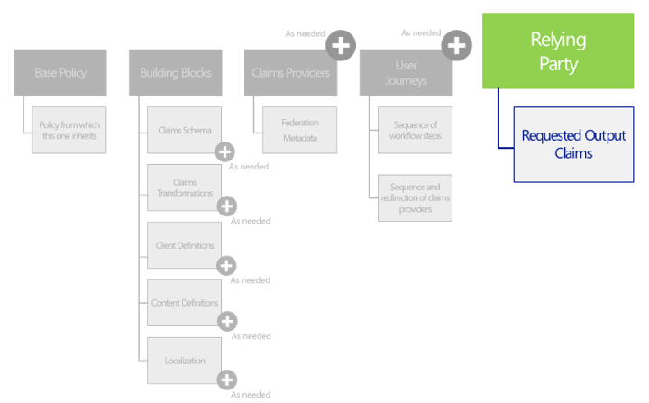

The relying party information chooses the user journey to enforce for
the current request. It also chooses the list of claims the relying
party application would like to get as part of the issued token.

Multiple applications can use a given policy. They will all receive the
same token with claims and the end user will go through the same user
journey.

Conversely, a single application can use multiple policies. This allows
the application to achieve functionality such as basic sign-in, step-up,
sign-up, etc.

To specify the relying party information, a *Relying Party* XML element
must be declared must be declared under the top-level XML element of the
policy XML file. This element is optional.

This element contains the following XML elements:

  XML element              Occurrences   Description
  ------------------------ ------------- -----------------------------------------------------------------------------------------------------------------------------------------------------------------------------------------------------
  *DefaultUserJourney*     0:1           Define the default user journey for the relying party application.
  *UserJourneyBehaviors*   0:1           Control the scope of various user journey behaviors.
  *TechnicalProfile*       0:1           Define a technical profile supported by the relying party application. The technical profile provides in this context a contract for the relying party application to contact Azure AD B2C Premium.

These above *DefaultUserJourney* and *TechnicalProfile* elements must be
declared for any given *RelyingParty* XML element.

The *DefaultUserJourney* XML element contains in turn the following
attribute:

  Attribute       Required   Description
  --------------- ---------- ----------------------------------------------------------------------------------------------------------------------------------
  *ReferenceId*   True       Specify a machine understandable identifier that is used to uniquely reference a particular user journey in the policy XML file.

The *UserJourneyBehaviors* XML element contains the following XML
elements:

  ----------------------------------------------------------------------------------------------------------------------------------------------------------------------------------------------------------------------------------------------------------------------------
  XML element                     Occurrences   Description
  ------------------------------- ------------- ------------------------------------------------------------------------------------------------------------------------------------------------------------------------------------------------------------------------------
  *SingleSignOn*                  0:1           Control the scope of the single sign-on (SSO) behavior of a user journey.

  *SessionExpiryType*             0:1           Control the whether the session is rolling or absolute.

                                                Value: one of the following value as per *SessionExpiryTypeTYPE* enumeration in the Azure AD B2C Premium XML schema for the names of the valid values the single sign-on session type:

                                                -   **Rolling**.

                                                -   **Absolute**.

  *SessionExpiryInSeconds*        0:1           Control the time of the session expiry in seconds.

                                                Value: Integer

  *AzureApplicationInsights*      0:1           Specify the Microsoft Azure Application Insights instrumentation key to be used in the application insights JavaScript.

                                                For additional information, see the [Visual Studio Application Insights documentation](https://azure.microsoft.com/en-us/documentation/services/application-insights/).

  *ContentDefinitionParameters*   0:1           Specify the list of key value pairs to be appended to the content definition load Uri.
  ----------------------------------------------------------------------------------------------------------------------------------------------------------------------------------------------------------------------------------------------------------------------------

The *SingleSignOn* XML element contains in turn the following attribute:

  ------------------------------------------------------------------------------------------------------------------------------------------------------------------------------------------------------------------------------------------------------------------------------------
  Attribute   Required   Description
  ----------- ---------- -------------------------------------------------------------------------------------------------------------------------------------------------------------------------------------------------------------------------------------------------------------
  *Scope*     True       Define the scope of the single sign-on behavior.

                         Value: one of the following value as per *UserJourneyBehaviorScopeType* enumeration in the Azure AD B2C Premium XML schema:

                         -   **Suppressed**. Indicate that the behavior is suppressed. For example in the case of SSO, no session is maintained for the user and the user will always be prompted for identity provider selection.

                         -   **TrustFramework**. Indicate that the behavior is applied for all policies in the trust framework. For example, a user being put through two policy journeys for a given trust framework will not be prompted for identity provider selection.

                         -   **Tenant**. Indicates that the behavior is applied for all policies in the tenant. For example, a user being put through two policy journeys for a given tenant will not be prompted for identity provider selection.

                         -   **Application**. Indicate that the behavior is applied for all policies for the application making the request. For example, a user being put through two policy journeys for a given application will not be prompted for identity provider selection.

                         -   **Policy**. Indicate that the behavior only applies to a policy. For example, a user being put through two policy journeys for a given trust framework will be prompted for identity provider selection when switching between policies.

  ------------------------------------------------------------------------------------------------------------------------------------------------------------------------------------------------------------------------------------------------------------------------------------

The *AzureApplicationInsights* XML element contains in turn the
following attribute:

  --------------------------------------------------------------------------------------------------------
  Attribute              Required   Description
  ---------------------- ---------- ----------------------------------------------------------------------
  *InstrumentationKey*   True       Define the instrumentation key for the application insights element.

                                    Value: String
  --------------------------------------------------------------------------------------------------------

The *ContentDefinitionParameters* XML element contains the following XML
elements:

  -------------------------------------------------------------------------------------------------------------------------------------------------
  XML element                    Occurrences   Description
  ------------------------------ ------------- ----------------------------------------------------------------------------------------------------
  *ContentDefinitionParameter*   0:n           Define a key value pair that is to be appended to the query string of content definition load Uri.

                                               Type: String
  -------------------------------------------------------------------------------------------------------------------------------------------------

The *ContentDefinitionParameter* XML element contains in turn the
following attribute:

  Attribute   Required   Description
  ----------- ---------- -----------------------------------------
  *Name*      True       Specify the name of the key value pair.

The *TechnicalProfile* XML element basically follows the structure
outlined before for a technical profile. Thus, it contains in turn the
following attributes:

  Attribute   Required   Description
  ----------- ---------- --------------------------------------------------------------------------------------------------------------------------------------
  *Id*        True       Specify a machine understandable identifier that is used to uniquely identify a particular technical profile in the policy XML file.

And the following XML elements:

  ----------------------------------------------------------------------------------------------------------------------------------------------------------------------------------------------------------------------------------------------------------------------------------------------------------------------
  XML element                           Occurrences   Description
  ------------------------------------- ------------- ------------------------------------------------------------------------------------------------------------------------------------------------------------------------------------------------------------------------------------------------------------------
  *DisplayName*                         0:1           Specify the human understandable name of the technical profile that can be displayed to the users.

                                                      Type: String

  *Description*                         0:1           Specify a human understandable description of the technical profile that can be displayed to the users.

                                                      Type: String

  *Protocol*                            0:1           Specify the protocol used for the federation.

  *Metadata*                            1:1           Specify the metadata utilized by the protocol for communicating with the endpoint in the course of a transaction to plumb “on the wire” interoperability between the relying party and other community participants.

                                                      Type: collection of *Item* of key/value pairs.

  *OutputClaims*                        0:1           Specify an optional list of the claim types that are taken as output in the technical profile. Each of these elements contains reference to a *ClaimType* already defined in the *ClaimsSchema* section or in a policy from which this policy XML file inherits.

  *OutputTokenFormat*                   0:1           Specify the format of the output token.

                                                      Type: String (enumeration)

                                                      Value: one of the following types as per *TokenFormat* enumeration in the Azure AD B2C Premium XML schema. See above.

  *SubjectAuthenticationRequirements*   0:1           Specify the requirements regarding the conscious and active participation of the subject in authentication

  *SubjectNamingInfo*                   0:1           Control the production of the subject name in tokens (e.g. SAML) where subject name is specified separately from claims.
  ----------------------------------------------------------------------------------------------------------------------------------------------------------------------------------------------------------------------------------------------------------------------------------------------------------------------

The *Protocol* XML element in the above table contains the following
attributes:

  ----------------------------------------------------------------------------------------------------------------------------------------------
  Attribute   Required   Description
  ----------- ---------- -----------------------------------------------------------------------------------------------------------------------
  *Name*      True       Specify the name of a valid protocol supported by Azure AD B2C Premium that is used as part of the technical profile.

                         Type: String (enumeration)

                         Value: one of the following types as per *ProtocolName* enumeration in the Azure AD B2C Premium XML schema:

                         -   **OAuth1**. OAuth 1.0 protocol standard as per IETF specification.

                         <!-- -->

                         -   **OAuth2**. OAuth 2.0 protocol standard as per IETF specification.

                         -   **SAML2**. SAML 2.0 protocol standard as per OASIS specification.

                         -   **OpenIdConnect**. OpenID Connect 1.0 protocol standard as per OpenID foundation specification.

                         -   **WsFed**. WS-Federation (WS-Fed) 1.2 protocol standard as per OASIS specification.

                         -   **WsTrust**. WS-Trust 1.3 protocol standard as per OASIS specification.

  ----------------------------------------------------------------------------------------------------------------------------------------------

As already introduced, the *OutputClaims* XML elements contain the
following XML elements:

  XML element     Occurrences   Description
  --------------- ------------- ----------------------------------------------------------------------------------------------------------------------------------------------------------------------------------
  *OutputClaim*   0:n           Specify the name of an expected claim type in the supported list for the policy to which the relying party subscribes. This claim serves as an output for the technical profile.

Each *OutputClaim* XML element contains the following attributes:

  ------------------------------------------------------------------------------------------------------------------------------------------------
  Attribute                Required   Description
  ------------------------ ---------- ------------------------------------------------------------------------------------------------------------
  *ClaimTypeReferenceId*   True       Specify a reference to a *ClaimType* already defined in the *ClaimsSchema* section in the policy XML file.

                                      Type: String

  *DefaultValue *          False      Specify a default value if not set.

                                      Type: String

  *PartnerClaimType*       False      Specify the partner claim type.

                                      Type: String

  *Required*               False      Specify this claim is required.

                                      Type: String
  ------------------------------------------------------------------------------------------------------------------------------------------------

The *SubjectAuthenticationRequirements* XML element in the above table
contains the following attributes:

  -----------------------------------------------------------------------------------------------------------------------------------------------------------------------------------------------------------------------
  Attribute                      Required   Description
  ------------------------------ ---------- -----------------------------------------------------------------------------------------------------------------------------------------------------------------------------
  *TimeToLive*                   True       Specify the maximum number of minutes cached credentials can be used following an active authentication by the subject.

                                            Type: Integer

  *ResetExpiryWhenTokenIssued*   Optional   Specify how the expiry time is set.

                                            Type: Boolean. Default is False. If True then whenever a token is issued (even using a cached credential) the expiry time is set to the current time plus the *TimeToLive*.
  -----------------------------------------------------------------------------------------------------------------------------------------------------------------------------------------------------------------------

The *SubjectNamingInfo* XML element in the above table contains the
following attributes:

  -------------------------------------------------------------------------------------------------------------------------------------------
  Attribute           Required   Description
  ------------------- ---------- ------------------------------------------------------------------------------------------------------------
  *ClaimType*         True       Specify a reference to a *ClaimType* already defined in the *ClaimsSchema* section in the policy XML file.

                                 Type: String

  *NameQualifier*     False      Provide a description

                                 Type: String

  *SPNameQualifier*   False      Provide a description

                                 Type: String

  *Format*            False      Provide a description

                                 Type: String

  *SPProvidedID*      False      Provide a description

                                 Type: String
  -------------------------------------------------------------------------------------------------------------------------------------------

Considering the above explanation, the following XML snippet illustrates
how to define a relying party:

&lt;?xml version="1.0" encoding="utf-8"?&gt;

&lt;TrustFrameworkPolicy
xmlns:xsi="http://www.w3.org/2001/XMLSchema-instance"

xmlns:xsd="http://www.w3.org/2001/XMLSchema"

xmlns="http://schemas.microsoft.com/online/cpim/schemas/2013/06"

PublicPolicyUri="http://example.com"

PolicySchemaVersion="0.3.0.0"

TenantId="contoso369b2c.onmicrosoft.com"

PolicyId="B2C\_1A\_MsolActive"&gt;

&lt;BasePolicy&gt;

&lt;TenantId&gt;contoso369b2c.onmicrosoft.com&lt;/TenantId&gt;

&lt;PolicyId&gt;B2C\_1A\_base-v2&lt;/PolicyId&gt;

&lt;/BasePolicy&gt;

&lt;RelyingParty&gt;

&lt;DefaultUserJourney ReferenceId="ActiveRST"/&gt;

&lt;TechnicalProfile Id="PolicyProfile"&gt;

&lt;DisplayName&gt;WsFedProfile&lt;/DisplayName&gt;

&lt;Protocol Name="WsFed" /&gt;

&lt;OutputTokenFormat&gt;SAML11&lt;/OutputTokenFormat&gt;

&lt;SubjectAuthenticationRequirements TimeToLive="4"
ResetExpiryWhenTokenIssued="false" /&gt;

&lt;Metadata&gt;

&lt;Item Key="Saml2AttributeEncodingInfo"&gt;

&lt;!\[CDATA\[

&lt;saml2:AttributeStatement
xmlns:saml2="urn:oasis:names:tc:SAML:2.0:assertion"&gt;

&lt;saml2:Attribute FriendlyName="UserPrincipalName"

Name="IDPEmail"

NameFormat="urn:oasis:names:tc:SAML:2.0:attrname-format:uri"&gt;

&lt;saml2:AttributeValue
xmlns:xsi="http://www.w3.org/2001/XMLSchema-instance"
xsi:type="xs:string"&gt;

&lt;/saml2:AttributeValue&gt;

&lt;/saml2:Attribute&gt;

&lt;/saml2:AttributeStatement&gt;

\]\]&gt;

&lt;/Item&gt;

&lt;Item Key="Saml11AttributeEncodingInfo"&gt;

&lt;!\[CDATA\[

&lt;saml:AttributeStatement
xmlns:saml="urn:oasis:names:tc:SAML:1.0:assertion"&gt;

&lt;saml:Attribute AttributeName="ImmutableID"

AttributeNamespace="http://schemas.microsoft.com/LiveID/Federation/2008/05"&gt;

&lt;saml:AttributeValue&gt;&lt;/saml:AttributeValue&gt;

&lt;/saml:Attribute&gt;

&lt;saml:Attribute AttributeName="UPN"
AttributeNamespace="http://schemas.xmlsoap.org/claims"&gt;

&lt;saml:AttributeValue&gt;&lt;/saml:AttributeValue&gt;

&lt;/saml:Attribute&gt;

&lt;/saml:AttributeStatement&gt;

\]\]&gt;

&lt;/Item&gt;

&lt;Item
Key="PartnerEntity"&gt;https://www.contoso369b2c.com/wp-content/uploads/2015/01/metadata.xml&lt;/Item&gt;

&lt;Item Key="client\_id"&gt;customClientId&lt;/Item&gt;

&lt;/Metadata&gt;

&lt;OutputClaims&gt;

&lt;OutputClaim ClaimTypeReferenceId="immutableId"
PartnerClaimType="ImmutableID" /&gt;

&lt;OutputClaim ClaimTypeReferenceId="userPrincipalName"
PartnerClaimType="UPN" /&gt;

&lt;OutputClaim ClaimTypeReferenceId="AuthenticationContext"
DefaultValue="urn:federation:authentication:windows" /&gt;

&lt;/OutputClaims&gt;

&lt;SubjectNamingInfo ClaimType="immutableId" /&gt;

&lt;/TechnicalProfile&gt;

&lt;/RelyingParty&gt;

&lt;/TrustFrameworkPolicy&gt;

Appendix A. Trust Framework Policy XML schema and tools
=======================================================

Trust Framework Policy XML Schema
---------------------------------

The Trust Framework policy XML schema is provided as part of the
“Starter Pack” of Azure AD B2C Premium”. **The second part of the series
of documents depicts how to proceed to get started with the “Starter
Pack” of Azure AD B2C Premium.**

The Trust Framework policy XML schema file
*TrustFrameworkPolicy\_0.3.0.0.xsd* is located under the path *B2C
policies*\\*Advanced Policies Starter pack* of the *Starter-Pack* folder
of the “Starter Pack”.

Generating .NET Classes for serialization/deserialization purposes
------------------------------------------------------------------

To generate the .NET classes for serialization/deserialization purposes
based on the aforementioned schemas, proceed with the following steps:

1.  Open a Visual Studio native tools command prompt.

2.  From the command prompt, type the following command:

xsd /n:Microsoft.Cpim.Common.Persistence.Autogenerated /classes
TrustFrameworkPolicy\_0.3.0.0.xsd

Installing XML tooling for editing the policy XML files
-------------------------------------------------------

This optional section suggests some XML tooling to leverage for editing
the policy XML files, and more particularly Notepad++ with XML Tools and
the XML Notepad. However, nothing prevents you to also use any text
editor of your choice, such as Notepad, but these tools make XML editing
easier.

### Using Notepad++ with XML Tools

To set up Notepad++ with XML Tools, proceed with the following steps:

1.  Open a browsing session and navigate to
    *<https://notepad-plus-plus.org/download>.*

2.  Click **Download** to install the latest version (6.9.2 as of this
    writing).

3.  Confirm the download of the file *npp.6.9.2.Installer.exe* and
    execute it.

4.  After the installation completes, run Notepad++.

5.  Click **Plugins | Plugin Manager | Show Plugin Manager**.

6.  From the list, select **XML Tools**.

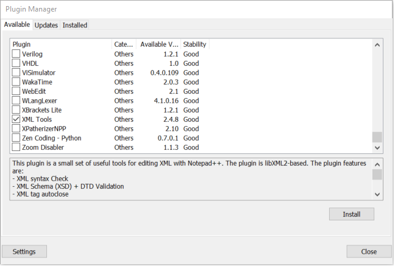 

1.  Click **Install**. The download and the installation of the selected
    > plugin starts.

2.  Restart Notepad++ to complete the installation steps.

After the installation of the plugin completes, you should be able to
click **Plugins** menu option in Notepad++ and see a new option **XML
Tools** appear.

To validate a policy using the provided XML schema file with the premium
policies of the “Starter Pack”, proceed with the following steps:

1.  Click **File | Open** and open the
    &lt;*your\_B2C\_tenant*&gt;*.onmicrosoft.com\_b2c\_1a\_base.xml*
    policy XML file from the “Started Pack” where *your\_B2C\_tenant* is
    the name of your tenant, for example *contoso369b2c* in our
    illustration: *contoso369b2c.onmicrosoft.com\_b2c\_1a\_base.xml*.

2.  Click **Plugins | XML Tools | Validate Now**. A **Select file…**
    > dialog pops up.

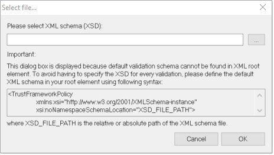

1.  Specify the path to the XML schema file
    > *TrustFrameworkPolicy\_0.3.0.0.xsd* under the *Starter-Pack*
    > folder in the text box, and then click **OK**.

2.  A message box should show stating “XML Schema validation: XML is
    > valid.”

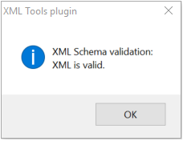

1.  Add the following line at line 10 (right after that
    > **TrustFrameworkPolicy** node:

&lt;Foo&gt;&lt;/Foo&gt;

1.  Validate XML again by clicking **Plugins | XML Tools | Validate
    > Now**.

2.  An error message similar to the following should show:

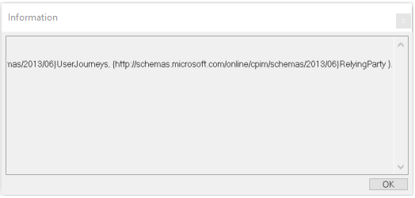

Validation of current file using XML schema:

ERROR: Element
'{http://schemas.microsoft.com/online/cpim/schemas/2013/06}Foo': This
element is not expected. Expected is one of (
{http://schemas.microsoft.com/online/cpim/schemas/2013/06}BasePolicy,
{http://schemas.microsoft.com/online/cpim/schemas/2013/06}Contacts,
{http://schemas.microsoft.com/online/cpim/schemas/2013/06}DocumentReferences,
{http://schemas.microsoft.com/online/cpim/schemas/2013/06}BuildingBlocks,
{http://schemas.microsoft.com/online/cpim/schemas/2013/06}ClaimsProviders,
{http://schemas.microsoft.com/online/cpim/schemas/2013/06}UserJourneys,
{http://schemas.microsoft.com/online/cpim/schemas/2013/06}RelyingParty
).

### Using Microsoft XML Notepad

To setup Microsoft XML Notepad, proceed with the following steps:

1.  Open a browsing session and navigate to
    [http://xmlnotepad.codeplex.com/](http://xmlnotepad.codeplex.com/).

[http://www.lovettsoftware.com/downloads/xmlnotepad/readme.htm](http://www.lovettsoftware.com/downloads/xmlnotepad/readme.htm)

1.  Click on the link **downloadable installer** to install the latest
    version.

2.  Click on the link **Microsoft XML Notepad**. The download of
    Microsoft XML Notepad starts.

To validate a policy using the provided XML schema file with the
“Starter Pack”, proceed with the following steps:

1.  Open XML Notepad.

2.  Click **File** | **Open** and open the
    &lt;*your\_B2C\_tenant*&gt;*.onmicrosoft.com\_b2c\_1a\_base.xml*
    policy XML file from the “Started Pack” where *your\_B2C\_tenant* is
    the name of your tenant, for example *contoso369b2c* in our
    illustration: *contoso369b2c.onmicrosoft.com\_b2c\_1a\_base.xml*.

> The left hand side tree view shows the policy elements in a hierarchy.
> You can expand any of those elements to go deeper into the policy.

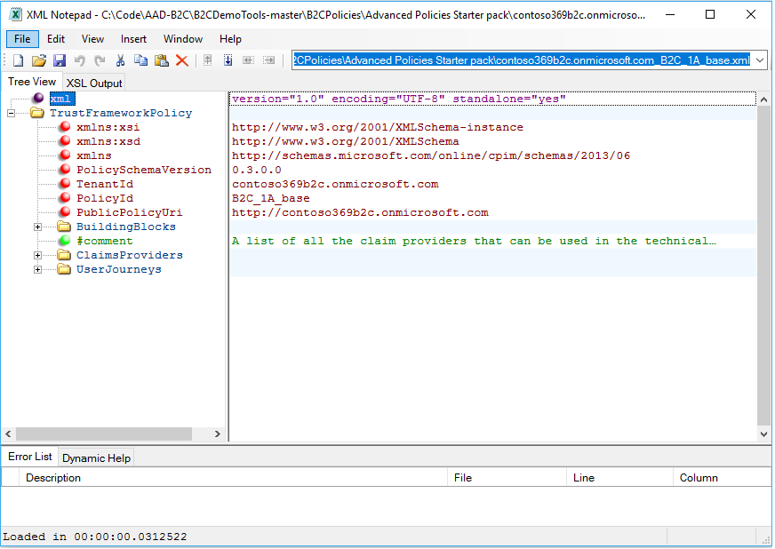 

1.  Click **View** | **Schemas**. An **XML Schemas** windows shows up.

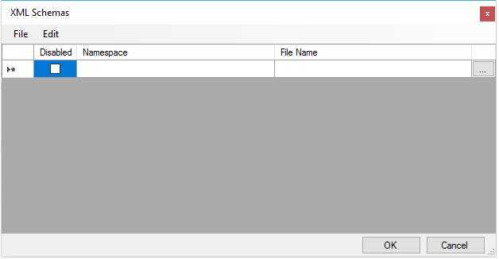 

1.  Click **File** | **Add Schemas**. In the dialog that shows up, point
    > to the XML schema file *TrustFrameworkPolicy\_0.3.0.0.xsd* in the
    > text box, and then click **Open**. This will add the schema to the
    > XML Schemas list.

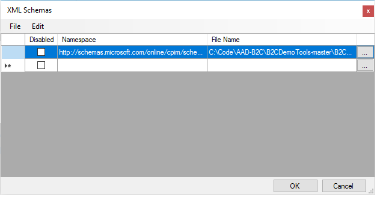 

1.  Click **OK**.

2.  To test whether the XML schema is linked correctly, expand
    > **BuildingBlocks** and right-click **ClaimsSchema**.

3.  In the context menu, click **Element** | **After**. It will show a
    > list of possible elements that can appear from the XML schema.

4.  You can then select any one of them, which will result in a
    > validation error at the bottom of the screen. This is because all
    > of the elements have already been added and duplicates are not
    > allowed.

5.  Delete the newly created node, or click **File** | **Reload** to
    > discard the changes.

  -----------------------------------------------------------------------------------------------------------------------------------------------------------------------------------------------------------------------------------------------------------------------------------------------------------------------------------------------------------------------------------------------------------------------------
  The information contained in this document represents the current view of Microsoft Corporation on the issues discussed as of the date of publication. Because Microsoft must respond to changing market conditions, it should not be interpreted to be a commitment on the part of Microsoft, and Microsoft cannot guarantee the accuracy of any information presented after the date of publication.

  This white paper is for informational purposes only. Microsoft makes no warranties, express or implied, in this document.

  Complying with all applicable copyright laws is the responsibility of the user. Without limiting the rights under copyright, no part of this document may be reproduced, stored in, or introduced into a retrieval system, or transmitted in any form or by any means (electronic, mechanical, photocopying, recording, or otherwise), or for any purpose, without the express written permission of Microsoft Corporation.

  Microsoft may have patents, patent applications, trademarks, copyrights, or other intellectual property rights covering subject matter in this document. Except as expressly provided in any written license agreement from Microsoft, the furnishing of this document does not give you any license to these patents, trademarks, copyrights, or other intellectual property.

  © 2016 Microsoft Corporation. All rights reserved.

  The example companies, organizations, products, domain names, e-mail addresses, logos, people, places, and events depicted herein are fictitious. No association with any real company, organization, product, domain name, e-mail address, logo, person, place, or event is intended or should be inferred.

  Microsoft, list Microsoft trademarks used in your white paper alphabetically are either registered trademarks or trademarks of Microsoft Corporation in the United States and/or other countries.

  The names of actual companies and products mentioned herein may be the trademarks of their respective owners.
  -----------------------------------------------------------------------------------------------------------------------------------------------------------------------------------------------------------------------------------------------------------------------------------------------------------------------------------------------------------------------------------------------------------------------------
