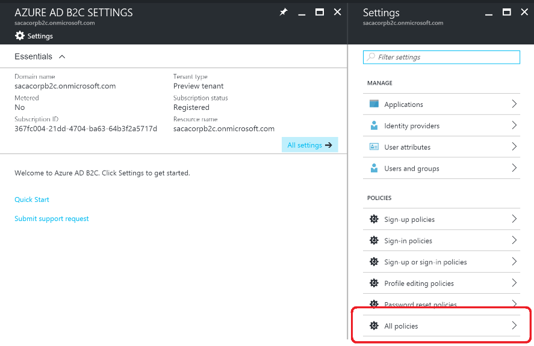
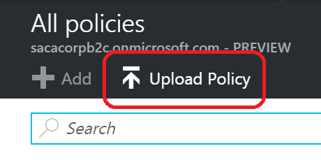
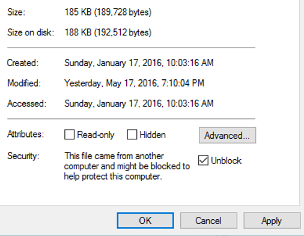
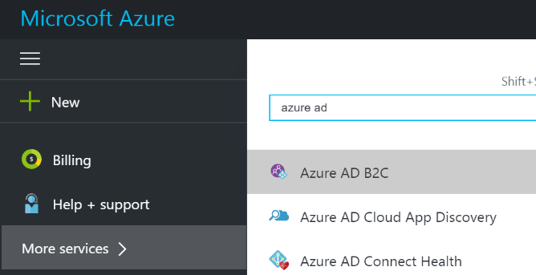
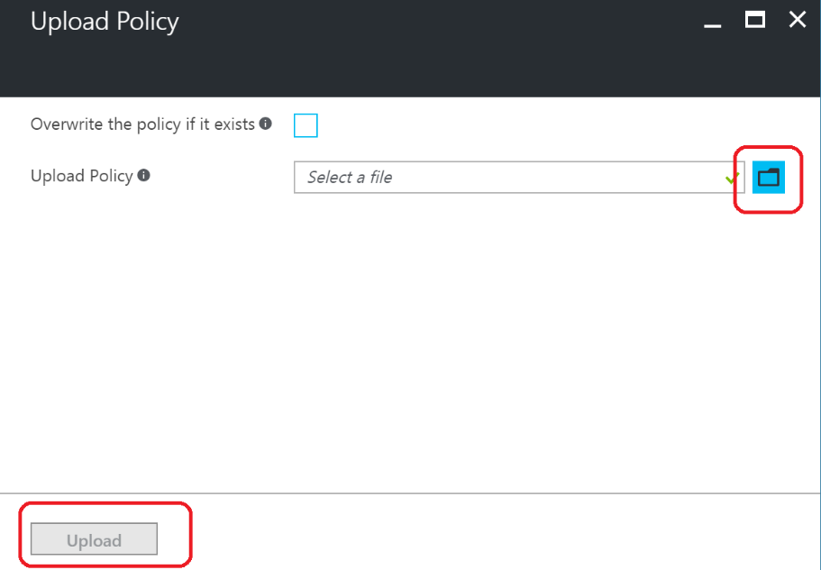
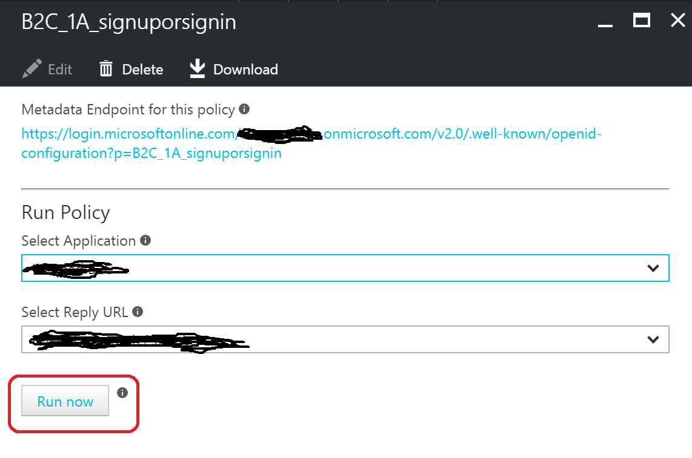

Overview
========

This document will walk you through the initial setup steps to get the
setup for Azure AD B2C advanced. After completing this setup, you’ll
have a standard set of advanced policies uploaded and running without
any extra functionality. Check out the other tutorials for walkthroughs
on enabling specific advanced scenarios.

Walkthrough
===========

Setup
-----

First, we’ll need to make sure you’ve been enabled for Azure AD B2C
Advanced functionality and that you have all the tools you’ll need to
work on advanced policies.

1.  Get your B2C tenant enabled for Advanced features.

    a.  Send an email to <AADB2CPreview@microsoft.com> as follows:

        i.  Subject: Request to Enable Premium

        ii.  Body, include the following info:

            a.  B2C tenant name (mytenant.onmicrosoft.com)

            b.  Brief description of your scenario.

2.  Confirm your B2C tenant is enabled Advanced features.

    a.  In your browser, navigate to: <https://portal.azure.com>

    b.  Go to your B2C tenant

    c.  Open Azure AD B2C

    

    d.  Go to the All policies blade

    

    e.  Confirm that the Upload Policy button is enabled.

    

3.  Download the GitHub repo that contains the necessary tools (base
    policies and PowerShell commandlets)

    a.  In your browser, navigate to:
        <https://github.com/beejones/B2CDemoTools>

    b.  Extract the zip files to your disk

    c.  Go to wherever you extracted the files, unblock them by
        right-clicking each one, Properties and mark Unblock.

        *These files are marked unsecure because they are downloaded
        from the internet.*

    

4.  Make sure to have the crypto keys and Facebook secret (for the
    Facebook claims provider that’s included in the starter pack).

    a.  Open Powershell

    b.  Go to ExploreAdmin

    c.  Import-Module ExploreAdmin.dll (if it fails, it might be because
        the dll hasn’t been unblocked)

    d.  Run Get-CpimKeyContainer -TenantId yourtenant.onmicrosoft.com
        -StorageReferenceId TokenSigningKeyContainer

        i.  When you run the command, make sure you sign in with the
            onmicrosoft.com account local to the tenant.

        ii. It’ll ask you for MFA

    e.  If this command returns the error: *KeyContainer cannot be
        found*.

        i.  Run New-CpimKeyContainer yourtenant.onmicrosoft.com
            TokenSigningKeyContainer TokenSigningKeyContainer rsa 2048 0
            0

        ii. And then run New-CpimKeyContainer yourtenant.onmicrosoft.com
            TokenEncryptionKeyContainer TokenEncryptionKeyContainer rsa
            2048 0 0

    f.  Run Get-CpimKeyContainer -TenantId yourtenant.onmicrosoft.com
        -StorageReferenceId FacebookSecret

        i.  When you run the command, make sure you sign in with the
            onmicrosoft.com account local to the tenant.

        ii. It’ll ask you for MFA

    g.  If this command returns the error: *KeyContainer cannot be
        found*.

        i.  Run Set-CpimKeyContainer -Tenant yourtenant.onmicrosoft.com
            -StorageReferenceId FacebookSecret -UnencodedAsciiKey
            ignoreForNow

Prepare Advanced Policies Starter Pack
--------------------------------------

Now we’ll get you set up with a working directory that has a starter
pack of advanced policies that you’ll be editing.

1.  Copy the files in ‘B2CDemoTools\\B2CPolicies\\Advanced Policies
    Starter pack’ to a new working directory

2.  Find and replace *lamnahealth* with your tenant name (excluding the
    .onmicrosoft.com part).

    a.  Make sure you do the replacement both in file names and in file
        contents.

Register Policy Engine Applications
-----------------------------------

Azure AD B2C requires you to register to extra “Proxy” applications that
are used by the engine to sign up and sign in users with local B2C
accounts (vs social or custom IdPs).

1.  Open Powershell

2.  Got to ExploreAdmin

3.  Run ./New-AzureADB2CPolicyEngineApplications.ps1 -BasePolicyPath
    &lt;PathOfTheBasePolicyInYourWorkingDirectory&gt;

Upload Advanced Policies Starter Pack
-------------------------------------

Finally, let’s get these policies uploaded and confirm you can sign up
and sign in users with this starter pack.

1.  Upload these policies to your B2C tenant

    a.  In your browser, navigate to: <https://portal.azure.com>

    b.  Go to your B2C tenant

    c.  Open Azure AD B2C

    

    d.  Go to the All policies blade

    

    e.  Click on the Upload Policy button.

    

    f.  Upload your policies in the following order:

        i.  B2C\_1A\_base

        ii. B2C\_1A\_base\_extensions

        iii. The rest (editprofile, passwordreset, signup, signin,
            signuporsignin) – the order doesn’t matter for these ones.

    

2.  Test to confirm that the policies work.

    a.  Close the Upload Policy blade

    b.  In the Upload Policy blade, select the
        **B2C\_1A**\_signuporsignin - Make sure you pick the one with
        the 1A not just 1.

    c.  In the blade that opens, click on the Run Now button and
        exercise the policy by signing in/up.

    
